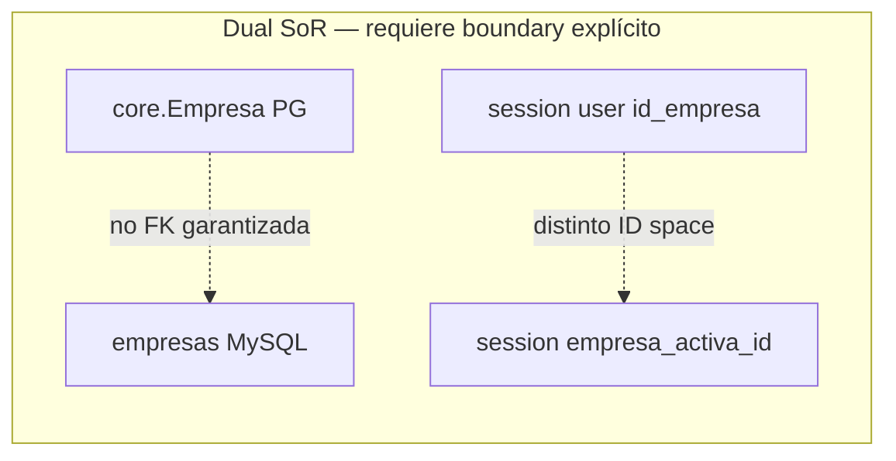

# 03 — Data Ownership Boundaries

**Estado:** COMPLETE  
**Fecha:** 25/08/2026

---

## Principio

No asumir migración total a PostgreSQL. Definir **System of Record (SoR)** lógico por entidad.

---

## Matriz de ownership

| Entity | Current SoR | Readers | Writers | Business owner | Future logical owner | Migration difficulty | Synap-native? | Must stay ERP? | Shared risk | Recommended boundary |
|--------|-------------|---------|---------|----------------|---------------------|---------------------:|:-------------:|:--------------:|:-----------:|---------------------|
| **User** | AdministraNET `usuarios` | login, core, all modules | core (CRUD) | IT/RRHH cliente | **Split:** auth ERP → Synap IdP gradual | HIGH | Partial (UsuarioExtendido PG exists) | Until IdP cutover | HIGH | IdentityPort; PG profile overlay |
| **Company** | AdministraNET `empresas` + PG `core_empresa` | login, all | core (PG), login (read AN) | Cliente | **Dual until sync** | HIGH | PG for Synap config; AN for ERP | Yes (empresas catalog) | **CRITICAL** | CompanyContextPort |
| **Customer** | AdministraNET `cliente` | ecom, reports, sc, TN | ecom, sc, TN | Ventas | ERP SoR; Synap cache optional | MEDIUM | No (transactional) | Yes | HIGH | CustomerPort read; write via adapter |
| **Supplier** | AdministraNET `proveedor` | legacy_db, compras | legacy_db, captura | Compras | ERP | LOW | No | Yes | MEDIUM | SupplierPort |
| **Product** | AdministraNET `articulo` | all commerce | core, mpr, TN | Comercial | ERP SoR | MEDIUM | No | Yes | HIGH | ProductCatalogPort |
| **Stock (qty)** | AdministraNET `stock*` | mpr, ecom, sc, reports | mpr, core, ecom, sc | Operaciones | **ERP until native WMS** | **CRITICAL** | No | Yes | **CRITICAL** | InventoryPort |
| **Warehouse** | AdministraNET `deposito` | stock, mpr | — (read) | Operaciones | ERP | LOW | No | Yes | LOW | WarehousePort read-only |
| **Price** | AdministraNET `lista_precio`, `stockp` | ecom, ventas | ecom (indirect) | Comercial | ERP | MEDIUM | No | Yes | HIGH | PricingPort |
| **Order** | AdministraNET `comp_ped` | ecom, mpr, reports | ecom, mpr, ventas, TN | Ventas | ERP SoR | HIGH | No | Yes | HIGH | SalesOrderPort |
| **Invoice (sale)** | AdministraNET `resumen_venta_cv` / FE | sc, fe_afip | sc, fe_afip | Finanzas | ERP + AFIP | HIGH | No | Yes | HIGH | InvoicingPort |
| **Payment/Collection** | AdministraNET `cuentacliente`, `caja` | ecom, sc | ecom, sc, TN | Tesorería | ERP | HIGH | No | Yes | HIGH | TreasuryPort |
| **Accounting entry** | AdministraNET `cont_asiento` | contabilidad_audit, legacy_db | legacy_db, ecom | Contabilidad | ERP | **CRITICAL** | No | Yes | **CRITICAL** | AccountingPort |
| **Tax config** | AdministraNET `iva`, AFIP tables | fe_afip, all | — | Fiscal | ERP + AFIP | MEDIUM | No | Yes | MEDIUM | TaxPort |
| **Reports metadata** | PostgreSQL `reports_*` | reports, ia | reports | Synap | **Synap Native** | LOW | **Yes** | No | LOW | Synap-owned |
| **Dashboards** | PostgreSQL | reports | reports | Synap | **Synap Native** | LOW | **Yes** | No | LOW | Synap-owned |
| **AI metadata** | PostgreSQL `ia_*` | ia | ia | Synap | **Synap Native** | LOW | **Yes** | No | LOW | Synap-owned |
| **Documents (OCR)** | PostgreSQL + filesystem | captura | captura | Compras | **Synap Native** | LOW | **Yes** | No | MEDIUM | Synap-owned; ERP posting via Port |
| **Permissions** | MySQL `synap_*` + `permiso_sistema*` | all | core | Synap+ERP | **Synap Native** (cutover) | MEDIUM | Yes | Legacy until cutover | HIGH | AuthorizationPort |
| **Integrations config** | PostgreSQL `tiendanube_*` | TN | TN | Synap | **Synap Native** | LOW | Yes | No | LOW | Integration framework |
| **App configuration** | PG `ModuleConfig` + MySQL `configuracion` | core | core | Synap | Split by scope | MEDIUM | Partial | ERP params stay | MEDIUM | ConfigPort |

---

## Entidades con ownership dual (riesgo alto)

**Evidencia:** `factura_compra_captura/session_empresa.py:9-25` — mezcla `empresa_activa_id` (PG) con `id_empresa` (MySQL).

---

## Recomendaciones de boundary

### Deben permanecer ERP-owned (corto/medio plazo)

- Stock quantities, movimientos, reservas
- Pedidos, facturas, cuentas corrientes
- Asientos contables
- Maestros articulo/cliente/proveedor (escritura)

### Pueden ser Synap-native hoy

- ReportDefinition, Dashboard, Widget, LearnedRelationship
- AgentDefinition, conversaciones IA
- Expediente factura compra (captura OCR)
- Tiendanube mappings, webhooks outbox
- WebAuthn credentials
- ModuleConfig, backup settings

### Zona de transición (Synap escribe, ERP es SoR)

Todas las 587 escrituras del inventario 02 — requieren **Adapter** no migración inmediata.

---

*Capabilities en `04-ERP-CAPABILITY-MAP.md`. Ports en `05-PORTS-CATALOG.md`.*
