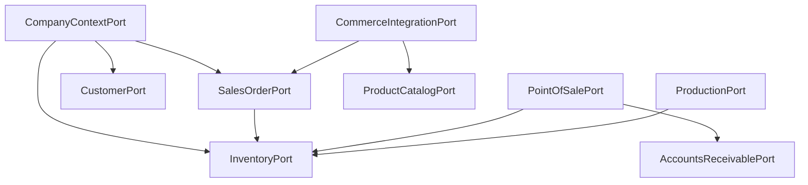

# 05 — Catálogo de Ports

**Estado:** COMPLETE  
**Fecha:** 25/08/2026

**Principio:** Ports orientados a **capacidades de negocio**, no a tablas.

---

## Ports candidatos (priorizados)

### PORT-01: InventoryPort

| Campo | Valor |
|-------|-------|
| **Business responsibility** | Consultar y modificar disponibilidad de stock por depósito/artículo |
| **Consumers** | mpr, ecom, self_checkout, stock, core, tiendanube |
| **Required operations** | `get_available_qty`, `reserve_qty`, `release_reservation`, `apply_movement`, `get_stock_by_warehouse` |
| **Required data** | company_id, warehouse_id, product_id, quantity, lot (optional) |
| **Current AN implementation** | `core/services/administranet_stock.py`, `mpr/services.py` ({tbl_stock}, {tbl_sd}) |
| **Tables** | `stock`, `stock_deposito`, `stockp`, `movimiento_stock`, `cuerpostock_mstock` |
| **Side effects** | Actualiza saldos; puede afectar `saldo_pedido_cliente` |
| **Transactional** | YES — must be atomic per movement |
| **Portability** | LOW |
| **Odoo viable?** | PARTIAL — different reservation model |
| **Native Synap?** | NO (short-term) |
| **Risk** | **CRITICAL** |

### PORT-02: SalesOrderPort

| Campo | Valor |
|-------|-------|
| **Business responsibility** | Crear, actualizar, cancelar pedidos de venta |
| **Consumers** | ecom, mpr, ventas, logistica, tiendanube |
| **Operations** | `create_order`, `get_order`, `update_status`, `cancel_order`, `add_line` |
| **Current AN** | `ecom/services/mayorista_checkout_service.py`, `mpr/best_migration/pedido_loader.py` |
| **Tables** | `comp_ped`, `cuerpo_comp_ped`, `stockp` |
| **Transactional** | YES |
| **Portability** | LOW |
| **Risk** | HIGH |

### PORT-03: CustomerPort

| Campo | Valor |
|-------|-------|
| **Consumers** | ecom, self_checkout, tiendanube, reports |
| **Operations** | `find_by_code`, `create_customer`, `update_customer`, `get_balance` |
| **Current AN** | `ecom/services/cliente_rapido_escritura.py`, `adminet_service.py` |
| **Tables** | `cliente`, `cliente_domicilio`, `cliente_contacto` |
| **Portability** | MEDIUM |
| **Risk** | HIGH |

### PORT-04: ProductCatalogPort

| Campo | Valor |
|-------|-------|
| **Consumers** | core, ecom, mpr, tiendanube, reports |
| **Operations** | `get_product`, `create_product`, `update_product`, `search_products` |
| **Current AN** | `core/services/administranet_articulo.py`, TN adminet_service |
| **Tables** | `articulo`, `rubro`, `bom` |
| **Portability** | MEDIUM |
| **Risk** | HIGH |

### PORT-05: PointOfSalePort

| Campo | Valor |
|-------|-------|
| **Consumers** | self_checkout |
| **Operations** | `confirm_sale`, `void_sale`, `get_pv_config` |
| **Current AN** | `self_checkout/services/confirmation_service.py` |
| **Tables** | `resumen_venta_cv`, `stock`, `cuentacliente`, `tc_comprobante`, `talonarios` |
| **Note** | **No escribe compventa** |
| **Portability** | LOW |
| **Risk** | HIGH |

### PORT-06: AccountsReceivablePort

| Campo | Valor |
|-------|-------|
| **Consumers** | ecom, self_checkout, fe_afip, tiendanube |
| **Operations** | `post_collection`, `allocate_payment`, `get_customer_balance` |
| **Tables** | `cuentacliente`, `recibo_factura*`, `imputacion` |
| **Risk** | HIGH |

### PORT-07: AccountingPort

| Campo | Valor |
|-------|-------|
| **Consumers** | legacy_db, contabilidad_audit, ecom |
| **Operations** | `create_entry`, `void_entry`, `recalculate_balances`, `get_trial_balance` |
| **Tables** | `cont_asiento`, `cont_detalle`, saldos |
| **Portability** | **NONE** cross-ERP |
| **Risk** | **CRITICAL** |

### PORT-08: IdentityPort

| Campo | Valor |
|-------|-------|
| **Consumers** | login, core |
| **Operations** | `authenticate`, `get_user`, `create_user`, `update_user` |
| **Tables** | `usuarios`, `sesion` |
| **Note** | Today IdP = AdministraNET exclusively |
| **Risk** | HIGH |

### PORT-09: AuthorizationPort

| Campo | Valor |
|-------|-------|
| **Consumers** | all modules via `@tiene_permiso` |
| **Operations** | `get_permissions`, `has_permission`, `assign_role` |
| **Tables** | `synap_*`, `permiso_sistema*` |
| **Risk** | HIGH |

### PORT-10: OrganizationPort

| Campo | Valor |
|-------|-------|
| **Consumers** | core, self_checkout, ecom |
| **Operations** | `get_branches`, `create_branch`, `get_pos_points`, `get_warehouses` |
| **Tables** | `sucursales`, `punto_venta`, `deposito` |
| **Risk** | MEDIUM |

### PORT-11: CashManagementPort

| Campo | Valor |
|-------|-------|
| **Consumers** | ecom, self_checkout, mercadopago, tiendanube |
| **Operations** | `register_income`, `register_expense`, `get_balance` |
| **Tables** | `caja`, `caja_saldo`, `codmov` |
| **Risk** | HIGH |

### PORT-12: ProductionPort

| Campo | Valor |
|-------|-------|
| **Consumers** | mpr |
| **Operations** | `create_production_order`, `execute_assembly`, `close_opt` |
| **Tables** | `mpr_*` (Synap) + `stock*` (AN) via InventoryPort |
| **Risk** | HIGH |

### PORT-13: CompanyContextPort

| Campo | Valor |
|-------|-------|
| **Consumers** | ALL |
| **Operations** | `resolve_company`, `get_database_alias`, `get_erp_context` |
| **Current** | `session['user']['base_empresa']`, `mysql_pool`, `empresa_activa_id` |
| **Risk** | **CRITICAL** — foundation for all Ports |

### PORT-14: ReportDataSourcePort (separate — see doc 06)

Analytics/read-only contract distinct from transactional Ports.

### PORT-15: CommerceIntegrationPort

| Campo | Valor |
|-------|-------|
| **Consumers** | tiendanube_administranet |
| **Operations** | `sync_product`, `sync_order`, `sync_customer` |
| **Wraps** | CustomerPort + ProductCatalogPort + SalesOrderPort + InventoryPort |

---

## Dependency graph (Ports)



---

## Anti-patterns actuales (lo que NO hacer)

```python
# INCORRECTO — table repository
class StockPRepository:
    def get_stockp(self, id): ...

# CORRECTO — capability port
class InventoryPort:
    def get_available_stock(self, company, warehouse, product) -> Decimal: ...
```

---

*Implementación futura: `AdministraNETInventoryAdapter` wrapping existing SQL.*
