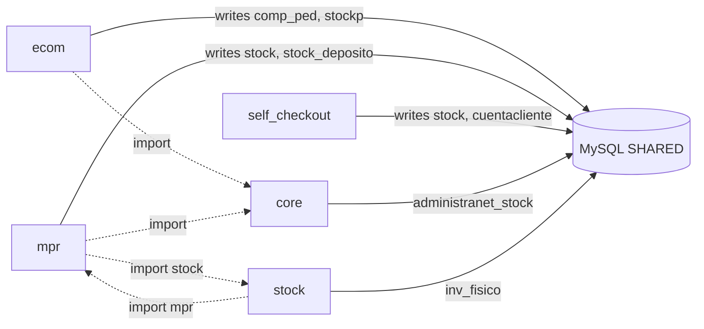

# 10 — Strongly Connected Components

**Estado:** COMPLETE  
**Fecha:** 25/08/2026

---

## Metodología

Grafo conceptual: arista A→B si existe **import**, **service call**, **shared table write**, **API call**, o **session side effect**.

---

## SCC-01: Commerce ↔ Stock ↔ Production

| Componente | Tipo acoplamiento |
|------------|------------------|
| ecom, mpr, self_checkout, core, stock | **SCC por tabla `stock*`** |
| Imports | mpr↔stock bidireccional (2↔2 archivos) |
| Clasificación | **Peligroso** — cualquier cambio stock afecta 5 módulos |
| Desacople | InventoryPort + single adapter |

---

## SCC-02: Reports ↔ Ventas ↔ Ecom (analítico)

| Par | A→B | B→A | Mecanismo |
|-----|----:|----:|-----------|
| reports → ventas | 6 archivos | — | imports servicios |
| ventas → reports | — | 4 archivos | imports runners |
| Shared data | — | — | `comp_ped`, `cliente`, `viajantes_objetivos_*` |

**Clasificación:** SCC débil por imports + datos analíticos.  
**Riesgo:** MEDIO — reports no escribe transaccional (salvo seed).

---

## SCC-03: Contabilidad ↔ Legacy_db

| Par | Imports | Datos |
|-----|---------|-------|
| contabilidad_audit ↔ legacy_db | 1↔1 + 26 contab→legacy en análisis extendido | `cont_asiento` read/write |

**Clasificación:** Esperado — dominio contable.  
**Riesgo:** ALTO para extracción — AccountingPort debe envolver ambos.

---

## SCC-04: Core ↔ Login

| Par | Imports |
|-----|---------|
| core → login | 5 |
| login → core | 5 |

**Mecanismo:** middleware, session, permisos, WebAuthn settings.  
**Clasificación:** Aceptable para platform core — pero core no debe crecer hacia dominio.

---

## SCC-05: Captura ↔ Self_checkout

| Mecanismo | Detalle |
|-----------|---------|
| Import | `factura_compra_captura/api/views.py:46-47` importa self_checkout |
| Datos | Ambos usan PG + MySQL indirecto |
| Inverso | No import sc → captura |

**Clasificación:** Acoplamiento unidireccional import; **bidireccional negocio** vía permisos/compras.  
**Riesgo:** MEDIO — seam candidate para desacoplar API compartida.

---

## SCC-06: Tiendanube ↔ Ecom ↔ Core (integración)

Escrituras coordinadas: TN `adminet_service.py` escribe `articulo`, `cliente`, `comp_ped`, `stockp` — mismas tablas que ecom.

**Clasificación:** SCC por integración commerce.  
**Desacople:** CommerceIntegrationPort.

---

## Imports circulares Python

| Resultado | Detalle |
|-----------|---------|
| **No ciclos profundos** | A→B→C→A no detectado en imports directos |
| **Pares bidireccionales** | reports↔ventas, mpr↔stock, ecom↔mpr, ecom↔ventas |

**Veredicto V2:** V1 "sin ciclos" es **PARCIAL** — correcto para imports; **incorrecto** si se ignora acoplamiento datos.

---

## Respuesta pregunta 24-25

| # | Pregunta | Respuesta |
|---|----------|-----------|
| 24 | ¿Dependencias circulares arquitectónicas? | Sí — por **datos compartidos**, no imports |
| 25 | ¿SCC principales? | Commerce-Stock-Production, Accounting-Legacy, Reports-Ventas |

---

*Change impact en `11-CHANGE-IMPACT-MATRIX.md`. Seams en `13-LEGACY-EXTRACTION-SEAMS.md`.*
