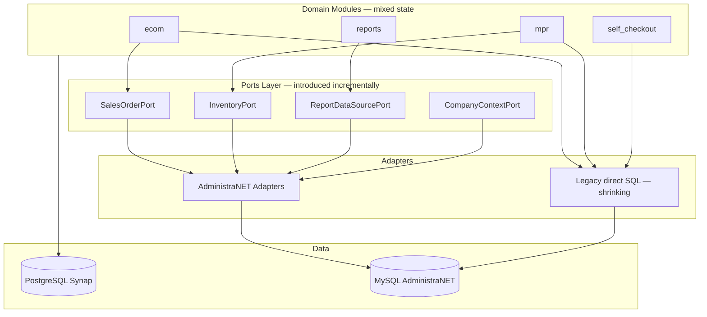

# 14 — Transition Architecture

**Estado:** COMPLETE  
**Fecha:** 25/08/2026

---

## Principio

Coexistencia temporal de:
- Legacy direct SQL
- New Ports (interfaces)
- AdministraNET Adapters
- Synap-native PG data
- Old + refactored modules

**No big-bang.**

---

## Fases de transición

### T0: Observabilidad y seguridad (sin Ports)

| Acción | Tipo | Riesgo |
|--------|------|--------|
| Fix IDOR factura_compra API | Security | LOW change |
| Document Architectural Deviations | Process | None |
| Tenant checks en APIs PG | Security | MEDIUM |
| Eliminar DEFAULT_BASE_EMPRESA en runtime user paths | Security | MEDIUM |

### T1: CompanyContextPort (foundation)

```text
Request
  → CompanyContextMiddleware (new)
  → CompanyContextPort.from_request(request)
  → { erp_database, synap_empresa_id, id_empresa_an }
  → mysql_pool uses erp_database (unchanged underneath)
```

**Coexistence:** Old code reads session directly; new code uses Port. Adapter = thin wrapper.

### T2: ReportDataSourcePort

```text
ReportExecutionEngine
  → ReportDataSourcePort (interface)
  → AdministraNETReportDataSource (wraps SqlQueryBuilder — no SQL move)
  → [future] PostgreSQLReportDataSource
```

**Coexistence:** declarative-v1 unchanged at config level; only execution indirection.

### T3: Domain Ports (incremental per module)

```text
ecom/mayorista_checkout_service
  → SalesOrderPort.create_order()
  → AdministraNETSalesOrderAdapter (contains existing SQL)
```

**Order:** CustomerPort → InventoryPort → SalesOrderPort → PointOfSalePort

### T4: Core slimming

Move OUT of core:
- `administranet_stock.py` → `adapters/administranet/inventory.py`
- `administranet_users.py` → `adapters/administranet/identity.py`
- `administranet_sucursales.py` → `adapters/administranet/organization.py`

Core retains: pool, middleware, module registry, ports interfaces.

### T5: Authorization cutover

`SYNAP_PERMISOS_SOURCE`: legacy → dual → synap per installation.

### T6: Identity (optional, product decision)

Synap IdP with AdministraNET sync adapter — only if product requires ERP independence.

---

## Architecture diagram (transitional)



---

## Reglas de coexistencia

1. **New code** MUST use Ports (once interface exists for that capability).
2. **Old code** MAY keep direct SQL until touched — document as deviation.
3. **No duplicate business rules** — adapter calls existing service initially (wrap, not rewrite).
4. **One module at a time** per Port adoption.

---

## Respuesta pregunta 28

> ¿Qué arquitectura transitoria permite migración incremental?

La descrita arriba: Ports como fachada sobre SQL existente, no reescritura. Adapters contienen el SQL actual movido desde core/módulos.

---

*Invariantes en `15-ARCHITECTURAL-INVARIANTS.md`. Contrato en `SYNAP-ARCHITECTURE-CONTRACT.md`.*
