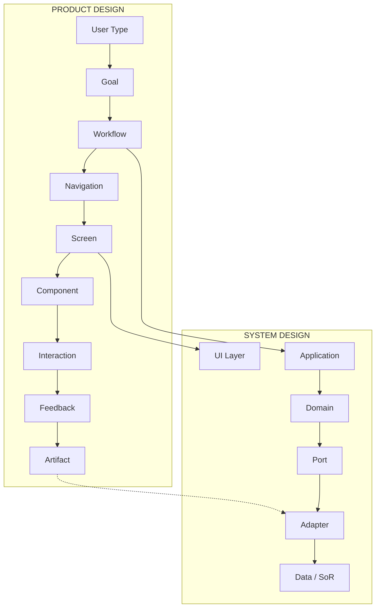

# SYNAP Product Design Blueprint

**Versión:** 1.0  
**Fecha:** 25/08/2026  
**Estado:** COMPLETE — **REQUIERE APROBACIÓN HUMANA**  
**Modo:** Descubrimiento V3 (READ ONLY — sin refactor)

---

## Propósito

Documento maestro que conecta **experiencia de usuario**, **capacidades de producto**, **arquitectura de software** y **datos/ERP** para guiar el refactor futuro de Synap como **producto empresarial independiente**.

```text
USER EXPERIENCE
       │
       ▼
PRODUCT CAPABILITY
       │
       ▼
SOFTWARE CAPABILITY (Module / API / Service)
       │
       ▼
DOMAIN (Port)
       │
       ▼
ADAPTER
       │
       ▼
DATA / ERP (System of Record)
```

---

## 1. Qué es Synap (producto)

Synap es una **plataforma web de operaciones empresariales** que:

- Orquesta workflows de **ventas mayoristas**, **producción**, **stock**, **TPV**, **reportes** e **integraciones** (Tienda Nube, AFIP, Odoo migration).
- Opera sobre **datos legacy AdministraNET (MySQL)** y **datos propios (PostgreSQL)** en modelo multi-empresa.
- Expone **471 pantallas** en Django Templates + Tailwind + Alpine, con UI canónica en **Reports** y **MPR**.
- Sirve a **~14 roles funcionales** inferidos desde permisos (vendedor, supervisor producción, cajero TPV, contador, administrador sistema, etc.).

**No es:** un reemplazo completo del ERP — es capa de producto moderna sobre ERP existente, evolucionando hacia Ports/Adapters.

---

## 2. System Design (resumen)

| Capa | Responsabilidad | Regla clave |
|------|-----------------|-------------|
| **UI** | Pantallas, componentes, feedback | Canon Reports/MPR; DS incremental |
| **Application** | Use cases, orquestación | ExecutionContext obligatorio |
| **Domain** | Reglas de negocio | Sin `base_empresa`, sin SQL ERP |
| **Port** | Contratos abstractos | InventoryPort, SalesOrderPort, etc. |
| **Adapter** | AdministraNET, AFIP, TN, Odoo | Único lugar con tablas legacy |
| **Data** | System of Record por dato | Una fuente lógica por campo |

**Contrato permanente:** [`ARCHITECTURE/SYNAP-ARCHITECTURE-CONTRACT-v1.0.md`](./ARCHITECTURE/SYNAP-ARCHITECTURE-CONTRACT-v1.0.md)  
**Reglas transitorias:** [`ARCHITECTURE/02-TARGET-VS-TRANSITION-RULES.md`](./ARCHITECTURE/02-TARGET-VS-TRANSITION-RULES.md)

---

## 3. Product Design (resumen)

| Dimensión | Hallazgo clave |
|-----------|----------------|
| **Capabilities** | 20+ capacidades usuario (no 1:1 con apps Django) |
| **Users** | 14 roles funcionales con permisos granulares |
| **Workflows** | 10 críticos documentados (WF-01 a WF-10) |
| **Screens** | ~250–300 pantallas; MPR (109 tpl) mayor superficie |
| **Navigation** | 18 apps menú; duplicación pedidos Ventas/Ecom |
| **UI canon** | `dashboard_detail.html` + `base_mpr.html` |
| **Design System** | Implícito; sin tokens centralizados |
| **Artifacts** | PDF, XLSX, CSV, email, ticket print, QR |

**Detalle:** carpetas [`PRODUCT/`](./PRODUCT/), [`UIUX/`](./UIUX/), [`DESIGN-SYSTEM/`](./DESIGN-SYSTEM/), [`ARTIFACTS/`](./ARTIFACTS/)

---

## 4. Matriz end-to-end — capacidades críticas

| Capability | User | Workflow | Screen | API | Domain | Port | Adapter | Data (SoR) | Artifact |
|------------|------|----------|--------|-----|--------|------|---------|------------|----------|
| **Login / sesión** | Todos | WF-01 | `/login/` | login API | SessionBootstrap | IdentityPort | AdministraNETAuthAdapter | usuarios (ERP) | — |
| **Pedido mayorista** | Vendedor | WF-02 | pedidos_hub, mayorista | ecom 60+ | CheckoutService | SalesOrderPort, InventoryPort | AdministraNETSalesAdapter | comp_ped (ERP) | PDF pedido |
| **Pedido masivo** | Vendedor/Admin | WF-03 | pedido-masivo-sucursales | import API | MatrizService | SalesOrderPort | AdministraNETSalesAdapter | comp_ped (ERP) | XLSX plantilla |
| **Producción OPT** | Supervisor MPR | WF-04 | mpr/wizard, opt_* | mpr 35 | ProductionService | ProductionPort, InventoryPort | AdministraNETMPRAdapter | mpr_*, stock (ERP) | PDF OPT |
| **Parte operario** | Operario | WF-05 | parte_operario mobile | mpr API | ParteService | ProductionPort | AdministraNETMPRAdapter | mpr_parte (ERP) | — |
| **Venta TPV** | Cajero | WF-06 | kiosco_view | sc 39 | ConfirmationService | PointOfSalePort, InventoryPort | AdministraNETTPVAdapter | resumen_venta_cv, stock (ERP) | Ticket 80mm |
| **Dashboard ventas** | Gerente | WF-07 | dashboard_detail | reports 72 | ReportExecutor | ReportDataSourcePort | MySQLReadAdapter | MySQL read | XLSX export |
| **Inventario físico** | Almacén | WF-08 | conteo mobile | stock 8 | ConteoService | InventoryPort | AdministraNETStockAdapter | inv_fisico_* (ERP) | — |
| **Auditoría contable** | Contador | WF-09 | auditoria tablero | contab 5 | AuditRunner | AccountingPort (read) | MySQLContAdapter | cont_asiento (ERP) | CSV/XLSX |
| **Sync Tienda Nube** | Admin ecom | WF-10 | TN dashboard | TN 28 | SyncOrchestrator | EcommerceIntegrationPort | TiendaNubeAdapter | mappings (Synap PG) + catálogo (ERP) | webhook |
| **Usuarios/permisos** | Admin sistema | — | core/archivo usuarios | core 15 | UserAdmin | IdentityPort | AdministraNETUserAdapter | usuarios, synap_* (mixed) | — |
| **Captura factura** | Compras | — | captura upload | captura 33 | OCRPipeline | DocumentCapturePort | PG + filesystem | expediente (Synap) | PDF/image |
| **Factura electrónica** | Admin finanzas | — | fe_afip | fe 8 | FEService | TaxPort | AFIPAdapter | cuentacliente (ERP) | CAE XML |
| **Reportes custom** | Analista | WF-07 | reports builder | builder 20 | ReportDefinition | ReportMetadata (Synap) | PostgreSQL | PG metadata | JSON export |

---

## 5. Flujo dual: System + Product



---

## 6. Execution Context (conceptual)

Todo request/job **MUST** resolver:

```text
ExecutionContext
├── PrincipalContext   (id, roles, permissions, identity_provider)
├── TenantContext      (tenant_id)
├── CompanyContext     (company_id, external_ref)
├── SecurityContext    (authz decision cache)
├── CorrelationContext (request_id, operation_id)
└── LocaleContext      (es-AR, dd/MM/yyyy)
```

**Dominio NO ve:** `base_empresa`, `AdministraNETUser`, conexión MySQL directa.

Detalle: [`ARCHITECTURE/03-EXECUTION-CONTEXT-MODEL.md`](./ARCHITECTURE/03-EXECUTION-CONTEXT-MODEL.md)

---

## 7. Data Ownership (resumen)

| Categoría | Ejemplos | Regla |
|-----------|----------|-------|
| **ERP OWNED** | comp_ped, stock, usuarios legacy | Synap escribe vía Port; no duplicar SoR |
| **SYNAP OWNED** | ReportDefinition, TN mappings, expediente OCR, synap_perm | PostgreSQL ORM |
| **DERIVED** | KPIs dashboard, agregados | Recalculable; no SoR |
| **TRANSITIONAL SHARED** | 587 escrituras MySQL actuales | Migrar a Ports; ver V2 inventory |

Detalle: [`ARCHITECTURE/05-DATA-OWNERSHIP-CONTRACT.md`](./ARCHITECTURE/05-DATA-OWNERSHIP-CONTRACT.md)

---

## 8. Cross-system transactions (resumen)

- **NO** ACID distribuido PostgreSQL + MySQL + AFIP + TN.
- **Obligatorio:** operation_id, idempotency key, correlation ID, audit trail.
- **Existente:** outbox TN; **Gaps:** compensation global, dead letter unificado.

Detalle: [`ARCHITECTURE/06-CROSS-SYSTEM-TRANSACTIONS.md`](./ARCHITECTURE/06-CROSS-SYSTEM-TRANSACTIONS.md)

---

## 9. Reports evolution

```text
ReportDefinition (declarative-v1)  ← MANTENER compatibilidad
        │
        ▼
Semantic Query Model (semantic-v2)  ← FUTURO: Entity, Metric, Dimension
        │
        ▼
ReportDataSourcePort
        │
   ┌────┼────┐
 MySQL  PG   API
```

Detalle: [`ARCHITECTURE/08-REPORTS-SEMANTIC-ARCHITECTURE.md`](./ARCHITECTURE/08-REPORTS-SEMANTIC-ARCHITECTURE.md)

---

## 10. Design System (resumen)

| Estado actual | Estado objetivo |
|---------------|-----------------|
| Sin tokens centralizados | `tailwind.extend` + CSS vars |
| 5+ variantes botón | Primitive Button |
| SynapMessages + mprShowAviso + modales | Toast + ConfirmDialog unificados |
| slate + gray mezclados | Paleta slate unificada |
| Canon Reports/MPR documentado | DS formal en `theme/design_system/` |

**Contract:** [`DESIGN-SYSTEM/06-DESIGN-SYSTEM-TARGET.md`](./DESIGN-SYSTEM/06-DESIGN-SYSTEM-TARGET.md)

---

## 11. Target experience (resumen)

| Tema | Decisión |
|------|----------|
| **Principios** | Rápido, denso, predecible, role-aware — no minimalismo vacío |
| **IA futura** | Por capacidad (Operaciones, Comercial, Producción…) no por app Django |
| **Frontend** | **Mantener** Django + Alpine + Tailwind; HTMX selectivo; NO React big-bang |
| **Migración** | Tokens → shell → primitives → patterns → módulos (reports primero) |
| **Readiness** | Bloqueado por aprobación contrato + characterization tests |

Detalle: [`TARGET/`](./TARGET/)

---

## 12. Deuda crítica (top 5)

| # | Deuda | Impacto | Fase refactor |
|---|-------|---------|:-------------:|
| 1 | `dashboard_detail.html` ~5300 líneas JS | Reports inmantenible | P0 |
| 2 | 587 escrituras MySQL sin Port | Acoplamiento ERP | Arquitectura (paralelo) |
| 3 | 3 patrones confirmación | UX inconsistente | Fase 2 DS |
| 4 | Tailwind CDN + build dual | CSS impredecible | Fase 1 |
| 5 | Ventas objetivos/presupuestos fuera canon | Deuda visual/UX | P1 rewrite |

---

## 13. Respuestas a las 35 preguntas V3

| # | Pregunta | Respuesta (doc) |
|---|----------|-----------------|
| 1 | Contrato permanente | `ARCHITECTURE/SYNAP-ARCHITECTURE-CONTRACT-v1.0.md` |
| 2 | Reglas transitorias | `ARCHITECTURE/02-TARGET-VS-TRANSITION-RULES.md` |
| 3 | Conceptos AN a eliminar del dominio | base_empresa, AdministraNETUser, nombres tabla |
| 4 | Principal/Tenant/Company | ExecutionContext model §6 |
| 5 | Ports y Adapters | `ARCHITECTURE/04-PORT-ADAPTER-RULES.md` |
| 6 | Cross-system ops | `ARCHITECTURE/06-CROSS-SYSTEM-TRANSACTIONS.md` |
| 7 | SoR por dato | `ARCHITECTURE/05-DATA-OWNERSHIP-CONTRACT.md` |
| 8 | Evolución Reports | `ARCHITECTURE/08-REPORTS-SEMANTIC-ARCHITECTURE.md` |
| 9 | Synap como producto | §1 este documento |
| 10 | Capacidades usuario | `PRODUCT/01-PRODUCT-CAPABILITY-MAP.md` |
| 11 | Tipos usuario | `PRODUCT/02-USER-TYPE-MAP.md` |
| 12 | Workflows críticos | `PRODUCT/03-WORKFLOW-CATALOG.md` |
| 13 | Cantidad pantallas | ~250–300 (`UIUX/04-SCREEN-CATALOG.md`) |
| 14 | Propósito cada pantalla | `UIUX/04-SCREEN-CATALOG.md` |
| 15 | Navegación | `UIUX/03-NAVIGATION-MAP.md` |
| 16 | Componentes UI | `UIUX/05-COMPONENT-INVENTORY.md` |
| 17 | Duplicados | `UIUX/05` + `DESIGN-SYSTEM/03` |
| 18 | DS implícito | `DESIGN-SYSTEM/01-DESIGN-SYSTEM-DISCOVERY.md` |
| 19 | Tokens | `DESIGN-SYSTEM/02-DESIGN-TOKENS-INVENTORY.md` |
| 20 | Patrones formulario | `UIUX/06-FORM-PATTERNS.md` |
| 21 | Patrones tablas | `UIUX/07-TABLE-DATA-GRID-PATTERNS.md` |
| 22 | Patrones dashboard | `UIUX/08-DASHBOARD-PATTERNS.md` |
| 23 | Errores y estados | `UIUX/09-FEEDBACK-STATES.md` |
| 24 | Responsive | `UIUX/10-RESPONSIVE-ASSESSMENT.md` |
| 25 | Accesibilidad | `UIUX/11-ACCESSIBILITY-ASSESSMENT.md` |
| 26 | Artefactos producidos | `ARTIFACTS/02-DOCUMENT-ARTIFACTS.md` |
| 27 | Import/export | `ARTIFACTS/04-EXPORT-IMPORT-ARTIFACTS.md` |
| 28 | Reportes/notificaciones | `ARTIFACTS/03`, `ARTIFACTS/05` |
| 29 | UI reutilizable | `TARGET/04` — MPR shell, SynapMessages, reports hero |
| 30 | UI rediseñar | `TARGET/04` — ventas, reports JS, confirm dialogs |
| 31 | Frontend architecture | `TARGET/03` — mantener Django+Alpine |
| 32 | IA futura | `TARGET/02-TARGET-INFORMATION-ARCHITECTURE.md` |
| 33 | Migración sin big-bang | `TARGET/05-MIGRATION-STRATEGY.md` |
| 34 | Tests pre-refactor | `TARGET/06-IMPLEMENTATION-READINESS.md` |
| 35 | ¿Listos para refactor? | **Casi** — falta aprobación + characterization tests |

---

## 14. Índice de documentos V3

```text
AUDIT-V3/
├── README.md
├── SYNAP-PRODUCT-DESIGN-BLUEPRINT.md          ← este documento
├── ARCHITECTURE/          (9 docs + contrato v1.0)
├── PRODUCT/               (5 docs)
├── UIUX/                  (12 docs)
├── DESIGN-SYSTEM/         (6 docs)
├── ARTIFACTS/             (6 docs)
├── TARGET/                (6 docs)
└── EVIDENCE/              (vacío — opcional)
```

---

## 15. Stop condition

```text
✅ Descubrimiento V3 COMPLETO
⬜ Aprobación humana Architecture Contract v1.0
⬜ Aprobación humana este Blueprint
⬜ Aprobación humana Implementation Readiness
⛔ NO iniciar refactor general hasta sign-off
```

---

## 16. Próximos pasos (post-aprobación)

1. Aprobar contrato + blueprint + readiness checklist
2. Crear characterization tests WF-01, WF-06, WF-04, WF-07
3. Fase 1 migración: design tokens + unificar feedback (Toast/Confirm)
4. Extraer JS `dashboard_detail.html` (P0)
5. Iniciar registro formal de transition rules en código (decorator/boundary marker)
6. Paralelo backend: primer Port piloto con adapter existente (sin big-bang)

---

*Synap V3 — UNDERSTAND THE PRODUCT BEFORE REDESIGNING THE PRODUCT.*
