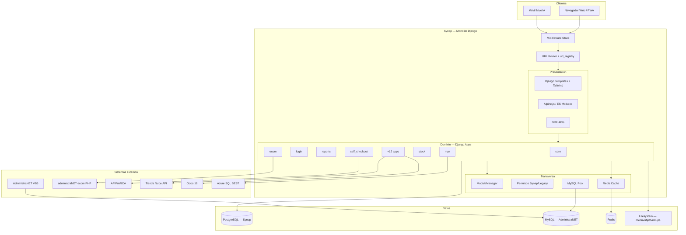
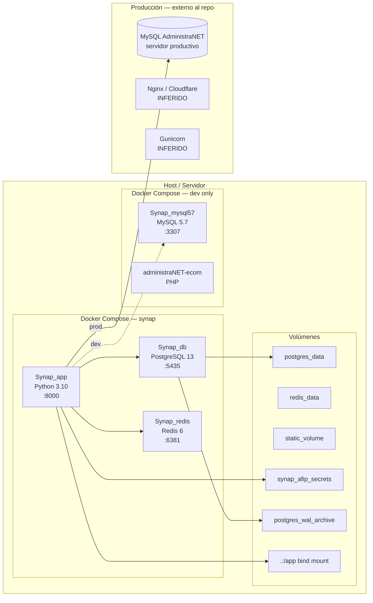
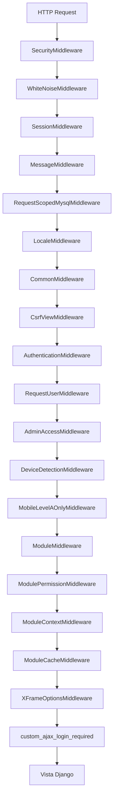
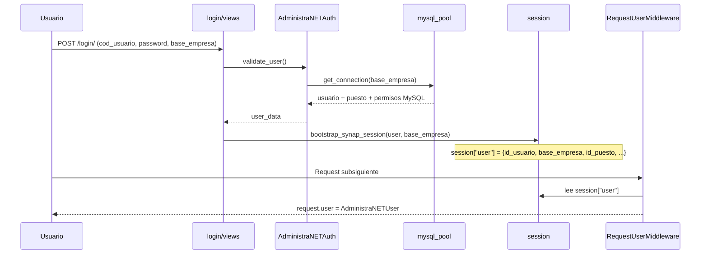
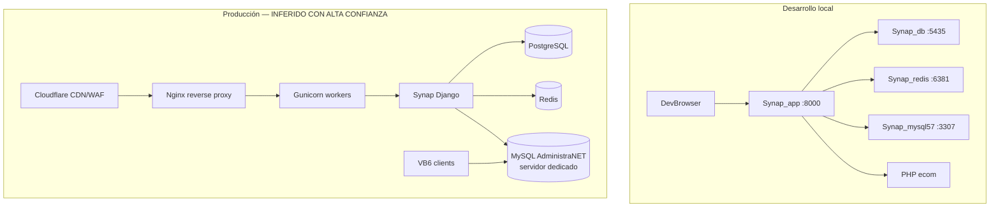
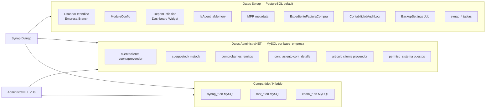
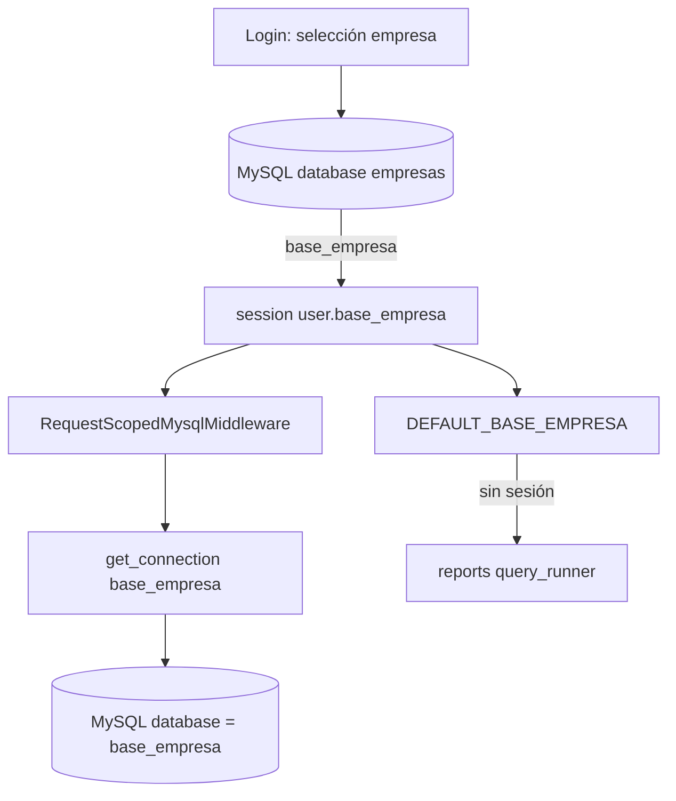
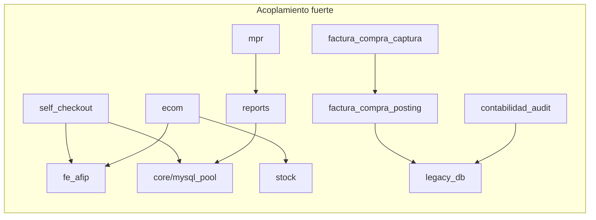
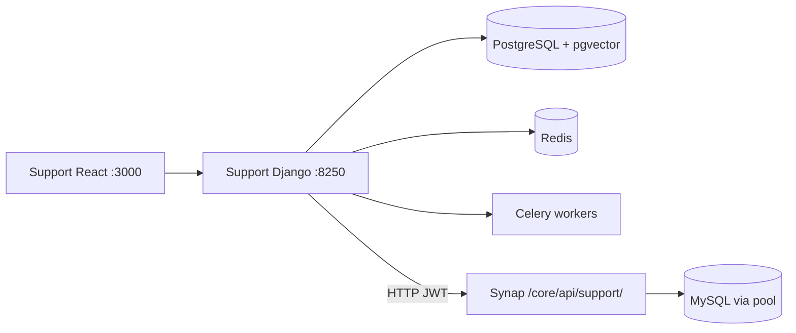
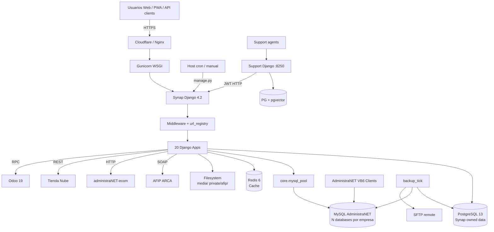

# 02 — Arquitectura Actual de Synap

**Estado:** COMPLETE (Fase 2)  
**Fecha:** 25/08/2026  
**Fuentes:** `django_project/settings.py`, `urls.py`, `docker-compose.yml`, `core/mysql_pool.py`, `core/middleware/`, `login/`, inspección de servicios y dependencias.

---

## Resumen ejecutivo

Synap es un **monolito modular Django 4.2** desplegado en contenedor Docker, que opera como capa web y de servicios sobre el ERP AdministraNET. Utiliza **PostgreSQL como sistema de registro propio** y accede **directamente a MySQL AdministraNET** mediante un pool de conexiones thread-safe, seleccionando la base por empresa (`base_empresa`) almacenada en sesión.

No es multitenant SaaS en el sentido clásico: es **pseudo-multitenant database-per-tenant** sobre infraestructura MySQL compartida con VB6, con aislamiento por nombre de database MySQL.

**Clasificación global:** CONFIRMADO POR CÓDIGO.

---

## 1. Arquitectura lógica

### 1.1 Estilo arquitectónico

| Característica | Valor | Evidencia |
|----------------|-------|-----------|
| Patrón | Monolito modular | Una app WSGI, múltiples Django apps |
| Estilo de capas | Views → Services → Pool/ORM | Patrón dominante en reports, ecom, mpr |
| Modularidad | Sistema de módulos propio + INSTALLED_APPS | `core/module_registry.py`, `ModuleConfig` |
| Eventos | In-process dispatcher | `core/event_dispatcher.py` |
| Integración ERP | Acceso directo SQL a MySQL legacy | `core/mysql_pool.py` |
| API | REST parcial (DRF) + HTML SSR | `rest_framework` en settings |
| Async | Sin Celery activo en principal | `django_project/celery.py` comentado |

### 1.2 Diagrama lógico



### 1.3 Flujo request típico (informe)

```
Usuario autenticado
  → GET /reports/dashboard/ventas-netas/
  → RequestScopedMysqlMiddleware (abre conn MySQL con session.user.base_empresa)
  → RequestUserMiddleware (construye AdministraNETUser desde sesión)
  → ModulePermissionMiddleware (verifica módulo reports activo)
  → reports.views.dashboard_detail
  → reports.services.query_runner.QueryRunner
  → core.mysql_pool.mysql_cursor(base_empresa)
  → SELECT ... FROM cuentacliente ... (MySQL legacy)
  → Template render + context_processors (menú, permisos)
  → HTML response
```

**Clasificación:** CONFIRMADO POR CÓDIGO — patrón verificado en `reports/services/query_runner.py`, `core/middleware/request_scoped_mysql.py`.

### 1.4 Flujo request típico (operación con escritura legacy)

```
Usuario autenticado
  → POST /stock/api/movimiento/
  → Middleware stack
  → stock.api_views
  → core.services.administranet_stock (o similar)
  → core.mysql_pool.get_connection(base_empresa)
  → INSERT/UPDATE en tablas stock MySQL
  → JSON response
```

**Clasificación:** CONFIRMADO POR CÓDIGO.

---

## 2. Arquitectura física

### 2.1 Componentes de infraestructura



### 2.2 Contenedores activos (`docker-compose.yml`)

| Servicio | Container | Imagen | Puerto host | Función |
|----------|-----------|--------|-------------|---------|
| `app` | Synap_app | build `.` | 8000 | Django WSGI |
| `db` | Synap_db | postgres:13 | 5435→5432 | PostgreSQL Synap |
| `redis` | Synap_redis | redis:6-alpine | 6381→6379 | Cache |

**Servicios eliminados del compose principal:** `celery_worker`, `celery_beat`, `qdrant` (comentados en `docker-compose.yml` líneas 109–112).

**Clasificación:** CONFIRMADO POR CÓDIGO.

### 2.3 Redes Docker

| Red | Uso |
|-----|-----|
| `default` | Comunicación interna app↔db↔redis |
| `synap_net` (external) | Compartida con `docker-compose.mysql.yml` para MySQL local dev |

**Clasificación:** CONFIRMADO POR CÓDIGO — `docker-compose.yml` líneas 123–127.

### 2.4 Volúmenes persistentes

| Volumen | Montaje | Propósito |
|---------|---------|-----------|
| `postgres_data` | `/var/lib/postgresql/data` | Datos PostgreSQL |
| `postgres_wal_archive` | WAL archive (PITR) | Backup incremental Postgres |
| `redis_data` | `/data` (AOF) | Persistencia cache |
| `static_volume` | `/app/staticfiles` | Estáticos recolectados |
| `synap_afip_secrets` | `/var/lib/synap/afip` | Certificados AFIP (fuera bind mount) |
| Bind `.:/app` | Código fuente | Desarrollo hot-reload |

**Clasificación:** CONFIRMADO POR CÓDIGO.

---

## 3. Arquitectura de runtime

### 3.1 Proceso de arranque

Secuencia en `docker-entrypoint.sh`:

```
1. Esperar PostgreSQL (pg_isready + Django ensure_connection)
2. Esperar Redis (redis.ping)
3. Detectar DB fresca vs existente
4. Reparar historial migraciones (core/ia, reports) si aplica
5. migrate --noinput (SYNAP_MIGRATIONS_POSTGRES_ONLY=1 → solo Postgres)
6. bootstrap_instalacion o setup_reports_installation
7. setup_modules --sync
8. collectstatic (si COLLECTSTATIC != false)
9. exec CMD (default: runserver 0.0.0.0:8000)
```

**Clasificación:** CONFIRMADO POR CÓDIGO.

### 3.2 Stack middleware (orden de ejecución)

Fuente: `django_project/settings.py` líneas 92–114.



#### Middleware críticos

| Middleware | Responsabilidad | Archivo |
|------------|-----------------|---------|
| **RequestScopedMysqlMiddleware** | 1 conexión MySQL por request desde `session.user.base_empresa`; flush sesión si DB inválida | `core/middleware/request_scoped_mysql.py` |
| **RequestUserMiddleware** | Construye `request.user` como `AdministraNETUser` desde sesión MySQL | `core/middleware/base_middleware.py` |
| **MobileLevelAOnlyMiddleware** | En móvil, restringe a rutas Nivel A (login, TPV, pedidos, etc.) | `core/middleware/mobile_level_a_middleware.py` |
| **ModuleMiddleware** | Bloquea módulos inactivos (`ModuleConfig.is_active`) | `core/middleware/module_middleware.py` |
| **ModulePermissionMiddleware** | Verifica permisos por módulo según `MODULE_CONFIGS` | `core/middleware/module_middleware.py` |

**Middleware definidos pero NO activos:** `RateLimitMiddleware`, `AuditoriaMiddleware`, `PerformanceMiddleware`, `SeguridadMiddleware`, `CDNCacheMiddleware`.

**Clasificación:** CONFIRMADO POR CÓDIGO.

### 3.3 Modelo de autenticación runtime

Synap **no usa Django Auth estándar** como fuente de verdad para usuarios operativos:



| Aspecto | Implementación | Evidencia |
|---------|---------------|-----------|
| Fuente identidad | MySQL AdministraNET (`usuario`, `puestos`, `permiso_sistema*`) | `login/administranet_auth.py` |
| Sesión | Django sessions (almacenadas según backend default) | `session_bootstrap.py` |
| Modelo Django | `core.UsuarioExtendido` (`AUTH_USER_MODEL`) — legacy Firebase | `settings.AUTH_USER_MODEL` |
| Permisos runtime | `SYNAP_PERMISOS_SOURCE` = `legacy` \| `synap` \| `dual` | `settings.py` línea 471 |
| Superuser | `cod_usuario == 'supervisor'` | `base_middleware.py` |

**Clasificación:** CONFIRMADO POR CÓDIGO.

### 3.4 Procesamiento asíncrono

| Mecanismo | Estado | Uso |
|-----------|--------|-----|
| **Celery** | Deshabilitado en Synap principal | `celery.py` comentado; sin worker en compose |
| **Celery (tiendanube)** | Código presente, requiere broker | `tiendanube_administranet/tasks/` |
| **threading** | Activo | OCR factura compra (`FACTURA_COMPRA_OCR_DEFER`) |
| **transaction.on_commit** | Activo | Jobs post-commit |
| **Management commands** | 160+ comandos | Cron/manual: backups, sync, migraciones schema |
| **Celery (support)** | Activo en proyecto separado | `support/backend/config/celery.py` |

**Clasificación:** CONFIRMADO POR CÓDIGO.

### 3.5 Servidor HTTP

| Entorno | Servidor | Evidencia |
|---------|----------|-----------|
| Docker dev | `runserver 0.0.0.0:8000` | `Dockerfile` CMD |
| Producción | Gunicorn (INFERIDO) | `requirements.txt`, `docs/general/PWA_SYNAP.md` proxy_pass |
| Estáticos | WhiteNoise + CDN Cloudflare | `settings.py` STATIC_URL, CDN_CACHE_HEADERS |
| ASGI | No utilizado | `asgi.py` presente sin configuración channels |

---

## 4. Arquitectura de despliegue

### 4.1 Topología por entorno



### 4.2 Variables de entorno críticas

| Variable | Propósito | Obligatoria en prod |
|----------|-----------|:-------------------:|
| `ENVIRONMENT` | `production` activa validaciones seguridad | Sí |
| `SECRET_KEY` | Django secret | Sí |
| `POSTGRES_*` | Conexión PostgreSQL | Sí |
| `DB_*` | Conexión MySQL AdministraNET | Sí |
| `REDIS_URL` | Cache Redis | Recomendada |
| `SYNAP_PERMISOS_SOURCE` | Fuente permisos (`legacy`/`synap`/`dual`) | No (default legacy) |
| `SYNAP_AFIP_STORAGE` | Ruta certificados AFIP | Sí si FE activa |
| `ADMINISTRANET_MYSQL_AES_KEY` | Validación password legacy | Sí |
| `SITE_URL` | URL pública, CSRF, WebAuthn | Sí |
| `REPORTS_CACHE_ENABLED` | Cache reportes (default false) | No |

Fuente: `env.example`, `django_project/settings.py`.

**Clasificación:** CONFIRMADO POR CÓDIGO.

### 4.3 Seguridad en producción

Activada cuando `ENVIRONMENT` ∈ (`production`, `produccion`):

| Control | Setting |
|---------|---------|
| SECRET_KEY obligatorio | `ImproperlyConfigured` si vacío |
| DB_PASSWORD obligatorio | `ImproperlyConfigured` si vacío |
| SESSION_COOKIE_SECURE | True |
| CSRF_COOKIE_SECURE | True |
| SECURE_SSL_REDIRECT | True (si DEBUG=False) |
| HSTS | 1 año, subdomains, preload |
| X_FRAME_OPTIONS | SAMEORIGIN |

**Clasificación:** CONFIRMADO POR CÓDIGO.

### 4.4 Backup y DR

Subsistema en `core/backup/`:

- **PostgreSQL:** pg_dump + WAL archiving (`archive_mode=on` en compose db)
- **MySQL:** mysqldump por `base_empresa`
- **Bootstrap:** `.env` + certificados AFIP cifrados
- **SFTP:** upload remoto opcional
- **Scheduling:** JSON en `BackupSettings` + comando `backup_tick`

**Clasificación:** CONFIRMADO POR CÓDIGO.

---

## 5. Arquitectura de datos

### 5.1 Bases de datos



### 5.2 Conexiones configuradas

| Alias | Motor | Host default | Propósito | Migraciones |
|-------|-------|-------------|-----------|:-----------:|
| `default` | PostgreSQL 13 | `db:5432` | Datos propios Synap | Sí |
| `mysql` | MySQL 5.7+ | `mysql:3306` / prod externo | AdministraNET legacy | No |

Router: `legacy_db.db_router.LegacyDbRouter` — solo enruta `app_label=legacy_db` a alias `mysql`; el resto del acceso legacy usa **pool directo** (`core/mysql_pool.py`), no ORM multi-db.

**Clasificación:** CONFIRMADO POR CÓDIGO.

### 5.3 Pool MySQL — componente central

Archivo: `core/mysql_pool.py`

| Característica | Valor |
|----------------|-------|
| Driver | MySQLdb (mysqlclient) |
| Thread-safe | Sí (Lock) |
| Max conexiones | `MYSQL_POOL_MAX_CONNECTIONS` (default 5) |
| Idle timeout | `POOL_IDLE_SECONDS` (default 30) |
| Tenant selection | `conn.select_db(base_empresa)` |
| Request scope | `ContextVar` reutiliza conn del middleware |
| Charset | latin1 |
| SQL mode | STRICT_TRANS_TABLES |

API pública:
- `get_connection(base_empresa)` — context manager
- `mysql_cursor(base_empresa, dict_cursor=False)` — cursor directo
- `close_all_pools()` — cleanup atexit

**Clasificación:** CONFIRMADO POR CÓDIGO.

### 5.4 Patrones de acceso a datos

| Patrón | Ocurrencias (aprox.) | Apps principales |
|--------|---------------------:|------------------|
| `cursor.execute` | 2.300+ total | mpr (787), core (512), reports (423) |
| `get_connection(` | 400+ | ecom (130), core (118), reports (58) |
| `mysql_cursor(` | 570+ | mpr (272), self_checkout (195) |
| Django ORM `.objects` | Postgres apps | core, reports, ia, mpr, factura_compra_captura |
| `.raw()` / `.using('mysql')` | **0** | No usado en producción |

**Clasificación:** CONFIRMADO POR CÓDIGO — conteos por grep en repo.

### 5.5 Tenancy / multiempresa



| Aspecto | Implementación |
|---------|---------------|
| Modelo tenancy | **Database-per-tenant** (1 MySQL database por empresa) |
| Identificador tenant | `base_empresa` (string, nombre de database) |
| Catálogo empresas | Tabla `empresas` en database `empresas` |
| Selección | Formulario login → sesión |
| Aislamiento | `SELECT db(base_empresa)` — no row-level security |
| Riesgo cross-tenant | Queries sin `base_empresa` de sesión; fallback `DEFAULT_BASE_EMPRESA` |
| Empresa Django (PG) | `core.Empresa` — metadata, match por CUIT/nombre |

**Clasificación:** CONFIRMADO POR CÓDIGO.  
**Tipo multitenant:** Pseudo-multitenant / database-per-tenant híbrido — no es SaaS multi-tenant puro.

### 5.6 Cache

| Backend | Config | Uso |
|---------|--------|-----|
| Redis (django-redis) | `REDIS_URL=redis://redis:6379/0` | Cache Django default |
| Módulos activos | `core.active_modules.db` TTL 300s | ModuleCacheMiddleware |
| Reportes | `REPORTS_CACHE_ENABLED=false` (default) | Desactivado por defecto |
| Permisos | TTL configurable | `SYNAP_AUTO_SYNC_PERMISSIONS_TTL` |

**Riesgo tenant cache:** Keys deben incluir `base_empresa` — pendiente auditoría detallada en `13-CACHE-ARCHITECTURE.md`.

---

## 6. Arquitectura de integración

### 6.1 Integraciones internas (entre módulos Synap)



Comunicación predominantemente por **import directo Python** (no message bus, no HTTP interno).

**Clasificación:** CONFIRMADO POR CÓDIGO — INFERIDO CON ALTA CONFIANZA para grafo completo (detalle en `04`).

### 6.2 Integraciones externas

| Sistema | Protocolo | Módulo | Dirección | Auth |
|---------|-----------|--------|-----------|------|
| **AdministraNET VB6** | MySQL compartido | Todos | Bidireccional (datos) | N/A (DB) |
| **administraNET-ecom PHP** | HTTP relays | ecom | Synap → PHP | Sesión/tokens |
| **AFIP/ARCA** | SOAP (pyafipws) | fe_afip, self_checkout | Synap → AFIP | Certificados X.509 |
| **Tienda Nube** | REST API + webhooks | tiendanube_administranet | Bidireccional | OAuth token |
| **Odoo 19** | XML-RPC/REST | odoo_migracion | Synap → Odoo | API key |
| **Azure SQL BEST** | TDS (pymssql) | mpr/best_migration | Lectura | SQL auth |
| **Google OAuth** | OAuth2 | login | Entrada | GOOGLE_CLIENT_ID |
| **Google Geocoding** | REST | core/api | Salida | API key server-side |
| **SMTP** | Email | core/backup, varios | Salida | EMAIL_* settings |
| **SFTP** | Backup upload | core/backup | Salida | BACKUP_SFTP_* |
| **OpenAI/Anthropic** | REST | ia, support | Salida | API keys en DB |
| **Support ↔ Synap** | HTTP + JWT | support/backend | Bidireccional | SUPPORT_SYNAP_JWT_SECRET |

**Clasificación:** CONFIRMADO POR CÓDIGO (por módulo inspeccionado).

### 6.3 Proyecto Support (satélite)



**Clasificación:** CONFIRMADO POR CÓDIGO — `support/backend/apps/integrations/adapters/synap_client.py`.

### 6.4 Esquema DDL centralizado

`core/services/legacy_mysql_schema/catalog.py` (~3200 líneas):

- Catálogo de `ALTER TABLE` / `CREATE TABLE` para tablas legacy
- `PROVIDER_REGISTRY` con acciones ejecutables desde UI supervisor
- Usado por: MPR, ecom, self_checkout, tiendanube, contabilidad_audit

**Implicación arquitectónica:** Synap no solo lee AdministraNET — **modifica el esquema y datos MySQL legacy** de forma controlada.

**Clasificación:** CONFIRMADO POR CÓDIGO.

---

## 7. Límites del sistema

### 7.1 Qué está dentro de Synap

- Aplicación web Django (SSR + APIs)
- Metadatos propios en PostgreSQL
- Pool de conexiones y lógica de negocio sobre MySQL
- Motor de reportes
- TPV / self-checkout
- Facturación electrónica
- Workflows propios (captura factura, auditoría contable, MPR)
- Sistema de módulos, permisos, backup

### 7.2 Qué está fuera pero acoplado

| Componente | Relación |
|------------|----------|
| AdministraNET VB6 | Co-propietario de datos MySQL; fuente de verdad maestros |
| MySQL Server | Infraestructura compartida |
| administraNET-ecom PHP | Backend e-commerce legacy |
| Nginx/Cloudflare | Terminación TLS, CDN (no en repo) |
| Support | Proyecto separado, integración HTTP |
| Cron del host | Ejecuta management commands (backups, sync) |

### 7.3 Fronteras débiles (riesgo arquitectónico)

| Frontera | Problema |
|----------|----------|
| Synap ↔ MySQL legacy | Acceso directo SQL sin capa anti-corrupción uniforme |
| Permisos legacy vs synap | Dos fuentes de verdad (`SYNAP_PERMISOS_SOURCE`) |
| core ↔ todos los módulos | Dependencia hub del núcleo transversal |
| Módulos ↔ tablas legacy | Nombres de tablas/columnas VB6 dispersos en 15+ apps |
| INSTALLED_APPS vs MODULE_CONFIGS | Dos registros de módulos no siempre sincronizados |

---

## 8. Diagrama de despliegue runtime completo



---

## 9. Comparación documentación vs código

| Afirmación en docs | Código actual | Estado |
|-------------------|---------------|--------|
| "Instalación mínima para Reportes" | 20 apps activas, ecom/mpr/tpv completos | DOCUMENTADO PERO NO CONFIRMADO — settings comentario legacy |
| "Celery eliminado" | celery en requirements.txt; tasks en tiendanube | PARCIAL — código presente, worker no en compose |
| "Firebase deshabilitado" | Código Firebase comentado, UsuarioExtendido legacy | CONFIRMADO POR CÓDIGO |
| "FastAPI" | No existe en repo | CONFIRMADO POR CÓDIGO — no hay FastAPI |
| "Una conexión MySQL por request" | RequestScopedMysqlMiddleware activo | CONFIRMADO POR CÓDIGO |

---

## 10. Respuestas arquitectónicas clave

| Pregunta | Respuesta |
|----------|-----------|
| ¿Monolito o microservicios? | **Monolito modular** + satellite Support |
| ¿Dónde viven los datos de negocio? | **MySQL AdministraNET** (mayoría) + **PostgreSQL** (metadatos Synap) |
| ¿Cómo se selecciona la empresa? | Login → `base_empresa` en sesión → pool MySQL |
| ¿Synap es multitenant? | **Pseudo-multitenant**: database-per-tenant en MySQL compartido |
| ¿Puede funcionar sin AdministraNET? | **No hoy** — auth, permisos, maestros y transacciones dependen de MySQL legacy |
| ¿Hay message bus? | **No** — comunicación in-process + HTTP a externos |
| ¿Hay API Gateway? | **No** — routing Django directo |
| ¿Cómo escala? | Vertical (más workers Gunicorn) + pool MySQL limitado (default 5 conn) |

---

## 11. Hallazgos arquitectónicos para fases posteriores

| ID | Hallazgo | Severidad | Fase destino |
|----|----------|-----------|--------------|
| ARCH-001 | Acceso MySQL directo sin ACL uniforme en 15+ apps | Alta | 05, 18 |
| ARCH-002 | Dos registros de módulos (INSTALLED_APPS vs MODULE_CONFIGS) | Media | 04, 09 |
| ARCH-003 | Celery instalado pero no operacional en compose principal | Media | 12 |
| ARCH-004 | `core.api.urls` posiblemente eclipsado por `core.urls` | Media | 11 |
| ARCH-005 | runserver en Dockerfile CMD (no Gunicorn) | Baja (dev) | 20 |
| ARCH-006 | Sin nginx en repo — dependencia infra externa | Info | 02 |
| ARCH-007 | DDL legacy centralizado pero también SQL disperso | Alta | 05, 06 |
| ARCH-008 | Permisos dual legacy/synap sin cutover completo | Alta | 10, 18 |

---

## 12. Próximos pasos

1. **Fase 3:** Catálogo detallado por módulo → `03-MODULE-CATALOG.md`
2. **Fase 4:** Grafo de dependencias e imports cruzados → `04-MODULE-DEPENDENCY-GRAPH.md`
3. **Fase 5:** Inventario exhaustivo tablas y ownership → `05`–`08`

---

*Generado por auditoría técnica READ ONLY. Diagramas basados exclusivamente en evidencia de código y configuración inspeccionada.*
