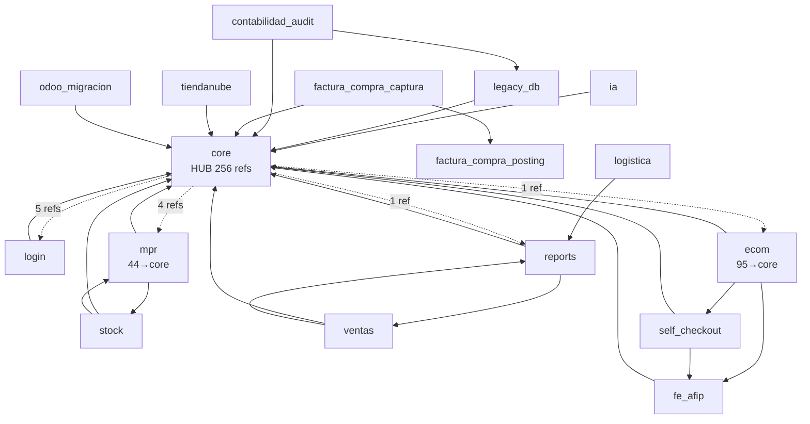
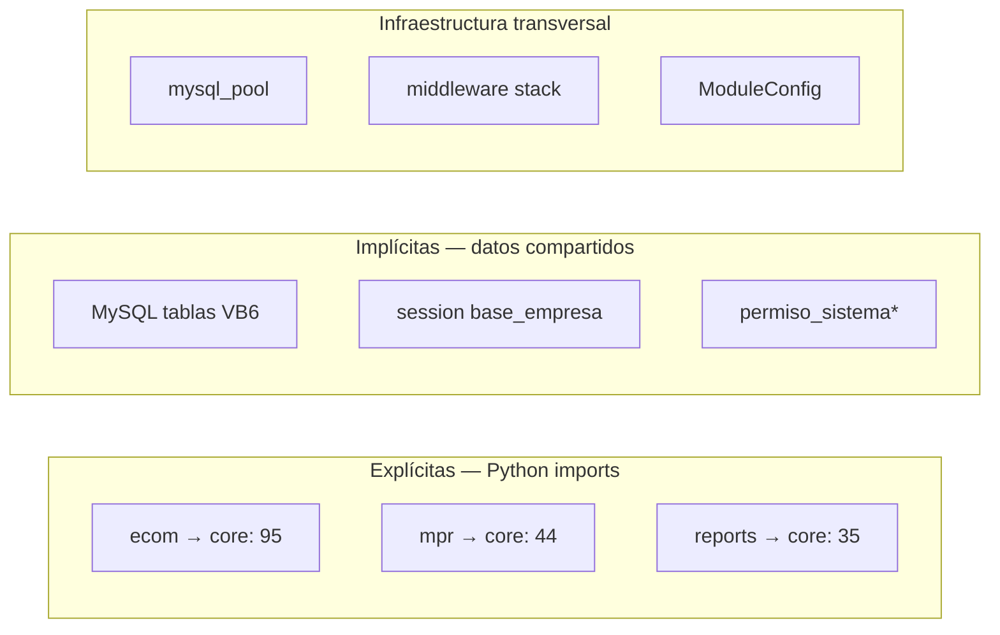

# 04 — Grafo de Dependencias entre Módulos

**Estado:** COMPLETE (Fase 4)  
**Fecha:** 25/08/2026  
**Metodología:** Análisis estático de imports Python (`from app.` / `import app`) en archivos `.py` por directorio de app, excluyendo tests/migrations.

---

## Resumen ejecutivo

Synap presenta un **patrón hub-and-spoke** con `core` como centro gravitacional. Dos métricas complementarias:

| Métrica | Valor | Método |
|---------|------:|--------|
| Archivos con import → core | **256** | Archivos `.py` por app que importan `core` |
| Sentencias import → core | **482** | Líneas `from core.` / `import core` en todo el repo |

No se detectaron ciclos de importación directa entre apps de negocio, pero sí **acoplamiento bidireccional** en pares específicos (ver tabla). El mayor riesgo es la **dependencia universal hacia core** combinada con **imports salientes de core hacia módulos de negocio** (login, mpr, ecom, reports).

**Clasificación:** CONFIRMADO POR CÓDIGO

---

## Matriz de dependencias (archivos con import cruzado)

Filas = módulo que importa. Columnas = módulo importado. Valores = cantidad de archivos.

| FROM ↓ / TO → | **core** | login | reports | ecom | mpr | self_chk | stock | ventas | ia | fe_afip | legacy | contab |
|---------------|:--------:|:-----:|:-------:|:----:|:---:|:--------:|:-----:|:------:|:--:|:-------:|:------:|:------:|
| **core** | — | 5 | 1 | 1 | 4 | 0 | 0 | 0 | 0 | 0 | 0 | 0 |
| **login** | 5 | — | 0 | 2 | 1 | 0 | 0 | 0 | 0 | 0 | 0 | 0 |
| **reports** | 35 | 0 | — | 1 | 3 | 0 | 0 | 6 | 0 | 0 | 0 | 0 |
| **ecom** | **95** | 0 | 0 | — | 1 | 4 | 0 | 1 | 0 | 3 | 0 | 0 |
| **mpr** | **44** | 0 | 0 | 1 | — | 0 | 2 | 0 | 0 | 0 | 0 | 0 |
| **self_checkout** | 5 | 2 | 0 | 0 | 0 | — | 0 | 0 | 0 | 4 | 0 | 0 |
| **stock** | 9 | 0 | 0 | 0 | 2 | 0 | — | 0 | 0 | 0 | 0 | 0 |
| **ventas** | 13 | 0 | 4 | 1 | 0 | 0 | 0 | — | 0 | 0 | 0 | 0 |
| **ia** | 1 | 0 | 1 | 0 | 1 | 0 | 0 | 0 | — | 0 | 0 | 0 |
| **fe_afip** | 3 | 0 | 0 | 0 | 0 | 0 | 0 | 0 | 0 | — | 0 | 0 |
| **legacy_db** | 7 | 0 | 0 | 0 | 0 | 0 | 0 | 0 | 0 | 0 | — | 1 |
| **contabilidad_audit** | 13 | 0 | 0 | 0 | 0 | 0 | 0 | 0 | 0 | 0 | 1 | — |

---

## Ranking: módulos más dependidos

| # | Módulo | Referencias entrantes | Rol |
|---|--------|----------------------:|-----|
| 1 | **core** | 256 | Hub universal |
| 2 | mpr | 12 | Producción referenciada |
| 3 | self_checkout | 10 | TPV referenciado |
| 4 | login | 7 | Auth |
| 5 | reports | 7 | Informes |
| 6 | ecom | 7 | E-commerce |
| 7 | ventas | 7 | Ventas |
| 8 | fe_afip | 7 | Facturación electrónica |
| 9 | factura_compra_posting | 6 | Posting compras |
| 10 | stock | 2 | Stock |

---

## Dependencias bidireccionales

| Par | A→B | B→A | Tipo | Riesgo |
|-----|----:|----:|------|--------|
| core ↔ login | 5 | 5 | Explícita | Bajo — esperado |
| core ↔ reports | 1 | 35 | **Asimétrica** | Medio — core importa reports mínimamente |
| core ↔ ecom | 1 | 95 | **Asimétrica extrema** | Alto — ecom depende masivamente de core |
| core ↔ mpr | 4 | 44 | Asimétrica | Alto |
| reports ↔ ventas | 6 | 4 | Bidireccional | Medio — acoplamiento analítico |
| ecom ↔ mpr | 1 | 1 | Bidireccional débil | Bajo |
| ecom ↔ ventas | 1 | 1 | Bidireccional débil | Bajo |
| mpr ↔ stock | 2 | 2 | Bidireccional | Medio — dominios relacionados |
| contabilidad_audit ↔ legacy_db | 26 | 1 | **Bidireccional fuerte** | Alto — auditoría contable acoplada a legacy_db |
| factura_compra_captura ↔ self_checkout | 10 | — | **Bidireccional** | **Alto** — dominios distintos acoplados |
| factura_compra_captura ↔ posting | 6 | 1 | Asimétrica | Esperado (lib) |
| stock → mpr | 2 | 2 | Bidireccional | **Alto** — inversión de capa (stock importa mpr) |
| ventas → ecom | 1 | 1 | Bidireccional débil | Medio |
| logistica ↔ reports | 1 | 1 | Bidireccional débil | Bajo |

**No se detectaron ciclos A→B→A→B con profundidad > 1** en imports directos entre apps de negocio.

**Clasificación:** CONFIRMADO POR CÓDIGO

---

## Diagrama de dependencias (simplificado)

---

## Clasificación de dependencias

### Explícitas (import directo)

Todas las documentadas en la matriz. Patrón dominante: `from core.mysql_pool import ...`, `from core.decorators import ...`, `from core.services.administranet_stock import ...`.

### Implícitas (sin import, acoplamiento por datos)

| Dependencia | Mecanismo | Apps afectadas |
|-------------|-----------|----------------|
| Tablas MySQL compartidas | SQL directo a mismas tablas | Todas las apps MySQL |
| Sesión `base_empresa` | Middleware global | Todas |
| `ModuleConfig` | Activación módulos | Todas vía middleware |
| DDL legacy catalog | `core/services/legacy_mysql_schema` | mpr, ecom, self_checkout, tiendanube |
| Permisos legacy | `permiso_sistema*` MySQL | Todas |

**Clasificación:** CONFIRMADO POR CÓDIGO

### Transversales (cross-cutting)

| Dependencia | Tipo | Impacto |
|-------------|------|---------|
| `core.mysql_pool` | Infraestructura | Universal |
| `core.decorators` | Seguridad | Universal |
| `core.utils.administranet_types` | Datos | Universal |
| `core.context_processors` | UI | Todas las templates |
| `core.middleware.*` | Runtime | Todos los requests |

### Peligrosas

| ID | Dependencia | Severidad | Descripción |
|----|-------------|-----------|-------------|
| DEP-001 | ecom → core (95 archivos) | **Alta** | Imposible extraer ecom sin extraer/replicar core |
| DEP-002 | core → mpr/ecom/reports (imports inversos) | **Alta** | Core conoce módulos de negocio |
| DEP-003 | core.services.administranet_stock | **Alta** | Lógica stock en core, usada por stock/mpr/self_checkout |
| DEP-004 | reports ↔ ventas bidireccional | Media | Acoplamiento analítico-operativo |
| DEP-005 | Sin interfaces/contratos formales | **Alta** | Imports directos sin API boundaries |
| DEP-006 | DDL catalog en core para todos los dominios | **Alta** | 3200 líneas DDL mezclando MPR, ecom, TN |
| DEP-007 | factura_compra_captura ↔ self_checkout (10 imports) | **Alta** | Acoplamiento cross-domain sin contrato |
| DEP-008 | stock → mpr (imports inversos) | **Alta** | Capa operativa depende de producción |
| DEP-009 | contabilidad_audit ↔ legacy_db (26 imports) | **Alta** | Refactor contable bloqueado por legacy_db |

---

## Dependencias por tipo de acoplamiento

---

## Señales Django y side effects

| Mecanismo | Ubicación | Dependencias |
|-----------|-----------|-------------|
| Django signals | `tiendanube_administranet/signals.py` | tiendanube → models propios |
| `transaction.on_commit` | factura_compra_captura OCR | captura → posting |
| `atexit` | `core/mysql_pool.py` | Pool cleanup |
| Context processors | `core/context_processors.py` | core → todas las templates |
| `url_registry` | `core/url_registry.py` | core → URLs dinámicas de módulos |

---

## Impacto en productización

| Módulo | Independencia | Bloqueador principal |
|--------|:------------:|---------------------|
| theme | Alta | Ninguno |
| ia | Media | core (auth, permisos) |
| factura_compra_posting | Media-Alta | Solo contrato Python |
| odoo_migracion | Media | core + MySQL |
| reports | Baja | core + MySQL masivo |
| ecom | Muy baja | core (95) + fe_afip + PHP |
| mpr | Muy baja | core (44) + MySQL intenso |
| self_checkout | Muy baja | core + fe_afip + MySQL |

---

## Conclusión

1. **No hay dependencias circulares críticas** entre apps de negocio en imports directos.
2. **core es el cuello de botella** — cualquier refactor debe empezar por desacoplar core.
3. **ecom y mpr son los más acoplados** a core (95 y 44 archivos respectivamente).
4. El acoplamiento **implícito por datos MySQL** es más grave que el de imports Python.
5. Se necesita **Anti-Corruption Layer** antes de extraer cualquier módulo.

---

*Generado por auditoría READ ONLY. Análisis estático de imports; no incluye dependencias runtime dinámicas.*
