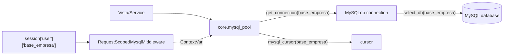
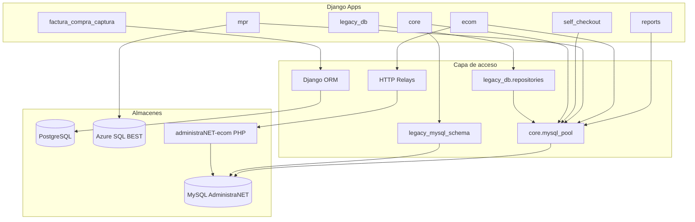

# 05 — Arquitectura de Acceso a Datos

**Estado:** COMPLETE (Fase 5)  
**Fecha:** 25/08/2026

---

## Resumen

Synap utiliza un **modelo dual de acceso a datos**: Django ORM sobre PostgreSQL para metadatos propios, y **SQL crudo parametrizado** vía `core/mysql_pool` para AdministraNET. No hay capa de abstracción uniforme (Repository/DAO) — cada módulo implementa su propio acceso.

**Clasificación:** CONFIRMADO POR CÓDIGO

---

## Conexiones de base de datos

| Alias | Motor | Config | Uso | Migraciones |
|-------|-------|--------|-----|:-----------:|
| `default` | PostgreSQL 13 | `POSTGRES_*` env vars | Datos Synap | Sí |
| `mysql` | MySQL 5.7+ | `DB_*` env vars | AdministraNET legacy | No |

**Router:** `legacy_db.db_router.LegacyDbRouter` — solo enruta `app_label=legacy_db` a alias `mysql`.

**Modo migraciones:** `SYNAP_MIGRATIONS_POSTGRES_ONLY=1` elimina alias `mysql` temporalmente durante `migrate`.

Fuente: `django_project/settings.py:174-224`

---

## Patrón canónico de acceso MySQL

### API del pool (`core/mysql_pool.py`)

| Función | Uso |
|---------|-----|
| `get_connection(base_empresa)` | Context manager, transacciones |
| `mysql_cursor(base_empresa, dict_cursor)` | Cursor directo |
| `request_mysql_conn_var` | Reutiliza conn del request (`RequestScopedMysqlMiddleware`) |
| `close_all_pools()` | Cleanup atexit |

**Config:** MAX_CONNECTIONS=5, POOL_IDLE_SECONDS=30, charset=latin1

**Re-exportadores (compatibilidad):** `mpr/db.py`, `self_checkout/db.py`, `reports/services/connection_pool.py` — delegan a `core.mysql_pool`.

**Middleware:** `core/middleware/request_scoped_mysql.py` — una conexión MySQL por request vía `contextvars`, keyed por `session['user']['base_empresa']`.

---

## Distribución de patrones por app

Conteos: `cursor.execute` vs `.objects.` por directorio (excl. duplicados `* 2.py`, migraciones).

| App | `cursor.execute` | `.objects.` | % ORM | % Raw | Patrón dominante |
|-----|----------------:|------------:|:-----:|:-----:|-----------------|
| **mpr** | 724 | 240 | 25% | **75%** | SQL crudo |
| **self_checkout** | 216 | 3 | 1% | **99%** | SQL crudo |
| **stock** | 54 | 0 | 0% | **100%** | SQL crudo |
| **ventas** | 59 | 0 | 0% | **100%** | SQL crudo |
| **logistica** | 13 | 0 | 0% | **100%** | SQL crudo |
| **core** | 510 | 342 | 40% | 60% | Mixto |
| **reports** | 359 | 295 | 45% | 55% | SQL crudo |
| **ecom** | 185 | 195 | 51% | 49% | Mixto |
| **login** | 23 | 11 | 32% | 68% | SQL crudo |
| **legacy_db** | 11 | 21 | 66% | 34% | Repositorios |
| **tiendanube_administranet** | 24 | 377 | **94%** | 6% | ORM PG |
| **factura_compra_captura** | 8 | 97 | **92%** | 8% | ORM PG |
| **contabilidad_audit** | 5 | 42 | **89%** | 11% | ORM PG + checks SQL |
| **ia** | 7 | 61 | **90%** | 10% | ORM PG |
| **odoo_migracion** | 3 | 29 | **91%** | 9% | ORM PG |
| **fe_afip** | 0 | 22 | **100%** | 0% | ORM PG |
| **sia** | 0 | 20 | **100%** | 0% | ORM PG |

**Conclusión:** Apps operativas legacy (MPR, self_checkout, stock, ventas, logistica) son casi 100% SQL crudo. Apps de configuración/sync (tiendanube, captura, ia, contabilidad_audit) son mayormente ORM PostgreSQL.

**`.raw()` ORM:** 0 ocurrencias. **`.using('mysql')`:** solo `legacy_db` + modelos unmanaged tiendanube.

**Clasificación:** CONFIRMADO POR CÓDIGO — conteos por grep

---

## Acceso PostgreSQL (Django ORM)

**132 modelos** en apps activas (`INSTALLED_APPS` settings.py:56-74). Migraciones solo PG (`SYNAP_MIGRATIONS_POSTGRES_ONLY=1`).

| App | Modelos | Notas |
|-----|--------:|-------|
| core | ~20 | Empresa, UsuarioExtendido, Rol, ModuleConfig, Backup* |
| reports | ~22 | ReportDefinition, Dashboard, Widget, Monthly*, LearnedRelationship |
| mpr | ~16 | Opt, MprParte, MprTurno + **dual:** tablas operativas en MySQL (`mpr_*`) |
| tiendanube_administranet | ~20 | Mayoría PG; algunos unmanaged → MySQL (`tipo_cliente`, `viajantes`, etc.) |
| ia | ~10 | AgentDefinition, LlmProviderConfig, AgentConversation |
| ecom | ~7 | EcomCart, EcomPedidoMasivoDraft |
| factura_compra_captura | ~4 | ExpedienteFacturaCompra, DocumentoFuente |
| contabilidad_audit | ~5 | PoliticaAuditoriaContable, CorridaAuditoria |
| odoo_migracion | ~3 | OdooConnection, MigrationJob |
| fe_afip | ~2 | AFIPConfig, CAEACode |
| sia | ~7 | Department, EvaluationCycle, FodaItem |
| login | 2 | WebAuthnCredential, WebAuthnUserPreference (`db_table` explícito) |

**Nota MPR dual:** modelos PG para metadata/config; operaciones de producción en tablas MySQL `mpr_*` vía SQL crudo.

---

## Tablas MySQL más referenciadas

Ordenadas por frecuencia en strings SQL (`FROM`/`JOIN`/`INTO`/`UPDATE`). Conteos aproximados.

| # | Tabla | Clasificación | READ (apps) | WRITE (apps) |
|---|-------|---------------|-------------|--------------|
| 1 | `articulo` | SHARED | ecom, reports, stock, ventas, self_checkout, legacy_db | core, mpr, tiendanube |
| 2 | `comp_ped` | SHARED | core, reports | ecom, mpr, tiendanube, ventas |
| 3 | `cliente` | SHARED | core, mpr, reports, stock, ventas, legacy_db, login | ecom, self_checkout, tiendanube |
| 4 | `cont_asiento` | SHARED | contabilidad_audit, core | ecom, legacy_db |
| 5 | `cuentacliente` | SHARED | contabilidad_audit, legacy_db, reports, ventas | ecom, self_checkout, tiendanube |
| 6 | `stock` / `stock_deposito` / `stockp` | SHARED | reports, stock, ecom | core, mpr, self_checkout, ecom, tiendanube |
| 7 | `sucursales` | SHARED | contabilidad_audit, ecom, legacy_db, reports, self_checkout | core |
| 8 | `usuarios` | SHARED | ecom, login, mpr, reports, stock, tiendanube | core |
| 9 | `viajantes` | ADMINISTRANET | core, ecom, reports, self_checkout, stock, ventas | login |
| 10 | `iva`, `rubro`, `deposito` | ADMINISTRANET | catálogos fiscales/maestros | — (lectura) |
| 11 | `caja`, `punto_venta` | SHARED | core, reports, self_checkout | ecom, tiendanube, self_checkout |
| 12 | `mpr_parte` | SYNAP OWNED | core | mpr |
| 13 | `self_checkout_cart` | SYNAP OWNED | — | self_checkout |
| 14 | `synap_permiso` | SYNAP OWNED | — | core |
| 15 | `inv_fisico_campana` | SYNAP OWNED | core | stock |

**Total tablas MySQL únicas detectadas:** ~200–250 (estimación regex sobre repo).

---

## Patrones de acceso por categoría

### 1. Repositorio centralizado (mejor práctica existente)

`legacy_db/repositories.py` — SQL parametrizado con `%s`, tipos via `administranet_types`.

Usado por: legacy_db views, contabilidad_audit (parcial).

### 2. Servicios con SQL embebido (patrón dominante)

Cada app tiene servicios con SQL inline:
- `core/services/administranet_stock.py` — 2000+ líneas SQL
- `mpr/services.py` — 8000+ líneas con SQL
- `reports/services/query_runner.py` — motor SQL dinámico
- `ecom/services/*.py` — 50+ servicios

### 3. Runners de reportes

`reports/services/*_runner.py` — queries específicas por informe, delegan a `query_runner.py`.

### 4. DDL centralizado

`core/services/legacy_mysql_schema/catalog.py` — ALTER/CREATE TABLE para tablas Synap en MySQL.

### 5. Relays HTTP (no SQL directo)

`ecom/services/*_relay.py` — delegan a PHP administraNET-ecom.

---

## SQL dinámico y riesgos

### Construcción dinámica de queries

| Ubicación | Patrón | Riesgo |
|-----------|--------|--------|
| `reports/services/query_runner.py` | f-strings para SQL dinámico | **Alto** — inyección si input no sanitizado |
| `reports/services/relationship_validation_service.py:184` | `f"SELECT COUNT(*) FROM \`{from_table}\`"` | **Alto** — nombre tabla dinámico |
| `reports/services/utilidad_gerencial.py` | f-strings columnas dinámicas | Medio |
| `reports/services/executive_dashboard/*.py` | `f"... WHERE {where_clause}"` | Medio — condiciones internas |
| `mpr/services.py` | f-strings con nombres tabla (`{tbl}`) | Medio — tablas de config interna |
| `core/services/administranet_stock.py:81` | `SHOW COLUMNS FROM \`{tabla}\`` | Bajo — introspección schema |
| `core/services/administranet_stock.py:212` | `IN ({placeholders})` con params | Bajo — parametrizado |
| `core/services/legacy_mysql_schema/catalog.py` | f-strings DDL | Bajo — nombres de catálogo |

### Mitigaciones existentes

- `%s` parametrizado en la mayoría de queries
- `core/utils/administranet_types` para normalización
- `reports/services/sql_validator.py` — validación SQL reportes
- No se usa SQLAlchemy ni ORM multi-db para legacy

---

## Acceso por stored procedures / triggers

**No se detectó** uso de stored procedures desde Synap. Triggers MySQL existen en AdministraNET pero Synap no los invoca directamente.

**Clasificación:** CONFIRMADO POR CÓDIGO — grep sin resultados `CALL ` en código Python

---

## information_schema

Usado en:
- `docker-entrypoint.sh` — verificar tablas Django
- `core/services/legacy_mysql_schema/helpers.py` — `SHOW COLUMNS`, verificar índices
- Migraciones bootstrap

---

## Azure SQL (lectura)

`mpr/best_migration/` — `pymssql` para lectura de data warehouse BEST. Conexión separada, solo lectura.

---

## Diagrama de acceso a datos

---

## Anti-patterns detectados

| ID | Pattern | Impacto |
|----|---------|---------|
| DA-001 | SQL disperso en 15+ apps sin repositorio común | Mantenibilidad |
| DA-002 | Nombres tabla hardcodeados en cada módulo | Acoplamiento VB6 |
| DA-003 | Lógica stock en core, no en stock/ | Responsabilidad |
| DA-004 | query_runner con SQL dinámico | Seguridad |
| DA-005 | Sin transacciones distribuidas PG+MySQL | Consistencia |
| DA-006 | latin1 charset fijo | Encoding issues |
| DA-007 | Archivos duplicados `* 2.py` con SQL | Deuda técnica / drift |
| DA-008 | `relationship_validation_service` tabla dinámica | Seguridad |

---

*Detalle de ownership por tabla en `06-DATABASE-TABLE-MAP.md`. Linaje en `07-DATA-LINEAGE.md`.*
