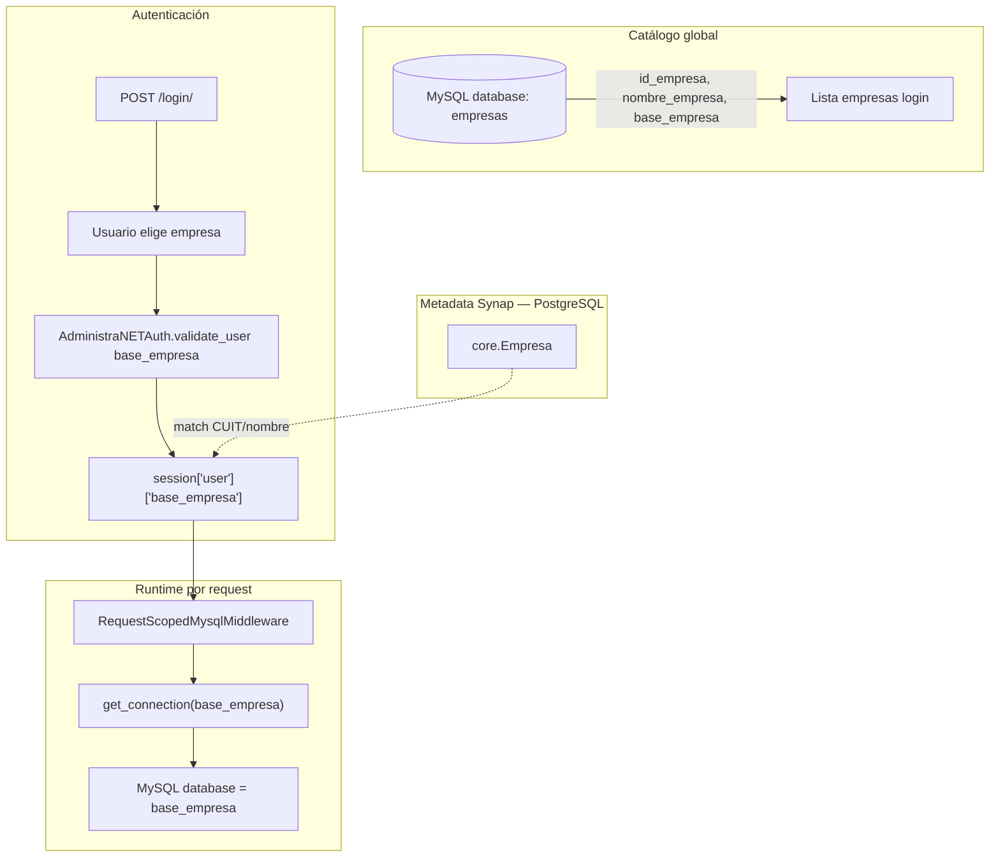

# 08 — Multiempresa y Tenancy

**Estado:** COMPLETE (Fase 8)  
**Fecha:** 25/08/2026

---

## Pregunta central

> ¿Synap es realmente multitenant?

**Respuesta:** Synap implementa **pseudo-multitenant database-per-tenant** sobre infraestructura MySQL compartida con AdministraNET VB6. No es SaaS multitenant con aislamiento de filas ni schemas por tenant en PostgreSQL.

**Clasificación:** CONFIRMADO POR CÓDIGO

---

## Modelo de tenancy



---

## Identificación del tenant

| Concepto | Campo | Almacenamiento | Evidencia |
|----------|-------|----------------|-----------|
| Tenant ID lógico | `base_empresa` | `session["user"]["base_empresa"]` | `login/services/session_bootstrap.py` |
| ID empresa AdministraNET | `id_empresa` | Sesión | `session_bootstrap.py` |
| Empresa Synap (PG) | `core.Empresa.pk` | PostgreSQL | `core/utils/empresa_sesion.py` |
| Catálogo empresas | `empresas.base_empresa` | MySQL DB `empresas` | `login/administranet_auth.py:51-57` |

### Flujo de selección

1. `AdministraNETAuth.get_empresas()` → `SELECT id_empresa, nombre_empresa, base_empresa FROM empresas`
2. Usuario elige empresa en formulario login
3. `validate_user(cod_usuario, password, base_empresa)` autentica contra esa database
4. `bootstrap_synap_session()` persiste `base_empresa` en sesión
5. Cada request: `RequestScopedMysqlMiddleware` abre conexión a esa database

**Clasificación:** CONFIRMADO POR CÓDIGO

---

## Tipo de aislamiento

| Modelo | ¿Aplica? | Detalle |
|--------|:--------:|---------|
| Database-per-tenant | **Sí** | `conn.select_db(base_empresa)` en pool |
| Schema-per-tenant | No | MySQL usa databases, no schemas separados |
| Row-level security | No | Sin filtros automáticos por tenant en queries |
| SaaS multi-tenant PG | No | PostgreSQL es single-tenant (datos Synap globales) |
| Híbrido | **Sí** | PG global + MySQL per-empresa |

---

## Resolución de conexión por módulo

| Módulo | Mecanismo | Fallback sin sesión |
|--------|-----------|---------------------|
| General | `session["user"]["base_empresa"]` | — |
| reports | `query_runner` + sesión | `DEFAULT_BASE_EMPRESA` (settings) |
| self_checkout | `self_checkout/db.py` | `DATABASES['mysql']['NAME']` |
| mpr | `mpr/db.py` | Idem |
| tiendanube | `resolve_mysql_base_empresa()` | Config + validación sesión |
| legacy_db views | `request.session["user"]["base_empresa"]` | Error si ausente |

**Riesgo:** `DEFAULT_BASE_EMPRESA` permite ejecutar reportes contra empresa por defecto sin sesión explícita.

**Clasificación:** CONFIRMADO POR CÓDIGO — `settings.py:221`, `reports/services/query_runner.py`

---

## Aislamiento PostgreSQL

Los datos en PostgreSQL **no están particionados por tenant**:

- `ReportDefinition`, `ModuleConfig`, `AgentDefinition` — globales
- `core.Empresa` existe pero no filtra automáticamente queries ORM
- `factura_compra_captura.ExpedienteFacturaCompra` — tiene FK empresa pero sin middleware tenant

**Implicación:** Un usuario autenticado en empresa A podría acceder a datos PG de empresa B si la vista no valida `empresa_id`.

**Clasificación:** INFERIDO CON ALTA CONFIANZA — requiere auditoría endpoint por endpoint (fase 10/21)

---

## Permisos y tenancy

| Capa | Aislamiento |
|------|-------------|
| Login | Por `base_empresa` seleccionada |
| Permisos MySQL | Por `id_puesto` del usuario en esa empresa |
| Permisos Synap (`synap_*`) | Por empresa en tablas MySQL |
| Permisos Django | `UsuarioExtendido` legacy Firebase — no por tenant |
| Módulos | Global (`ModuleConfig`) — no por empresa |

---

## Riesgos de cross-tenant data leakage

| ID | Riesgo | Severidad | Evidencia |
|----|--------|-----------|-----------|
| TENANT-001 | Queries MySQL sin `base_empresa` de sesión | **Alta** | Fallback `DEFAULT_BASE_EMPRESA` en reports |
| TENANT-002 | Datos PostgreSQL sin filtro empresa | **Alta** | Modelos globales sin middleware tenant |
| TENANT-003 | Cache Redis sin key por tenant | **Media** | Pendiente auditoría cache (fase 13) |
| TENANT-004 | Management commands sin contexto empresa | **Media** | 160+ commands, algunos iteran empresas |
| TENANT-005 | API endpoints sin validación tenant | **Alta** | Pendiente catálogo API (fase 11) |
| TENANT-006 | Pool MySQL reutiliza conexiones entre requests | **Baja** | `select_db()` en cada acquire; ContextVar por request |

### Escenario de riesgo TENANT-001

```
Reporte ejecutado sin sesión (API/cron)
  → query_runner usa DEFAULT_BASE_EMPRESA = 'administranet'
  → Datos de empresa por defecto expuestos
```

### Escenario de riesgo TENANT-002

```
Usuario empresa A accede a /compras/captura/revision/<uuid>/
  → Si UUID no valida empresa del expediente
  → Posible IDOR cross-tenant en PostgreSQL
```

**Clasificación:** INFERIDO — requiere validación por endpoint

---

## Middleware de protección

`RequestScopedMysqlMiddleware` (`core/middleware/request_scoped_mysql.py`):

- Abre conexión solo si `session["user"]["base_empresa"]` existe
- Si MySQL rechaza database (errno 1049/1044): `session.flush()` + redirect login
- Libera conexión al final del request

**No protege:** Acceso PostgreSQL, APIs sin sesión, management commands.

---

## Configuración multiempresa

| Setting | Valor | Efecto |
|---------|-------|--------|
| `DEFAULT_BASE_EMPRESA` | `DB_NAME` (default `administranet`) | Fallback reports |
| `enable_multi_company` | `True` en MODULE_CONFIGS core | Flag declarativo |
| `enable_multi_branch` | `True` en MODULE_CONFIGS core | Sucursales en sesión |
| `FACTURA_COMPRA_BASE_EMPRESA_BY_EMPRESA_ID` | `{}` | Mapeo opcional empresa PG → MySQL |

---

## Comparación con SaaS ideal

| Aspecto | Synap hoy | SaaS ideal |
|---------|-----------|------------|
| Tenant resolution | Manual en login | Automático (subdomain/JWT) |
| Data isolation | Database MySQL separada | Schema/row-level + RLS |
| PG data | Global | Tenant-scoped |
| Onboarding | Manual (crear DB MySQL) | Self-service provisioning |
| Billing per tenant | No | Sí |
| Cross-tenant queries | Posible en PG | Bloqueado |

---

## Respuesta a preguntas del master prompt

| # | Pregunta | Respuesta |
|---|----------|-----------|
| 10 | ¿Cómo funciona multiempresa? | Login selecciona `base_empresa` → sesión → pool MySQL |
| 13 | ¿Cómo se selecciona empresa? | Dropdown en login desde tabla `empresas` |
| 21 | ¿Riesgo contaminación tenants? | **Sí** — PG sin aislamiento, fallbacks, APIs sin validación |
| 25 | ¿Puede ser SaaS? | **No sin refactor** — requiere tenant middleware en PG + provisioning |

---

## Recomendaciones (para fases posteriores, no implementar ahora)

1. Middleware tenant para ORM PostgreSQL
2. Eliminar `DEFAULT_BASE_EMPRESA` en runtime con sesión
3. Keys Redis con prefijo `base_empresa`
4. Validar `empresa_id` en todos los endpoints PG
5. ADR sobre modelo tenancy objetivo

---

*Generado por auditoría READ ONLY.*
