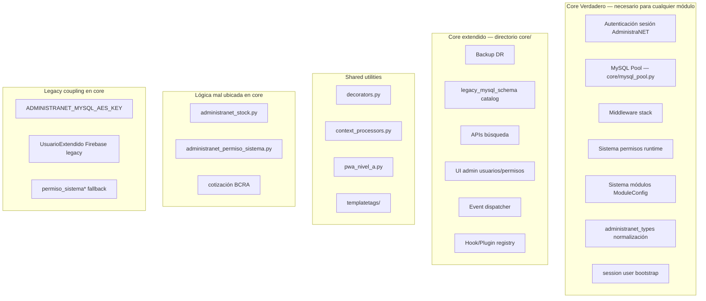

# 09 — Core de Synap

**Estado:** COMPLETE (Fase 9)  
**Fecha:** 25/08/2026

---

## Pregunta central

> ¿Qué constituye realmente el CORE de Synap?

El core **no es solo** el directorio `core/`. Es el conjunto de capacidades transversales sin las cuales ningún módulo puede operar. El directorio `core/` concentra la mayoría, pero `login/` y partes de `django_project/` son igualmente esenciales.

**Clasificación:** CONFIRMADO POR CÓDIGO

---

## Mapa del Core verdadero



---

## Core verdadero — capacidades indispensables

### 1. Autenticación y sesión

| Componente | Path | Función |
|------------|------|---------|
| Login AdministraNET | `login/administranet_auth.py` | Validación usuario/password MySQL |
| Session bootstrap | `login/services/session_bootstrap.py` | `session["user"]` con base_empresa |
| Request user | `core/middleware/base_middleware.py` | `AdministraNETUser` mock |
| Decoradores | `core/decorators.py` | `@administranet_login_required`, `@tiene_permiso` |

**Sin esto:** ningún módulo opera.

### 2. Pool MySQL

| Componente | Path | Función |
|------------|------|---------|
| Pool | `core/mysql_pool.py` | Conexiones thread-safe por base_empresa |
| Request scope | `core/middleware/request_scoped_mysql.py` | 1 conn/request |
| Tipos | `core/utils/administranet_types.py` | Normalización INT/DATE/VARCHAR/DECIMAL |

**Sin esto:** 15+ apps pierden acceso a AdministraNET.

### 3. Sistema de permisos

| Componente | Path | Función |
|------------|------|---------|
| Permisos runtime | `core/services/administranet_permisos_usuario.py` | Lectura permiso_sistema* / synap_* |
| Fuente configurable | `SYNAP_PERMISOS_SOURCE` | legacy / synap / dual |
| Utils | `core/utils/permissions.py` | `user_has_full_access`, mixins DRF |
| Context | `core/context_processors.py` | `permisos_usuario`, `apps_menu` |

### 4. Sistema de módulos

| Componente | Path | Función |
|------------|------|---------|
| Catálogo | `core/module_registry.py` | MODULE_CONFIGS estático |
| Runtime | `core/module_manager.py` | ModuleConfig DB, cache |
| URLs | `core/url_registry.py` | Montaje dinámico |
| Middleware | `core/middleware/module_middleware.py` | Bloqueo módulos inactivos |

### 5. Middleware transversal

Orden en `settings.MIDDLEWARE` — 12 middlewares propios de core.

---

## Shared utilities (reutilizables, no core crítico)

| Utilidad | Path | Uso |
|----------|------|-----|
| Session store seguro | `core/utils/session_store.py` | No expone id_sesion al frontend |
| Empresa sesión | `core/utils/empresa_sesion.py` | Resuelve Empresa PG desde sesión |
| Rate limit | `core/utils/rate_limit.py` | Middleware (inactivo) |
| CDN utils | `core/utils/cdn.py` | Headers cache |
| Menu tags | `core/templatetags/menu_tags.py` | Templates |
| PWA Nivel A | `core/pwa_nivel_a.py` | Restricción móvil |

---

## Lógica de negocio mal ubicada en core

Estas capacidades son **dominio de negocio** pero viven en `core/services/`:

| Servicio | Dominio real | Impacto |
|----------|-------------|---------|
| `administranet_stock.py` | stock | stock/, self_checkout, ecom importan desde core |
| `administranet_permiso_sistema.py` | permisos/HR | Escritura permisos legacy |
| `cotizacion_bcra.py` | finanzas | Cotización dólar |
| `legacy_mysql_schema/catalog.py` | infra DDL | 3200 líneas DDL por dominio (MPR, ecom, etc.) |

**Problema arquitectónico:** core se convierte en "god module" con lógica de stock, permisos, finanzas y DDL de todos los dominios.

**Clasificación:** CONFIRMADO POR CÓDIGO

---

## Legacy coupling dentro de core

| Acoplamiento | Evidencia | Nivel |
|--------------|-----------|:-----:|
| Password AES AdministraNET | `ADMINISTRANET_MYSQL_AES_KEY` default hardcoded | 4 |
| UsuarioExtendido Firebase | `AUTH_USER_MODEL = core.UsuarioExtendido` | 3 |
| permiso_sistema* como fuente default | `SYNAP_PERMISOS_SOURCE=legacy` | 4 |
| Tabla empresas MySQL para login | `get_empresas()` database `empresas` | 4 |
| Charset latin1 MySQL | `DATABASES['mysql'].OPTIONS.charset` | 3 |
| Puestos ancla VB6 | `SYNAP_BLOQUEAR_CREAR_PUESTOS=True` | 3 |

---

## Capacidades core extendidas (directorio core/)

### Backup y DR

`core/backup/` — orquestación Postgres + MySQL + SFTP + bootstrap cifrado.

**Productizable:** Sí, con abstracción de fuentes de datos.

### Extensibilidad

| Sistema | Estado | Uso real |
|---------|--------|----------|
| Hooks | Implementado | Bajo — ejemplos en `core/examples/` |
| Plugins | Implementado | Bajo — JSON opcional |
| Events | Implementado | In-process |
| Extensions | Implementado | Bajo |

**Clasificación:** CONFIRMADO POR CÓDIGO — infraestructura presente, adopción limitada.

### APIs transversales

`core/api/views.py` — búsquedas predictivas usadas por múltiples módulos (artículos, clientes, geo).

---

## Qué NO es core (pero se confunde)

| Componente | Por qué no es core |
|------------|-------------------|
| reports | Dominio analítico completo con motor propio |
| theme | Capa presentación, intercambiable |
| django_project/ | Configuración, no lógica |
| legacy_db | Capa integración ERP, debería ser adapter |
| fe_afip | Dominio fiscal específico Argentina |

---

## Core objetivo para productización

Capacidades que **deberían** formar Synap Platform Core:

```
Synap Core (propuesto, no implementado)
├── Identity        ← login + session (desacoplado de AdministraNET)
├── Tenant          ← base_empresa resolution + PG tenant middleware
├── Permissions     ← synap_* como única fuente
├── Configuration   ← SystemConfiguration, ModuleConfig
├── Data Access     ← pool abstraction + anti-corruption layer
├── Events          ← event_dispatcher (evolucionar a message bus)
├── Audit           ← logging transversal
└── Integration     ← framework para adapters (AdministraNET, Odoo, ...)
```

---

## Dependencias hacia core (hub)

Todas las 20 apps activas importan desde `core`. Apps con más dependencias:

| App | Imports desde core (aprox.) |
|-----|----------------------------:|
| ecom | 40+ |
| mpr | 35+ |
| self_checkout | 30+ |
| reports | 25+ |
| stock | 20+ |

**Detalle completo:** `04-MODULE-DEPENDENCY-GRAPH.md`

---

## Respuestas clave

| Pregunta | Respuesta |
|----------|-----------|
| ¿Cuál es el Core? | Pool MySQL + auth sesión + permisos + módulos + middleware |
| ¿Dónde está? | Principalmente `core/` + `login/` + `django_project/settings.py` |
| ¿Qué módulos deberían formar el Core? | Identity, Tenant, Permissions, Config, Data Access, Events |
| ¿Qué está mal ubicado? | Stock, permisos HR, cotización BCRA, DDL legacy en core |

---

*Generado por auditoría READ ONLY.*
