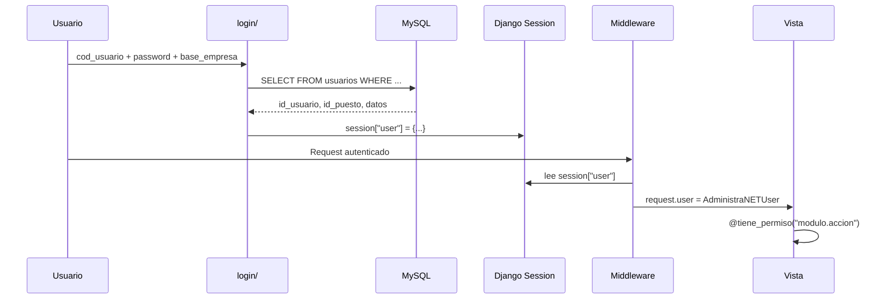

# 10 — Identity & Access Management

**Estado:** COMPLETE (Fase 10)  
**Fecha:** 25/08/2026

---

## Modelo de identidad

Synap **no gestiona identidades propias** para usuarios operativos. La identidad proviene de AdministraNET MySQL.



**Clasificación:** CONFIRMADO POR CÓDIGO

---

## Componentes IAM

| Componente | Archivo | Función |
|----------|---------|---------|
| Autenticación | `login/administranet_auth.py` | Validación MySQL + AES password |
| Session bootstrap | `login/services/session_bootstrap.py` | Estructura session["user"] |
| User mock | `core/middleware/base_middleware.py` | `AdministraNETUser` |
| Permisos runtime | `core/services/administranet_permisos_usuario.py` | Lectura permiso_sistema*/synap_* |
| Decoradores | `core/decorators.py` | `@administranet_login_required`, `@tiene_permiso` |
| DRF permissions | `core/utils/permissions.py` | Mixins, `user_has_full_access` |
| Admin Django | `core/middleware/base_middleware.py` | `AdminAccessMiddleware` — rol administrador |
| WebAuthn | `login/services/webauthn_*` | Passkeys PWA post-login (flag `login.webauthn.unlock_enabled`, default off) |
| Google OAuth | settings `GOOGLE_CLIENT_*` | **NO IMPLEMENTADO** — solo placeholders en settings y `module_registry` |

---

## Estructura de sesión

```python
session["user"] = {
    "id_usuario": int,
    "cod_usuario": str,        # "supervisor" = superuser
    "base_empresa": str,       # TENANT KEY
    "nombre_empresa": str,
    "id_empresa": int,
    "id_sucursal": int,
    "id_puesto": int,          # ANCLA PERMISOS
    "id_sesion": int,          # NO expuesto al frontend
    # ... más campos
}
```

Fuente: `login/services/session_bootstrap.py`

---

## Sistema de permisos

### Fuente configurable

`SYNAP_PERMISOS_SOURCE` en settings:

| Modo | Fuente | Estado |
|------|--------|--------|
| `legacy` (default) | `permiso_sistema` + `permiso_sistema_puesto` MySQL | Activo |
| `synap` | Tablas `synap_*` MySQL | Cutover planificado |
| `dual` | Unión ambas + WARNING si difieren | Validación |

### Jerarquía

```
cod_usuario == "supervisor" → acceso total
id_puesto → permiso_sistema_puesto → permiso_sistema
synap_puesto_rol → synap_rol → synap_rol_permiso → synap_permiso
ModuleConfig.permissions → verificación por módulo
@tiene_permiso("modulo.accion") → decorador en vistas
```

### Permisos por módulo

`MODULE_CONFIGS[modulo].permissions` — lista declarada en `core/module_registry.py`.

`ModulePermissionMiddleware` verifica acceso al módulo activo.

---

## Autorización DRF

```python
REST_FRAMEWORK = {
    'DEFAULT_AUTHENTICATION_CLASSES': [
        'SessionAuthentication',
        'TokenAuthentication',
    ],
    'DEFAULT_PERMISSION_CLASSES': [
        'IsAuthenticated',
    ],
}
```

**Nota:** `IsAuthenticated` verifica Django auth, pero usuarios operativos son `AdministraNETUser` (mock), no `UsuarioExtendido` Django.

---

## Supervisión y roles especiales

| Rol | Criterio | Acceso |
|-----|----------|--------|
| Supervisor AdministraNET | `cod_usuario == 'supervisor'` | Total (`{"*"}` permisos) |
| Admin Django | `AdminAccessMiddleware` | **Efectivamente solo `supervisor`** — `RolesManager` mock no resuelve rol "Administrador" |
| Supervisor schema MySQL | Decorador `@solo_usuario_supervisor` | DDL legacy tools |
| PWA Nivel A móvil | `MobileLevelAOnlyMiddleware` | Rutas restringidas |

**Gap documentado:** `tiene_permiso` verifica rol Django `"Administrador"` vía `user.roles.all()`, pero `AdministraNETUser.RolesManager.all()` siempre retorna `[]` — ese bypass está **muerto** para usuarios de sesión.

---

## Riesgos IAM

| ID | Riesgo | Severidad | Evidencia |
|----|--------|-----------|-----------|
| IAM-001 | AdministraNETUser no es User Django real | Media | Mock sobre AnonymousUser |
| IAM-002 | Dos fuentes permisos (legacy/synap) | **Alta** | SYNAP_PERMISOS_SOURCE |
| IAM-003 | Endpoints sin @tiene_permiso | **Alta** | Auditoría parcial APIs |
| IAM-004 | IDOR en recursos PG sin check empresa | **Alta** | `factura_compra_captura/api/views.py` — list/detail por `pk` sin filtro `empresa_activa_id`; web views sí filtran |
| IAM-005 | AES key default hardcoded | **Alta** | `settings.py` + duplicado en `core/services/administranet_users.py:14` |
| IAM-006 | CSRF exempt en webhooks TN | Media | `@csrf_exempt` + HMAC obligatorio en prod |
| IAM-007 | Token auth sin rotación documentada | Media | DRF TokenAuthentication |
| IAM-008 | Permisos solo UI (sin API check) | **Alta** | Varias api_views |
| IAM-009 | API empresas sin autenticación | Media | `GET /login/api/empresas/` — rate limit 90/min |
| IAM-010 | Google OAuth documentado pero ausente | INFO | Sin views/URLs de callback |

---

*Threat assessment completo en `21-SECURITY-ASSESSMENT.md`.*
