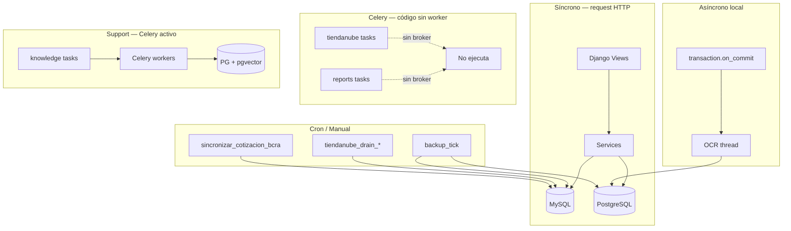

# 12 — Procesamiento Asíncrono y Jobs

**Estado:** COMPLETE (Fase 12)  
**Fecha:** 25/08/2026

---

## Resumen

Synap principal **no tiene Celery operacional** en Docker Compose. El procesamiento asíncrono se realiza via **threads**, **management commands** (cron), y **transaction.on_commit**. El proyecto `support/` sí tiene Celery activo.

**Clasificación:** CONFIRMADO POR CÓDIGO

---

## Celery en Synap principal

| Componente | Estado | Evidencia |
|------------|--------|-----------|
| `django_project/celery.py` | **Comentado/eliminado** | Líneas 1-23 comentadas |
| `django_project/__init__.py` | Celery import comentado | — |
| `docker-compose.yml` | Sin celery_worker/beat | Líneas 109-112 comentadas |
| `requirements.txt` | `celery>=5.3,<6` instalado | Línea 45 |
| Settings CELERY_* | Comentados | settings.py 489-498, 584-590 |

### Tasks Celery presentes (código sin worker)

| Módulo | Archivo | Función |
|--------|---------|---------|
| tiendanube_administranet | `tasks/sync_tasks.py` | Sync productos/clientes |
| tiendanube_administranet | `tasks/webhook_tasks.py` | Procesamiento webhooks |
| reports | `tasks.py` | `refresh_report_cache`, `export_report_async` (stubs) |
| factura_compra_captura | `ocr/jobs.py` | OCR diferido |

**Archivos duplicados detectados:** `jobs 2.py` en `factura_compra_captura/ocr/` y `factura_compra_posting/` — posible copia accidental, revisar antes de deploy.

**Riesgo:** Tasks definidas pero sin broker/worker → jobs encolados se pierden o fallan silenciosamente.

---

## Procesamiento por threads

| Módulo | Uso | Config |
|--------|-----|--------|
| factura_compra_captura | OCR post-upload | `FACTURA_COMPRA_OCR_DEFER=True` |
| tiendanube (fallback) | Drain outbox sin Celery | management commands |

---

## Management commands (160 total)

| App | Commands | Ejemplos |
|-----|:--------:|---------|
| **core** | 60 | backup_tick, backup_run, setup_modules, apply_synap_permisos_tables |
| **self_checkout** | 31 | Operaciones TPV batch |
| **reports** | 21 | setup_reports_installation, fix_reports_migrations |
| **mpr** | 18 | apply_schema_mpr, tablero operations |
| **tiendanube** | 9 | tiendanube_drain_outbox, tiendanube_drain_inbox |
| **odoo_migracion** | 5 | Migration jobs |
| **fe_afip** | 5 | Certificados, padrón |
| **ecom** | 3 | Checkpoints, sync |
| **stock** | 2 | Sincronización |
| **login** | 2 | WebAuthn cleanup |
| **contabilidad_audit** | 1 | Auditoría batch |
| **ia** | 1 | export_ia_learning_jsonl |

### Commands críticos programables (cron)

| Command | Frecuencia sugerida | Función |
|---------|--------------------|---------| 
| `backup_tick` | Diario/incremental | DR backup Postgres+MySQL |
| `tiendanube_drain_outbox` | Cada 5 min | Sync Tienda Nube |
| `tiendanube_drain_inbox` | Cada 5 min | Webhooks Tienda Nube |
| `sincronizar_cotizacion_bcra` | Diario | Cotización dólar |
| `sync_tiendanube` | Configurable | Sync completo |

---

## Schedulers

| Mecanismo | Ubicación | Estado |
|-----------|-----------|--------|
| Celery Beat | — | **No activo** en Synap principal |
| BackupSettings.schedule_json | `core/backup/models.py` | JSON cron Lun-Sáb 02:00, Dom 03:00 |
| Host cron | Externo al repo | Ejecuta manage.py commands |
| docker-entrypoint.sh | Al arranque | migrate + bootstrap (no periódico) |

---

## Idempotencia

| Componente | Idempotente | Evidencia |
|------------|:-----------:|-----------|
| backup_tick | Parcial | Verifica jobs existentes |
| tiendanube outbox | Sí | Outbox pattern con estado |
| tiendanube webhooks | Parcial | WebhookEvent con dedup |
| OCR jobs | No claro | Re-ejecución posible |
| migrate | Sí | Django migrations |
| legacy_mysql_schema providers | Sí | Verifica columna/índice existe |

---

## Retries y dead-letter

| Componente | Retries | Dead-letter |
|------------|:-------:|:-----------:|
| Celery tasks | Configurable (sin worker) | No |
| Tiendanube outbox | Reintento en drain | SyncLog con error |
| Webhook delivery | WebhookDeliveryLog | Log de fallos |
| Backup jobs | Manual | BackupJob.status=failed |
| HTTP relays ecom | requests timeout | Error en response |

---

## Diagrama de procesamiento

---

## Riesgos

| ID | Riesgo | Severidad |
|----|--------|-----------|
| ASYNC-001 | Celery instalado pero sin worker en compose | **Alta** |
| ASYNC-002 | OCR en thread puede perderse si proceso muere | Media |
| ASYNC-003 | 60 commands en core sin documentación cron | Media |
| ASYNC-004 | Sin dead-letter queue centralizada | Media |
| ASYNC-005 | Backup depende de cron externo no versionado | Media |

---

*Generado por auditoría READ ONLY.*
