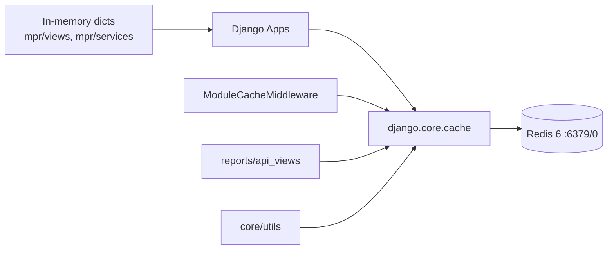

# 13 — Arquitectura de Cache

**Estado:** COMPLETE (Fase 13)  
**Fecha:** 25/08/2026

---

## Configuración

```python
CACHES = {
    'default': {
        'BACKEND': 'django_redis.cache.RedisCache',
        'LOCATION': 'redis://redis:6379/0',  # REDIS_URL env
        'OPTIONS': {
            'CLIENT_CLASS': 'django_redis.client.DefaultClient',
            'CONNECTION_POOL_KWARGS': {'decode_responses': False}
        }
    }
}
```

Fuente: `django_project/settings.py:445-456`

**Infraestructura:** Redis 6 Alpine, AOF persistence, puerto 6381 (host).

**Clasificación:** CONFIRMADO POR CÓDIGO

---

## Qué se cachea

| Dato | Mecanismo | TTL | Key pattern | Aislamiento tenant |
|------|-----------|-----|-------------|:------------------:|
| Módulos activos | `ModuleCacheMiddleware` | 300s | `core.active_modules.db` | **No** — global |
| Resultados reportes API | `cache.get/set` en `reports/api_views.py` | Variable | Por reporte+filtros | **Parcial** — depende key |
| Usuario Firebase legacy | `cache` en middleware | 300s | `user_uid_{uid}` | No |
| BOM MPR | Dict in-memory en servicio | Request-scoped | Variable local | Por request |
| Permisos sync | TTL config | 86400s | Por empresa | **Sí** — por base_empresa |
| Schema ensure | TTL config | 86400s | Por empresa | **Sí** |

### Reportes cache

`REPORTS_CACHE_ENABLED = False` (default) — cache de reportes **desactivado** por defecto.

Cuando activo, `reports/api_views.py` usa `cache.get(cache_key)` / `cache.set(cache_key, data)` en endpoints de datos de dashboard.

---

## Caches in-memory (no Redis)

| Ubicación | Tipo | Scope |
|-----------|------|-------|
| `mpr/views.py` | Dict local `mov_cache`, `renglones_cache` | Request/view |
| `mpr/services.py` | `bom_cache`, `stock_cache` | Función |
| `ModuleManager` | `_cache` dict | Proceso, TTL 300s |

---

## Middleware de cache (inactivo)

`CDNCacheMiddleware` — definido en `core/middleware/` pero **comentado** en settings.

Headers CDN configurados en settings:
- Static: `max-age=31536000, immutable`
- Media: `max-age=86400`
- Images: `max-age=604800`

---

## Invalidación

| Cache | Invalidación | Automática |
|-------|-------------|:----------:|
| Módulos activos | TTL 300s o restart | Sí |
| Reportes | TTL o manual | Parcial |
| Permisos | `SYNAP_AUTO_SYNC_PERMISSIONS_TTL` | Sí |
| Redis general | Sin estrategia documentada | No |

**No se detectó** invalidación por señal Django al modificar datos MySQL.

---

## Riesgo cross-tenant en cache

| ID | Riesgo | Severidad | Detalle |
|----|--------|-----------|---------|
| CACHE-001 | Keys sin `base_empresa` | **Alta** | ModuleCache global |
| CACHE-002 | Reportes cache sin tenant en key | **Alta** | Si REPORTS_CACHE_ENABLED=true |
| CACHE-003 | Firebase user cache sin tenant | Baja | Legacy, poco usado |

### Escenario CACHE-002

```
Empresa A ejecuta reporte → cache.set("report_ventas_2024", data_A)
Empresa B solicita mismo reporte → cache.get("report_ventas_2024") → data_A
```

**Mitigación actual:** REPORTS_CACHE_ENABLED=false por defecto.

---

## Diagrama



---

*Generado por auditoría READ ONLY.*
