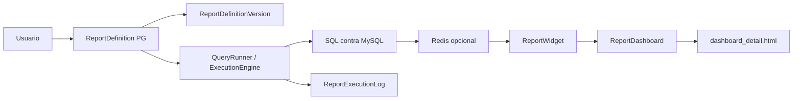

# 15 — Motor de Reportes

**Estado:** COMPLETE (Fase 15)  
**Fecha:** 25/08/2026

---

## Ciclo completo

---

## Modelos (PostgreSQL) — 22 clases

| Modelo | Función |
|--------|---------|
| `ReportDefinition` | Definición informe (slug, query config JSON, category) |
| `ReportDefinitionVersion` | Versionado con rollback |
| `ReportDashboard` | Dashboard con layout widgets |
| `ReportWidget` | Widget individual (tipo, config, posición) |
| `ReportExecutionLog` | Log ejecuciones (duración, rows, error) |
| `ReportWorkspace` | Espacio trabajo personalizado |
| `ReportTemplate` | Plantillas reutilizables |
| `LearnedRelationship` | Relaciones aprendidas entre tablas |
| `TableClusterAssignment` | Clustering tablas para sugerencias |
| `MonthlyReportingPack` | Reporting mensual licenciatarios |
| `MonthlyReportingImportBatch` | Importación .xlsb |
| `PuntoVentaCanalEjecutivo` | Config canales PV |
| `SucursalCanalEjecutivo` | Config canales sucursal |

Fuente: `reports/models.py`

---

## Motor de ejecución — dos rutas paralelas

| Ruta | Condición | Componente |
|------|-----------|------------|
| **Declarative v1** | `config.engine == "declarative-v1"` | `DeclarativeV1Engine` → `SqlQueryBuilder` |
| **Legacy slug-dispatch** | Resto de slugs | `if/elif` por slug en `query_runner.py` (~4000 líneas) |

Híbridos (`BUILDER_HYBRID_SLUGS`): `stock_existencias`, `stock_existencias_por_deposito` — mezclan builder + SQL custom.

**Código muerto:** bloque post-`return` en `query_runner.py` (~líneas 3840+) — nunca ejecutado.

| Componente | Archivo | Función |
|----------|---------|---------|
| QueryRunner | `reports/services/query_runner.py` | Orquestador principal (dual engine) |
| ExecutionEngine | `reports/services/execution_engine.py` | Motor ejecución |
| Connection pool | `reports/services/connection_pool.py` | Wrapper mysql_pool |
| SQL Validator | `reports/services/sql_validator.py` | Validación SQL |
| Declarative v1 | `reports/services/declarative-v1/` | Builder declarativo |
| Runners específicos | `reports/services/*_runner.py` | 20+ informes hardcoded |
| Cache | `reports/cache.py` | build_cache_key, get/set |
| Tasks | `reports/tasks.py` | Stubs Celery (`refresh_report_cache`, `export_report_async`) — sin worker |

---

## Conexión a datos

- **MySQL:** via `get_mysql_pool()` → `base_empresa` de sesión o `DEFAULT_BASE_EMPRESA`
- **PostgreSQL:** metadatos reportes, workspaces, logs
- **No usa ORM** para datos de negocio — todo SQL crudo

---

## Caching

- `REPORTS_CACHE_ENABLED` (default: **false**)
- `reports/cache.py` — keys por reporte+filtros+base_empresa
- `reports/api_views.py` — cache.get/set en endpoints dashboard
- Lock anti-stampede en `query_runner.py` (`_cache_locks`)

---

## Permisos de ejecución

| Clase | Uso |
|-------|-----|
| `OperationalReportsPermission` | Informes operativos |
| `ManagerialReportsPermission` | Informes gerenciales |
| `ReportWorkspacePermission` | Workspaces personales |
| `ReportBuilderPermission` | Constructor de informes |

Fuente: `reports/permissions.py`

---

## Versionado y rollback

- `ReportDefinitionVersion` almacena snapshots de config
- Rollback posible a versión anterior de **definición**
- **Gap:** rollback no revierte widgets asociados al dashboard
- `RelationshipAuditLog` para cambios en relaciones aprendidas

---

## Acoplamiento AdministraNET

| Aspecto | Nivel | Detalle |
|---------|:-----:|---------|
| Tablas MySQL | **4 - Crítico** | Lee cientos de tablas VB6 |
| Nombres columnas | **4 - Crítico** | Conoce schema legacy |
| Formato fechas | **3 - Alto** | YYYYMMDD INT, latin1 |
| Lógica negocio | **2 - Moderado** | Algunas reglas en runners |
| Metadatos PG | **0 - Independiente** | ReportDefinition es propio |

---

## Desacoplamiento y reusabilidad

| Componente | Reusabilidad | Notas |
|------------|:------------:|-------|
| ReportDefinition/Widget/Dashboard | **Alta** | Modelo genérico productizable |
| QueryRunner | **Baja** | Acoplado a tablas AdministraNET |
| ExecutionEngine | **Media** | Abstracción parcial |
| Declarative v1 | **Media** | Builder genérico, data sources legacy |
| LearnedRelationship | **Alta** | Descubrimiento schema automático |
| Monthly Reporting | **Baja** | Específico cliente/licenciatarios |
| Runners específicos | **Muy baja** | Hardcoded por informe |

---

## Riesgos

| ID | Riesgo | Severidad |
|----|--------|-----------|
| REP-001 | query_runner 4000 líneas monolítico | Alta |
| REP-002 | SQL dinámico sin sandbox | Alta |
| REP-003 | DEFAULT_BASE_EMPRESA sin sesión | Alta |
| REP-004 | 20+ runners duplican lógica | Media |
| REP-005 | Sin tests para todos los runners | Media |
| REP-006 | Código muerto post-return en query_runner | Baja |
| REP-007 | Rollback no revierte widgets | Media |
| REP-008 | Tasks Celery definidas sin worker | Alta |

---

*Generado por auditoría READ ONLY.*
