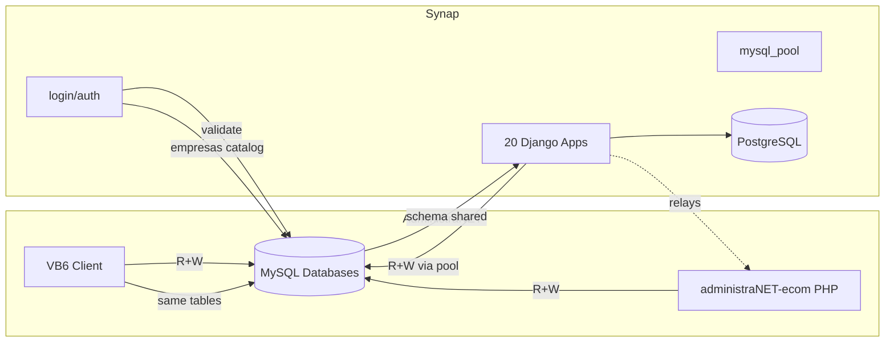

# 18 — Acoplamiento Synap ↔ AdministraNET

**Estado:** COMPLETE (Fase 18)  
**Fecha:** 25/08/2026

---

## Diagrama de dependencias

---

## Clasificación por tipo de acoplamiento

### DATA COUPLING (Nivel 4 — Crítico)

| Dependencia | Apps | Tablas |
|-------------|------|--------|
| Maestros artículos/clientes | Todos | articulo, cliente, proveedor |
| Transacciones ventas | self_checkout, ecom | compventa, comp_ped |
| Stock | stock, mpr, self_checkout | stockp, stock_deposito |
| Contabilidad | contabilidad_audit, legacy_db | cont_asiento, cont_detalle |
| Permisos | core, login | permiso_sistema*, usuarios, puestos |
| Configuración | core, self_checkout | configuracion, talonarios |

### LOGIC COUPLING (Nivel 3 — Alto)

| Dependencia | Evidencia |
|-------------|-----------|
| Validación password AES | `ADMINISTRANET_MYSQL_AES_KEY` |
| Tipos datos INT/DATE/VARCHAR | `administranet_types.py` |
| Reglas stock VB6 replicadas | `administranet_stock.py` |
| Formato fechas YYYYMMDD | query_runner, mpr |
| Numeración talonarios | self_checkout, mpr |
| Imputación contable VB6 | legacy_db services |

### IDENTITY COUPLING (Nivel 4 — Crítico)

| Dependencia | Evidencia |
|-------------|-----------|
| Usuarios en MySQL | login/administranet_auth.py |
| Puestos como ancla permisos | SYNAP_BLOQUEAR_CREAR_PUESTOS |
| Catálogo empresas MySQL | database `empresas` |
| Supervisor = superuser | cod_usuario == 'supervisor' |

### PROCESS COUPLING (Nivel 3 — Alto)

| Proceso | Synap | VB6 | Conflicto |
|---------|:-----:|:---:|:---------:|
| Venta TPV | self_checkout | TPV VB6 | Mismas tablas |
| Pedido e-commerce | ecom | — | comp_ped |
| Movimiento stock | stock, mpr | VB6 stock | stockp |
| Asiento contable | legacy_db | VB6 contabilidad | cont_asiento |
| Factura compra | captura→posting | VB6 compras | cuentaproveedor |

### INFRASTRUCTURE COUPLING (Nivel 3 — Alto)

| Dependencia | Evidencia |
|-------------|-----------|
| Mismo servidor MySQL | DB_HOST en settings |
| Mismo charset latin1 | DATABASES mysql OPTIONS |
| Docker MySQL 5.7 dev | docker-compose.mysql.yml |
| Red synap_net compartida | docker-compose |

### UI COUPLING (Nivel 1 — Bajo)

| Dependencia | Evidencia |
|-------------|-----------|
| Navegación desde VB6 a Synap | Links documentados en plan FODA |
| Mismos conceptos UI | Sucursales, depósitos, artículos |
| Sin iframe VB6 en Synap | Independiente |

### SEMANTIC COUPLING (Nivel 3 — Alto)

| Concepto | Convención VB6 | Synap |
|----------|---------------|-------|
| Sí/No | 'Si'/'No' strings | administranet_types |
| Fechas | INT YYYYMMDD o DATE | Mixto |
| IDs | Auto-increment MySQL | Respeta MAX+1 VB6 |
| Anulado | 'Si'/'No' | Replicado |
| CodigoMovimiento | Global counter | Respeta secuencia |

---

## Nivel global de acoplamiento: **4 — Crítico**

Synap no puede operar sin AdministraNET MySQL. La separación requiere Anti-Corruption Layer completa.

---

## Viabilidad Anti-Corruption Layer

| Aspecto | Viabilidad | Esfuerzo |
|---------|:----------:|:--------:|
| Encapsular lectura tablas | Media | Alto |
| Encapsular escritura | Baja | Muy alto |
| Reemplazar auth | Baja | Muy alto |
| Adapter patrón | Alta (diseño) | Muy alto (implementación) |
| Convivencia incremental | Alta | Medio |

**Recomendación:** ACL incremental empezando por lectura (queries) → escritura (transacciones) → identidad.

---

*Generado por auditoría READ ONLY.*
