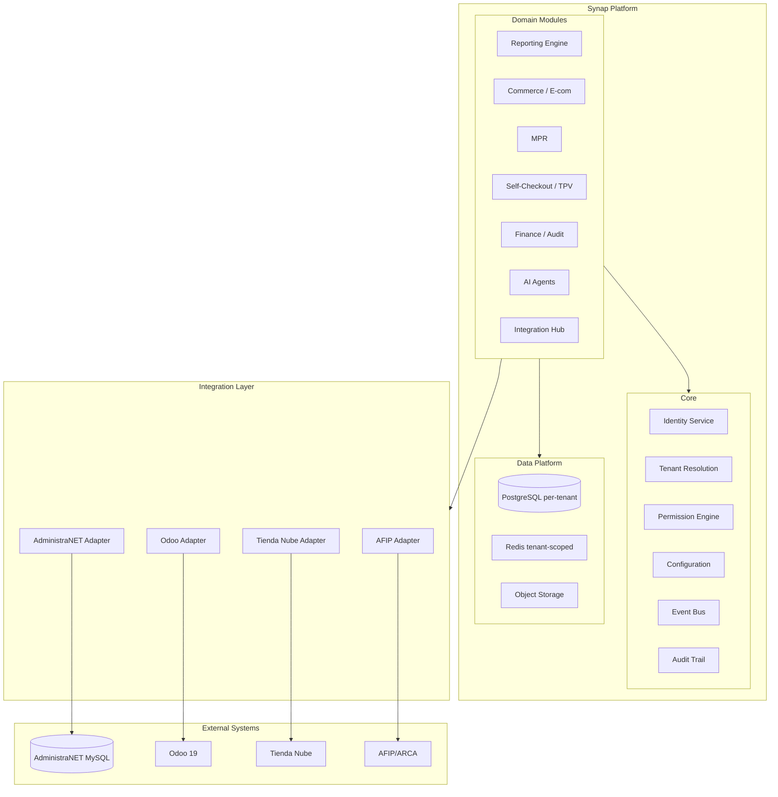

# 30 — Arquitectura Objetivo

**Estado:** COMPLETE (Fase 30)  
**Fecha:** 25/08/2026  
**Nota:** Surge de la auditoría, no es diseño previo.

---

## Principios derivados de la auditoría

1. **AdministraNET es un adapter, no la base de datos de Synap**
2. **PostgreSQL debe ser tenant-scoped**
3. **Core debe ser infraestructura, no lógica de negocio**
4. **SQL crudo debe vivir detrás de repositories/adapters**
5. **Módulos se comunican por contratos (APIs/events), no imports directos**

---

## Arquitectura objetivo



---

## Bounded contexts objetivo

| Context | Módulos actuales | Datos propios |
|---------|-----------------|---------------|
| Identity | login, core (parcial) | Usuarios, sesiones |
| Tenant | core (nuevo) | Empresas, branches |
| Reporting | reports | ReportDefinition, dashboards |
| Commerce | ecom, ventas | Carts, pedidos draft |
| Manufacturing | mpr | OPT, partes, armado |
| POS | self_checkout | Carts TPV |
| Finance | contabilidad_audit, factura_compra_*, legacy_db | Expedientes, auditoría |
| Fiscal | fe_afip | Certificados, CAEA |
| Integration | tiendanube, odoo_migracion | Mappings, sync logs |
| AI | ia | Agents, conversations |

---

## Anti-Corruption Layer (viabilidad: ALTA con esfuerzo XL)

```
Synap Domain Service
       │
       ▼
Integration API (Python interface)
       │
       ▼
AdministraNET Adapter
  ├── ArticuloRepository
  ├── ClienteRepository
  ├── StockRepository
  ├── VentaRepository
  ├── ContabilidadRepository
  └── PermisoRepository
       │
       ▼
Legacy MySQL (via pool)
```

**Fases ACL:**
1. Read-only repositories para maestros
2. Transaction repositories para operaciones
3. Identity adapter (reemplazar login directo)
4. Event-driven sync (reemplazar escritura concurrente)

---

*Generado por auditoría READ ONLY.*
