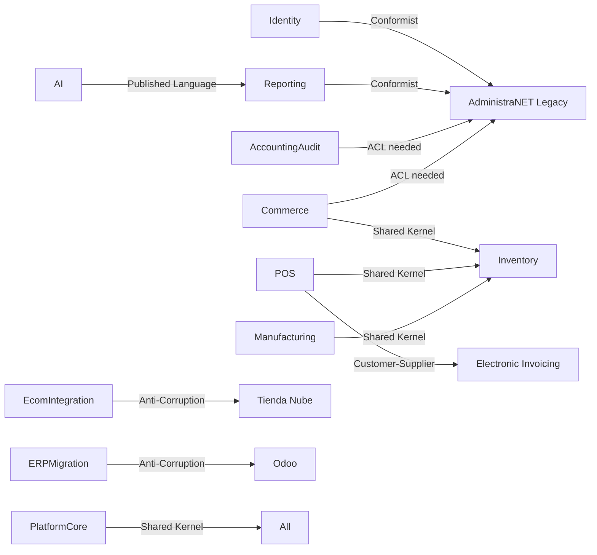

# 31 — Domain Boundaries (DDD)

**Estado:** COMPLETE (Fase 31)  
**Fecha:** 25/08/2026

---

## Bounded contexts descubiertos

| Context | Ubicación actual | Cohesión | Acoplamiento |
|---------|-----------------|:--------:|:------------:|
| **Identity & Access** | login/, core/permisos | Media | Alto (MySQL) |
| **Tenant Management** | login/, core/Empresa | Baja | Alto |
| **Reporting & Analytics** | reports/ | **Alta** | Alto (MySQL read) |
| **Commerce (B2B)** | ecom/, ventas/ | Media | Muy alto |
| **Point of Sale** | self_checkout/ | Media | Alto |
| **Manufacturing** | mpr/ | **Alta** | Alto |
| **Inventory** | stock/, core/administranet_stock | Baja (split) | Alto |
| **Purchasing** | compras/, factura_compra_* | Media | Medio |
| **Accounting Audit** | contabilidad_audit/, legacy_db/ | Media | Alto |
| **Electronic Invoicing** | fe_afip/ | **Alta** | Medio |
| **E-commerce Integration** | tiendanube_administranet/ | **Alta** | Medio |
| **ERP Migration** | odoo_migracion/ | **Alta** | Bajo |
| **AI & Assistants** | ia/ | **Alta** | Medio |
| **Platform Core** | core/ (infra + negocio mezclado) | **Baja** | Universal |

---

## Context map

---

## Invasiones de contexto detectadas

| Invasión | De | A | Evidencia |
|----------|----|---|-----------|
| Stock logic en core | Inventory | Platform Core | administranet_stock.py |
| DDL MPR en core | Manufacturing | Platform Core | catalog.py providers |
| Permisos HR en core | Identity | Platform Core | administranet_permiso_sistema.py |
| Reports data en ventas | Reporting | Commerce | ventas → reports imports |
| Contabilidad en legacy_db | Accounting | Integration | shared repositories |

---

*Generado por auditoría READ ONLY.*
