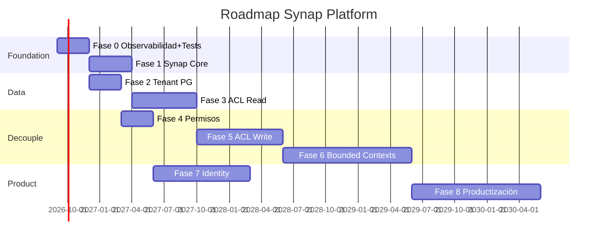

# 34 — Roadmap de Transformación

**Estado:** COMPLETE (Fase 34)  
**Fecha:** 25/08/2026

---

## Estrategia: incremental, no big-bang

---

### Fase 0 — Observabilidad y tests (0-3 meses)

- Activar logging estructurado + correlation IDs
- Tests críticos: login, TPV venta, FE AFIP, query_runner
- Documentar cron jobs (57 commands core)
- Decidir: activar Celery o eliminar tasks
- Fix SEC-C001 (AES key default)

**Criterio de éxito:** Paths críticos con >80% test coverage

---

### Fase 1 — Formalizar Synap Core (2-4 meses)

- Extraer de core/: administranet_stock → stock/, permisos → identity/
- Separar legacy_mysql_schema por dominio
- Unificar MODULE_CONFIGS + INSTALLED_APPS
- Resolver routing core.api.urls
- Cleanup dead code (mtrix, dashboard stub, * 2.py)

**Criterio de éxito:** core/ solo infraestructura transversal

---

### Fase 2 — Tenant isolation PostgreSQL (2-3 meses)

- Tenant middleware para ORM
- empresa_id en queries PG
- Redis keys con prefijo tenant
- Auditar endpoints IDOR

**Criterio de éxito:** Zero cross-tenant leaks en tests

---

### Fase 3 — Anti-Corruption Layer read (3-6 meses)

- Interface `ErpAdapter` con implementación AdministraNET
- Repositories: Articulo, Cliente, Proveedor, Stock (read)
- Migrar reports query_runner a repositories
- Eliminar DEFAULT_BASE_EMPRESA en runtime

**Criterio de éxito:** Nuevos módulos usan solo ACL, no SQL directo

---

### Fase 4 — Permisos y configuración (2-3 meses)

- Cutover SYNAP_PERMISOS_SOURCE=synap
- Eliminar dual mode
- SystemConfiguration tenant-scoped

---

### Fase 5 — ACL write + transacciones (4-8 meses)

- Repositories write: Venta, Compra, Stock, Contabilidad
- Serializar escrituras concurrentes VB6+Synap
- Event bus para notificar cambios

---

### Fase 6 — Separar bounded contexts (6-12 meses)

- ecom como módulo con API interna
- mpr como módulo con API interna
- self_checkout como módulo con API interna
- Eliminar imports cross-app directos

---

### Fase 7 — Identity service (6-9 meses)

- Auth independiente de AdministraNET MySQL
- SSO/OIDC para nuevos clientes
- AdministraNET auth como adapter legacy

---

### Fase 8 — Productización (12+ meses)

- Provisioning multi-tenant
- Onboarding self-service
- Billing integration
- Adapter Odoo (validar patrón)
- Reports como producto standalone

---

---

*Generado por auditoría READ ONLY.*
