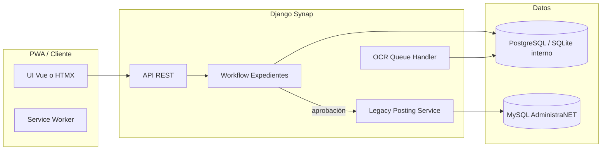

# Arquitectura: PWA captura facturas de compra + posting legacy

**Referencias:** [product_requirements.md](product_requirements.md), [domain_model.md](domain_model.md), [legacy_integration_spec.md](legacy_integration_spec.md), ADRs en [adrs/](adrs/).

**Convención:** *Confirmado por auditoría* | *Decisión nueva de arquitectura* | *Riesgo pendiente*

---

## 1. Visión general



*Decisión nueva de arquitectura:* DB interna del workflow separada de MySQL legacy (ADR-0005).

---

## 2. Apps Django propuestas

| App | Responsabilidad |
|-----|-----------------|
| **`factura_compra_captura`** | Expedientes, líneas, documentos, estados, API para PWA. *Decisión nueva.* |
| **`factura_compra_posting`** | Comando posting, adapter MySQL, transacciones, idempotencia de aprobación. *Decisión nueva.* |
| **`factura_compra_ocr`** | Jobs, proveedores OCR, normalización de salida. *Decisión nueva.* |
| **Core existente** | Auth, empresa, sucursal, permisos, `administranet_types`. Reutilizar según Synap. |

*Confirmado por auditoría:* la lógica de negocio legacy vive en **servicios de posting**, no en modelos Django mapeados 1:1 a `cuentaproveedor` para el expediente.

---

## 3. Capas y componentes

### 3.1 API (REST + sesión / JWT según estándar Synap)

- Recursos: expedientes, líneas, transiciones, archivos, reintento posting.
- *Decisión nueva:* subida multipart para PDF/imagen; URLs firmadas para descarga.

### 3.2 Servicios de dominio

- `ExpedienteService`, `AprobacionService` (Synap DB).
- `LegacyPostingService` (orquesta validación + boundary MySQL).

### 3.3 Repositorios

- **Internos:** Django ORM sobre modelos expediente.
- **Legacy:** módulo dedicado con SQL explícito o thin wrapper; sin ORM obligatorio para tablas VB6. *Decisión nueva* para control fino y paridad con auditoría.

### 3.4 Capa de integración legacy

- `LegacyPostingAdapter.execute(command: LegacyPostingCommand) -> LegacyPostingResult`
- Usa una **conexión MySQL** con aislamiento `READ COMMITTED` o el que use el cliente; transacción única (ADR-0002).
- Normalización de tipos: `to_int_or_none`, `to_decimal_or_none`, etc. (*regla proyecto* `.cursorrules`).

---

## 4. Cola asíncrona (OCR y tareas largas)

*Decisión nueva de arquitectura:*

- **Celery + Redis/RabbitMQ** o **Django-Q** según stack ya adoptado en Synap.
- Tareas: `ocr_procesar_expediente`, `posting_ejecutar` (opcional async si se desacopla de request HTTP — por defecto **síncrono en worker** tras aprobación para simplificar rollback).

**Idempotencia:** clave única `(expediente_id, intento_posting)` para evitar doble `codmov` si el worker se repite.

---

## 5. PWA

- **Mobile-first:** cámara con `capture="environment"` en input file; fallback galería.
- **Service Worker:** caché shell, offline **limitado** (cola de borradores locales *opcional* fase posterior — *riesgo* complejidad).
- **Instalable:** manifest.json, iconos.

---

## 6. Pipeline OCR

*Decisión nueva* (proveedor TBD):

1. Normalizar PDF a imágenes si hace falta.
2. Llamar motor OCR + layout.
3. Mapear a **schema interno** alineado a campos de expediente (no directo a SQL legacy).
4. Guardar `ExtraccionOCR` + confianza por campo.
5. Notificar UI (websocket o polling).

---

## 7. Estrategia de transacciones

| Ámbito | Estrategia |
|--------|------------|
| Expediente Synap | Transacción corta por request o `atomic()` |
| Posting legacy | **Una** transacción MySQL envolviendo numerador + todo el cuerpo (*decisión nueva*; contraste VB6 en ADR-0002) |
| Post-commit contable UI | Fuera de transacción principal si se replica comportamiento `visualiza_asiento_cont` (*confirmado por auditoría* que ocurre después del commit) |

---

## 8. Observabilidad

- **Structured logging:** `expediente_id`, `actor_id`, `codigo_movimiento` si existe.
- **Métricas:** tasa OCR, latencia posting, errores por tipo (validación vs DB).
- **Trazas:** OpenTelemetry si ya está en Synap. *Decisión nueva.*

---

## 9. Seguridad

- Autenticación y autorización por rol (ver PRD permisos).
- Archivos: antivirus opcional, límite tamaño, tipos MIME permitidos.
- MySQL legacy: credenciales en vault; **sin** SQL dinámico desde entrada usuario en posting (solo parámetros).
- Auditoría interna inmutable (append-only).

---

## 10. Interfaces sugeridas (firmas conceptuales)

```python
class LegacyPostingCommand: ...  # frozen dataclass / attrs

class LegacyPostingAdapter(Protocol):
    def execute(self, cmd: LegacyPostingCommand) -> LegacyPostingResult: ...

class ExpedienteRepository(Protocol):
    def get_for_update(self, id: UUID) -> ExpedienteFacturaCompra: ...
    def save(self, exp: ExpedienteFacturaCompra) -> None: ...
```

---

## 11. Contenedores y despliegue

- Alineado a regla Synap: tests/comandos Django en contenedor `Synap_app` cuando toque código existente.
- Worker OCR/posting en mismo compose o servicio separado. *Decisión nueva según infra.*

---

## 12. Referencias auditoría → componentes

| Componente | Justificación |
|------------|---------------|
| Numerador dedicado en posting | `auditoria_facturas_compras_resumen.md` (dos fases VB6) |
| Módulo `stock` línea a línea | `auditoria_facturas_compras_tablas_campos.md` Anexo A |
| Asiento + Balancea | `auditoria_facturas_compras_flujo_completo.md` §C.8 |
