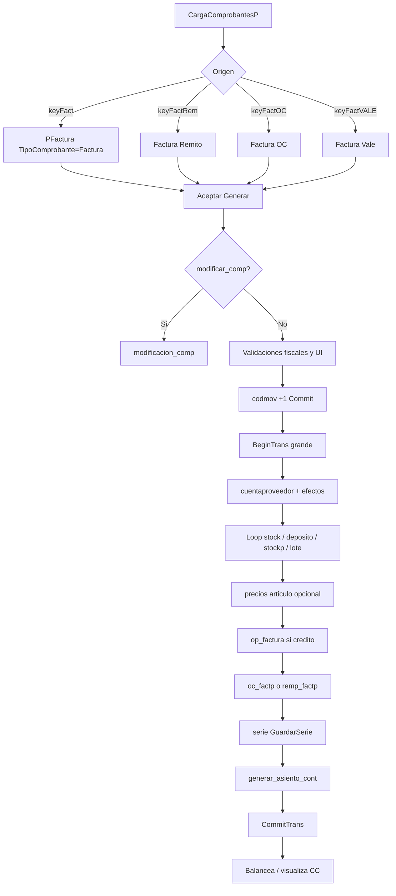

# Auditoría: Facturas de compras — Flujo extremo a extremo

**Fuente principal:** `administranet_vb6/Formularios/CargaComprobantesP.frm`, `PFactura.frm`.  
**Convención:** *Confirmado por código* | *Inferencia fuerte* | *Hipótesis / pendiente*

---

## Fase A — Punto de entrada hasta apertura de PFactura

1. **Usuario abre módulo Compras** desde **Principal** (menú; detalle del ítem en `Principal.frm` no auditado en este documento). *Inferencia fuerte:* estándar del ERP.

2. **CargaComprobantesP** muestra proveedores y menú **Comprobantes** con claves `keyFact`, `keyFactRem`, `keyFactOC`, `keyFactVALE` (`CargaComprobantesP.frm`, líneas ~962–1181 según perfil de menú).

3. **Selección de proveedor obligatoria** para `keyFact`: si `GridTodos.BOF` → mensaje «Debe seleccionar un proveedor» (`Case "keyFact"`, ~1610–1615).

4. **Regla obliga_oc_carga_comp:** si `proveedor.obliga_oc_carga_comp = "Si"` → no abre factura manual; mensaje explícito (~1618–1621).

5. **CAI del proveedor:** se asignan `PFactura.nro_cai_proveedor`, `fecha_cai_proveedor`; si `FechaCAI < FechaActual` → error y `Unload PFactura` (~1696–1701).

6. **Condición fiscal → letra:** según `DataProveedor.Recordset.Fields!IDIVA` y `Principal.IDIVA` se fija `Tipo_Factura` FA / FM / FC / FB y caption del formulario (~1706–1821 y ramas paralelas para otros orígenes).

7. **TipoComprobante** según caso: `"Factura"`, `"Factura Remito"`, `"Factura OC"`, `"Factura Vale"`; visibilidad de `ListaRem`, `ListaVales` (documentado en [ORIGEN_DATOS_FACTURA_COMPRA_VB6.md](ORIGEN_DATOS_FACTURA_COMPRA_VB6.md)).

8. **Un solo comprobante abierto:** bucle `For Each Formulario In Forms` descarga `PPresupuesto`, `POrden_Compra`, `PFactura`, `PRemito`, `PNotaCredDev` si el usuario confirma (~1638–1690 y similares).

9. **`PFactura.Inicial`:** fechas, `DataCV`/`CuerpoStock`, `Elimina_Temporal` (borra buffers del usuario en `cuerpostockp`, `percep_prov_temp`, `serie_entrada_temp` condicionado), grilla según `conf_grilla_final_puesto`, proyecto, permisos de stock, combo caja (`PFactura.frm` ~6874–7066, `Elimina_Temporal` ~7769–7785).

10. **`PFactura.Show`:** edición de encabezado, condición de compra, número PV/número, renglones (pestaña), totales.

---

## Fase B — Carga de renglones (previo a Generar)

- **Manual:** usuario agrega ítems con `AceptarStock_Click` / lista de artículos → filas en buffer ligado a ADODC `CuerpoStock` (típicamente `cuerpostockp` con `CodigoMovimiento` NULL/0 hasta grabar). *Confirmado por uso de `CuerpoStock.Recordset` en `Guardar`.*

- **Desde Remito / OC:** `ListaRem_Click` abre **Lista_Comp_Gral**; copia a `cuerpostockp` con `codmov_remito` / `codmov_oc` (lógica en `Lista_Comp_Gral.frm`; referencias cruzadas en búsqueda del repo).

- **Desde Vale:** `ListaVales_Click` → **En_Liquidacion_Vales** llena `en_vale_factura_temp`.

- **Validación número de comprobante:** `Nro_LostFocus` → `Validacion_Comp` consulta `cuentaproveedor` para duplicados FA/FC/FB según `Principal.valida_pv_comp_compra` y `ModTalonario` (~7611–7683).

---

## Fase C — Click «Generar» (`Aceptar_Click` → `Guardar`)

### C.1 Pre-chequeos inmediatos

| Paso | Condición | Acción |
|------|-----------|--------|
| 1 | `GridRenglon.EOF` | `Exit Sub` (~3511–3513) |
| 2 | `TipoComprobante = "Factura Remito"` | SELECT `cuerpostockp` con `codmov_remito` NOT NULL; si vacío → mensaje y salida (~3517–3537) |
| 3 | `TipoComprobante = "Factura OC"` | SELECT `cuerpostockp` con `codmov_oc` (~3540–3561) |
| 4 | `TipoComprobante = "Factura Vale"` | SELECT `en_vale_factura_temp` por usuario (~3565–3584) |
| 5 | `modificar_comp = "Si"` | `modificacion_comp` y `Exit Sub` (~3590–3594) |

### C.2 Contabilidad — selección ejercicio/período

- Si `Principal.activ_contabilidad = "Si"` y `Principal.selec_ejer_per_cont = "Si"` → modal **Cont_AbmEjercicio** con `Accion = "PFactura"` (~3600–3608).

### C.3 Series (artículos seriados)

- Si `remite_factura_art = "Si"` y no es `Factura Remito` → `ESerie` / `ValCantSerie`; si cantidad serie ≠ cantidad → salida (~3614–3629).

### C.4 Confirmación usuario

- `MsgBox("¿Desea generar la factura de compra?", ...)` → si No, no entra al bloque principal (~3633).

### C.5 Validaciones fiscales / cabecera

- **Período fiscal** según **fecha de registro** (`periodos` + `years`, `abierto_periodo = 'Si'`, `vencimiento_fiscal_periodo` vs `Principal.Fecha`) (~3637–3663).
- **Año** del comprobante debe existir en `Years` (~3686–3699).
- **Campos obligatorios:** `Nro`, `NroSuc`, `ImporteTotal`; total > 0 (~3703–3710).

### C.6 UI espera

- `form_espera` con barra de progreso 25 → 50 → 75 → 100 (~3713–3718, 4189, 4672, 5311).

### C.7 Transacción 1 — numerador global

- `conn.BeginTrans`, `SET AUTOCOMMIT=0`
- `SELECT * FROM codmov WHERE codigo = 1` pessimistic lock; `CodigoMovimiento += 1`; `CodMov = contador` (~3752–3761)
- `CommitTrans` (~3765–3767)

### C.8 Transacción 2 — persistencia

- `BeginTrans`, `SET AUTOCOMMIT=0` (~3770–3772)
- Formato número: `num` = PV ceros + `-` + nro compuesto (`Principal.Ceros_Nro_Comp`, `Ceros_Nro_pv`) (~3774–3783)

#### Cabecera `cuentaproveedor`

- `AddNew` sobre plantilla `CodigoMovimiento = 1` (~3788–3791)
- Asignación `TipoComprobante` FA/FB/FC/FM desde `Tipo_Factura` (~3795–3813)
- `NroComprobante`, `NroCompBusq`, `Detalle`, totales IVA/subtotales/percepciones/impuesto interno/sobretasa, CAI, usuario, sucursal, `TipoFactura` según `TipoComprobante`, `Exento`, `anulado = "No"`, `Codigo` proveedor, `CodigoMovimiento = contador`, condición compra, `CotiDolar`, flags `remite_factura_art` / `estado_fact_remito`, proyecto (~3815–4184)
- **Saldo CC:** lectura `proveedor.saldo`; si `cond_venta.Dias <> "0"` acumula `ImporteTotal` al saldo en cabecera; si no, mantiene saldo (~3831–3842)
- **Vales:** `INSERT INTO en_vale_factura ... SELECT ... FROM en_vale_factura_temp` (~3849); loop `UPDATE en_vale_viaje SET estado='En Factura'` (~3860–3863)
- **proveedor.saldo** = saldo de cabecera antes de `Update` final de `cuentaproveedor` (~3867–3871)
- **Percepciones IB:** bucle `percep_prov_temp` → `percep_prov` + `percepcion_prov_convenio` (~3885–3927)
- **Contado:** `Estado = "Canc"`; actualiza `caja_saldo`; `caja.AddNew` con egreso (~4033–4101)
- **Crédito:** `Estado = "N/Canc"` (~4103–4104)
- `Vencimiento`, `Vencido` según `VencFact` vs `FechaActual` (~4107–4111)
- `rs_cuentaproveedor.Update` (~4185)

#### Detalle `stock` + depósitos + OC + lotes + gastos

- Por cada fila de `CuerpoStock.Recordset` (~4198–4668):
  - `rs_stock.AddNew`
  - **stock_deposito:** según permisos y `TipoComprobante`, suma `Saldo` (con multiplicadores embalaje / bulto / display vía `Obtener_Datos_Articulo_Mayorista`) o marca `no_entregado_fact = "Si"` (~4209–4264)
  - **Factura OC + saldo_pedido_proveedor:** lógica de suma estadística con `stockp` del OC (~4214–4230) *confirmado por código; interpretación “estadístico” del comentario VB6*
  - Copia precios, alícuotas, depósito, vínculos OC/remito/presupuesto, `TipoComp = "Compra"`, `Comprobante` = letra, `CodigoMovimiento = contador`, gastos → **`otro_egreso`** si `Codgasto <> 0` (~4374–4392)
  - **Lote:** validación obligatoriedad; actualización o alta en `lote` / `lote_stock`; `last_insert_id()` para nuevo lote (~4447–4563)
  - **stockp:** si hay `nro_oc` y no es Factura Remito, ajuste `cantidad_pendiente`, `remitido_facturado` (~4577–4597)
  - **Serie en stock:** campos `serie`, `desc_serie` (~4611–4617)
  - **Cotización por artículo:** `Actualiza_Cotizacion_Dolar_Articulo` (~4627–4628)
  - `rs_stock.Update` (~4643)
  - **Opcional:** `UPDATE articulo SET codigoProveedor` si `Principal.compras_cambia_prov_factura = "Si"` (~4662–4663)

#### Actualización de precios de compra (`Principal.actualiza_lista_compra = "Si"`)

- Segundo barrido de `CuerpoStock`: actualiza **`articulo`** (costos, listas, `PNOficial`/`PFOficial`, descuentos) consultando **`iva`**, registra **`precios_historial`**, llama **`Principal.ActualizaCostoEnsamblajeInsumo`** (~4674–5083)

#### `op_factura` (documento a pagar)

- Si `DataCV.Recordset.Fields!Dias <> 0` → `op_factura.AddNew` con importes, saldo, neto, vínculo a proveedor y `CodigoMovimiento` (~5085–5129). *Nota:* comentario en código menciona `CV.BoundText <> "0"` como alternativa comentada.

#### Factura OC — cierre y vínculo

- Validación `cuerpostockp` con `CodigoMovimiento` y `visualiza = 'No'` (~5133–5138)
- Por cada `nro_oc` distinto: actualiza estado OC en `cuentaproveedor` (`Facturado` / `Parcial`) según si quedan líneas `stockp` con `remitido_facturado='No'` (~5154–5174)
- Insert **`oc_factp`**: `Codigo_MovimientoF`, `codigo_movimiento_oc` (~5176–5182)

#### Factura Remito

- `cuerpostock` agrupado por remito; `cuentaproveedor` REM → `estado_remito = "Facturado"`; **`remp_factp`** (~5202–5236)

#### Series físicas

- Si aplica, `GuardarSerie` (insert `serie_entrada`, `serie_movimiento`) (~5245–5250)

#### Asiento contable

- `generar_asiento_cont(num, TipoFactura)`; si `Error_conta = "Si"` → `GoTo captura` (rollback) (~5256–5266)

#### Cierre

- `CommitTrans`, `conn.Close` (~5271–5274)
- **Post-commit:** `Balancea_asiento`, `visualiza_asiento_cont` (puede abrir **Cont_CargaAsientoM** para CC) (~5279–5286)
- Refresco `CargaComprobantesP`, mensaje éxito, opcional etiquetas, `Unload Me`, `Unload form_espera`, **`Elimina_Temporal`** (~5288–5344)

### C.9 Error (`captura:`)

- `Principal.Guardar_Error`, `RollbackTrans` si conexión abierta, recuperación `CV.BoundText`, `Unload form_espera` (~5347–5368)

---

## Fase D — Modificación de comprobante existente (`modificacion_comp`)

Flujo distinto: una sola transacción; actualiza `cuentaproveedor`, `stock`, `op_factura`, `op_factura_par`, `imputacion_p`, `caja` por `CodigoMovimiento` existente; valida período fiscal también para **fecha comprobante** (bloque activo no comentado) (~7894–8149). No regenera `codmov` ni relaciones OC/remito en el fragmento leído.

---

## Diagrama de decisión simplificado (Mermaid)

---

## Referencias de línea (PFactura.frm)

- `Aceptar_Click` / `Guardar`: ~3500–5371
- `Validacion_Comp`: ~7611–7696
- `Inicial`: ~6874–7066
- `Elimina_Temporal`: ~7769–7785
- `modificacion_comp`: ~7894–8169
- `generar_asiento_cont`: ~8171–9537
