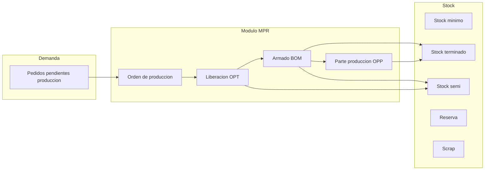

# Análisis del proceso de producción en AdministraNET y propuesta de módulo MPR (MVP)

**Contexto:** Los motivos "Pedido producción" (OPT), "Parte producción" (OPP) y "Armado" no son simples movimientos de stock: son **fases de un proceso de manufactura**. Este documento analiza lo existente en AdministraNET y propone un módulo **MPR (Manufacturing / Producción)** como MVP, inspirado en sistemas como Odoo y NetSuite, adaptado a una **fábrica de medias** donde la unidad mínima es el **par** (2 medias).

**Decisión de producto:** Los **tres motivos** (Pedido producción / OPT, Parte producción / OPP, Armado) **no se realizan en "Ingreso de movimiento de stock"**; pasan a ejecutarse **solo desde el módulo MPR**. En Synap se eliminan o ocultan los códigos 9, 11 y 12 del combo de motivos en la app Stock (alta de movimiento) y toda la UX de "Busca PEDI" para OPT/OPP; la liberación OPT, el armado (BOM) y el registro OPP se hacen desde pantallas MPR que orquestan los mismos movimientos en `movimiento_stock` / `stock` / `stock_deposito` y tablas de producción.

---

## 1. Análisis del proceso actual en AdministraNET

### 1.1 Flujo de datos y tablas

| Fase | Origen | Tablas / Campos clave | Qué hace |
|------|--------|------------------------|-----------|
| **Pedidos pendientes de producción** | Pedidos de venta (comp_ped) marcados para fábrica | `comp_ped`: TipoComprobante='PED', tipo_pedido_opt='Fabrica', estado_pedido_opt='Pendiente'. Cuerpo en `stockp` (cantidad, cantidad_pendiente_opt, cantidad_fab_pendiente_opt) | Demandas a fabricar; unidad de gestión es el pedido de venta. |
| **Lista de producción (detalle y agrupada)** | Botón "Actualización" en Lista_Pedidos_OPT | `lista_produccion_detalle`: por (codigo_movimiento_pedido, id_articulo) → cantidad_pedida, cantidad_pendiente_prod, en_proceso_produccion. `lista_produccion_agrupada`: por id_articulo → cantidad_pedida, cantidad_pendiente_prod | Agrega demanda por artículo; marca pedidos en "Producción" y detalle en_proceso_produccion='Si'. |
| **OPT (Pedido producción)** | CargaMovStock motivo 10 / ListIndex 10 | Origen: lista_produccion_agrupada + stockp. Movimiento **Entrada** (material/producto a producir). Al confirmar: `lista_produccion_agrupada.cantidad_pendiente_prod` se descuenta; se escribe `lista_produccion_historico` (id_articulo, id_articulo_formula, cantidad_pedida, cantidad_movimiento, cantidad_armada, id_deposito, codigo_movimiento_mstock). `movimiento_stock.tipo_mov = 'OPT'`. | "Liberar a producción" / compromiso de producción; entrada a depósito de producción. |
| **OPP (Parte producción)** | CargaMovStock motivo 11 / ListIndex 11 | Origen: stockp (cantidad_fab_pendiente_opt). Movimiento **Salida** (producto terminado). Al confirmar: `stockp.cantidad_fab_pendiente_opt` se descuenta. `movimiento_stock.tipo_mov = 'OPP'`. Pedidos en estado "En proceso parcial" o "En proceso completo". | Registrar **salida de producción** (parte terminada); descuenta pendiente de fabricación del pedido. |
| **Armado** | CargaMovStock motivo 8 (Armado) | `en_abm` (conjunto armado) + `en_abm_formula` (BOM: id_articulo, cantidad_articulo). Articulo.ensamblado='Si', articulo.id_en_abm. MstockE = entrada producto armado; MstockS = salida componentes. | Consume componentes (salida) y produce producto armado (entrada) según fórmula. |

### 1.2 Estados del pedido de producción (estado_pedido_opt)

- **Pendiente:** Pedido de venta listo para ser llevado a producción; aún no está en lista_produccion_agrupada o está en_proceso_produccion='No'.
- **Producción:** Tras "Actualización masiva" en Lista_Pedidos_OPT; entra en lista_produccion_detalle/agrupada.
- **En proceso parcial / En proceso completo:** Según si queda cantidad_fab_pendiente_opt en stockp (lógica comentada en VB6 pero referenciada en filtros "Parte producción").
- **Terminado:** Todo el pedido producido.

### 1.3 Conclusión del análisis

- **OPT, OPP y Armado** están implementados como **motivos de movimiento de stock** (CargaMovStock) y tablas auxiliares (lista_produccion_*, stockp, en_abm, en_abm_formula). La lógica de negocio de "orden de producción" está repartida entre comp_ped, stockp, lista_produccion_agrupada/detalle/historico y movimiento_stock.
- Para una **refactorización clara** y escalable (y para alinearse con sistemas tipo Odoo/NetSuite), conviene tratar estos flujos como un **módulo MPR** que:
  - Tenga un concepto explícito de **Orden de producción** (o "Orden de trabajo") con estados y fases.
  - Diferencie **demanda** (pedidos pendientes), **liberación a producción** (OPT), **producción** (Armado/BOM) y **salida de producto terminado** (OPP).
  - Permita en el futuro **stock por tipo** (mínimo, terminado, semi-elaborado, reserva, scrap) sin mezclar todo en movimientos genéricos.

---

## 2. Refactorización: por qué no son "simples movimientos de stock"

- **OPT:** No es solo una "entrada" genérica; es la **liberación a producción** de una cantidad demandada (lista_produccion_agrupada), con trazabilidad en lista_produccion_historico y vínculo a pedido/artículo.
- **OPP:** No es solo una "salida"; es la **registración de producto terminado** que descuenta cantidad_fab_pendiente_opt del pedido y cierra (total o parcial) la orden de trabajo.
- **Armado:** Es una **operación de manufactura** con BOM (en_abm_formula): consumo de insumos y generación de producto armado; no es un movimiento de transferencia ni un ajuste.

En un diseño tipo Odoo/NetSuite, estos serían **órdenes de fabricación** y **operaciones** dentro del módulo de manufactura, no solo motivos de un movimiento de inventario genérico.

---

## 3. Propuesta de módulo MPR (MVP) – Fábrica de medias

### 3.1 Dominio y reglas de negocio (medias)

- **Unidad mínima de venta/producción:** **Par** (2 medias). Todas las cantidades en "pares" donde corresponda.
- **Pack x 6 / Pack x 12 pares:** Ver sección 3.2 (está soportado en AdministraNET de forma genérica; MPR debe reutilizarlo).
- **Tipos de stock a identificar (MVP):**
  - **Stock mínimo:** Punto de reorden; por artículo/depósito (o por tipo de producto).
  - **Stock terminado:** Producto listo para venta (pares de medias).
  - **Stock semi-elaborado:** Producto en proceso (ej. media suelta, piezas antes del armado final).
  - **Stock reserva:** Cantidad reservada para pedidos o producción (no disponible para otros usos).
  - **Scrap (desecho):** Cantidad descartada en producción; opcionalmente por causa (defecto, corte, etc.).

### 3.2 Pack x 6 y Pack x 12 pares (análisis AdministraNET)

En AdministraNET **no existe** un concepto fijo "pack 6" o "pack 12"; está resuelto de forma **genérica y parametrizable**:

- **Tablas/campos relevantes:**
  - **articulo:** `multiplicador_comp`, `multiplicador_vta` (unidades por bulto/presentación); `cantidad_promedio_bulto`; `id_presentacionV`; `nro_cod_barra_bulto`, `nro_cod_barra_display`.
  - **articulo_prov:** `multiplicador_comp`, `cantidad_uni`, `cantidad_unidad_display`, `cantidad_display_bulto`, `cantidad_bulto_pallet`, `id_presentacionC`. Permite distintos multiplicadores por proveedor.
  - **stockp, stock, cuerpostock_mstock:** `multiplicador_comp`, `multiplicador_vta`, `cantidad_uni`, `tipo_unidad` (Unidad / Display / Bulto), `cantidad_bulto`, `cantidad_unidad_display`, `cantidad_dividir`.
  - **configuracion:** `utiliza_bulto_cerrado`, `utiliza_display` — habilitan en CargaMovStock y Lista_Pedidos_OPT el combo **tipo_unidad_bulto** (Unidad, Display, Bulto) y el cálculo de cantidad según multiplicador.
- **Lógica:** Si el usuario elige "Bulto" o "Display", la cantidad ingresada se multiplica por `multiplicador_comp` (o por `cantidad_unidad_display` / `cantidad_dividir` según función `Calculo_Cantidad_Multiplicar_Diplay_Bulto`) para obtener cantidad en unidad base. No hay valores 6 o 12 fijos: **el pack size es dato** (multiplicador_comp = 6 o 12, o por presentación).
- **Presentaciones (opcional):** Tabla `presentacion_abm` (id_presentacion, nombre_presentacion); articulo.id_presentacionV; articulo_prov.id_presentacionC. Permiten varias presentaciones por artículo (ej. "Pack 6", "Pack 12") con su multiplicador asociado vía articulo_prov o lógica por id_presentacion.

**Conclusión:** Pack x 6 y pack x 12 pares **están contemplados** en AdministraNET mediante:
- **Opción A:** Un artículo con `multiplicador_comp = 6` (venta/compra en bultos de 6 pares) u otro artículo/variante con `multiplicador_comp = 12`.
- **Opción B:** Mismo artículo con dos presentaciones (ej. id_presentacionC 1 = "Pack 6", 2 = "Pack 12") y en articulo_prov o en la lógica por presentación el multiplicador 6 o 12 según la presentación elegida.
- En movimientos (OPT, OPP, Armado) se persiste `tipo_unidad` (Unidad/Bulto/Display), `multiplicador_comp`, `multiplicador_vta`, `cantidad_uni` y la cantidad ya convertida a unidad base en `Cantidad`/`Entrada`/`Salida`.

**Para MPR:** Reutilizar los mismos campos. En pantallas MPR (Liberar OPT, Armado, Parte OPP) permitir elegir **unidad de carga** (Unidad = pares, o Bulto/Display si utiliza_bulto_cerrado/utiliza_display = Si) y tomar `multiplicador_comp`/`multiplicador_vta` y `cantidad_unidad_display` del artículo (o articulo_prov) para convertir a pares. No hace falta nueva tabla ni campos; solo asegurar que en artículos de medias los multiplicadores 6 y 12 (u otros) estén cargados y que la UI MPR exponga tipo_unidad cuando la configuración lo habilite.

---

En AdministraNET actual no hay ubicaciones "tipo" (terminado/semi/reserva/scrap); se usan **depósitos** y **motivos**. En el MVP se puede:
- Usar **depósitos** para representar ubicaciones (ej. Depósito Producción, Depósito Terminados, Depósito Scrap) y/o
- Introducir un **tipo de stock** o **tipo de ubicación** (configuración por depósito o por artículo) para reportes y alertas (mínimo, terminado, semi, reserva, scrap).

### 3.3 Conceptos del módulo MPR (inspirados en Odoo/NetSuite)

| Concepto | Descripción MVP |
|----------|------------------|
| **Demanda de producción** | Pedidos de venta (comp_ped) con tipo_pedido_opt='Fabrica' y estado_pedido_opt en Pendiente/Producción. Siguen siendo la fuente de "qué fabricar". |
| **Orden de producción (OP)** | Registro que agrupa una o más líneas de demanda (por pedido y artículo, o por artículo agregado). Estados: Borrador, Confirmada, En progreso, Parcialmente terminada, Terminada, Cancelada. Equivalente conceptual a "OPT + seguimiento hasta OPP". |
| **Liberación a producción (OPT)** | Acción que "confirma" la OP y registra la **entrada** de materiales/producto a producir (movimiento tipo OPT). En MVP puede seguir generando un movimiento_stock tipo_mov='OPT' y actualizar lista_produccion_agrupada/historico o su equivalente en el nuevo modelo. |
| **Operación de producción** | En MVP: **Armado** (BOM). Consumo de componentes (salida) + producción de producto armado (entrada). Se puede modelar como un paso de la OP o como movimiento de stock con motivo Armado vinculado a la OP. |
| **Parte de producción (OPP)** | Registro de **salida de producto terminado** (movimiento tipo OPP); descuenta cantidad pendiente de la OP/pedido. Cierra total o parcialmente la OP. |
| **BOM (lista de materiales)** | Ya existe como en_abm + en_abm_formula. En MPR se expone como "Fórmula de armado" por producto armado (insumos y cantidades). |

### 3.4 Flujo propuesto (MVP)

1. **Pedidos pendientes de producción** (comp_ped + stockp) → se listan en el módulo MPR como "Demanda a fabricar".
2. Usuario **crea o confirma Orden de producción** (agregado por artículo desde lista_produccion_agrupada o por pedido). Estado: Confirmada.
3. **Liberación (OPT):** Se registra entrada a depósito de producción (movimiento OPT); la OP pasa a "En progreso".
4. **Armado (si aplica):** Se ejecuta la operación BOM (consumo componentes + producción producto armado); puede ser un movimiento de stock motivo Armado vinculado a la OP.
5. **Parte producción (OPP):** Se registra salida de producto terminado (movimiento OPP); se descuenta cantidad pendiente de la OP; si queda 0 pendiente, OP → "Terminada".
6. **Stock:** En MVP los saldos se siguen leyendo de stock_deposito; la **clasificación** (mínimo, terminado, semi, reserva, scrap) se puede hacer por:
   - Depósito (ej. "Terminados", "Semi", "Scrap") y/o
   - Campo o configuración por artículo/depósito para reportes (alertas de stock mínimo, informe por tipo).

### 3.5 Alcance MVP (qué incluir y qué dejar para después)

**Incluir en MVP:**

- **Modelo de datos (Synap):**
  - **Orden de producción:** Cabecera (número, estado, fecha, depósito producción, origen: pedido(s) o agregado por artículo). Líneas: artículo, cantidad pedida, cantidad liberada (OPT), cantidad producida (OPP), cantidad pendiente. Puede reutilizar o mapear a lista_produccion_agrupada/detalle y comp_ped/stockp para no duplicar datos en MySQL compartido; o ser tablas nuevas en Synap con sincronización a AdministraNET.
  - **Tipos de stock/ubicación:** Configuración por depósito (ej. tipo_ubicacion: terminado | semi | materia_prima | scrap | reserva) o por artículo; uso en reportes y alertas de stock mínimo.

- **Pantallas MPR (MVP):**
  - **Listado "Pedidos pendientes de producción":** Lectura de comp_ped (tipo_pedido_opt='Fabrica', estado_pedido_opt en Pendiente/Producción) + stockp; opcionalmente agregado por artículo (lista_produccion_agrupada).
  - **Orden de producción:** Alta/consulta de OP; estados; vinculación a pedidos/líneas. Acción "Liberar (OPT)" que genere el movimiento OPT y actualice lista_produccion_*.
  - **Parte de producción (OPP):** Registrar salida de producto terminado desde una OP (o desde pedido seleccionado), generando movimiento OPP y descontando cantidad_fab_pendiente_opt.
  - **Armado:** Mantener como operación desde MPR: pantalla que invoque la lógica de BOM (en_abm_formula) y genere movimiento Armado (entrada producto + salida componentes), opcionalmente vinculado a OP.

- **Reportes / indicadores básicos:**
  - Stock por tipo (terminado, semi, reserva, scrap) usando depósito o configuración.
  - Alertas de stock mínimo (por artículo/depósito).
  - Pendiente de producción por artículo o por pedido.

**Dejar para fases posteriores:**

- Planificación MRP automática (explosión de demanda, sugerencia de órdenes).
- Múltiples operaciones por OP (ruteos, work orders tipo Odoo).
- Costeo detallado por OP (coste estándar vs real).
- Scrap con causas y aprobaciones.
- Integración completa con compras (materiales).

### 3.6 Unidad mínima: par (2 medias)

- En **artículo** y **BOM:** Definir unidad de medida del producto terminado como "Par" (o "Unidad" = 1 par = 2 medias). Cantidades en stock y en OP en pares.
- **Stock semi-elaborado:** Si se trabaja con "media suelta", definir artículo o presentación "Media" y relación 2 medias = 1 par en fórmulas o conversiones.
- **Configuración:** Parámetro o tipo de unidad por defecto para el módulo MPR (ej. "Par") para que listados y movimientos usen esa unidad.

### 3.7 Integración con lo existente en Synap

- **Movimientos de stock:** OPT y OPP siguen generando registros en `movimiento_stock`, `stock`, `stock_deposito` (y opcionalmente lista_produccion_historico, stockp) para no romper AdministraNET/VB6. El módulo MPR orquesta la creación de esos movimientos desde sus pantallas.
- **Armado:** Reutilizar lógica de en_abm_formula y motivo Armado; desde MPR se puede invocar el mismo servicio que use CargaMovStock para Armado.
- **Pedidos:** comp_ped y stockp siguen siendo la fuente de verdad de demanda; MPR los lee y, al confirmar OPP, actualiza cantidad_fab_pendiente_opt y estado_pedido_opt si corresponde.

---

## 4. Origen y cálculo de los stocks (DB existente y reformulación)

Todos los valores de stock listados (mínimo, terminado, semi-elaborado, reserva, scrap) deben poder obtenerse o calcularse desde la base de datos. A continuación se indica **cómo se obtienen o calculan hoy** y qué **reutilizar o reformular** para MPR.

### 4.1 Tablas y campos de stock en la DB (AdministraNET)

| Tabla | Campos relevantes | Uso actual |
|-------|-------------------|------------|
| **stock_deposito** | id_articulo, id_deposito, saldo, saldo_pedido_cliente, saldo_pedido_proveedor | Saldo físico por artículo y depósito; reservado venta (saldo_pedido_cliente); reservado compra (saldo_pedido_proveedor). |
| **deposito_reposicion** | id_articulo, id_deposito, stock_minimo, stock_maximo, punto_pedido | Stock mínimo (y máximo) por artículo y depósito; reporte stock_minimo.rpt: saldo <= stock_minimo. |
| **stock** | IDArt, CodDeposito, Entrada, Salida, Saldo, CodigoMovimiento, Comprobante, TipoComp | Detalle de movimientos; saldo se recalcula en AjustarSaldos; stock_deposito.saldo es el saldo actual por artículo/depósito. |
| **stockp** | CodigoMovimiento, IDArt, Cantidad, cantidad_pendiente, cantidad_entregada, cantidad_fab_pendiente_opt, cantidad_pendiente_opt | Pedidos (PED, OC); reservado venta calculado desde stockp + comp_ped (Estados En preparación/Preparado/Parcial); OPT/OPP usan cantidad_fab_pendiente_opt. |
| **deposito** | CodDeposito, NombreDeposito | Catálogo; no tiene “tipo” (terminado/semi/scrap) en el esquema actual. |

### 4.2 Cómo se obtienen o calculan cada uno de los stocks listados

- **Stock mínimo (punto de reorden)**  
  - **Origen:** `deposito_reposicion.stock_minimo` por (id_articulo, id_deposito). Opcional: `deposito_reposicion.punto_pedido`.  
  - **Cálculo:** Valor directo de la tabla; no es un saldo. Se usa para alertas (saldo <= stock_minimo) y para reportes (stock_minimo.rpt).  
  - **MPR:** Reutilizar tabla y campos; en MPR mostrar/alertar “debajo de mínimo” por artículo/depósito.

- **Stock terminado**  
  - **Origen:** Saldo físico en depósitos que la empresa considere “terminados”. En la DB no hay campo “tipo de depósito”; el saldo es único por artículo/depósito en `stock_deposito.saldo`.  
  - **Cálculo:** `SUM(stock_deposito.saldo)` por artículo restringido a `id_deposito IN (depósitos terminados)`. Requiere **configuración**: qué depósitos son “Terminados” (ej. lista de CodDeposito o nuevo campo en `deposito` como tipo_ubicacion = 'Terminado').  
  - **MPR:** Opción A) Usar depósitos dedicados (ej. “Terminados”) y filtrar por ellos. Opción B) Añadir en `deposito` un campo `tipo_ubicacion` (Terminado | Semi | Materia prima | Scrap | Reserva) y calcular por tipo.

- **Stock semi-elaborado**  
  - **Origen:** Igual que terminado: saldo en depósitos considerados “semi”. No existe campo específico en el esquema actual.  
  - **Cálculo:** `SUM(stock_deposito.saldo)` por artículo donde `id_deposito IN (depósitos semi)`.  
  - **MPR:** Misma configuración que terminado (depósitos o tipo_ubicacion).

- **Stock reserva (reservado)**  
  - **Origen (ventas):** En Synap/reports se usa **cálculo** desde `stockp` + `comp_ped`: PED con Estado IN ('En preparación','Preparado','Parcial'), SUM(cantidad_pendiente o Cantidad - cantidad_entregada) por artículo. En self_checkout y otros se usa `stock_deposito.saldo_pedido_cliente`.  
  - **Cálculo:** Reservado venta = SUM desde stockp (PED, estados indicados); o, si se mantiene actualizado, saldo_pedido_cliente por artículo/depósito. Reservado compra = saldo_pedido_proveedor (OC pendientes).  
  - **MPR:** Reutilizar lógica existente; reservado para producción (OPT/OPP) podría ser cantidad en lista_produccion_agrupada.cantidad_pendiente_prod o stockp.cantidad_fab_pendiente_opt por artículo, si se desea mostrar “reservado a producción”.

- **Scrap (desecho)**  
  - **Origen:** No existe tabla ni campo específico en la DB actual. En VB6 los movimientos de stock pueden usar un motivo “Ajuste” o similar para bajas por scrap, pero no hay segregación.  
  - **Cálculo:** No hay cálculo estándar. Opciones: (1) Depósito dedicado “Scrap” y saldo = SUM(stock_deposito.saldo) WHERE id_deposito = deposito_scrap; (2) Nuevo motivo de movimiento (ej. “Scrap”) y calcular desde `stock` WHERE TipoComp = 'Scrap' (requiere extensión); (3) Nueva tabla `mpr_scrap` (id_articulo, id_deposito, cantidad, fecha, causa).  
  - **MPR:** Reformular: definir si scrap es por depósito o por motivo/tabla nueva y documentar en esquema MPR.

### 4.3 Resumen: reutilizar vs reformular

| Concepto | Reutilizar | Reformular / añadir |
|----------|------------|----------------------|
| Stock mínimo | deposito_reposicion.stock_minimo (y punto_pedido) | Solo configuración de qué artículos/depósitos mostrar en MPR. |
| Stock terminado | stock_deposito.saldo filtrado por depósito | Configuración de “depósitos terminados” o campo deposito.tipo_ubicacion. |
| Stock semi-elaborado | stock_deposito.saldo filtrado por depósito | Configuración de “depósitos semi” o tipo_ubicacion. |
| Stock reserva | stockp + comp_ped (reservado venta); stock_deposito.saldo_pedido_cliente/proveedor; cantidad_fab_pendiente_opt para “reserva producción” | Opcional: vista o campo calculado “reserva a producción” desde lista_produccion_agrupada o stockp. |
| Scrap | — | Depósito “Scrap” y/o nuevo motivo en movimiento_stock y stock, o tabla mpr_scrap. |
| OPT/OPP/Armado | movimiento_stock (tipo_mov OPT/OPP), stock, stock_deposito, lista_produccion_*, stockp, en_abm_formula | No crear tablas duplicadas; MPR orquesta escritura en las mismas tablas; quitar motivos 9, 11, 12 del Ingreso de movimiento de stock. |

### 4.4 Campos de producción a usar en MPR (sin duplicar)

- **comp_ped:** TipoComprobante='PED', tipo_pedido_opt='Fabrica', estado_pedido_opt (Pendiente, Producción, En proceso parcial, Terminado).
- **stockp:** Cantidad, cantidad_pendiente_opt, cantidad_fab_pendiente_opt, CodigoMovimiento (pedido), id_stock.
- **lista_produccion_detalle:** codigo_movimiento_pedido, id_articulo, cantidad_pedida, cantidad_pendiente_prod, en_proceso_produccion.
- **lista_produccion_agrupada:** id_articulo, cantidad_pedida, cantidad_pendiente_prod, id_lista_produccion.
- **lista_produccion_historico:** id_articulo, id_articulo_formula, cantidad_pedida, cantidad_movimiento, cantidad_armada, id_deposito, codigo_movimiento_mstock, codigo_movimiento_opt.
- **movimiento_stock:** codigo_movimiento, tipo_mov ('OPT'|'OPP'), motivo_movimiento, deposito_origen, deposito_destino, etc.
- **stock:** Por cada renglón OPT/OPP/Armado; Entrada/Salida, CodDeposito, TipoComp.
- **en_abm, en_abm_formula:** BOM para Armado (id_articulo, cantidad_articulo por componente).
- **articulo:** ensamblado='Si', id_en_abm para productos armados.

MPR debe **leer y escribir** en estas tablas/campos; no definir tablas nuevas que dupliquen movimiento_stock o stockp. Si se agrega un concepto “Orden de producción” como cabecera, puede ser vista sobre lista_produccion_agrupada + comp_ped o una tabla nueva **solo de cabecera** (número OP, estado, fechas) con líneas que sigan referenciando lista_produccion_detalle/stockp.

---

## 5. Quitar OPT, OPP y Armado del Ingreso de movimiento de stock

- En la app **Stock** (Synap): en el alta de movimiento, el combo de motivos debe **excluir** los códigos **9 (Armado), 11 (Pedido producción) y 12 (Parte producción)**. No se muestra "Busca PEDI" para motivos 11/12; no se ofrece motivo Armado.
- El servicio `obtener_motivos_movimiento` (o equivalente) en `core/services/administranet_stock.py` debe filtrar por permiso `pedidos_parte_produccion` y, en lugar de incluir 9, 11 y 12, **no devolverlos** (o devolverlos solo si existe un flag “mostrar motivos producción en Stock”, por defecto no).
- Las APIs de stock que hoy listan pedidos pendientes para motivo 6 (PEDI) se mantienen para **Transferencia (PEDI)**; las que cargan renglones para motivo 11/12 se **eliminan o redirigen** al módulo MPR cuando este exista.
- **Resultado:** Ingreso de movimiento de stock solo permite motivos “genéricos” (Stock Inicial, Ajuste, Faltante, Sobrante, Rotura, Transferencia, Mov. Interno E/S, Desarmado si se mantiene). OPT, OPP y Armado solo se ejecutan desde MPR.

---

## 6. Resumen y siguientes pasos

- **Análisis:** En AdministraNET, Pedido producción (OPT), Parte producción (OPP) y Armado son fases de un mismo proceso de manufactura, apoyadas en comp_ped, stockp, lista_produccion_* y movimiento_stock; no son "simples movimientos de stock".
- **Refactorización:** Tratarlos como un **módulo MPR** permite estados claros (Orden de producción), trazabilidad y futuro stock por tipo (mínimo, terminado, semi, reserva, scrap).
- **Decisión:** Los tres motivos **no se realizan en Ingreso de movimiento de stock**; pasan **solo a MPR**. Usar campos y tablas existentes (stock_deposito, deposito_reposicion, lista_produccion_*, stockp, movimiento_stock, en_abm_formula); reformular solo donde no hay soporte (scrap, tipo de depósito para terminado/semi).
- **Propuesta MVP:** Módulo MPR con: (1) Demanda desde pedidos pendientes de producción, (2) Orden de producción con estados y liberación OPT, (3) Operación Armado (BOM), (4) Parte producción OPP, (5) Tipos de stock/ubicación para reportes y stock mínimo (usar deposito_reposicion.stock_minimo; configurar depósitos o tipo_ubicacion para terminado/semi/scrap). Unidad mínima: **par** (fábrica de medias).
- **Siguientes pasos sugeridos:** (a) Quitar motivos 9, 11 y 12 del combo y flujo de Ingreso de movimiento de stock; (b) Definir modelo de datos de Orden de producción (vista sobre lista_produccion_* o tabla cabecera MPR); (c) Implementar pantallas MPR (lista demanda, OP, Liberar OPT, Registrar OPP, Armado); (d) Configuración tipo de stock/depósito y reporte por tipo y alerta de mínimo; (e) Documentar esquema de cálculo de cada stock (sección 4) en docs y en implementación.
