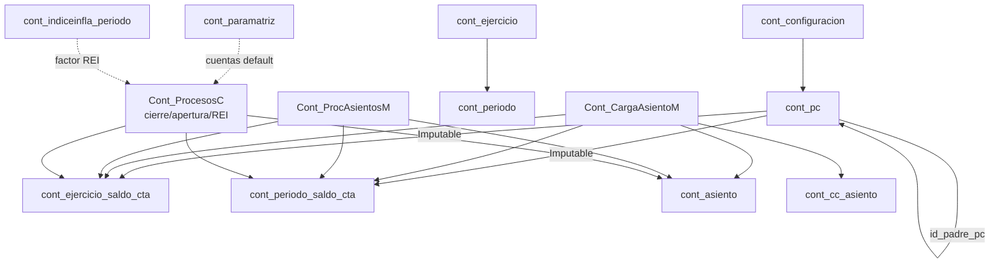

# Auditoría de imputación contable — AdministraNET VB6 (módulo `Cont_*`)

> **Propósito:** levantamiento de todos los procesos de imputación del módulo de Contabilidad VB6 y catálogo de bugs / inconsistencias / riesgos de coherencia, con referencia `archivo:línea`, para servir de base a un refactor y a la auditoría/recálculo de datos en Synap.
>
> **Alcance:** 25 formularios `Cont_*` en `administranet_vb6/Formularios/`. Solo análisis (sin cambios de código VB6).
>
> **Estado del mapeo previo:** no existía mapeo de *procesos*; solo estaban documentadas las *tablas* (`docs/general/tablas/cont_*.md`). Este es el primer levantamiento funcional. Las copias `... 3.frm` son idénticas salvo `Cont_CargaAsientoM 3.frm`.

---

## 1. Inventario de formularios por rol en la imputación

| Grupo | Formularios | Rol |
|---|---|---|
| **Motor de imputación** | `Cont_CargaAsientoM` (alta/modif. manual), `Cont_ProcAsientosM` (anulación/contra-asiento), `Cont_ProcesosC` (cierre PyG, cierre PN, apertura, ajuste inflación) | Escriben `cont_asiento` + tablas de saldo |
| **Plantillas / automáticos** | `Cont_PA`, `Cont_ListaPA` | Definen plantillas de asiento |
| **Estructura de cuentas** | `Cont_PlanCta`, `Cont_CargaPlanCta`, `Cont_pc`, `Cont_ListaCtaCont` | Plan de cuentas (`cont_pc`, niveles) |
| **Ejercicios/periodos** | `Cont_AbmEjercicio`, `Cont_CargaEjer`, `Cont_CargaPerido` | Control apertura/cierre |
| **Centro de costo** | `Cont_CentroCosto`, `Cont_CargaCentroCosto`, `Cont_CargaCosto`, `Cont_CargaImpCCosto`, `Cont_Param_CC` | Reparto por CC |
| **Inflación** | `Cont_abmIndiceInfla`, `Cont_CargaIndInf`, `Cont_CargaIndInfPer` | Índices REI |
| **Conceptos / parámetros / info** | `Cont_ABMConceptos_Cont`, `Cont_Conceptos_Cont`, `Cont_Carga_Concepto_Cont`, `Cont_ParametrosIni`, `Conta_Info` | Config e informes |

---

## 2. Modelo de datos de la imputación

Cada renglón de asiento se escribe en `cont_asiento` (una fila por cuenta) con un `codigo_movimiento` común y un `nro_asiento` por ejercicio. En paralelo el saldo por cuenta se acumula en **dos tablas denormalizadas**:

- `cont_ejercicio_saldo_cta` (`id_pc`, `id_ejercicio`, `saldo_ejercicio_cta`)
- `cont_periodo_saldo_cta` (`id_pc`, `id_ejercicio`, `id_periodo`, `saldo_periodo_cta`)

El signo se determina por `cont_pc.saldo_pc` (`Deudor`/`Acreedor`):

- **Deudor:** `saldo += debe − haber`
- **Acreedor:** `saldo += −debe + haber`

Tablas de apoyo: `cont_pc` (plan, con `imp_cont_pc` = Imputable/Contenedora, `saldo_pc`, `ajuste_infla_pc`, `asig_cc`, niveles 1–6), `cont_concepto_asiento` (incluye `id_concepto_anul`), `cont_cc` / `cont_cc_asiento` / `cont_cc_temp` (centros de costo), `cont_indiceinfla` / `cont_indiceinfla_periodo` (REI), `cont_paramatriz` (cuentas por defecto: resultado/refundición/etc.), `codmov` (contador global de movimientos), `cont_ejercicio.nro_asiento_ejercicio` (contador por ejercicio).

> **Riesgo estructural raíz:** la doble contabilidad (diario + saldos denormalizados) **no tiene FKs ni reconciliación**. Cualquier fallo de atomicidad desincroniza `cont_asiento` de las tablas de saldo de forma permanente.

### Diagrama



---

## 3. Hallazgos consolidados

Severidad: 🔴 crítico (corrompe saldos/balance) · 🟠 alto (coherencia relacional/numeración) · 🟡 medio · 🔵 bajo/diseño.
`E` = detectado en análisis directo del motor; `W1` = plan de cuentas; `W2` = ejercicios/periodos; `W3` = CC/inflación/conceptos.

### 3.1 Motor de imputación (asientos, anulación, procesos)

| # | Sev | Hallazgo | Ubicación | Impacto |
|---|-----|----------|-----------|---------|
| H01 | 🔴 | `generar_asiento_cont` (REI) **no es transaccional**: actualiza saldos e inserta renglones sin `BeginTrans`; los `Exit Sub` por error dejan saldos modificados y asiento incompleto | `Cont_ProcesosC.frm:4214` (`4485/4526/4667`) | Saldos y diario desincronizados de forma persistente |
| H02 | 🔴 | Ajuste por inflación con **acumulación rota** en VB6: al cambiar de cuenta o en el último registro (`RecordCount=i`) entra al `If` de cierre **sin acumular** el renglón actual → REI subvaluado; `ind_cierre` puede quedar sin asignar si no hay índice para `fechasta_ejercicio`; sin `On Error`. **Fórmula correcta** (Synap `rei_calculo.py`): por cada renglón base (excl. concepto 13), `subt = mov×(ind_cierre/ind_origen)−mov` con `mov` según `saldo_pc`; acumular **todos** los renglones; comparar `total` vs suma firmada de concepto 13 | `Cont_ProcesosC.frm:4107-4198` (`4111`, `4150-4193`) | Ajuste por inflación mal calculado en legacy |
| H03 | 🔴 | Alta manual: `Exit Sub` por "Cuenta con saldo NULL" **sin `RollbackTrans` ni cerrar `conn`** dentro de transacción con saldos ya actualizados | `Cont_CargaAsientoM.frm:1598-1599,1676-1677,1724-1725,1798-1799` | Transacción colgada + saldos parciales |
| H04 | 🔴 | Modificación de asiento: la **reversa** usa `cont_pc.saldo_pc` pero el **re-alta** usa `saldo_pc_temp` sin control `IsNull`; si es NULL, resta pero no vuelve a sumar | `Cont_CargaAsientoM.frm:2169/2199/2230` (reversa) vs `2308/2338/2378` (re-alta) | Saldo disminuido permanentemente |
| H05 | 🟠 | Contra-asiento de anulación referencia `id_concepto_asiento + 1` en vez del campo real `id_concepto_anul` de `cont_concepto_asiento` | `Cont_ProcAsientosM.frm:2212` | Concepto de anulación equivocado/inexistente |
| H06 | 🟠 | Numeración `nro_asiento_ejercicio` con `adLockOptimistic` (mientras `codmov` usa pessimistic) | `Cont_CargaAsientoM.frm:1525/1527`, `Cont_ProcAsientosM.frm:1907`, `Cont_ProcesosC.frm:4442/4447,3259` | Colisión de nº de asiento entre usuarios concurrentes |
| H07 | 🟠 | Contra-asiento toma el nº del **ejercicio activo** pero se estampa con el **ejercicio original** | `Cont_ProcAsientosM.frm:1907` vs `2058` | Numeración incoherente al anular asientos de ejercicios no activos |
| H08 | 🟠 | `codmov` (contador global) se commitea en transacción propia antes del asiento; si el asiento se rollbackea queda un hueco permanente en `codigo_movimiento` (a diferencia de `nro_asiento`) | `Cont_CargaAsientoM.frm:1504-1515`, `Cont_ProcesosC.frm:4070-4081` | Huecos en numeración global; contadores inconsistentes entre sí |
| H09 | 🟡 | `Truncar` es locale-dependiente (busca coma); si el separador es punto no trunca. Aplicado asimétricamente: cierre PyG trunca `haber` pero no `debe` | `Cont_ProcesosC.frm:2496`, `1349-1350` | Asientos de cierre potencialmente desbalanceados |
| H10 | 🟡 | `Balancea_asiento` solo corrige ±0,01 y **no** ajusta las tablas de saldo | `Cont_ProcesosC.frm:2509` | Diario ≠ saldos por el centavo compensado; ≥0,02 no se corrige |
| H11 | 🟡 | Verificación de "cuentas de resultado en cero" tras cierre PyG **comentada** | `Cont_ProcesosC.frm:1408-1448` | Cierre se da por válido sin verificar |
| H12 | 🟡 | `fecha_asiento` guardada desde `Fecha.Text` (control) y fechas armadas sin cero-padding | `Cont_CargaAsientoM.frm:1116,1846,1893,2427` | Dependencia de locale/formato (incumple normativa tipos AdministraNET) |
| H13 | 🟡 | "Clamp" silencioso de fecha a última fecha del periodo/ejercicio | `Cont_ProcesosC.frm:1315/1337` | Asiento posteado a fecha distinta de la intención |
| H14 | 🔵 | Cuentas/conceptos hardcodeados: `cod_pc LIKE '41/42/2%'`, `id_concepto` 13/45/47/53, `cont_paramatriz` id 63 | `Cont_ProcesosC.frm:507/573/1364/1617/4694/4309`, `AsientoApertura` `3129/3162/3193` | Rompe silenciosamente con otro plan/catálogo |
| H15 | 🔵 | No se valida `imp_cont_pc = 'Imputable'` al postear en procesos automáticos | `Cont_ProcesosC.frm:4479` y flujo `generar_asiento_cont` | Posible imputación a cuenta de agrupación |
| H16 | 🟡 | Plantillas (`Cont_PA`) validan que exista ≥1 cuenta en debe y ≥1 en haber, pero **no** `Σdebe = Σhaber` | `Cont_PA.frm:671-693` | Plantilla desbalanceada |
| H17 | 🟡 | Alta de fila de saldo faltante "prometida" pero no implementada (solo actúa `If RecordCount = 1`) | `Cont_CargaAsientoM.frm:1777` | Cuenta sin fila de saldo → `saldo_asiento` no registrado |

### 3.2 Plan de cuentas (`W1`)

| # | Sev | Hallazgo | Ubicación |
|---|-----|----------|-----------|
| H18 | 🔴 | Copy-paste en `ReferenciasCrystal`: niveles 5/6 leen `rs_lev4` | `Cont_CargaPlanCta.frm:2110,2180,2197` |
| H19 | 🔴 | Contenedora de nivel 6 no se inserta en `cont_nivel6` (solo DELETE/SELECT) | `Cont_CargaPlanCta.frm` (falta rama `txtN6.Enabled`) |
| H20 | 🔴 | Modificar contenedora → imputable **no crea** filas de mayor (`cont_*_saldo_cta`); solo el alta las crea | `Cont_CargaPlanCta.frm:834+` vs `749-817` |
| H21 | 🟠 | Unicidad de `codjer_pc` comparada sin comillas (coerción numérica; ceros a la izquierda) | `Cont_CargaPlanCta.frm:620,888` |
| H22 | 🟠 | Clave del árbol (SSTree) = `descrip_pc`, no única por padre | `Cont_PlanCta.frm:442-455` |
| H23 | 🟠 | Contenedora puede persistir moneda/inflación/CC (datos inválidos) | `Cont_CargaPlanCta.frm:708-712` |
| H24 | 🟡 | Sugerencia de código por hijos del árbol UI, no por BD | `Cont_PlanCta.frm:907-911` |
| H25 | 🟡 | Modificar imputable → contenedora sin limpiar mayor ni validar `cont_asiento` | `Cont_CargaPlanCta.frm:848` |
| H26 | 🟡 | `Eliminar_Cta` sin transacción (DELETE en `cont_pc` + `cont_nivel*`) | `Cont_PlanCta.frm:1306-1314` |
| H27 | 🔵 | Duplicidad: `Cont_pc.frm` y `Cont_PlanCta.frm` comparten `VB_Name="Cont_PlanCta"` con divergencias | `Cont_pc.frm` / `Cont_PlanCta.frm` |

### 3.3 Ejercicios y periodos (`W2`)

| # | Sev | Hallazgo | Ubicación |
|---|-----|----------|-----------|
| H28 | 🔴 | Solapamiento de ejercicios/periodos solo validado por extremos; un rango envolvente pasa | `Cont_CargaEjer.frm:512-535`, `Cont_CargaPerido.frm:464-487,576-598` |
| H29 | 🔴 | Selección manual de ejer/per propaga `IdEjer`/`IdPer` sin revalidar `cerrado` | `Cont_AbmEjercicio.frm:1098+` |
| H30 | 🟠 | Modificación de periodo no revalida que las fechas sigan dentro del ejercicio | `Cont_CargaPerido.frm:552-673` |
| H31 | 🟠 | Modificación de ejercicio no valida periodos hijos al acortar fechas | `Cont_CargaEjer.frm:605-647` |
| H32 | 🟠 | No se valida `fecdesde <= fechasta` | `Cont_CargaEjer.frm:451-454`, `Cont_CargaPerido.frm:397-413` |
| H33 | 🟠 | Saldos siempre inician en 0; **sin arrastre** entre periodos/ejercicios | `Cont_CargaEjer.frm:568`, `Cont_CargaPerido.frm:521` |
| H34 | 🟠 | Cuentas imputables creadas después del alta del ejercicio/periodo **no reciben fila de saldo** | `Cont_CargaEjer.frm:558-571` |
| H35 | 🟡 | Desactivar ejercicio activo no desactiva periodos activos | `Cont_CargaEjer.frm:669` |
| H36 | 🟡 | Validación de `nro_asiento_ejercicio` en modificación insuficiente (permite bajar contador) | `Cont_CargaEjer.frm:677-687` |

### 3.4 Centros de costo, inflación, conceptos (`W3`)

| # | Sev | Hallazgo | Ubicación |
|---|-----|----------|-----------|
| H37 | 🟠 | Conceptos nuevos setean `tipo_concepto="Manual"` pero no `tipo_concepto_asiento='Normal'`; el ABM filtra por `='Normal'` → invisibles para imputar | `Cont_Carga_Concepto_Cont.frm:266-267` vs `Cont_ABMConceptos_Cont.frm:518` |
| H38 | 🟠 | Bloqueo de conceptos "Sistema" compara `tipo_concepto` mientras las consultas usan `tipo_concepto_asiento` | `Cont_ABMConceptos_Cont.frm:383` |
| H39 | 🟠 | `VerificaTotCCost` nunca se activa (no hay asignación a `Cont_CargaImpCCosto.Accion`) | `Cont_CargaImpCCosto.frm:478-485,657-664` |
| H40 | 🟠 | Acumulador `totalccosto` sin inicializar (doble ejecución acumula) | `Cont_CargaImpCCosto.frm:716-720` |
| H41 | 🔴 | `DELETE FROM cont_pc` masivo sin transacción ni validación de referencias | `Cont_ParametrosIni.frm:574-575` |
| H42 | 🔴 | Vista `cont_libroc` con producto cartesiano (`FROM configuracion, (...)`) distorsiona SUM(debe/haber) | `Conta_Info.frm:1303-1307` |
| H43 | 🟡 | Reparto CC comparado con `<>` sin tolerancia decimal | `Cont_CargaImpCCosto.frm:730-737`, `Cont_CargaAsientoM.frm:1238-1250` |
| H44 | 🟡 | Periodos de inflación: solapamiento validado sin filtrar por `id_indiceinfla`; sin `fecdesde<=fechasta` ni `importe>0` | `Cont_CargaIndInfPer.frm:399,413,432-434` |
| H45 | 🟡 | UPDATE `cont_cc_asiento` sin transacción | `Cont_CargaImpCCosto.frm:747-758` |
| H46 | 🔵 | `Cont_Conceptos_Cont.frm` incoherente (referencia formularios de banco) — código muerto | `Cont_Conceptos_Cont.frm:372-407` |
| H47 | 🔵 | Credenciales MySQL embebidas y schema `administranet` hardcodeado en launcher de reportes | `Conta_Info.frm:823,1303,1985-1997` |

**Libro Mayor (`Conta_Info` reporte 130 / `conta_libro_mayor.rpt`):** el launcher filtra solo `id_pc` + rango `Fecha_asiento`; **no** filtra `anulado='No'` (hay variantes comentadas). La columna de saldo corrido lee `cont_asiento.saldo_asiento` (precalculado al imputar / recalculado en Synap **incluyendo** anulados). El pie «Saldo ejercicio» y los checks `saldo_*_vs_diario` usan la misma regla canónica (`incluir_neutralizado` por defecto). Ver REC-17 en `AUDITORIA_IMPUTACION_CONTABILIDAD_SYNAP.md`.

### 3.5 Transversal

| # | Sev | Hallazgo |
|---|-----|----------|
| H48 | 🟠 | SQL concatenado sin parametrizar en todo el módulo (inyección / rotura por comilla) |
| H49 | 🔵 | Handlers de error con `Caption` de formulario equivocado (`CargaBanco.Caption`) |
| H50 | 🔵 | Normalización de tipos ausente al escribir MySQL (fechas como texto, numéricos como string) |

### 3.6 Compras y pagos — facturas y órdenes de pago (`PFactura`, `OrdenPago`)

| # | Sev | Hallazgo | Ubicación | Impacto |
|---|-----|----------|-----------|---------|
| H51 | 🔴 | **Exit Sub silencioso por divergencia de flags:** el caller valida `Principal.activ_contabilidad="Si"` y `Principal.conta_suc="Si"`, pero `generar_asiento_cont` relee `configuracion.activ_contabilidad` y hace `Exit Sub` **sin** setear `Error_conta` si no es `"Si"`; el caller confirma el comprobante igual | `PFactura.frm:8199-8205`, `OrdenPago.frm:12452-12458`; confirmación sin asiento `PFactura.frm:5256-5275` | Comprobante en `cuentaproveedor` confirmado **sin** filas en `cont_asiento` |
| H52 | 🔴 | **`conta_suc` stale / sucursal divergente:** `Principal.conta_suc` se carga una vez en login desde `sucursales.cont` y solo se refresca en carga de comprobantes; el comprobante puede guardarse con otra sucursal (`codSucursal=id_sucursal` cuando `modifica_sucursal_comp="Si"`) | `IngresoUsuario.frm:2503-2505`; refresh `CargaComprobantesP 3.frm:4144-4148`; divergencia `PFactura.frm:3989-3994`, `OrdenPago.frm:6641-6646` | Condición `conta_suc="Si"` evaluada contra sucursal de sesión, no la del comprobante → asiento omitido |
| H53 | 🟠 | **Saldos parciales en asientos generados:** sin período activo se omite actualización de `cont_periodo_saldo_cta`; updates de saldo solo si la fila existe (`RecordCount=1`); el centavo de `Balancea_asiento` no corrige tablas denormalizadas | `OrdenPago.frm:14045-14057`; relacionado H10, H17 | `saldo_asiento` puede quedar NULL; saldos derivados desincronizados aunque el diario exista |

---

## 4. Coherencia relacional (validada contra `docs/general/tablas/`)

- `cont_pc.saldo_pc` (Deudor/Acreedor) e `imp_cont_pc` (Imputable/Contenedora): base del cálculo; usados de forma inconsistente (H04, H15, H20, H25).
- `cont_concepto_asiento.id_concepto_anul` **existe** pero se ignora (H05).
- `cont_ejercicio.nro_asiento_ejercicio`: contador con riesgo de concurrencia (H06).
- Ausencia total de FKs → toda la integridad depende del código VB6, lo que amplifica H01–H04, H33, H34, H41.

---

## 5. Priorización para refactor

1. **Atomicidad de escrituras** (H01, H03, H41, H45, H26): envolver cada proceso en una única transacción con rollback garantizado.
2. **Consistencia diario ↔ saldos** (H04, H10, H17, H33, H34): fuente única de signo (`cont_pc.saldo_pc`), y recálculo derivado de `cont_asiento`.
3. **Referencias correctas** (H05, H18, H19, H37, H38): usar `id_concepto_anul`, corregir niveles Crystal, unificar `tipo_concepto*`.
4. **Cálculos** (H02, H09, H42): reescribir acumulación REI, truncado y vista `cont_libroc`.
5. **Control de periodos/fechas** (H28–H32, H13): validación de intervalos e imputación a periodo abierto.
6. **Numeración/concurrencia** (H06, H07, H08): locking pesimista y numeración coherente por ejercicio.
7. **Integración compras/pagos ↔ contabilidad** (H51, H52, H53): unificar flags en memoria vs `configuracion`, refrescar `conta_suc` al guardar, y validar asiento antes de confirmar comprobante.

> El plan de auditoría y recálculo de datos correspondiente está en **`docs/general/PROPUESTA_ARQUITECTURA_AUDITORIA_RECALCULO_CONTABILIDAD_SYNAP.md`**.

---

## 6. Asientos no generados en compras y pagos (`OrdenPago` / `PFactura`)

### 6.1 Descripción del bug

Cuando `Principal.activ_contabilidad="Si"` y `Principal.conta_suc="Si"` (este último proviene de `sucursales.cont` de la sucursal de sesión), al guardar **facturas de compra** (`PFactura.frm`) u **órdenes de pago** (`OrdenPago.frm`) el sistema **debe** generar el asiento contable en `cont_asiento`. En ciertas condiciones el comprobante se confirma **sin asiento** y **sin mensaje de error** al usuario (fallo silencioso).

### 6.2 Causas raíz (con evidencia `archivo:línea`)

**Causa 1 — Exit Sub silencioso por divergencia de flags (H51)**

- El caller comprueba `Principal.activ_contabilidad` y `Principal.conta_suc` en memoria (cargados en login).
- `generar_asiento_cont` **relee** `configuracion.activ_contabilidad` y, si no es `"Si"`, ejecuta `Exit Sub` **sin** asignar `Error_conta="Si"`.
- El caller no detecta el fallo y confirma el comprobante en `cuentaproveedor` igualmente.
- Referencias: `PFactura.frm:8199-8205`, `OrdenPago.frm:12452-12458`; confirmación del comprobante `PFactura.frm:5256-5275`.

**Causa 2 — `conta_suc` stale / sucursal divergente (H52)**

- `Principal.conta_suc` se carga **una vez** en login desde `sucursales.cont` (`IngresoUsuario.frm:2503-2505`).
- Solo se refresca al cargar comprobantes en `CargaComprobantesP 3.frm:4144-4148`.
- Si `modifica_sucursal_comp="Si"`, el comprobante puede persistirse con `cuentaproveedor.codSucursal=id_sucursal` distinta de la sucursal de sesión (`PFactura.frm:3989-3994`, `OrdenPago.frm:6641-6646`).
- La condición de contabilidad se evalúa contra la sucursal en memoria, no la del comprobante guardado.

**Causa 3 — Saldos parciales en asientos que sí se generan (H53)**

- Sin período activo se omite la actualización de `cont_periodo_saldo_cta` (`OrdenPago.frm:14045-14057`).
- Los updates de saldo solo aplican si la fila ya existe (`RecordCount=1`); no hay INSERT de fila faltante (H17).
- `Balancea_asiento` corrige ±0,01 en el diario pero **no** ajusta `cont_ejercicio_saldo_cta` / `cont_periodo_saldo_cta` (H10).
- Resultado: asiento presente pero con `saldo_asiento` NULL o saldos denormalizados incorrectos.

### 6.3 Transaccionalidad y por qué `Error_conta` no deja huérfanos

- **`codmov`:** el contador global se confirma en transacción **propia** (`BeginTrans`/`CommitTrans` dedicado). Si el asiento falla después, queda un **hueco** permanente en `codigo_movimiento` (H08), pero no un comprobante huérfano.
- **Comprobante + asiento:** la transacción principal envuelve comprobante y asiento. Los ~40 puntos con `Error_conta="Si"` hacen `RollbackTrans` → ni comprobante ni asiento persisten.
- **El bug silencioso (H51/H52):** no setea `Error_conta`; el flujo **no** entra al rollback y confirma solo el comprobante → hueco funcional (comprobante sin asiento), no huérfano transaccional clásico.

### 6.4 Clave de enlace canónica

| Origen | Campo enlace | Destino |
|--------|--------------|---------|
| `cuentaproveedor` | `CodigoMovimiento` | `cont_asiento.codigo_movimiento` |

- **Facturas de compra:** `TipoComprobante IN ('FA','FC')` (en la base analizada no existen `FB`/`FM`), `id_concepto_asiento=3`.
- **Órdenes de pago:** `TipoComprobante='OP'`, `id_concepto_asiento=7`.
- `cont_asiento` **no** tiene FK ni número de comprobante; la trazabilidad es exclusivamente por `codigo_movimiento`.

> **Nota esquema (verificado en `administranet89`):** `cuentaproveedor.CodigoMovimiento` (DECIMAL), `CodSucursal` (INT), `Anulado` (VARCHAR 'Si'/'No'), `ImporteCompra`/`TotalOP` (DECIMAL). `stock` enlaza por `stock.CodigoMovimiento` (mayúscula). `cont_pc.saldo_pc` guarda la naturaleza (`'Deudor'`/`'Acreedor'`). `codmov` es un contador **global de una sola fila** compartido por todos los módulos.

### 6.5 Query de detección (solo lectura)

**Comprobantes sin asiento (huérfanos linkables):** debe excluirse `CodigoMovimiento=0`, porque ese valor corresponde a **registros de anulación** (ver 6.8), no a comprobantes con asiento faltante. También hay que excluir del subquery los asientos espurios con `codigo_movimiento=0`.

```sql
SELECT cp.CodigoMovimiento, cp.TipoComprobante, cp.NroComprobante, cp.Fecha,
       cp.Codigo AS id_proveedor, cp.CodSucursal, cp.ImporteCompra
FROM cuentaproveedor cp
JOIN sucursales s ON s.id_sucursal = cp.CodSucursal
LEFT JOIN (SELECT DISTINCT codigo_movimiento AS cm
             FROM cont_asiento WHERE codigo_movimiento <> 0) ca
       ON ca.cm = cp.CodigoMovimiento
WHERE COALESCE(cp.Anulado,'No') <> 'Si'
  AND s.cont = 'Si'
  AND cp.CodigoMovimiento <> 0
  AND cp.TipoComprobante IN ('FA','FC','OP')
  AND ca.cm IS NULL;
```

**Asientos existentes desbalanceados o con saldo NULL** (segundo check):

```sql
SELECT ca.codigo_movimiento,
       SUM(ca.debe_asiento) AS sum_debe,
       SUM(ca.haber_asiento) AS sum_haber,
       SUM(CASE WHEN ca.saldo_asiento IS NULL THEN 1 ELSE 0 END) AS saldos_nulos
FROM cont_asiento ca
INNER JOIN cuentaproveedor cp ON cp.CodigoMovimiento = ca.codigo_movimiento
WHERE COALESCE(cp.Anulado,'No') <> 'Si'
  AND ca.codigo_movimiento <> 0
  AND cp.TipoComprobante IN ('FA','FC','OP')
  AND (ca.anulado IS NULL OR ca.anulado <> 'Si')
GROUP BY ca.codigo_movimiento
HAVING ABS(SUM(ca.debe_asiento) - SUM(ca.haber_asiento)) > 0.005
    OR SUM(CASE WHEN ca.saldo_asiento IS NULL THEN 1 ELSE 0 END) > 0;
```

Filtrar por sucursales con `sucursales.cont='Si'` cuando la política de auditoría lo exija (excluir comprobantes de sucursales no contables).

### 6.6 Resultados empíricos de la detección (`administranet89`, entorno de testing)

Detección ejecutada en **solo lectura** sobre la copia de testing (`190.15.214.142`, `administranet89`). Universo: sucursales con `cont='Si'` (3 de 4), no anulados, tipos `FA`/`FC`/`OP`.

| Clase | FA | FC | OP | Total |
|-------|----|----|----|-------|
| **Huérfanos linkables** (`CodigoMovimiento>0`, sin ninguna fila en `cont_asiento`) | 147 | 27 | 157 | **331** |
| **Clave rota / anulaciones** (`CodigoMovimiento=0`) | 38 | 2 | 46 | **86** |

- Los **331** son el bug real: comprobantes con `CodigoMovimiento` válido y **cero** filas en `cont_asiento` → **regenerables** reusando su `CodigoMovimiento`.
- Los **86** con `CodigoMovimiento=0` son **registros de anulación** (ver 6.8), **no** asientos faltantes.
- Además existen **2 asientos espurios** con `codigo_movimiento=0` y **3 asientos existentes desbalanceados** (de 2.306 asientos de compra/pago; el resto balancea y sin `saldo_asiento` NULL).
- **Confirmación de que es el bug intermitente (no falta de activación):** los faltantes están dispersos mes a mes (jul-2025 → jul-2026), intercalados con asientos correctos de la misma sucursal y mes. Contabilidad activa de forma continua desde jul-2025.

**Dry-run de regeneración (solo lectura, `dryrun-missing`):**
- **330 de 331 regenerables** (reconstrucción balanceada, sin cuentas nulas, ejercicio de la fecha original resuelto y abierto). Total a regenerar: **$12.278.701.161,32** (ejercicio 1: $12.106.448.296,54; ejercicio 2: $172.252.864,78).
- **1 bloqueado por desbalance histórico:** OP `cm=74930` (27/03/2026): `TotalOP`=$154.871.426,20 vs. cheque propio persistido=$154.871.426,01 → diferencia **$0,19**. Es una inconsistencia de datos de origen (el medio de pago no cubre el total), no un error de reconstrucción; requiere decisión de negocio (ajuste de centavos tipo `Balancea_asiento` o corrección del comprobante).
- `cont_periodo` existe pero **sin filas**: los saldos por período no aplican; solo se reconstruye `cont_ejercicio_saldo_cta`.

**Apply de regeneración ejecutado (`apply-missing`, escritura):**
- **331 asientos regenerados** (1.012 renglones), **0 bloqueados**, **1 con ajuste de redondeo** (cm=74930: se agregó renglón a la cuenta `Redondeo` `id_pc=300` por $0,19 en el HABER para balancear). Reuso de `CodigoMovimiento`, `nro_asiento` nuevo del contador `cont_ejercicio` (con `SELECT … FOR UPDATE`), fecha original, concepto 3 (Compra)/7 (Pago), `id_periodo` NULL, transacción InnoDB por asiento e idempotencia. Cada renglón lleva `desc_renglon_asiento="REGEN auditoria (bug factura/OP sin asiento)"` para trazabilidad/reversión.
- Verificación post-apply: **0 huérfanos restantes**, 0 asientos REGEN desbalanceados, 0 `saldo_asiento` NULL; `validate-fa` = 808/808 (100%).

**Rebuild de saldos ejecutado (`rebuild-saldos`, escritura):**
- Modelo validado empíricamente: `cont_ejercicio_saldo_cta` = **Σ firmada de TODAS las filas** del ejercicio (incluye `anulado='Si'`; el contra neutraliza) según `cont_pc.saldo_pc`, **sin arrastre de apertura** (probado: con arrastre las diferencias empeoran a 109; sin arrastre el modelo reproduce la propia base).
- Resultado: **83 cuentas/ejercicio actualizadas**, 0 insertadas, 2 puestas en cero. Los deltas grandes (id_pc 22/28/17…) corresponden al impacto de los 331 asientos incorporados. Post-rebuild el recompute es **idempotente** (dry-run posterior: 0 cambios).
- Validación final: `validate-op` = **1.828/1.829** (el único caso restante es cm=74930, cuyo asiento real incluye el renglón de Redondeo de $0,19 que la reconstrucción no agrega → diferencia esperada, no error). Con eso, toda la cadena diario ↔ saldos queda consistente.

### 6.7 Motor de reconstrucción y validación

Herramienta (solo lectura / dry-run): `legacy_db/scripts/cont_reconstruccion_compras_pagos.py`. Reconstruye la composición del asiento que VB6 hubiera generado a partir de las **tablas persistidas** (los temporales de sesión originales ya no existen) y la **valida contra los asientos reales**.

- **Descubrimiento clave:** `generar_asiento_cont` (PFactura/OrdenPago) **no lee por `CodigoMovimiento`**; arma el asiento desde controles de UI y tablas temporales por usuario (`cuerpostockp`, `percep_prov_temp`, `data_*_temp`). Regenerar históricamente exige reconstruir esos insumos desde tablas persistidas (`cuentaproveedor`, `stock`, `percep_prov`, `transferencia`, `chequepropio`/`chequetercero`, `otro_egreso`, `caja`, etc.).
- **Facturas (FA/FC): 634/634 = 100 % de fidelidad de importes** (563 exactas + 71 con cuenta remapeada por deriva histórica de config). Composición: DEBE neto (`articulo.id_pc_comp` → `gastos.id_pc` → matriz 13/24) + IVA (matriz 10/11/12/50) + impuesto interno (m6) + otros impuestos (m15) + percep. IVA/Gan (m16/m17) + IIBB (`percep_prov`→`provincia.id_pc`); HABER descuento (matriz 20 = `TotalDesc`) + contrapartida (`proveedor.id_pc` o matriz 28; contado `id_condcompra=1` → caja).
- **OP (concepto 7): 1.671/1.672 match exacto + 1 remap = 100 % de fidelidad** (0 estructurales, 0 `_ERR_`). DEBE: `proveedor.id_pc = TotalOP` (Imputación/A cuenta) u `otro_egreso` (Egreso: `gastos.id_pc`/m24, `impuesto.id_pc_deuda`/m27, `deuda_abm.id_pc`/m43, `percepcion_abm.id_pc`/m49). HABER: transferencia (`cuenta_banco.id_pc` vía `id_cuentabancaria`/m42), efectivo (`caja.egreso` WHERE `codigo_movimiento` → `id_caja_abm_origen`→`caja_abm.id_pc`), cheque propio (`chequepropio.CodigoMovimientoOP`→m32), cheque tercero (`chequetercero.CodigoMovimientoOP`→`caja_abm.id_pc`/m31), retenciones (`retenciones_prov`→m30, `retenciones_provg`→m29, `retenciones_prov_IVA`→m62).
  - **Ajuste clave validado:** las filas de `caja` con `id_chequetercero` seteado representan la **entrega del cheque de tercero** y deben **excluirse del efectivo** (ya se reconstruye el HABER desde `chequetercero`), para no duplicar. `Tipo_OP` se normaliza (valor persistido `"A Cuenta"`).

### 6.7bis Ventas y cobranzas (`cuentacliente`) — diagnóstico Synap

Conceptos verificados en `administranet89` (`cont_concepto_asiento`): **1** Venta, **2** Anulación-Venta, **5** Cobranza, **6** Anulación-Cobranza (además NC/ND cliente 9–12).

Enlace a diario: `cuentacliente.CodigoMovimiento` → `cont_asiento.codigo_movimiento` (igual patrón que compras). Tipos de factura de venta en esta base: principalmente `FA`/`FB`; cobranzas `REC`. Gating de contabilidad: **clientes → `punto_venta.cont='Si'`**; **proveedores → `sucursales.cont='Si'`** (no intercambiar).

Check Synap: `comprobante_venta_cobranza_sin_asiento` (AUD-LECT-24, H54/H55). Regeneración automática en el motor (`reconstruir_factura_venta` / `reconstruir_rec`, REC-20): dry-run/apply con reuso de `CodigoMovimiento`, conceptos 1/5 y marca `REGEN auditoria (bug factura/REC sin asiento)`. **Fuera de alcance aún:** integridad de anulación venta/REC (análogo REC-19).

### 6.8 Mecanismo de anulación de compras/pagos (validado)

La anulación de una factura/OP es **partida doble correcta** y toca tres lugares. Motor contable en `Cont_ProcesosC.frm:2758-2861` (también `Cont_ProcAsientosM.frm`, `Cont_CargaAsientoM.frm`).

**a) En `cuentaproveedor`:**
- El comprobante **original** queda `Anulado='Si'`.
- Se crea un **registro marcador** con `CodigoMovimiento=0`, `Detalle="Anulacion - <Tipo> - <Nro>"`, `codigo_movimiento_anul = CodigoMovimiento del original`, `Anulado='No'`.

**b) En `cont_asiento`:**
- Las filas del **asiento original** (concepto 3/7) se marcan `anulado='Si'`.
- Se genera un **contra-asiento** con `codigo_movimiento` **nuevo** (del contador global), `codigo_movimiento_anul = cm original`, `id_concepto_asiento=4` (Anulación-Compra) u `8` (Anulación-Pago), **debe/haber invertidos**, `anulado='No'`, `nro_asiento` nuevo y `fecha = Principal.Fecha` (fecha de anulación). Guarda: no se puede anular una anulación (si `codigo_movimiento_anul` no es nulo, aborta).
- Para hallar el contra hay que buscar por **`codigo_movimiento_anul`**, no por `codigo_movimiento`. En la base: 125 filas concepto 4 + 220 concepto 8, todas `anulado='No'` con cm nuevo.

**c) Efecto en saldos — corrección importante:**
Como el original (`anulado='Si'`) y su contra (`anulado='No'`) **se netean a cero**, los saldos denormalizados **no** quedan sobrevaluados por anulaciones. Verificación empírica: comparando el saldo almacenado contra la reconstrucción, difieren en 31/111 cuentas si se **excluyen** anulados, pero solo en 6/111 si se **incluyen todas** las filas → **la base correcta de reconstrucción es sumar TODAS las filas de `cont_asiento`** (el contra ya revierte). Con esa base, el desfase material real es solo **7 cuentas (ej.1) + 3 (ej.2)**.

**Remediación Synap (REC-19, 25/07/2026):** el motor `cont_recalculo_service` repara automáticamente `falta_marcador_cuentaproveedor_cm0`, `asiento_original_no_anulado` y `falta_contra_asiento` (si existe asiento original); excluye `contra_no_invierte_original`. Flujo: dry-run → apply con backup de `cuentaproveedor`/`cont_asiento` → log `cont_audit_correccion_*`. Detalle operativo y piloto `administranet89`: `docs/general/AUDITORIA_IMPUTACION_CONTABILIDAD_SYNAP.md` (sección REC-19 / piloto). Spec: `openspec/specs/contabilidad-recalculo-correccion/spec.md` REC-19.

### 6.9 Plan de reconstrucción de saldos y regeneración de asientos

**Regeneración de asientos faltantes (los 331):**

- Reconstruir insumos desde tablas persistidas y componer el asiento con la lógica portada (6.7), validada contra los existentes.
- **Reusar el `CodigoMovimiento` existente** del comprobante (preserva el enlace; fiel a VB6) y asignar **`nro_asiento` nuevo** del contador `cont_ejercicio.nro_asiento_ejercicio` del ejercicio que contiene la fecha del comprobante. **No** asignar `codmov` nuevo a los 331.
- Fecha del asiento = fecha **original** del comprobante; concepto `3` (facturas) / `7` (OP).
- Idempotente: no duplicar si ya existe fila en `cont_asiento` para ese `codigo_movimiento`.
- Los **86 de clave rota** se tratan aparte (requieren asignar `codmov` nuevo al comprobante y su detalle).

**Reconstrucción de saldos (fuente de verdad = diario):**

- Regla de signo según `cont_pc.saldo_pc`: **Deudor** `+debe − haber`; **Acreedor** `+haber − debe`.
- Recomputar **totalmente** (no incrementalmente) `cont_ejercicio_saldo_cta` (`id_pc`,`id_ejercicio`) y `cont_periodo_saldo_cta` (`id_pc`,`id_ejercicio`,`id_periodo`).
- **Sumar TODAS las filas** de `cont_asiento` (NO excluir `anulado='Si'`): el modelo es original marcado + contra reversante, ambos presentes, que se netean. Excluir anulados dejaría el contra sin su original y desbalancearía.
- Contemplar el **arrastre de apertura** de cuentas patrimoniales: el ejercicio 2 **no** tiene asiento de apertura; el saldo inicial se arrastra directo a `cont_ejercicio_saldo_cta` (sumar arrastre + movimientos).
- Ejecutar con dry-run y transacción única (spec `contabilidad-recalculo-correccion`, REC-17). En `ENVIRONMENT=production`, backup previo y permiso reforzado (REC-18).
