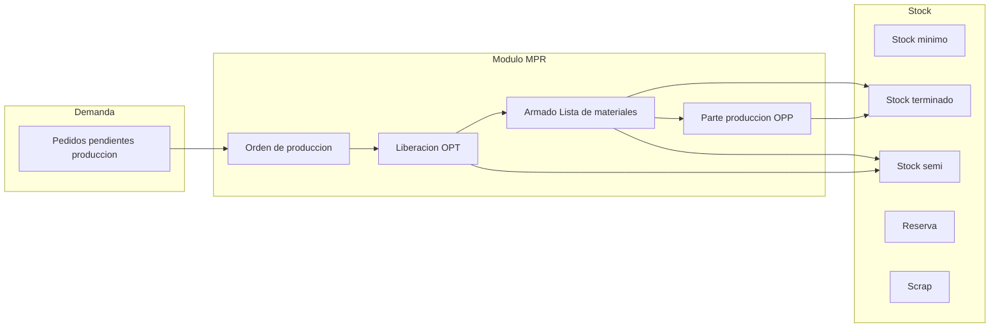

# Análisis del proceso de producción en AdministraNET y propuesta de módulo MPR (MVP)

**Contexto:** Los motivos "Pedido producción" (OPT), "Parte producción" (OPP) y "Armado" no son simples movimientos de stock: son **fases de un proceso de manufactura**. Este documento analiza lo existente en AdministraNET y propone un módulo **MPR (Manufacturing / Producción)** como MVP, inspirado en sistemas como Odoo y NetSuite. El módulo debe ser **parametrizable** para cualquier proceso de fabricación (unidad mínima, packs, presentaciones); se utiliza como **ejemplo** el caso de una fábrica de medias (unidad = par, pack x 6 / x 12) para ilustrar conceptos de unidades, pares y packs.

**Decisión de producto:** Los **tres motivos** (Pedido producción / OPT, Parte producción / OPP, Armado) **no se realizan en "Ingreso de movimiento de stock"**; pasan a ejecutarse **solo desde el módulo MPR**. En Synap se eliminan o ocultan los códigos 9, 11 y 12 del combo de motivos en la app Stock (alta de movimiento) y toda la UX de "Busca PEDI" para OPT/OPP; la liberación OPT, el armado (Lista de materiales) y el registro OPP se hacen desde pantallas MPR que orquestan los mismos movimientos en `movimiento_stock` / `stock` / `stock_deposito` y tablas de producción.

---

## 1. Análisis del proceso actual en AdministraNET

### 1.1 Flujo de datos y tablas

| Fase | Origen | Tablas / Campos clave | Qué hace |
|------|--------|------------------------|-----------|
| **Pedidos pendientes de producción** | Pedidos de venta (comp_ped) en estado de producción | `comp_ped`: TipoComprobante='PED', **estado_pedido_opt** en 'Pendiente', 'Produccion', 'Terminado'. La única fuente de demanda para fabricación son los pedidos con estado_pedido_opt='Pendiente'. Solo se consideran artículos con **articulo.tipo_art_fab = 'Terminado'**. Cuerpo en `stockp` (cantidad, cantidad_pendiente_opt). *(cantidad_fab_pendiente_opt deprecado para MPR.)* | Demandas a fabricar; unidad de gestión es el pedido de venta. |
| **Lista de producción (detalle y agrupada)** | Botón "Actualización" en Lista_Pedidos_OPT | `lista_produccion_detalle`: por (codigo_movimiento_pedido, id_articulo) → cantidad_pedida, cantidad_pendiente_prod, en_proceso_produccion. `lista_produccion_agrupada`: por id_articulo → cantidad_pedida, cantidad_pendiente_prod. El botón Actualizar solo hace INSERT en detalle e INSERT/UPDATE en agrupada; no actualiza en_proceso_produccion ni comp_ped. | Agrega demanda por artículo desde pedidos PED (Anulado='No', estado_pedido_opt='Pendiente' si aplica) y solo artículos tipo_art_fab='Terminado'. |
| **OPT (Pedido producción)** | CargaMovStock motivo 10 / ListIndex 10 | Origen: lista_produccion_agrupada + stockp. Movimiento **Entrada** (material/producto a producir). Al liberar: `lista_produccion_agrupada.cantidad_pendiente_prod` se descuenta por línea; si queda 0 se **elimina** la fila; se escribe `lista_produccion_historico` (id_articulo, **id_articulo_formula** siempre grabado). `movimiento_stock.tipo_mov = 'OPT'`. En Synap: "Generar OPT" en Confirmar OPT crea la OPT y ejecuta Liberar OPT de inmediato; también se puede "Liberar (OPT)" desde Detalle de OP. | "Liberar a producción" / compromiso de producción; entrada a depósito de producción. |
| **OPP (Parte producción)** | CargaMovStock motivo 11 / ListIndex 11 | En MPR: origen lista_produccion_agrupada (cantidad_pendiente_prod). Movimiento **Salida** (producto terminado). Al confirmar: `lista_produccion_agrupada.cantidad_pendiente_prod` se descuenta. `movimiento_stock.tipo_mov = 'OPP'`. *(Deprecado: stockp.cantidad_fab_pendiente_opt y estados "En proceso parcial/completo"; MPR no los usa.)* | Registrar **salida de producción** (parte terminada); descuenta pendiente de la OP. |
| **Armado** | CargaMovStock motivo 8 (Armado) | `en_abm` (conjunto armado) + `en_abm_formula` (lista de materiales: id_articulo, cantidad_articulo). Articulo.ensamblado='Si', articulo.id_en_abm. MstockE = entrada producto armado; MstockS = salida componentes. | Consume componentes (salida) y produce producto armado (entrada) según fórmula. |

### 1.2 Estados del pedido de producción

**En MPR (Synap)** se usan únicamente los estados de **estado_pedido_opt** en `comp_ped`: **Pendiente**, **Produccion**, **Terminado**. La única fuente de demanda para fabricación son los pedidos con estado_pedido_opt = 'Pendiente'.

**Deprecado (no usado en MPR):** Los estados "En proceso parcial" y "En proceso completo" basados en `cantidad_fab_pendiente_opt` en stockp (lógica comentada en VB6 y referenciada en filtros legacy "Parte producción") **no se utilizan** en el módulo MPR. El progreso de la producción se refleja en lista_produccion_agrupada (cantidad_pendiente_prod, en_proceso_produccion) y en estado_pedido_opt (Pendiente → Produccion → Terminado).

### 1.3 Conclusión del análisis

- **OPT, OPP y Armado** están implementados como **motivos de movimiento de stock** (CargaMovStock) y tablas auxiliares (lista_produccion_*, stockp, en_abm, en_abm_formula). La lógica de negocio de "orden de producción" está repartida entre comp_ped, stockp, lista_produccion_agrupada/detalle/historico y movimiento_stock.
- Para una **refactorización clara** y escalable (y para alinearse con sistemas tipo Odoo/NetSuite), conviene tratar estos flujos como un **módulo MPR** que:
  - Tenga un concepto explícito de **Orden de producción** (o "Orden de trabajo") con estados y fases.
  - Diferencie **demanda** (pedidos pendientes), **liberación a producción** (OPT), **producción** (Armado/Lista de materiales) y **salida de producto terminado** (OPP).
  - Permita en el futuro **stock por tipo** (mínimo, terminado, semi-elaborado, reserva, scrap) sin mezclar todo en movimientos genéricos.

---

## 2. Refactorización: por qué no son "simples movimientos de stock"

- **OPT:** No es solo una "entrada" genérica; es la **liberación a producción** de una cantidad demandada (lista_produccion_agrupada), con trazabilidad en lista_produccion_historico y vínculo a pedido/artículo.
- **OPP:** No es solo una "salida"; es la **registración de producto terminado** que en MPR descuenta cantidad_pendiente_prod de lista_produccion_agrupada y cierra (total o parcial) la orden de trabajo. *(En legacy VB6 se usaba stockp.cantidad_fab_pendiente_opt; deprecado para MPR.)*
- **Armado:** Es una **operación de manufactura** con lista de materiales (en_abm_formula): consumo de insumos y generación de producto armado; no es un movimiento de transferencia ni un ajuste.

En un diseño tipo Odoo/NetSuite, estos serían **órdenes de fabricación** y **operaciones** dentro del módulo de manufactura, no solo motivos de un movimiento de inventario genérico.

---

## 3. Propuesta de módulo MPR (MVP)

El módulo MPR se diseña para **cualquier proceso de fabricación**, parametrizado según el tipo de producto (unidad mínima, packs, presentaciones). En este documento se usa como **ejemplo** el caso "fábrica de medias" (par, pack x 6 / x 12) para explicar unidades, pares y packs.

### 3.1 Dominio y reglas de negocio

- **Unidad mínima de venta/producción:** **Parametrizable** por tipo de producto o configuración MPR. Todas las cantidades se expresan en esa unidad (ej. en fábrica de medias: **par** = 2 medias; en otros: unidad, kg, m, etc.).
- **Packs y presentaciones:** Ver sección 3.2 (AdministraNET ya soporta multiplicadores y presentaciones de forma genérica; MPR debe reutilizarlo y exponer la unidad de carga según parametrización).
- **Tipos de stock a identificar (MVP):**
  - **Stock mínimo:** Punto de reorden; por artículo/depósito (o por tipo de producto).
  - **Stock terminado:** Producto listo para venta (en la unidad de producción configurada).
  - **Stock semi-elaborado:** Producto en proceso (ej. piezas antes del armado, componentes sueltos).
  - **Stock reserva:** Cantidad reservada para pedidos o producción (no disponible para otros usos).
  - **Scrap (desecho):** Cantidad descartada en producción (no vendible); opcionalmente por causa (defecto, corte, etc.).
  - **2da selección:** Productos con defectos de fabricación que **sí son aptos para venta a menor costo**. Se diferencian del Scrap: en Scrap el producto no se vende; en 2da selección se vende como partida de menor calidad/precio.

- **Depósito (ubicación por etapa):** Además del artículo, el **depósito** es la otra dimensión relevante en MPR: la ubicación por donde pasan los productos. Se deben poder **agregar todos los depósitos necesarios** como etapas (producción, terminados, semi-elaborado, scrap, **2da selección**, etc.). En la tabla **deposito** (AdministraNET) se agrega el campo **suma_stock** `varchar(2)` con valor por defecto `'Si'`. Indica si el depósito **suma o no** stock para los distintos cálculos (stock terminado, cantidad a fabricar, cantidad urgente, etc.): solo los depósitos con `deposito.suma_stock = 'Si'` entran en esas sumatorias.

- **Tratamiento de productos con defectos aptos para venta (2da selección):**
  - **Opción recomendada para el MVP:** usar un **depósito distinto** (ej. "Depósito 2da selección") donde se contabilice el stock de 2da selección.
  - **suma_stock:** Decisión de negocio: si el depósito 2da selección tiene `suma_stock = 'Si'`, ese stock entrará en el "stock total" de las ventanas Pack/Unidades (se considera disponible para venta); si tiene `suma_stock = 'No'`, no se suma al indicador principal de "stock terminado" y puede reportarse por separado (ej. informe "Stock 2da selección").
  - **Origen del movimiento:** salida desde depósito de producción o terminados hacia depósito 2da selección (transferencia o motivo específico "Pase a 2da selección") cuando se reclasifica un producto por defecto vendible.
  - No sustituye al Scrap: el Scrap sigue siendo producto descartado (no vendible); 2da selección es producto vendible a menor precio.

**Coherencia y mejoras (3.1):** Asegurar que en cada pantalla MPR (Liberar OPT, Armado, OPP) se exija siempre la selección de depósito origen/destino según el movimiento, para que la trazabilidad y los reportes por depósito sean consistentes. Validar en implementación que los depósitos con suma_stock='No' (ej. tránsito, scrap, y opcionalmente 2da selección si no se suma) no distorsionen el "stock disponible" en ventanas Pack/Unidades. Documentar en un glosario MPR el significado de cada tipo de stock (incl. **2da selección** = defectos aptos para venta a menor costo; **Scrap** = desecho no vendible) y su vínculo con depósitos y suma_stock.

### 3.2 Unidades, packs y presentaciones (análisis AdministraNET)

En AdministraNET **no existe** un concepto fijo "pack 6" o "pack 12"; está resuelto de forma **genérica y parametrizable** para cualquier producto:

- **Identificación del pack:** El pack se conoce por el campo **descripción** del artículo y también por la descripción/nombre del artículo en la parametrización (ej. la palabra "Pack" o el tamaño en el nombre).
- **Unidades de medida:** Tabla **unimed** con las distintas unidades: P1 (PACK 1), P2 (PACK 2), P3 (PACK 3), P4 (PACK 4), P6 (PACK 6). Permite homologar presentaciones entre artículos.
- **Artículo unitario vs artículo de venta:** El **artículo unitario** (o “por unidad”) es la **unidad de fabricación** (ej. en medias: 1 par; en otros: 1 unidad, 1 kg). El **artículo de venta** puede ser por pack. En **articulo.multiplicador_vta** se indica la cantidad por pack (1, 2, 3, 4, 6, 12, etc., según el producto).
- **Tablas/campos relevantes:**
  - **articulo:** `multiplicador_comp`, `multiplicador_vta` (unidades por bulto/presentación); `cantidad_promedio_bulto`; `id_presentacionV`; `nro_cod_barra_bulto`, `nro_cod_barra_display`.
  - **articulo_prov:** `multiplicador_comp`, `cantidad_uni`, `cantidad_unidad_display`, `cantidad_display_bulto`, `cantidad_bulto_pallet`, `id_presentacionC`. Permite distintos multiplicadores por proveedor.
  - **stockp, stock, cuerpostock_mstock:** `multiplicador_comp`, `multiplicador_vta`, `cantidad_uni`, `tipo_unidad` (Unidad / Display / Bulto), `cantidad_bulto`, `cantidad_unidad_display`, `cantidad_dividir`.
  - **configuracion:** `utiliza_bulto_cerrado`, `utiliza_display` — habilitan en CargaMovStock y Lista_Pedidos_OPT el combo **tipo_unidad_bulto** (Unidad, Display, Bulto) y el cálculo de cantidad según multiplicador.
- **Lógica:** Si el usuario elige "Bulto" o "Display", la cantidad ingresada se multiplica por `multiplicador_comp` (o por `cantidad_unidad_display` / `cantidad_dividir` según función `Calculo_Cantidad_Multiplicar_Diplay_Bulto`) para obtener cantidad en unidad base. No hay valores 6 o 12 fijos: **el pack size es dato** (multiplicador_comp = 6 o 12, o por presentación).
- **Presentaciones (opcional):** Tabla `presentacion_abm` (id_presentacion, nombre_presentacion); articulo.id_presentacionV; articulo_prov.id_presentacionC. Permiten varias presentaciones por artículo (ej. "Pack 6", "Pack 12") con su multiplicador asociado vía articulo_prov o lógica por id_presentacion.

**Conclusión:** Packs y presentaciones **están contemplados** en AdministraNET de forma genérica:
- **Opción A:** Artículo con `multiplicador_comp` / `multiplicador_vta` según tamaño de pack (6, 12, etc., según el producto).
- **Opción B:** Mismo artículo con varias presentaciones (id_presentacionC) y multiplicador por presentación.
- En movimientos (OPT, OPP, Armado) se persiste `tipo_unidad` (Unidad/Bulto/Display), `multiplicador_comp`, `multiplicador_vta`, `cantidad_uni` y la cantidad ya convertida a **unidad base** en `Cantidad`/`Entrada`/`Salida`.

**Para MPR:** Reutilizar los mismos campos. En pantallas MPR (Liberar OPT, Armado, Parte OPP) permitir elegir **unidad de carga** (Unidad = unidad de fabricación configurada, o Bulto/Display si utiliza_bulto_cerrado/utiliza_display = Si) y tomar `multiplicador_comp`/`multiplicador_vta` y `cantidad_unidad_display` del artículo (o articulo_prov) para convertir a unidad base. Consultar **unimed** para etiquetar o filtrar por tipo de unidad. La UI MPR debe exponer tipo_unidad y conversiones según la **parametrización del proceso** (ej. en medias: pares y packs; en otros: unidades, kg, docenas, etc.).

**Coherencia y mejoras (3.2):** Unificar en una sola capa de servicios el uso de unimed + multiplicador_vta + cantidad_promedio_bulto para que Pedido producción trabajo (OPT) y Ventana Unidades usen las mismas reglas de conversión. La unidad de fabricación y las etiquetas (Par, Pack, Docena, etc.) deben ser **configurables** para no fijar un solo tipo de producto.

---

En AdministraNET actual no hay ubicaciones "tipo" (terminado/semi/reserva/scrap/2da selección); se usan **depósitos** y **motivos**. En el MVP se puede:
- Usar **depósitos** para representar ubicaciones (ej. Depósito Producción, Depósito Terminados, Depósito Scrap, **Depósito 2da selección**) y/o
- Introducir un **tipo de stock** o **tipo de ubicación** (configuración por depósito o por artículo) para reportes y alertas (mínimo, terminado, semi, reserva, scrap, 2da selección).

### 3.3 Conceptos del módulo MPR (inspirados en Odoo/NetSuite)

| Concepto | Descripción MVP |
|----------|------------------|
| **Demanda de producción** | Pedidos de venta (comp_ped) con estado_pedido_opt='Pendiente' (única fuente para fabricación). estado_pedido_opt puede ser también 'Produccion' o 'Terminado'. |
| **Orden de producción (OP)** | Registro que agrupa una o más líneas de demanda (por pedido y artículo, o por artículo agregado). Estados: Borrador, Confirmada, En progreso, Parcialmente terminada, Terminada, Cancelada. Equivalente conceptual a "OPT + seguimiento hasta OPP". |
| **Liberación a producción (OPT)** | Acción que "confirma" la OP y registra la **entrada** de materiales/producto a producir (movimiento tipo OPT). En MVP puede seguir generando un movimiento_stock tipo_mov='OPT' y actualizar lista_produccion_agrupada/historico o su equivalente en el nuevo modelo. |
| **Operación de producción** | En MVP: **Armado** (Lista de materiales). Consumo de componentes (salida) + producción de producto armado (entrada). Se puede modelar como un paso de la OP o como movimiento de stock con motivo Armado vinculado a la OP. |
| **Parte de producción (OPP)** | Registro de **salida de producto terminado** (movimiento tipo OPP); descuenta cantidad pendiente de la OP/pedido. Cierra total o parcialmente la OP. |
| **Lista de materiales** | Ya existe como en_abm + en_abm_formula. En MPR: pantallas de mantenimiento (listado, alta/edición de conjuntos y componentes) en Synap; se expone como "Fórmula de armado" en Armado. Fuente de verdad: tablas en_abm y en_abm_formula en MySQL AdministraNET. |

### 3.4 Flujo propuesto (MVP)

1. **Pedidos pendientes de producción** (comp_ped + stockp) → se listan en el módulo MPR como "Demanda a fabricar".
2. Usuario **crea o confirma Orden de producción** (agregado por artículo desde lista_produccion_agrupada o por pedido). Estado: Confirmada.
3. **Liberación (OPT):** Se registra entrada a depósito de producción (movimiento OPT); la OP pasa a "En progreso".
4. **Armado (si aplica):** Se ejecuta la operación lista de materiales (consumo componentes + producción producto armado); puede ser un movimiento de stock motivo Armado vinculado a la OP.
5. **Parte producción (OPP):** Se registra salida de producto terminado (movimiento OPP); se descuenta cantidad pendiente de la OP; si queda 0 pendiente, OP → "Terminada".
6. **Stock:** En MVP los saldos se siguen leyendo de stock_deposito; la **clasificación** (mínimo, terminado, semi, reserva, scrap, 2da selección) se puede hacer por:
   - Depósito (ej. "Terminados", "Semi", "Scrap", "2da selección") y/o
   - Campo o configuración por artículo/depósito para reportes (alertas de stock mínimo, informe por tipo).

**Coherencia y mejoras (3.4):** Verificar que el flujo exija en cada paso el **depósito** correspondiente (OPT: depósito destino de entrada; Armado: depósitos de componentes y producto armado; OPP: depósito origen de salida) para que los reportes por depósito y la trazabilidad sean correctos. Considerar un paso intermedio de validación antes de Liberar OPT: comprobar que exista stock o demanda suficiente y que el depósito de producción esté configurado (suma_stock según corresponda). Documentar la transición explícita de "Demanda" a "En producción" (actualización de lista_produccion_agrupada/detalle y estado_pedido_opt) para evitar doble conteo en Pedido producción trabajo (OPT)/Unidades.

### 3.5 Alcance MVP (qué incluir y qué dejar para después)

**Incluir en MVP:**

- **Modelo de datos (Synap):**
  - **Orden de producción:** Cabecera (número, estado, fecha, depósito producción, origen: pedido(s) o agregado por artículo). Líneas: artículo, cantidad pedida, cantidad liberada (OPT), cantidad producida (OPP), cantidad pendiente. Puede reutilizar o mapear a lista_produccion_agrupada/detalle y comp_ped/stockp para no duplicar datos en MySQL compartido; o ser tablas nuevas en Synap con sincronización a AdministraNET.
  - **Tipos de stock/ubicación:** Configuración por depósito (ej. tipo_ubicacion: terminado | semi | materia_prima | scrap | 2da_seleccion | reserva) o por artículo; uso en reportes y alertas de stock mínimo.

- **Pantallas MPR (MVP):**
  - **Listado "Pedidos con estado de producción":** Lectura de comp_ped (estado_pedido_opt en Pendiente, Produccion, Terminado) + stockp; opcionalmente agregado por artículo (lista_produccion_agrupada). La demanda para fabricar son los pedidos con estado_pedido_opt='Pendiente'.
  - **Orden de producción:** Alta/consulta de OP; estados; vinculación a pedidos/líneas. Acción "Liberar (OPT)" que genere el movimiento OPT y actualice lista_produccion_*.
  - **Parte de producción (OPP):** Registrar salida de producto terminado desde una OP, generando movimiento OPP y descontando cantidad_pendiente_prod de lista_produccion_agrupada. (cantidad_fab_pendiente_opt en stockp está deprecado para MPR.)
  - **Armado:** Mantener como operación desde MPR: pantalla que invoque la lógica de lista de materiales (en_abm_formula) y genere movimiento Armado (entrada producto + salida componentes), opcionalmente vinculado a OP.
  - **Lista de materiales (receta):** Listado de conjuntos de armado (en_abm); alta/edición de conjunto y de componentes (en_abm_formula); vinculación artículo–conjunto. Ver 3.5.1.

- **Reportes / indicadores básicos:**
  - Stock por tipo (terminado, semi, reserva, scrap, 2da selección) usando depósito o configuración.
  - Alertas de stock mínimo (por artículo/depósito).
  - Pendiente de producción por artículo o por pedido.

**Dejar para fases posteriores:**

- Planificación MRP automática (explosión de demanda, sugerencia de órdenes).
- Múltiples operaciones por OP (ruteos, work orders tipo Odoo).
- Costeo detallado por OP (coste estándar vs real).
- Scrap con causas y aprobaciones.
- Integración completa con compras (materiales).

**Coherencia y mejoras (3.5):** Incluir en el alcance MVP la **Ventana de pack** y **Ventana de unidades** (4.2.1) como primera pantalla de entrada al módulo MPR, ya que definen qué fabricar y alimentan la decisión de crear/liberar OP. Asegurar que el reporte "Pendiente de producción por artículo o por pedido" use las mismas fuentes que las fórmulas de Cantidad a fabricar / Cantidad urgente para coherencia. Valorar un indicador único "Órdenes en progreso" (OP en estado En progreso / Parcialmente terminada) para no perder de vista el WIP.

### 3.5.1 Pantallas de Lista de materiales (receta)

- **Listado de conjuntos de armado:** Lectura de `en_abm`; filtro por anulado; búsqueda por nombre.
- **Alta / edición de conjunto (en_abm):** Cabecera: nombre_en_abm, detalle, anulado, descuenta_en (si aplica).
- **Alta / edición de fórmula (en_abm_formula):** Por conjunto (id_en_abm), líneas con artículo (insumo) y cantidad_articulo; reutilizar búsqueda de artículos existente.
- **Vínculo artículo–conjunto:** Asignar `articulo.id_en_abm` (y `ensamblado = 'Si'`) para productos armados; puede ser desde pantalla de artículo o desde Lista de materiales.
- **Integridad:** Escritura en las tablas compartidas `en_abm` y `en_abm_formula` en MySQL; una sola definición de receta para AdministraNET (VB6) y Synap.

### 3.6 Unidad mínima (parametrizable)

- En **artículo** y **Lista de materiales:** La unidad de medida del producto terminado es **configurable** (unimed, descripción). Cantidades en stock y en OP se expresan en esa unidad (ej. en medias: "Par"; en otros: "Unidad", "kg", "m").
- **Stock semi-elaborado:** Si el proceso usa subunidades (ej. medias sueltas vs par), definir artículo o presentación y relación de conversión en fórmulas o configuración.
- **Configuración MPR:** Parámetro o tipo de unidad por defecto para el módulo (ej. Par, Unidad, Docena) para que listados y movimientos usen la unidad de fabricación definida para cada tipo de producto.

### 3.7 Integración con lo existente en Synap

- **Movimientos de stock:** OPT y OPP siguen generando registros en `movimiento_stock`, `stock`, `stock_deposito` (y opcionalmente lista_produccion_historico, stockp) para no romper AdministraNET/VB6. El módulo MPR orquesta la creación de esos movimientos desde sus pantallas.
- **Armado:** Reutilizar lógica de en_abm_formula y motivo Armado; desde MPR se puede invocar el mismo servicio que use CargaMovStock para Armado.
- **Pedidos:** comp_ped (estado_pedido_opt: Pendiente, Produccion, Terminado) y lista_produccion_agrupada son la fuente de verdad en MPR. Al confirmar OPP se actualiza lista_produccion_agrupada.cantidad_pendiente_prod. (Actualización de stockp.cantidad_fab_pendiente_opt y estado_pedido_opt "En proceso parcial/completo" está deprecada; MPR no los usa.)

---

## 4. Origen y cálculo de los stocks (DB existente y reformulación)

Todos los valores de stock listados (mínimo, terminado, semi-elaborado, reserva, scrap) deben poder obtenerse o calcularse desde la base de datos. A continuación se indica **cómo se obtienen o calculan hoy** y qué **reutilizar o reformular** para MPR.

### 4.1 Tablas y campos de stock en la DB (AdministraNET)

| Tabla | Campos relevantes | Uso actual |
|-------|-------------------|------------|
| **stock_deposito** | id_articulo, id_deposito, saldo, saldo_pedido_cliente, saldo_pedido_proveedor | Saldo físico por artículo y depósito; reservado venta (saldo_pedido_cliente); reservado compra (saldo_pedido_proveedor). |
| **deposito_reposicion** | id_articulo, id_deposito, stock_minimo, stock_maximo, punto_pedido | Stock mínimo (y máximo) por artículo y depósito; reporte stock_minimo.rpt: saldo <= stock_minimo. |
| **stock** | IDArt, CodDeposito, Entrada, Salida, Saldo, CodigoMovimiento, Comprobante, TipoComp | Detalle de movimientos; saldo se recalcula en AjustarSaldos; stock_deposito.saldo es el saldo actual por artículo/depósito. |
| **stockp** | CodigoMovimiento, IDArt, Cantidad, cantidad_pendiente, cantidad_entregada, cantidad_fab_pendiente_opt, cantidad_pendiente_opt | Pedidos (PED, OC); reservado venta desde stockp + comp_ped. *En MPR: OPT/OPP usan lista_produccion_agrupada; cantidad_fab_pendiente_opt y estados "En proceso parcial/completo" están deprecados.* |
| **deposito** | CodDeposito, NombreDeposito, **suma_stock** (varchar(2), default 'Si') | Catálogo; suma_stock indica si el depósito suma al stock total para cálculos MPR. Sin tipo explícito; depósitos dedicados o tipo_ubicacion si se añade. |
| **articulo** | (campos en 4.4) **stock_reserva** | Stock de reserva general por artículo; usado en ventanas MPR Pack/Unidades (4.2.1). |

### 4.2 Cómo se obtienen o calculan cada uno de los stocks listados

- **Stock mínimo (punto de reorden)**  
  - **Origen:** `deposito_reposicion.stock_minimo` por (id_articulo, id_deposito). Opcional: `deposito_reposicion.punto_pedido`.  
  - **Cálculo:** Valor directo de la tabla; no es un saldo. Se usa para alertas (saldo <= stock_minimo) y para reportes (stock_minimo.rpt).  
  - **MPR:** Reutilizar tabla y campos; en MPR mostrar/alertar “debajo de mínimo” por artículo/depósito.

- **Stock terminado**  
  - **Origen:** Saldo físico en depósitos que **suman** al stock. Con el campo `deposito.suma_stock = 'Si'` (default), se consideran los depósitos que participan en el total.  
  - **Cálculo:** `SUM(stock_deposito.saldo)` por artículo donde `id_deposito` está en depósitos con `deposito.suma_stock = 'Si'`.  
  - **MPR:** Usar solo depósitos con suma_stock = 'Si' para "stock terminado" en ventanas Pack y Unidades (véase 4.2.1).

- **Stock semi-elaborado**  
  - **Origen:** Igual que terminado: saldo en depósitos considerados “semi”. No existe campo específico en el esquema actual.  
  - **Cálculo:** `SUM(stock_deposito.saldo)` por artículo donde `id_deposito IN (depósitos semi)`.  
  - **MPR:** Misma configuración que terminado (depósitos o tipo_ubicacion).

- **Stock reserva (reservado)**  
  - **Origen (ventas):** En Synap/reports se usa **cálculo** desde `stockp` + `comp_ped`: PED con Estado IN ('En preparación','Preparado','Parcial'), SUM(cantidad_pendiente o Cantidad - cantidad_entregada) por artículo. En self_checkout y otros se usa `stock_deposito.saldo_pedido_cliente`.  
  - **Origen (ventanas MPR):** Para la "Ventana de pack" y "Ventana de unidades" se usa el campo **articulo.stock_reserva** (valor general por artículo). Cálculo: stock_reserva - stock_actual, donde stock_actual = SUM(stock_deposito.saldo) solo en depósitos con deposito.suma_stock = 'Si'.  
  - **Cálculo:** Reservado venta = SUM desde stockp (PED, estados indicados); o saldo_pedido_cliente. Reservado compra = saldo_pedido_proveedor. Para MPR ventanas: articulo.stock_reserva vs stock en depósitos que suman.  
  - **MPR:** Reutilizar lógica existente para reservado venta/compra; para indicador "stock reserva" en MPR usar articulo.stock_reserva (véase 4.2.1).

- **Stock 2da selección**  
  - **Origen:** Productos con defectos de fabricación aptos para venta a menor costo. Saldo en **depósito dedicado** "2da selección" (o depósitos con tipo_ubicacion = '2da_seleccion' si se implementa).  
  - **Cálculo:** `SUM(stock_deposito.saldo)` por artículo donde `id_deposito` = depósito 2da selección (o IN lista de depósitos 2da selección).  
  - **MPR:** Configurar depósito 2da selección; definir si suma_stock = 'Si' o 'No' según si se quiere incluir en el total vendible o reportar aparte (véase 3.1).

- **Scrap (desecho)**  
  - **Origen:** Producto descartado, **no vendible** (a diferencia de 2da selección, que sí es vendible a menor costo). No existe tabla ni campo específico en la DB actual. En VB6 los movimientos de stock pueden usar un motivo “Ajuste” o similar para bajas por scrap, pero no hay segregación.  
  - **Cálculo:** No hay cálculo estándar. Opciones: (1) Depósito dedicado “Scrap” y saldo = SUM(stock_deposito.saldo) WHERE id_deposito = deposito_scrap; (2) Nuevo motivo de movimiento (ej. “Scrap”) y calcular desde `stock` WHERE TipoComp = 'Scrap' (requiere extensión); (3) Nueva tabla `mpr_scrap` (id_articulo, id_deposito, cantidad, fecha, causa).  
  - **MPR:** Reformular: definir si scrap es por depósito o por motivo/tabla nueva; típicamente depósito Scrap con suma_stock = 'No'. Documentar en esquema MPR.

#### 4.2.1 Ventanas MPR: Pack y Unidades (fórmulas de cálculo)

Las pantallas "Ventana de pack" y "Ventana de unidades" muestran los indicadores que definen **qué fabricar** (artículos a producir desde pedidos de clientes y para stock de reserva). Los mismos conceptos se calculan en **packs** o en **unidades** (unidad de fabricación configurada, ej. pares) según la vista; la **Ventana de unidades** es la base para el primer proceso de fabricación (Pedido de producción).

**Stock de reserva (para estas ventanas):** Se usa el campo **articulo.stock_reserva** solo como **indicador** de stock mínimo a garantizar al producir; **no se usa para calcular saldos**.

**Fórmulas de cálculo (comunes a Pack y Unidades):**

| Concepto | Cálculo |
|----------|--------|
| **Pedidos** | Cantidad de pedidos pendientes de clientes que **no entraron en producción**. Cuando entran en producción se descuenta vía `comp_ped.estado_pedido_opt` (Pendiente → Produccion → Terminado). |
| **Saldo (stock terminado)** | Sumatoria de saldos en depósitos con `deposito.suma_stock = 'Si'`: por artículo, SUM(stock_deposito.saldo). La reserva no forma parte del saldo. |
| **Reserva** | `articulo.stock_reserva`: indicador de stock mínimo a garantizar (no se usa para calcular saldos). |
| **Cantidad a fabricar** | `max(0, (Pedido − Saldo) + Reserva)`, donde Saldo = SUM(stock_deposito.saldo) en depósitos con suma_stock='Si' y Reserva = articulo.stock_reserva. Si la demanda está cubierta (resultado ≤ 0), se muestra 0. |
| **Urgente** | Si (Cantidad Pedida − SUM(saldo) en depósitos con suma_stock='Si') > 0 entonces Urgente = Cantidad Pedida − SUM(saldo); sino Urgente = 0. Es decir: `max(0, Cantidad Pedida − Saldo)`. La reserva **no** interviene. |
| **Cantidad por docena** | `articulo.cantidad_promedio_bulto`: por cuánto multiplicar el pack para obtener valor por docena; `articulo.multiplicador_vta`: cantidad del pack para multiplicar y obtener docenas. |

- **Ventana de pack:** Los valores anteriores se expresan en **packs** (según multiplicador_vta / unimed del artículo).
- **Ventana de unidades:** Misma lógica en **unidades** (unidad de fabricación: ej. pares, unidades, kg). Opción de vista: Pack / Unidades / Docenas (definir en UX). **Origen de unidades para fórmulas:** tabla **en_abm_formula** (en_abm_formula.id_en_abm relacionado con articulo.idart; en_abm_formula.id_articulo tiene los artículos de la fórmula); de ahí se obtienen las unidades necesarias para fabricar (componentes en unidad base).
- **Regla de unidad mínima:** Las cantidades se expresan en la **unidad mínima configurada** para el proceso (ej. en fábrica de medias: pares; sobrantes inferiores a 1 unidad no se contabilizan hasta completar la unidad). Parametrizable por tipo de producto o configuración MPR.

**Origen de la demanda (Ventana pack / botón Actualizar):** La demanda que alimenta lista_produccion_detalle y lista_produccion_agrupada **ya no** depende de `comp_ped.tipo_pedido_opt = 'Fabrica'`. El criterio actual es: pedidos PED con `Anulado = 'No'`, `estado_pedido_opt = 'Pendiente'` (si la columna existe), y solo artículos con **`articulo.tipo_art_fab = 'Terminado'`**. Así solo se consideran ítems de stockp cuyo artículo está marcado como fabricado. El botón "Actualizar" solo escribe en lista_produccion_detalle (INSERT) y lista_produccion_agrupada (INSERT/UPDATE); no actualiza en_proceso_produccion en detalle ni comp_ped.

**Dónde entra MPR en Análisis de Punto de Reposición y Punto de equilibrio**

- **Punto de reposición:** En el sistema, el "análisis de punto de reposición" usa **deposito_reposicion.stock_minimo** (y opcionalmente punto_pedido) por artículo/depósito. El reporte MPR **"Bajo mínimo"** (`reporte_mpr_bajo_minimo`) lista artículos cuyo stock total (depósitos con suma_stock='Si') está por debajo de ese mínimo. **MPR** entra como **ejecución**: la Ventana pack y la Ventana de unidades usan **articulo.stock_reserva** solo como indicador de stock mínimo a garantizar (no para calcular saldos). La fórmula Cant. Producir = max(0, Pedido − Stock + Reserva) hace que, al enviar a producir, se reponga no solo la demanda sino también el colchón hasta ese mínimo. Así, `stock_reserva` es el objetivo de reposición por artículo en MPR; el reporte "Bajo mínimo" puede seguir usando `deposito_reposicion.stock_minimo` (o articulo.stock_minimo) para alertar.
- **Punto de equilibrio (en este contexto):** Equilibrio = demanda cubierta y reserva satisfecha: **Saldo ≥ Pedido + Reserva**. En ese caso, (Pedido − Saldo) + Reserva ≤ 0 y MPR muestra **Cant. a producir = 0**. No se produce cuando ya se está en ese "punto de equilibrio".

**Coherencia y mejoras (4.2 y 4.2.1):** Definir un único servicio o conjunto de consultas que implemente estas fórmulas para Pack y Unidades, de modo que un cambio de regla (ej. qué depósitos suman) no se duplique. Revisar que "Pedidos pendientes de producción" esté alineado con estado_pedido_opt y con lista_produccion_agrupada (pedidos que ya están "Produccion" o "Terminado" no deben contarse dos veces). Considerar cache o vista materializada por artículo/depósito si el volumen de ítems hace lenta la Ventana de unidades.

### 4.3 Resumen: reutilizar vs reformular

| Concepto | Reutilizar | Reformular / añadir |
|----------|------------|----------------------|
| Stock mínimo | deposito_reposicion.stock_minimo (y punto_pedido) | Solo configuración de qué artículos/depósitos mostrar en MPR. |
| Stock terminado | stock_deposito.saldo filtrado por depósitos con deposito.suma_stock = 'Si' | Campo deposito.suma_stock (default 'Si'); opcional tipo_ubicacion. |
| Stock semi-elaborado | stock_deposito.saldo filtrado por depósito | Configuración de “depósitos semi” o tipo_ubicacion. |
| Stock reserva | articulo.stock_reserva para ventanas MPR; stockp + comp_ped (reservado venta); saldo_pedido_cliente/proveedor | Ventanas Pack/Unidades: stock_reserva - stock_actual (depósitos con suma_stock='Si'). |
| Stock 2da selección | stock_deposito.saldo en depósito 2da selección | Depósito dedicado; suma_stock según criterio (Si = suma al vendible; No = reporte aparte). |
| Scrap | — | Depósito “Scrap” (suma_stock='No'); y/o nuevo motivo en movimiento_stock y stock, o tabla mpr_scrap. |
| OPT/OPP/Armado | movimiento_stock (tipo_mov OPT/OPP), stock, stock_deposito, lista_produccion_*, stockp, en_abm_formula | No crear tablas duplicadas; MPR orquesta escritura en las mismas tablas; quitar motivos 9, 11, 12 del Ingreso de movimiento de stock. |

**Coherencia y mejoras (4.3):** Centralizar la definición de "qué depósitos suman" (suma_stock) y "qué es stock reserva" (articulo.stock_reserva) en una capa de configuración o constantes compartidas entre Ventanas Pack/Unidades, reportes y alertas de mínimo, para que un cambio de criterio no obligue a tocar múltiples pantallas. Revisar que deposito_reposicion.stock_minimo se evalúe contra el mismo "stock actual" (depósitos con suma_stock='Si') que se usa en las ventanas.

### 4.4 Campos de producción a usar en MPR (sin duplicar)

- **comp_ped:** TipoComprobante='PED', **estado_pedido_opt** (estado de producción: Pendiente, Produccion, Terminado). La única fuente de demanda para fabricación es estado_pedido_opt='Pendiente'.
- **stockp:** Cantidad, cantidad_pendiente_opt, CodigoMovimiento (pedido), id_stock. *(cantidad_fab_pendiente_opt y estados "En proceso parcial/completo" deprecados para MPR; MPR usa lista_produccion_agrupada.)*
- **lista_produccion_detalle:** codigo_movimiento_pedido, id_articulo, cantidad_pedida, cantidad_pendiente_prod, en_proceso_produccion.
- **lista_produccion_agrupada:** id_articulo, cantidad_pedida, cantidad_pendiente_prod, id_lista_produccion.
- **lista_produccion_historico:** id_articulo, **id_articulo_formula** (siempre grabado en Synap: artículo de la línea o componente si hay desglose BOM; trazabilidad), cantidad_pedida, cantidad_movimiento, cantidad_armada, id_deposito, codigo_movimiento_mstock, codigo_movimiento_opt. Solo se escribe en motivo 10 (OPT), no en motivo 11 (OPP).
- **movimiento_stock:** codigo_movimiento, tipo_mov ('OPT'|'OPP'), motivo_movimiento, deposito_origen, deposito_destino, etc.
- **stock:** Por cada renglón OPT/OPP/Armado; Entrada/Salida, CodDeposito, TipoComp.
- **en_abm, en_abm_formula:** Lista de materiales para Armado (id_articulo, cantidad_articulo por componente).
- **articulo:** ensamblado='Si', id_en_abm para productos armados; **stock_reserva** (stock de reserva general por artículo, usado en ventanas MPR Pack/Unidades); **tipo_art_fab** = 'Terminado' para que el artículo entre en la demanda de la Ventana pack (botón Actualizar): solo artículos con tipo_art_fab='Terminado' se consideran en stockp+comp_ped al cargar lista_produccion_detalle/agrupada.

MPR debe **leer y escribir** en estas tablas/campos; no definir tablas nuevas que dupliquen movimiento_stock o stockp. Si se agrega un concepto “Orden de producción” como cabecera, puede ser vista sobre lista_produccion_agrupada + comp_ped o una tabla nueva **solo de cabecera** (número OP, estado, fechas) con líneas que sigan referenciando lista_produccion_detalle/stockp.

**Coherencia y mejoras (4.4):** Antes de implementar escritura en lista_produccion_historico y stockp desde MPR, auditar en VB6 el orden y las condiciones exactas de actualización (ej. si hay triggers o lógica que dependa del valor anterior de cantidad_pendiente_prod). Incluir en el modelo de lectura los campos deposito.suma_stock y articulo.stock_reserva para que las ventanas y reportes no tengan que repetir la lógica de filtrado.

---

## 5. Quitar OPT, OPP y Armado del Ingreso de movimiento de stock

- En la app **Stock** (Synap): en el alta de movimiento, el combo de motivos debe **excluir** los códigos **9 (Armado), 11 (Pedido producción) y 12 (Parte producción)**. No se muestra "Busca PEDI" para motivos 11/12; no se ofrece motivo Armado.
- El servicio `obtener_motivos_movimiento` (o equivalente) en `core/services/administranet_stock.py` debe filtrar por permiso `pedidos_parte_produccion` y, en lugar de incluir 9, 11 y 12, **no devolverlos** (o devolverlos solo si existe un flag “mostrar motivos producción en Stock”, por defecto no).
- Las APIs de stock que hoy listan pedidos pendientes para motivo 6 (PEDI) se mantienen para **Transferencia (PEDI)**; las que cargan renglones para motivo 11/12 se **eliminan o redirigen** al módulo MPR cuando este exista.
- **Resultado:** Ingreso de movimiento de stock solo permite motivos “genéricos” (Stock Inicial, Ajuste, Faltante, Sobrante, Rotura, Transferencia, Mov. Interno E/S, Desarmado si se mantiene). OPT, OPP y Armado solo se ejecutan desde MPR.

**Coherencia y mejoras (5):** Comunicar claramente a usuarios que OPT/OPP/Armado pasan a MPR (mensaje en la app Stock o tooltip en el combo de motivos) para evitar confusión. Incluir en "siguientes pasos" la migración de datos o historial: si existen movimientos recientes con motivos 9, 11, 12, definir si se muestran en MPR como lectura o solo en reportes de stock.

---

## 6. Resumen y siguientes pasos

- **Análisis:** En AdministraNET, Pedido producción (OPT), Parte producción (OPP) y Armado son fases de un mismo proceso de manufactura, apoyadas en comp_ped, stockp, lista_produccion_* y movimiento_stock; no son "simples movimientos de stock".
- **Refactorización:** Tratarlos como un **módulo MPR** permite estados claros (Orden de producción), trazabilidad y futuro stock por tipo (mínimo, terminado, semi, reserva, scrap).
- **Decisión:** Los tres motivos **no se realizan en Ingreso de movimiento de stock**; pasan **solo a MPR**. Usar campos y tablas existentes (stock_deposito, deposito_reposicion, lista_produccion_*, stockp, movimiento_stock, en_abm_formula); reformular solo donde no hay soporte (scrap, tipo de depósito para terminado/semi).
- **Propuesta MVP:** Módulo MPR con: (1) Demanda desde pedidos pendientes de producción, (2) Orden de producción con estados y liberación OPT, (3) Operación Armado (Lista de materiales), (4) Parte producción OPP, (5) Tipos de stock/ubicación para reportes y stock mínimo (deposito.suma_stock para qué depósitos suman al total; articulo.stock_reserva para reserva; deposito_reposicion.stock_minimo), (6) Ventana de pack y Ventana de unidades (4.2.1) con fórmulas de Pedidos, Stock reserva, Stock terminado, Cantidad a fabricar, Cantidad urgente, Cantidad por docena, (7) Pantallas de Lista de materiales (receta) / receta): mantenimiento de conjuntos de armado y componentes en Synap (en_abm, en_abm_formula). **Unidad mínima y presentaciones parametrizables** según el proceso (ej. par, pack, docena, unidad, kg).
- **Siguientes pasos sugeridos:** (a) Quitar motivos 9, 11 y 12 del combo y flujo de Ingreso de movimiento de stock; (b) Definir modelo de datos de Orden de producción (vista sobre lista_produccion_* o tabla cabecera MPR); (c) Implementar pantallas MPR (lista demanda, OP, Liberar OPT, Registrar OPP, Armado); (d) Configuración tipo de stock/depósito y reporte por tipo y alerta de mínimo; (e) Documentar esquema de cálculo de cada stock (sección 4) en docs y en implementación; (f) Añadir en tabla deposito el campo suma_stock y en articulo el uso de stock_reserva; (g) Implementar Ventana de pack y Ventana de unidades (4.2.1) como punto de entrada al módulo; (h) Implementar pantallas de Lista de materiales en el módulo MPR: listado y mantenimiento de conjuntos de armado (en_abm) y de componentes de la fórmula (en_abm_formula); vinculación con artículos ensamblados (articulo.id_en_abm, ensamblado).

**Coherencia y mejoras (6):** Incluir en el plan de implementación la **validación integral del flujo** entre etapas: desde Pedido producción trabajo (OPT)/Unidades (qué fabricar) hasta Liberar OPT → Armado → OPP, comprobando que los mismos depósitos (suma_stock) y las mismas fuentes (comp_ped.estado_pedido_opt, lista_produccion_*) se usen en todo el recorrido. No usar "En proceso parcial/completo" (deprecados). Revisar si falta contemplar el **cierre o anulación de OP** (cancelación, devolución de materiales) y el impacto en lista_produccion_* y stockp.

### 6.1 Implementación inicial (febrero 2025)

- **App Django `mpr`:** Creada en `mpr/` con `urls.py`, `views.py`, `apps.py`. Registrada en `INSTALLED_APPS` y en `django_project/urls.py` como `path('mpr/', include('mpr.urls', namespace='mpr'))`.
- **Menú:** MPR en `APPS_MENU` en `core/utils/utils.py` (id `mpr`, permiso `mpr.ver`), con submenús de producción, reportes y configuración. Visibilidad en navbar y Command Center según **`ModuleConfig.is_active`** (`core/module_registry.py` → `mpr`; migración `0013_moduleconfig_mpr`; activación con `setup_modules --activate mpr`).
- **Permisos:** Añadido permiso `mpr.ver` en `core/constantes_permisos.py` bajo "Producción (MPR)". El usuario supervisor (`*`) ve el módulo; el resto necesita el permiso asignado al puesto/rol.
- **Tablero MPR:** Primera pantalla en `/mpr/` (`mpr:tablero`): vista "control de planta" con KPIs (OP en progreso, atrasadas, unidades pendientes, ítems urgentes), paneles Top urgencias y Movimientos recientes, y bloques OPs a liberar / OPs a cerrar. Template `mpr/templates/mpr/tablero.html` extendiendo `base_app.html`, responsive y con variantes `dark:` (modo claro/oscuro). Datos actualmente placeholders; siguiente paso: conectar a MySQL AdministraNET (lista_produccion_*, etc.).
- **Módulo activo en sidebar:** En `core/templatetags/menu_tags.py`, `get_current_module` devuelve `'mpr'` cuando `app_name == 'mpr'` para resaltar el ítem MPR en el menú.

**Continuación (lista de OP y datos reales):**

- **Servicio MPR (`mpr/services.py`):** Lectura desde MySQL AdministraNET con `core.mysql_pool.mysql_cursor`. `listar_lista_produccion_agrupada(base_empresa, limit, id_articulo)` resuelve nombres de tablas con `SHOW TABLES` (compatible mayúsculas/minúsculas), hace JOIN con `articulo` y devuelve id_lista_produccion, id_articulo, codigo_articulo, descripcion_articulo, cantidad_pedida, cantidad_pendiente_prod. `listar_lista_produccion_detalle(base_empresa, limit, codigo_movimiento_pedido)` para detalle por pedido. Tipos normalizados con `core.utils.administranet_types`.
- **Lista de OP (`/mpr/ordenes/`):** Vista `OpListView` y template `mpr/op_list.html` con tabla de producción agrupada por artículo, filtro opcional por ID artículo, breadcrumbs y enlace al tablero. Menú MPR "Lista de OP" apunta a `mpr:op_list`.
- **Tablero con datos reales:** Si hay `base_empresa` en sesión, el tablero usa `listar_lista_produccion_agrupada` para rellenar KPIs (OP en progreso, unidades pendientes, ítems urgentes), Top urgencias y OPs a liberar; "Ver todo" y "Liberar" enlazan a la lista de OP; cada ítem de "OPs a liberar" tiene enlace "Ver" al detalle de esa OP.

**Detalle de OP (continuación):**

- **Servicio:** `get_op_detalle(base_empresa, id_lista_produccion)` devuelve todas las líneas de `lista_produccion_agrupada` con ese `id_lista_produccion`. `get_op_detalle_by_articulo(base_empresa, id_articulo)` devuelve una línea cuando no hay lista (OP de un artículo).
- **Vista y URL:** `OpDetailView` en `/mpr/ordenes/<id_lista>/`; si `id_lista` es 0 y se pasa `?articulo=<id>`, se muestra la OP de ese artículo. Sin líneas → 404.
- **Template `mpr/op_detail.html`:** Breadcrumbs (Producción > Órdenes > OP Nº), header tipo hero (Nº OP, estado "En progreso", totales), barra de progreso (porcentaje completado, pasos Pedida → Liberada OPT → Producida OPP → Pendiente), tabla de artículos (código, descripción, cant. pedida/pendiente, estado), tres tarjetas de acción (Liberar OPT, Armado Lista de materiales, Registrar OPP) que por ahora enlazan al tablero. Responsive y modo oscuro.
- **Enlaces:** En la lista de OP, cada fila tiene "Ver" (al detalle por `id_lista_produccion` o por `?articulo=`) y "Liberar". En el tablero, cada OP a liberar tiene "Ver" al detalle y "Liberar" a la lista.

**Motivos 9, 11, 12 solo desde MPR (continuación):**

- En **Stock > Ingreso Mov. Stock** se dejaron de ofrecer los motivos **9 (Armado), 11 (Pedido producción), 12 (Parte producción)**. En `core/services/administranet_stock.py`, `get_motivos_permitidos(..., incluir_pedidos_produccion=False)` excluye (9, 11, 12). La API de datos iniciales del ingreso (`stock/api_views.py`) pasa `incluir_pedidos_produccion=False`, por lo que el combo de motivos ya no muestra Armado, Pedido producción ni Parte producción; esos flujos se realizan solo desde el módulo MPR.

**Pantalla Liberar OPT (continuación):**

- **URL:** `/mpr/ordenes/<id_lista>/liberar-opt/` (`mpr:liberar_opt`). Solo para OP con `id_lista` distinto de 0.
- **Vista:** `LiberarOptView`: GET muestra formulario (resumen OP, pendiente total, input cantidad a liberar, select depósito destino desde `get_depositos`); POST por ahora redirige al detalle de la OP con mensaje informativo de que el registro en BD está en desarrollo.
- **Template `mpr/liberar_opt.html`:** Breadcrumbs (Producción > Órdenes > OP Nº > Liberar OPT), título y subtítulo, resumen de líneas y pendiente, formulario con cantidad y depósito destino, aviso de impacto y botones "Liberar a producción (OPT)" y "Cancelar y volver". Responsive y modo oscuro.
- **Enlace:** En el detalle de OP, la tarjeta "Liberar (OPT)" apunta a `liberar_opt` cuando hay `id_lista`; si la OP es por artículo (`id_lista=0`), se muestra la tarjeta deshabilitada. Menú MPR "Liberar (OPT)" enlaza a la lista de OP.

**Escritura real Liberar OPT (continuación):**

- **Servicio `ejecutar_liberar_opt` (mpr/services.py):** Recibe base_empresa, id_usuario, id_lista_produccion, lineas (get_op_detalle), cantidad_total, deposito_destino. Reparte cantidad_total entre las líneas en orden (`_distribuir_cantidad_a_lineas`). En una transacción: obtiene siguiente codigo_movimiento (codmov) y nro_comprobante (talonarios MSTOCK); INSERT movimiento_stock (motivo "Pedido producción", tipo_mov 'OPT', deposito_origen = deposito_destino); por cada (línea, cantidad) INSERT stock (Entrada), actualiza stock_deposito (saldo), UPDATE lista_produccion_agrupada (cantidad_pendiente_prod -= cantidad); opcionalmente INSERT lista_produccion_historico si la tabla existe, **con id_articulo_formula siempre grabado** (línea.id_articulo_formula si existe, si no id_articulo de la línea) para trazabilidad. Nombres de tablas resueltos con SHOW TABLES. Devuelve (ok, codigo_movimiento, nro_comprobante, error).
- **Vista LiberarOptView POST:** Obtiene base_empresa, id_usuario (sesión), cantidad y deposito_destino del POST; valida y llama a ejecutar_liberar_opt. Si ok, redirige al detalle de la OP con mensaje de éxito (movimiento y comprobante); si error, redirige a la pantalla Liberar OPT con mensaje de error.

**Nueva OP y Pedido producción trabajo (OPT) (continuación):**

- **Servicio `crear_op_agrupada` (mpr/services.py):** Inserta en lista_produccion_agrupada (id_articulo, cantidad_pedida, cantidad_pendiente_prod, id_usuario, en_proceso_produccion='No'). Devuelve (ok, id_lista_produccion, error). Servicio `listar_articulos_para_op(base_empresa, limit)` para el selector de artículos.
- **Nueva OP (`/mpr/ordenes/nueva/`, `mpr:op_create`):** Formulario artículo (select) + cantidad; POST crea la OP y redirige al detalle. Preselección de artículo vía `?articulo=<id>` (desde Pedido producción trabajo (OPT)). Menú MPR "Nueva OP" apunta a `mpr:op_create`.
- **Servicio `listar_ventana_pack` (mpr/services.py):** Agrupa lista_produccion_agrupada por id_articulo; obtiene stock terminado (SUM(stock_deposito.saldo) en depósitos con COALESCE(suma_stock,'Si')='Si'); devuelve cantidad_a_fabricar = max(0, demanda - stock_terminado). Ordenado por cantidad_a_fabricar descendente.
- **Pedido producción trabajo (OPT) (`/mpr/demanda/ventana-pack/`, `mpr:ventana_pack`):** Tabla con Artículo, Stock terminado, Pendiente producción, Cantidad a fabricar (editable); checkbox por fila; botón "Continuar" envía selección a **Confirmar OPT** (`mpr:ventana_pack_agrupar`). Toggle **Pack | Unidades** en la misma pantalla (`?vista=unidades`); misma fuente de datos. En **Confirmar OPT** solo se muestra la tabla **Unidades** (componentes de recetas BOM de los packs seleccionados), con **Cant. a fabricar** editable por fila; botón **Generar OPT** crea la OPT (INSERT lista_produccion_agrupada por cada componente con cantidades del formulario) y **ejecuta Liberar OPT de inmediato** (movimiento stock tipo OPT, actualización de lista_produccion_agrupada: si cantidad_pendiente_prod queda 0 se elimina la fila), luego redirige al Detalle de la OP. Equivalente a Lista_Pedidos_OPT en VB6 (crear OPT + liberar). La liberación también puede hacerse desde Detalle de OP → **Liberar (OPT)** para OPT creadas por otros flujos.
- **Trazabilidad OPT:** Al ejecutar Liberar OPT, `ejecutar_liberar_opt` escribe en `lista_produccion_historico` con **id_articulo_formula** siempre informado (por defecto = id_articulo de la línea; si en el futuro hay desglose por componente BOM, id_articulo_formula = componente).

**Registrar OPP y Ventana Unidades (continuación):**

- **Servicio `ejecutar_opp` (mpr/services.py):** Registra Parte de producción: movimiento_stock (tipo_mov OPP, motivo "Parte producción"), renglones stock (Salida en depósito origen, Entrada en depósito destino), actualiza stock_deposito en ambos. Recibe deposito_origen y deposito_destino. No actualiza stockp ni lista_produccion_agrupada en esta versión.
- **Pantalla Registrar OPP (`/mpr/ordenes/<id_lista>/registrar-opp/`, `mpr:registrar_opp`):** Formulario cantidad a registrar, depósito origen (producción/WIP), depósito destino (terminados). POST llama a ejecutar_opp y redirige al detalle de la OP. Enlace desde detalle de OP (tarjeta "Registrar OPP") cuando id_lista no es 0. Menú "Parte de producción (OPP)" apunta a lista de OP.
- **Toggle Ventana Unidades:** En Pedido producción trabajo (OPT), botones Pack | Unidades; con `?vista=unidades` el título y las etiquetas de columnas pasan a "Ventana Unidades" y "(unid.)"; mismos datos que Pack.

**Lista de materiales – Listado y detalle (continuación):**

- **Servicios en `mpr/services.py`:** `listar_bom_conjuntos(base_empresa, limit, solo_activos)` lee `en_abm` con cantidad de componentes (subconsulta a `en_abm_formula`). `get_bom_detalle(base_empresa, id_en_abm)` devuelve cabecera del conjunto y lista de componentes (en_abm_formula + articulo: código, descripción, cantidad_articulo, tipo_unidad).
- **Listado Lista de materiales (`/mpr/bom/`, `mpr:bom_list`):** Tabla con ID, Nombre, Detalle, Nº componentes, Estado (Activo/Anulado). Filtro "Solo activos" / "Todos". Enlace "Ver detalle" por fila.
- **Detalle Lista de materiales (`/mpr/bom/<id_en_abm>/`, `mpr:bom_detail`):** Cabecera (nombre, detalle, estado, descuenta_en) y tabla de componentes (código, artículo, cantidad, unidad).
- **Menú:** Sección "Lista de materiales" con "Listado de conjuntos" → `mpr:bom_list`. "Armado (Lista de materiales)" en Ejecución y la tarjeta en detalle de OP apuntan a `mpr:bom_list` (flujo de armado desde OP se puede añadir después).

---

## 7. Diseño UX/UI del módulo MPR (MVP)

Foco: que el usuario **entienda el proceso** (no motivos sueltos), que sea **difícil equivocarse** (depósitos, unidades, estados), que sea **rápido** (operaciones masivas, presets, escaneo/teclado), y que **conviva con AdministraNET** sin romper nada (los movimientos se generan igual, orquestados solo desde MPR).

### 7.0 Referencias de diseño y stack visual

**Maquetas de referencia (inspiración):** Los diseños en `stitch/` (tablero, demanda/planning, detalle OP, flujo OPT) sirven como referencia visual para implementar la UI del módulo MPR. Cada archivo es un HTML autónomo con Tailwind, Inter y Material Symbols.

| Archivo | Pantalla / flujo que representa |
|---------|----------------------------------|
| `tablero_de_control_mpr_synap/code.html` | Tablero MPR (home): KPIs, Top Urgencies, Recent Movements, OPs to Release, OPs to Close. |
| `synap_mpr_module_dashboard/code.html` | Vista de planificación / órdenes activas: tabla con Stock Health (barra), panel lateral Order Details, Fulfillment Center (depósito), Usage analytics, botón Validar y confirmar. |
| `detalle_de_orden_de_producción_(op)/code.html` | Detalle de OP: breadcrumbs, header OP + estado, stepper Ordered → Released (OPT) → Produced (OPP) → Pending, tabs, tabla artículos en producción, acciones Liberar / Armado / Iniciar Producción, sidebar eventos e info de gestión. |
| `flujo_de_liberación_(opt)/code.html` | Flujo Liberación (OPT): paso 1 (cantidad, unidad, conversión, almacén de salida, Suma Stock al Destino), Resumen de Impacto, botón Release to Production (OPT), validación de capacidad. |

**Stack visual y coherencia con Synap:** Usar **la misma paleta y componentes que el resto de Synap** para mantener coherencia visual. No introducir colores ajenos (p. ej. no usar el azul #195de6 de las maquetas stitch como primario).

- **Colores y tema:** Tailwind con `darkMode: 'class'`. Fondo: `bg-gray-100 dark:bg-gray-900`; header/superficies: `bg-white dark:bg-gray-950`, `dark:bg-gray-800` para paneles. Acentos: gradiente violeta–azul ya usado en Synap (`#a855f7`, `#3b82f6`) para iconos, botones primarios y estados activos. Texto: escala gray/slate (`text-gray-900 dark:text-gray-100`, `text-slate-500 dark:text-slate-400`). Bordes: `border-gray-200 dark:border-gray-700` (o equivalente en theme). Chips y estados: `purple-100 dark:purple-900`, `blue-100 dark:blue-900`, etc., como en navbar y listados actuales.
- **Iconos y tipografía:** Material Icons (como en base_app) o Material Symbols si se unifica más adelante; fuente según Synap (font-inter / Inter si está definida).
- **Header/footer MPR:** Mismo patrón que el resto de la app (logo, búsqueda, nav, CTAs, avatar); icono factory o equivalente para identificar módulo MPR.

**Diseño 100% responsive:** Todas las pantallas del módulo MPR deben funcionar en móvil, tablet y escritorio. Usar breakpoints de Tailwind (`sm:`, `md:`, `lg:`) de forma sistemática: tablas con scroll horizontal o vistas apiladas en móvil; grids que colapsen a una columna; menú/sidebar colapsable o drawer en pantallas pequeñas; botones y CTAs accesibles en touch. Si alguna vista es demasiado densa o el flujo en móvil resulta confuso, **definir pantallas o flujos específicos para mobile** (p. ej. vista simplificada del tablero, flujo OPP paso a paso en una sola columna, lista de OP con tarjetas en lugar de tabla). Documentar en cada pantalla del inventario (7.14) si se prevé variante mobile dedicada.

**Modo claro y modo oscuro:** El diseño debe **soportar ambos modos** tal como Synap: todas las superficies, textos, bordes y estados deben tener variante `dark:` coherente con `theme/templates/base_app.html` y `partials/navbar.html`. No usar colores fijos que rompan en oscuro; usar clases Tailwind con variante dark (p. ej. `bg-white dark:bg-gray-800`, `text-gray-900 dark:text-gray-100`). Las maquetas de referencia en stitch pueden usarse como inspiración de layout y contenido, pero los tokens de color en implementación serán los de Synap.

### 7.1 Principios UX del MPR (que se sienta "manufactura", no "stock")

**1.1 Mental model**

El usuario no "hace OPT/OPP/Armado". El usuario:

- Decide **qué fabricar** (Demanda + stock + urgencias).
- Abre y **libera** una OP.
- **Produce** (armado / consumo / WIP).
- **Declara terminado** (parcial o total).
- **Clasifica** (terminado / 2da / scrap) y cierra.

**1.2 Anti-error por diseño (guardrails)**

- Depósitos siempre obligatorios con **defaults inteligentes** (por perfil/estación).
- Unidades y conversiones **visibles** (lo que carga el usuario vs lo que se graba en unidad base).
- "Hacer" siempre **desde un contexto** (una OP). Nunca suelto.
- Estados explícitos y un **timeline** ("qué pasó y cuándo").

**1.3 Velocidad operativa**

Dos modos de uso:

- **Planificación/encargado:** Analiza, crea OPs, libera.
- **Piso/producción:** Registra armado/partes con mínima fricción (scanner, teclado, plantillas).

**1.4 Responsive y modos claro/oscuro**

- **Responsive:** Diseño 100% responsive (móvil, tablet, escritorio). Uso sistemático de breakpoints; tablas con scroll o vistas apiladas en móvil; menú/sidebar adaptado (drawer o colapsable). Donde el flujo lo requiera, se definen pantallas o flujos específicos para mobile (véase 7.0).
- **Modo claro y oscuro:** Todas las pantallas MPR deben respetar el modo claro y oscuro de Synap (`darkMode: 'class'`). Sin colores fijos que rompan en oscuro; variantes `dark:` en superficies, texto, bordes y estados.

### 7.2 Navegación del módulo MPR

**Menú MPR (sidebar)**

| Grupo | Ítems |
|-------|--------|
| **Tablero** | Vista "control de planta" y entrada rápida a acción. |
| **Demanda** | Pedido producción trabajo (OPT), Ventana Unidades, Pedidos a fábrica (detalle por pedido). |
| **Órdenes de producción** | Lista de OP, Nueva OP. |
| **Ejecución** | Liberar (OPT), Armado (Lista de materiales), Parte de producción (OPP), Reclasificación (2da / Scrap). |
| **Lista de materiales** | Mantenimiento en_abm / en_abm_formula. |
| **Reportes** | Pendiente por artículo/pedido, WIP / En progreso, Stock por tipo/depósito, Bajo mínimo. |
| **Configuración** | Depósitos (suma_stock, tipo_ubicacion si aplica), Unidades/presentaciones, Parámetros MPR. |

**Nota UX:** "Ejecución" existe como atajo, pero la entrada principal es **desde una OP** (contextual). Mantener Ejecución como atajo guiado.

### 7.3 Tablero MPR (home)

**Objetivo:** Vista "control de planta" y entrada rápida a acción.

**Header de página:** Título "Tablero de Control MPR", subtítulo "Gestión integral de requerimientos y manufactura industrial". Botones: Armado, Ver demanda.

**Layout detallado:**

- **Fila 1 – KPI cards (grid 4 columnas):**
  - **OP In Progress:** número (ej. 42), tendencia vs semana anterior (ej. +5%), icono pending_actions.
  - **Delayed OPs:** número (ej. 08), etiqueta "critical", icono priority_high (rojo).
  - **Total Pending Units:** unidades base (ej. 1,240), tendencia (ej. +12% volume), icono inventory_2 (ámbar).
  - **Urgent Items:** número (ej. 15), etiqueta "High Priority", icono warning (rojo).

- **Fila 2 – Dos paneles (grid 2 columnas):**
  - **Top Urgencies:** tabla con columnas Article ID, Description, Stock, Demand, Status (chips Critical/Warning). Botón "View All". Filas con hover.
  - **Recent Movements:** lista cronológica de eventos (OPP Registered, Armado Completed, New OPT Generated) con icono, título, detalle (línea/depósito), tiempo relativo (ej. "2 mins ago", "15 mins ago"). Solo lectura.

- **Fila 3 – Dos bloques:**
  - **OPs to Release:** título con icono rocket_launch, chip "Confirmed Status". Lista de OP (número, cliente/resumen, unidades). Por cada OP: botón "Release". Clic en fila o botón lleva a flujo de liberación o detalle.
  - **OPs to Close:** título con icono task_alt, chip "Production Completed". Lista de OP terminadas (número, fecha/hora, "Quality Approved" o "Pending Doc Verification"). Botón "Close OP" (primario en verde para listas para cerrar).

**CTA primarios (header o barra):** Crear OP (primario), Registrar OPP (secundario), Armado, Ver demanda. Footer opcional: Reports, MRP Config, System Online, versión.

### 7.4 Demanda: Pedido producción trabajo (OPT) / Ventana Unidades y vista de planificación

**Objetivo:** Responder en pocos segundos: qué fabricar, cuánto, por qué (pedidos vs reserva), dónde impacta (stock terminado / depósitos que suman).

**4.1 Pedido producción trabajo (OPT) / Ventana Unidades (UI común):**

- **Header:** Filtros (Depósito(s) que suman, Rubro/Familia, Solo bajo mínimo, Solo con pedidos, Solo urgente, Buscar artículo). Toggle: Pack | Unidades | Docena (si aplica).
- **Tabla:** Artículo (código + descripción), Stock terminado, Pedidos pendientes, Stock reserva / Brecha, Cantidad a fabricar, Cantidad urgente, Presentación (pack x N / unidad base). Acciones: Crear OP, Agregar a "carrito" de OP, Ver detalle.
- **Panel lateral (detalle):** Al seleccionar artículo: desglose por depósito, pedidos que lo componen (top 5), Lista de materiales asociada (si ensamblado), recomendación "Sugerir OP de X" (editable).

**Carrito de fabricación (acelerador):** Checkbox por fila + input cantidad sugerida editable. Barra inferior: "Crear 1 OP por artículo" / "Crear OP agrupada". Selección: Depósito producción destino, Fecha objetivo, Prioridad (Alta/Media/Baja).

**4.2 Vista de planificación / órdenes activas (opcional MVP):**

Pantalla tipo "Active Planning Orders": tabla principal con columnas Order ID, Material/Component (nombre + SKU), Stock Health (barra de porcentaje + etiqueta), Qty Req. (con unidad), Due Date, Status (chips: In Progress, Ready, Critical, Delayed). Fila seleccionada resaltada (borde izquierdo primary). Toggle vista: DAILY | WEEKLY | MONTHLY. Badges en header: total órdenes, shortages. Botón CREATE ORDER.

**Panel lateral (al seleccionar fila):** "Order Details". Mostrar: selección (Order ID), nombre del material, Base Unit, Conversion (ej. 1 MT = 1000 KG). Selector "Fulfillment Center" (depósito) con lista de almacenes; mensaje informativo: "Selected deposit has X available. Allocation will not exceed current stock levels." Bloque "Usage Analytics": barras (Scheduled for today, Available capacity). Enlace o aviso "Vista completa Lista de materiales Available". Botón primario: "VALIDATE & COMMIT" (confirmar y crear/liberar según contexto).

### 7.5 Órdenes de producción: lista + detalle

**Lista de OP**

- Filtros: Estado, Prioridad, Depósito producción, Fecha objetivo vencida, Artículo, Origen (por pedidos / por stock).
- Columnas: Nº OP, Estado (chip), Artículo(s), Cantidad pedida / liberada / producida / pendiente, Depósito prod., Prioridad, Fecha creación/objetivo. Acciones rápidas: Liberar, Armado, Registrar OPP, Cerrar.

**Detalle de OP (pantalla central)**

- **Breadcrumbs:** Producción > Órdenes de Producción > [Nº OP]. Acciones header: Imprimir, Editar Orden.

- **Hero / Header de la OP:** Fondo superficie (surface-dark). Nº OP (título grande) + chip de estado (ej. "En Progreso"). Línea: icono location_on + "Destino: [nombre depósito]". Chips: Prioridad (Alta/Media/Baja) con icono priority_high, Fecha entrega con icono calendar_today.

- **Stepper / Barra de progreso:** Texto "Estado Actual: Released (OPT)" y "% Completado" (ej. 45%). Barra horizontal con segmentos. Cuatro pasos con iconos: (1) **Ordered** – check; (2) **Released (OPT)** – paso actual (círculo con borde); (3) **Produced (OPP)** – pendiente; (4) **Pending**. Etiquetas en español: Pedida → Liberada (OPT) → Producida (OPP) → Pendiente.

- **Tabs:** Resumen | Líneas de Producción (N) | Timeline / Eventos | Archivos Adjuntos (si aplica). Contenido por tab: Resumen; tabla de líneas; timeline; adjuntos.

- **Contenido principal (tab Líneas):** Tabla "Artículos en Producción". Columnas: SKU / Artículo (nombre + descripción corta), Cant. Solicitada, Unidad Base (chip: Meters, Packs, Cajas…), Cant. Producida (barra de progreso + valor "X / Y"), Estado (chip: Completado, En Proceso, Pendiente), Acciones (menú more_vert). Nota de conversión visible: "Conversión: 1 Pack = 12 Units / 1 Caja = 4 Packs" (ejemplo).

- **Tarjetas de acción (debajo de la tabla):** Tres botones grandes:
  - **Liberar (Release):** "Validar disponibilidad" (lleva a flujo OPT).
  - **Armado (Kitting):** "Preparar componentes" (lleva a flujo Armado Lista de materiales).
  - **Iniciar Producción / Registrar OPP:** "Registrar tiempos" (destacado, lleva a flujo OPP).

- **Sidebar (columna derecha):** Bloque "Información de Gestión": Solicitante (avatar + nombre), Centro de Trabajo, Warehouse Default (con icono lock). Resumen numérico: Total SKU's, Peso estimado, Volumen. Bloque "Eventos Recientes": timeline vertical (OP Liberada, Materiales Validados, OP Creada) con fecha/hora y actor; botón "VER TODO".

**UX clave:** El usuario opera "dentro de la OP" y ejecuta pasos desde ahí (Liberar, Armado, Registrar OPP).

### 7.6 Flujo 1: Liberación (OPT) desde OP

**Objetivo:** Registrar "liberado a producción" con mínimos errores.

**Contexto:** Breadcrumbs: Producción > Work Orders / Órdenes > Liberación OPT. Título: "Liberación a Producción (OPT)". Subtítulo: "Paso 1: Configuración de cantidades y almacén de salida" (o equivalente por pasos si se divide en wizard de varios pasos).

**Contenido principal (paso único o paso 1):**

- **Sección "Detalles de la Carga":** Icono analytics. Campo **Cantidad a Liberar:** input numérico grande (default = pendiente), etiqueta de unidad a la derecha (ej. "Packs"). Línea de ayuda: "Pendiente total: X Packs". Selector **Unidad de Medida:** Unidad | Display | Bulto (ej. "Cajas Reales (Packs)"). **Caja de conversión** (destacada, borde primary): "Conversión de Unidades" / "Equivalente a: [N] Unidades Base" (valor en primary). Texto secundario: "Ratio: 1 Pack = 12 Unidades" (ejemplo).

- **Sección "Origen de Inventario" (o Depósito destino):** Icono warehouse. Select **Almacén de Salida** (obligatorio): lista de depósitos (ej. WH-CENTRAL, WH-SOUTH, WH-PROD). Bloque informativo: "Suma Stock al Destino" con icono add_chart, texto "Incrementar inventario en planta al confirmar", toggle o etiqueta YES/NO según suma_stock del depósito seleccionado.

**Panel lateral (resumen de impacto):** Fondo oscuro (slate-900). Título "Resumen de Impacto". Líneas: Orden de Trabajo (código OPT/OP), Producto, Salida de Stock (ej. -150 Packs, en rojo), Entrada en Piso (ej. +1,800 Units, en verde). Caja de aviso (primary/10): "Esta acción generará un movimiento de inventario irreversible y actualizará el estatus de la OT a 'En Proceso'." Botón primario ancho: "Release to Production (OPT)" con icono rocket_launch. Botón secundario: "Cancelar y volver".

**Validación opcional:** Caja de warning (ámbar): "Validación de Capacidad" – "Línea de producción X reporta alta carga (Y%). Considere liberar en lotes menores." (si se implementa chequeo de capacidad).

**Microcopy:** "Liberar" ≠ "producir". "Esto habilita la OP y registra el compromiso de producción."

### 7.7 Flujo 2: Armado (Lista de materiales) desde OP

**Objetivo:** Consumir componentes y producir armado según lista de materiales, vinculado a la OP.

**Modo A – Armado estándar (lista de materiales completa):** Cantidad a armar (default: liberada pendiente de armar). Lista componentes: insumo, cantidad por unidad (lista de materiales), total requerido, stock disponible por depósito origen. Depósito componentes (origen) y depósito producto armado (destino). Validación: si falta stock de insumo, warning + "Registrar faltante" / "Continuar" según política.

**Modo B – Armado rápido (piso):** Input OP + cantidad + Confirmar. Depósitos preconfigurados por estación (perfil). Ideal para tablets en planta.

**Simulador de impacto (antes de confirmar):** "Se consumen: X de A, Y de B. Se produce: Z de Producto. Destino: depósito …"

### 7.8 Flujo 3: Parte de producción (OPP) desde OP

**Objetivo:** Declarar terminado parcial o total, con opción de clasificar.

- Cantidad producida ahora (default: pendiente o lote estándar). Unidad de carga + equivalencia a unidad base.
- Depósito origen (default: producción/WIP). Depósito destino (terminados o según modelo).
- **Calidad / clasificación (MVP simple):** Radio: Primera (terminado) | 2da selección | Scrap. Si 2da o Scrap: depósito destino = correspondiente (mostrar si suma_stock); motivo opcional (scrap: defecto, corte, etc.).
- **Cierre:** Si pendiente = 0: ofrecer "Cerrar OPT". Si queda pendiente: estado "Parcialmente terminada".

### 7.9 Reclasificación (2da selección / Scrap) como acción separada

Pantalla **Reclasificar** (rápida, con defaults por estación): Buscar artículo (o escanear), Cantidad, Origen depósito, Destino (2da / Scrap), Motivo opcional, Confirmar. Útil cuando la reclasificación ocurre después del OPP.

### 7.10 Lista de materiales: UX de mantenimiento

- **Listado de conjuntos:** Buscar, Estado (anulado/no). Columnas: Nº componentes, última modificación.
- **Editor de conjunto:** Header (nombre, detalle, flags). Tabla componentes: artículo insumo (autocomplete), cantidad, unidad. Acciones: duplicar fila, ordenar, eliminar.
- **Vínculo con artículo:** En pantalla Artículo (o dentro de Lista de materiales): "Producto ensamblado: Sí/No", "Receta asociada", botón "Ir a receta".

### 7.11 Depósitos y suma_stock en la UI

- **Etiquetado sin cambiar esquema (MVP):** Chip junto al depósito: "Suma stock" / "No suma". Agrupar en selects: "Disponibles (suma_stock = Sí)" / "No disponibles (suma_stock = No): tránsito, scrap, etc."
- **Configuración Depósitos (MPR):** Tabla depósitos, toggle suma_stock (Sí/No). Opcional: categoría solo UI (Terminado / Semi / Producción / Scrap / 2da / Tránsito) como ayuda visual.

### 7.12 Estados, permisos y roles

**Roles típicos:** Planificación (crea OP, libera, reprograma); Producción (arma, registra OPP); Calidad (reclasifica 2da/scrap); Admin (configura depósitos, Lista de materiales).

**Reglas UX:** Botones visibles según rol (simplificar pantalla, no solo ocultar). Confirmaciones en acciones sensibles: cancelar OP, liberar sobrependiente, scrap masivo.

### 7.13 Microcopy y nomenclatura (evitar confusión con Stock)

**En acciones primarias no mostrar "OPT/OPP":**

| Lo que hace el usuario | Etiqueta en UI | Internamente |
|------------------------|----------------|--------------|
| Liberar a producción | "Liberar a producción" | OPT |
| Consumir + producir según Lista de materiales | "Armar" / "Producir (Lista de materiales)" | Armado |
| Declarar terminado | "Registrar terminado" | OPP |

En **trazabilidad y modo técnico** sí mostrar: "Movimiento: OPT / OPP / ARM".

### 7.14 Inventario de pantallas necesarias (MPR MVP)

Listado de todas las pantallas a implementar para el módulo MPR, alineado con la navegación (7.2) y los flujos (7.3–7.9).

| # | Pantalla | Descripción breve | Sección ref. |
|---|----------|-------------------|--------------|
| 1 | **Tablero MPR** | Home: KPIs, Top Urgencies, Recent Movements, OPs to Release, OPs to Close. CTAs Crear OP, Registrar OPP, Armado, Ver demanda. | 7.3 |
| 2 | **Pedido producción trabajo (OPT)** | Demanda en packs: filtros, tabla (stock, pedidos, cantidad a fabricar/urgente), toggle Pack/Unidades/Docena, carrito de fabricación. | 7.4 |
| 3 | **Ventana Unidades** | Misma lógica que Pedido producción trabajo (OPT) en unidad base (pares, unidades, kg según parametrización). | 7.4 |
| 4 | **Pedidos con estado de producción (detalle)** | Listado/detalle de pedidos con estado_pedido_opt en Pendiente, Produccion, Terminado; filtro por estado; vínculo a OP. | 7.2, 4.2.1 |
| 5 | **Vista de planificación / órdenes activas** | Tabla órdenes con Stock Health, panel lateral Order Details, Fulfillment Center, Validar y confirmar. Opcional MVP. | 7.4 |
| 6 | **Lista de OP** | Listado filtrable de órdenes de producción (estado, prioridad, depósito, artículo, origen). Columnas y acciones rápidas. | 7.5 |
| 7 | **Nueva OP** | Alta de orden de producción: origen (pedidos o stock), líneas (artículo, cantidad), depósito producción, prioridad, fecha objetivo. | 7.5 |
| 8 | **Detalle de OP** | Pantalla central: breadcrumbs, header OP + estado, stepper, tabs (Resumen, Líneas, Timeline, Archivos), tabla artículos, tarjetas Liberar / Armado / Registrar OPP, sidebar info y eventos. | 7.5 |
| 9 | **Liberación (OPT)** | Flujo/wizard: cantidad a liberar, unidad, conversión, almacén de salida, Suma Stock, Resumen de Impacto, botón Release to Production (OPT). | 7.6 |
| 10 | **Armado (Lista de materiales)** | Flujo desde OP: cantidad a armar, lista componentes (lista de materiales), depósitos origen/destino, simulador de impacto, confirmar. Modo estándar y modo rápido piso. | 7.7 |
| 11 | **Parte de producción (OPP)** | Flujo desde OP: cantidad producida, unidad, depósitos, clasificación (Primera / 2da / Scrap), cierre OP si pendiente = 0. | 7.8 |
| 12 | **Reclasificación (2da / Scrap)** | Pantalla rápida: artículo (búsqueda/escaneo), cantidad, origen, destino (2da o Scrap), motivo opcional, confirmar. | 7.9 |
| 13 | **Lista de materiales – Listado de conjuntos** | Listado en_abm: búsqueda, estado anulado, columnas Nº componentes, última modificación. Acción: editar / nueva. | 7.10, 3.5.1 |
| 14 | **Lista de materiales – Editor de conjunto** | Alta/edición de conjunto (nombre, detalle, anulado) y de componentes (tabla en_abm_formula: artículo, cantidad, unidad). | 7.10, 3.5.1 |
| 15 | **Reportes:** Pendiente por artículo/pedido, WIP, Stock por tipo/depósito, Bajo mínimo | Una pantalla por reporte o una con pestañas/filtros. | 7.2 |
| 16 | **Configuración MPR:** Depósitos, Unidades/presentaciones, Parámetros | Depósitos: tabla + toggle suma_stock (+ tipo/categoría UI si aplica). Unidades y parámetros según modelo. | 7.2, 7.11 |

**Layout global:** Header fijo Synap MPR (logo, búsqueda, nav, CTAs, usuario). Sidebar o menú con ítems Tablero, Demanda, Órdenes, Ejecución, Lista de materiales, Reportes, Configuración. Contenido principal en área central; modales o paneles laterales para flujos OPT/OPP/Armado cuando se invoquen desde detalle de OP. **Responsive:** Layout adaptable (sidebar colapsable o drawer en móvil; tablas en scroll o vistas simplificadas). **Claro/oscuro:** Todas las pantallas con variantes dark coherentes con Synap (paleta y clases según 7.0).
