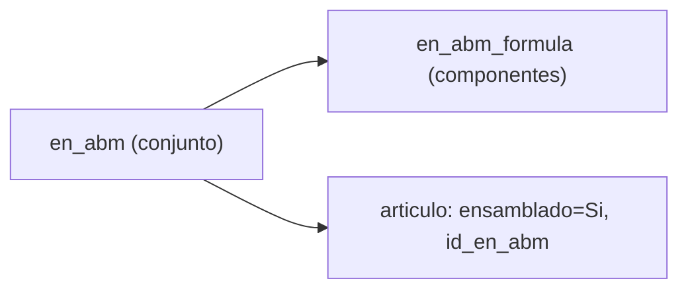

# Pack y componente en MPR — Identificación en datos e implementación

Documento de referencia para **usuarios avanzados**, soporte e implementación. Explica cómo Synap distingue el **pack** (producto terminado / línea de demanda) del **componente** (insumo de receta o de armado surtido) en AdministraNET y en tablas Synap.

**Relacionados:** [MANUAL_USUARIO_MPR.md](MANUAL_USUARIO_MPR.md) (§ Pack y componentes), [GLOSARIO_MPR.md](GLOSARIO_MPR.md), [MPR_ARMADO_STOCK_COMPONENTES.md](MPR_ARMADO_STOCK_COMPONENTES.md), [SDD_ARMADO_SURTIDO_MVP.md](SDD_ARMADO_SURTIDO_MVP.md), [SCHEMA_MPR_ADMINISTRANET92.md](SCHEMA_MPR_ADMINISTRANET92.md).

---

## 1. Idea central

En la tabla **`articulo`** de AdministraNET **no existe** un campo único del tipo `es_pack` / `es_componente` válido para todos los flujos MPR.

| Rol en negocio | Dónde se define según el flujo |
|----------------|--------------------------------|
| **Pack** (terminado a fabricar / armar) | Depende del proceso: `articulo` + BOM, línea OPT, o config Synap |
| **Componente** (insumo que sale de un depósito) | Receta `en_abm_formula`, explosión BOM, o composición manual (armado surtido) |

El mismo `IDArt` puede ser pack en un contexto y componente en otro (p. ej. un semi que es componente de un pack mayor).

---

## 2. Campos de `articulo` relevantes para MPR

Referencia completa: [docs/general/tablas/articulo.md](../general/tablas/articulo.md).

| Campo | Tipo | Rol en MPR |
|-------|------|------------|
| **IDArt** | INT PK | Identificador en todos los movimientos y listas |
| **CodigoArticulo / CodigoArticuloT** | INT / VARCHAR | Código mostrado en pantallas |
| **NombreArticulo** | VARCHAR | Descripción |
| **ensamblado** | VARCHAR | `'Si'` → artículo **resultado** de un armado con lista de materiales (pack BOM) |
| **id_en_abm** | DOUBLE | Enlace al **conjunto** (`en_abm`) / receta |
| **cantidad_promedio_bulto** | DECIMAL | Unidades por bulto para mostrar **docenas · unidades** del pack en OPT/armado (no define pack vs componente) |
| **stock_reserva** | DECIMAL | Colchón de reserva en **demanda del terminado** (ventana pack); no es rol BOM |
| **Lote** | VARCHAR | `'Si'` → consumo **FIFO por lote** en armado (BOM y surtido) |
| **multiplicador_vta** | DECIMAL | Presentación comercial (legacy); MPR usa sobre todo `cantidad_promedio_bulto` |

**No usar como discriminador pack/componente:** `stock_reserva`, `cantidad_promedio_bulto`, `Lote`, categorías de artículo genéricas (salvo criterio de negocio fuera de MPR).

---

## 3. Tres formas de identificar el pack

### 3.1 Armado con lista de materiales (BOM)

| Elemento | Tabla / criterio |
|----------|------------------|
| **Conjunto / receta** | `en_abm` (`id_en_abm`, `nombre_en_abm`, `descuenta_en` = Mstock para armado MPR) |
| **Pack (producto armado)** | `articulo` con **`ensamblado = 'Si'`** y **`id_en_abm`** = ese conjunto |
| **Componentes** | Filas en **`en_abm_formula`** (`id_articulo`, `cantidad_articulo`, …) por `id_en_abm` |

Synap resuelve el pack con `get_articulo_armado_por_bom` / `bulk_articulo_armado` (`mpr/services.py`). Los componentes **no** necesitan `ensamblado = 'Si'`; basta con figurar en la fórmula.

**Mantenimiento:** Lista de materiales MPR → editar conjunto → asignar **artículo armado** y alta de **componentes**.

### 3.2 Demanda y OPT (pedido de producción)

Aquí **pack** es el artículo de la **línea de producción**, no necesariamente `ensamblado = 'Si'`.

| Elemento | Tabla / criterio |
|----------|------------------|
| **Pack en la OPT** | `lista_produccion_agrupada.id_articulo` (cantidades en unidades pack: `cantidad_pedida`, `cantidad_pendiente_prod`) |
| **¿Tiene receta?** | `articulo.id_en_abm` no nulo (armado OPT exige además `ensamblado = 'Si'` vía `bulk_id_en_abm`) |
| **Componentes en UI** | Explosión de `en_abm_formula` del `id_en_abm` del pack (ventana Unidades, OPP, liberación OPT) |

En **movimientos de stock**, OPT y OPP registran salidas/entradas de **componentes** (explosión BOM), aunque la demanda se exprese en packs.

Ver [MPR_ARMADO_STOCK_COMPONENTES.md](MPR_ARMADO_STOCK_COMPONENTES.md).

### 3.3 Armado surtido (composición libre)

No usa `ensamblado` ni `en_abm_formula` para definir el pack ni los componentes.

| Elemento | Tabla / criterio |
|----------|------------------|
| **Pack terminado** | **`articulo.tipo_art_fab = 'Fabricado 2da'`** (catálogo AdministraNET) |
| **Componentes** | Los que el operario elige en pantalla (artículos con saldo en depósito origen); persistencia en **`mpr_mprarmadosurtidolinea`** |

**Alta de packs en el selector:** asignar `tipo_art_fab = 'Fabricado 2da'` al artículo en la tabla **`articulo`** de AdministraNET.

El modelo Synap `MprArticuloArmadoSurtido` y el comando `mpr_cargar_packs_armado_surtido` quedan como legado; el selector ya no depende de ellos.

Pantalla: `/mpr/armado-surtido/` · Servicio: `ejecutar_armado_surtido` · SDD: [SDD_ARMADO_SURTIDO_MVP.md](SDD_ARMADO_SURTIDO_MVP.md).

---

## 4. Resumen comparativo

| Flujo | Pack | Componente |
|-------|------|--------------|
| **Lista de materiales / Armado BOM** | `articulo.ensamblado='Si'` + `id_en_abm` | `en_abm_formula` |
| **Ventana demanda / OPT** | `lista_produccion_agrupada.id_articulo` | Explosión BOM (`en_abm_formula`) |
| **OPP** | Cantidades en pack (UI); movimiento en **componentes** | Misma explosión BOM |
| **Armado OPT** | Línea OPT con BOM (`get_lineas_armado_opt`) | Stock componentes en Semi elaborado |
| **Armado surtido** | `articulo.tipo_art_fab = 'Fabricado 2da'` | Composición manual + `MprArmadoSurtidoLinea` |

---

## 5. Implementación en código (Synap)

| Función / artefacto | Uso |
|---------------------|-----|
| `bulk_id_en_abm(base, ids_articulos)` | Mapa pack → `id_en_abm`; por defecto solo `ensamblado='Si'` |
| `bulk_bom_detalle` / `get_bom_detalle` | Componentes por conjunto |
| `get_articulo_armado_por_bom` | Pack (`IDArt`) asociado a un `id_en_abm` |
| `bulk_cantidad_promedio_bulto` | Divisor docenas en presentación pack |
| `articulo_habilitado_armado_surtido` | Pack surtido permitido |
| `listar_packs_armado_surtido` | Selector de packs en UI surtido |
| `ejecutar_armado` | Armado BOM (componentes + entrada pack) |
| `ejecutar_armado_surtido` | Armado surtido; FIFO lote si `articulo.Lote='Si'` |

**Modelos Django (solo surtido):** `mpr/models.py` — `MprArticuloArmadoSurtido`, `MprArmadoSurtidoMovimiento`, `MprArmadoSurtidoLinea`.

**Vistas:** `ArmadoSurtidoView`, `ArmadoOptView`, `BomEditView`, `OptDetailView` (enlace armado surtido con `?id_lista=`).

**Tests:** `mpr/tests/test_armado_surtido.py` (validaciones); `mpr/tests/test_presentacion_docenas_unidades.py` (bulto/docenas).

---

## 6. Checklist de configuración (operaciones / datos)

### Pack con receta (armado BOM y OPT)

1. Crear conjunto en **`en_abm`** (Lista de materiales MPR).
2. Cargar **componentes** en **`en_abm_formula`**.
3. En **`articulo`**, el producto terminado: **`ensamblado = 'Si'`**, **`id_en_abm`** = ID del conjunto.
4. Verificar **`descuenta_en`** del conjunto compatible con armado MPR (Mstock).
5. Configurar depósitos MPR (`tipo_mpr`: Producción, SemiElaborado, Terminado, etc.).

### Pack armado surtido

1. El artículo debe existir en **`articulo`** (`IDArt`) con **`tipo_art_fab = 'Fabricado 2da'`**.
2. Tener stock de **componentes** en depósito origen (típ. 2.ª selección) y depósito **Terminado** configurado.

### Errores frecuentes por mala identificación

| Síntoma | Causa probable |
|---------|----------------|
| No aparece armado desde OPT | Pack sin `id_en_abm` / sin BOM o sin `ensamblado='Si'` |
| «No hay artículo armado asociado a este conjunto» | Falta asignar artículo armado en edición del conjunto |
| Pack no listado en armado surtido | El artículo no tiene `tipo_art_fab = 'Fabricado 2da'` |
| Máx. armable = Sin stock | Componentes sin saldo en Semi elaborado (OPP no distribuyó) |
| Pack no aparece en tablero Armado 1ra | `max_armable = 0` (sin stock Semi armable); no es por falta de demanda PED desde 05/08/2026 |
| Stock en lotes insuficiente | Componente con `Lote='Si'` y saldo FIFO insuficiente |

---

## 7. Historial del documento

| Fecha | Cambio |
|-------|--------|
| 01/06/2026 | Documento inicial: criterios pack/componente por flujo MPR, campos `articulo`, implementación y checklist. |
| 05/08/2026 | Tablero Armado 1ra: aparición por `max_armable > 0`; demanda PED ya no excluye. |
