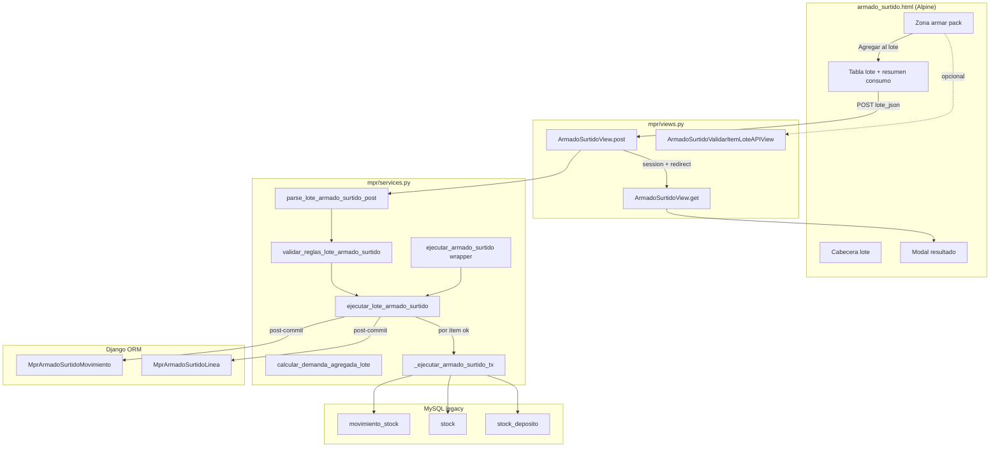

# Diseño técnico — Armado surtido multi-pack (lote / carrito)

**Change:** `mpr-armado-surtido-multi-lote`  
**Especificación:** [SPEC_ARMADO_SURTIDO_MULTI_LOTE.md](SPEC_ARMADO_SURTIDO_MULTI_LOTE.md)  
**SDD:** [SDD_ARMADO_SURTIDO_MULTI_LOTE.md](SDD_ARMADO_SURTIDO_MULTI_LOTE.md)  
**Código base:** `mpr/services.py` (`ejecutar_armado_surtido`, ~8809+), `mpr/views.py` (`ArmadoSurtidoView`), `mpr/templates/mpr/armado_surtido.html`

---

## 1. Enfoque técnico

Extender la pantalla existente con estado **cliente** (Alpine.js) para el carrito y un **orquestador de lote** en servidor que:

1. Valida reglas de negocio del lote (sin MySQL).
2. Ejecuta cada ítem en **orden FIFO** con **commit independiente** por ítem exitoso.
3. Reutiliza la lógica transaccional del MVP mediante refactor a `_ejecutar_armado_surtido_tx`.
4. Devuelve resultado parcial; la vista persiste en **sesión** y re-renderiza modal + carrito reducido a fallidos.

**No** se introduce tabla Django `MprArmadoSurtidoLote` en esta fase: cada ítem exitoso sigue generando su `MprArmadoSurtidoMovimiento` (1:1 con MSTOCK).

---

## 2. Arquitectura



---

## 3. Refactor `ejecutar_armado_surtido`

### 3.1 Extracción

**Nueva firma interna:**

```python
def _ejecutar_armado_surtido_tx(
    cursor,
    conn,
    base_empresa: str,
    id_usuario: int,
    id_articulo_pack: int,
    cantidad_packs: int,
    deposito_origen: int,
    deposito_destino: int,
    lineas_composicion: List[Dict[str, Any]],
    *,
    id_operario: Optional[int] = None,
    id_lista_produccion: Optional[int] = None,
    detalle: Optional[str] = None,
    reservar_codmov: bool = True,
) -> Tuple[bool, Optional[int], Optional[str], Optional[str], List[Dict[str, Any]]]:
    """
    Misma semántica que ejecutar_armado_surtido pero sobre cursor/conn abiertos.
    reservar_codmov=True: incrementa codmov + talonario (comportamiento actual).
    Devuelve además lineas_enriquecidas para guardar_composicion_armado_surtido.
    """
```

**`ejecutar_armado_surtido` público:** abre conexión, llama `_ejecutar_armado_surtido_tx`, commit/rollback, luego `guardar_composicion_armado_surtido` (ORM Django fuera del cursor MySQL, como hoy).

### 3.2 Commit por ítem en lote

`ejecutar_lote_armado_surtido`:

```text
exitosos = []
fallidos = []
for idx, item in enumerate(armados):
    conn = get_connection(base_empresa)
    conn.autocommit(False)
    try:
        ok, cod, nro, err, lineas_enc = _ejecutar_armado_surtido_tx(...)
        if not ok:
            conn.rollback()
            fallidos.append({...item, error: err})
            continue
        conn.commit()
        guardar_composicion_armado_surtido(...)  # Django, post-commit MySQL
        exitosos.append({...})
    except Exception as e:
        conn.rollback()
        fallidos.append({...item, error: str(e)})
    finally:
        conn.close()  # o devolver al pool
return {"exitosos": exitosos, "fallidos": fallidos}
```

**Importante:** cada ítem exitoso consume `codmov` y talonario **secuencialmente**; el ítem *k+1* ve stock ya actualizado por ítems 1…*k* (coherente con D5 parcial y FIFO).

**Alternativa descartada:** una sola conexión con savepoints — más frágil ante `guardar_composicion_armado_surtido` en ORM y rollback parcial en MySQL legacy.

---

## 4. Servicios nuevos (`mpr/services.py`)

| Función | Entrada | Salida | MySQL |
|---------|---------|--------|-------|
| `calcular_demanda_agregada_lote(armados)` | lista ítems | `Dict[int, Decimal]` | No |
| `calcular_demanda_item_lote(item)` | un ítem | `Dict[int, Decimal]` | No |
| `validar_reglas_lote_armado_surtido(armados)` | lista | `(ok, msg)` | No |
| `_ids_pack_y_componentes_lote(armados)` | lista | `(packs, componentes, cruce)` | No |
| `validar_stock_agregado_lote(base, dep, armados, item_extra=None)` | lote ± candidato | `(ok, conflictos[])` | Sí (lectura) |
| `parse_lote_armado_surtido_post(request)` | HttpRequest | `(cabecera, armados)` o error | No |
| `ejecutar_lote_armado_surtido(...)` | cabecera + armados | §4.5 spec | Sí (escritura) |

### 4.1 Reglas en `validar_reglas_lote_armado_surtido`

- `len(armados) >= 1` (solo al ejecutar; agregar valida en cliente).
- `len(armados) <= 20`.
- `id_articulo_pack` únicos en el lote.
- Por ítem: `validar_datos_armado_surtido` (reutilizar).
- Cruce pack/componente: unión de todos los packs vs todos los componentes del lote; intersección no vacía → error.
- Pack distinto del propio componente en la misma línea (ya cubierto por MVP si aplica).

### 4.2 Demanda agregada

```python
def calcular_demanda_agregada_lote(armados: List[Dict]) -> Dict[int, Decimal]:
    demanda: Dict[int, Decimal] = {}
    for item in armados:
        packs = int(item["cantidad_packs"])
        for ln in item["lineas"]:
            id_a = int(ln["id_articulo"])
            qty = int(ln["cantidad_por_pack"]) * packs
            demanda[id_a] = demanda.get(id_a, Decimal(0)) + Decimal(qty)
    return demanda
```

### 4.3 Validación stock al agregar (API / servidor)

`validar_stock_agregado_lote`:

1. `demanda = calcular_demanda_agregada_lote(lote_actual + [item_candidato])`.
2. Para cada `id_art` en demanda, `SELECT saldo FROM stock_deposito … FOR UPDATE` **solo lectura** (sin lock prolongado en GET) o lectura simple en API GET.
3. Comparar `demanda[id] > saldo` → conflicto con código/descripción desde `_fetch_articulos_map`.

En **ejecución**, `_ejecutar_armado_surtido_tx` ya valida stock con `FOR UPDATE` (MVP).

---

## 5. Vista y sesión

### 5.1 POST `ArmadoSurtidoView`

```python
def post(self, request):
    cabecera, armados = parse_lote_armado_surtido_post(request)
    if error_parse:
        messages.error(...)
        return redirect(...)

    ok_reg, msg_reg = validar_reglas_lote_armado_surtido(armados)
    if not ok_reg:
        messages.error(request, msg_reg)
        return redirect(...)

    if id_lista := cabecera.get("id_lista_produccion"):
        ok_opt, msg_opt = opt_puede_armado_surtido(base, id_lista)
        ...

    resultado = ejecutar_lote_armado_surtido(base, id_usuario, cabecera, armados)
    request.session["armado_surtido_resultado_lote"] = resultado
    request.session["armado_surtido_lote_fallidos"] = [
        item_para_rehidratar_carrito(f) for f in resultado["fallidos"]
    ]

    n_ok = len(resultado["exitosos"])
    n_fail = len(resultado["fallidos"])
    messages.success/warning(...)

    return redirect(f"{reverse('mpr:armado_surtido')}{q}")
```

### 5.2 GET — modal y carrito fallidos

`get_context_data`:

```python
resultado = self.request.session.pop("armado_surtido_resultado_lote", None)
fallidos = self.request.session.pop("armado_surtido_lote_fallidos", None)
context["resultado_lote_json"] = json.dumps(resultado) if resultado else "null"
context["lote_fallidos_json"] = json.dumps(fallidos) if fallidos else "null"
context["mostrar_modal_resultado_lote"] = bool(resultado)
```

Alpine al init: si `lote_fallidos_json` tiene datos, `lote = fallidos` (rehidratar carrito).

### 5.3 Unificación MVP → lote

**Decisión:** el formulario **siempre** envía `lote_json`. Flujo single-pack = carrito con un ítem agregado antes de ejecutar, **o** botón «Ejecutar» que auto-agrega el ítem en curso si hay pack/composición válidos (UX a definir en apply — preferencia: obligar «Agregar al lote» para claridad).

**Migración:** eliminar POST legacy `id_articulo_pack` + `comp_*` sueltos tras unificar template.

---

## 6. UI (Alpine)

### 6.1 Estado

```javascript
{
  // Cabecera (existente, movida arriba)
  depositoOrigen, depositoDestino, operarioId, detalleLote,
  // Armar pack (existente)
  packId, cantidadPacks, lineas, ...
  // Nuevo
  lote: [],           // [{ id_articulo_pack, codigo, descripcion, cantidad_packs, lineas, _uid }]
  editandoUid: null,  // fila en edición
  resumenConsumo: [], // [{ id_articulo, codigo, descripcion, total, saldo }]
  modalResultado: { open: false, exitosos: [], fallidos: [] },
}
```

### 6.2 Métodos clave

| Método | Acción |
|--------|--------|
| `agregarAlLote()` | Valida cabecera + pack + RF2–RF4; push/update `lote`; `recalcularResumen()`; limpia armar pack |
| `editarItemLote(uid)` | Carga en formulario; splice del lote |
| `quitarItemLote(uid)` | splice; recalcular |
| `recalcularResumen()` | `calcular_demanda_agregada_lote(lote)` + saldos cacheados API |
| `syncLoteHidden()` | Escribe `lote_json` en hidden antes de submit |
| `abrirModalResultado()` | Desde contexto Django al load |

### 6.3 Include modal

Nuevo archivo: `mpr/templates/mpr/includes/armado_surtido_modal_resultado_lote.html`  
Patrón: overlay + panel (`rounded-2xl`, tablas éxito/fallo), botón Cerrar. Referencia visual: modal comprobante OPT.

---

## 7. API GET validación (opcional P1)

**Ruta:** `mpr/urls.py` → `path("api/armado-surtido/validar-item-lote/", …)`

**View:** `ArmadoSurtidoValidarItemLoteAPIView` — parse query JSON, llama `validar_stock_agregado_lote`, JsonResponse §7 spec.

---

## 8. Archivos a modificar

| Archivo | Cambio |
|---------|--------|
| `mpr/services.py` | Refactor TX + funciones lote |
| `mpr/views.py` | POST lote, GET contexto sesión, API validar |
| `mpr/urls.py` | Ruta API |
| `mpr/templates/mpr/armado_surtido.html` | Carrito Alpine, cabecera, botones |
| `mpr/templates/mpr/includes/armado_surtido_modal_resultado_lote.html` | **Nuevo** |
| `mpr/tests/test_armado_surtido_lote.py` | **Nuevo** — unit servicios |
| `docs/mpr/*` | Manual post-implementación |

**Sin cambios:** modelos Django (`MprArmadoSurtidoMovimiento`, `MprArmadoSurtidoLinea`), catálogo MySQL legacy, `opt_puede_armado_surtido`.

---

## 9. Decisiones de arquitectura

| Decisión | Elección | Rechazada | Motivo |
|----------|----------|-----------|--------|
| Transacción lote | Commit **por ítem** | Una TX global | D5 parcial; no revertir MSTOCK OK |
| Persistencia lote UI post-error | Sesión `lote_fallidos` | Re-POST fallidos | Rehidratar carrito tras redirect |
| Payload | `lote_json` hidden | Solo campos indexados | Menos parsing frágil |
| Composición Synap | Post-commit ORM por ítem | Dentro cursor MySQL | Patrón MVP actual |
| API validar | GET opcional P1 | Solo cliente | Cliente rápido; servidor autoritativo al ejecutar |

---

## 10. Riesgos

| Riesgo | Mitigación |
|--------|------------|
| Race entre operarios en mismo depósito | `FOR UPDATE` en ejecución por ítem; mensaje claro en modal |
| JSON malformado POST | `parse_lote_armado_surtido_post` con try/except + mensaje |
| Sesión grande | Truncar labels en fallidos; max 20 ítems |
| Regresión MVP | `ejecutar_armado_surtido` wrapper + tests existentes |

---

## 11. Rollback

Revertir commits en `services.py`, `views.py`, template: vuelve flujo single-pack MVP (sin carrito).

---

Lista de tareas: [TASKS_ARMADO_SURTIDO_MULTI_LOTE.md](TASKS_ARMADO_SURTIDO_MULTI_LOTE.md) → `sdd-apply`.
