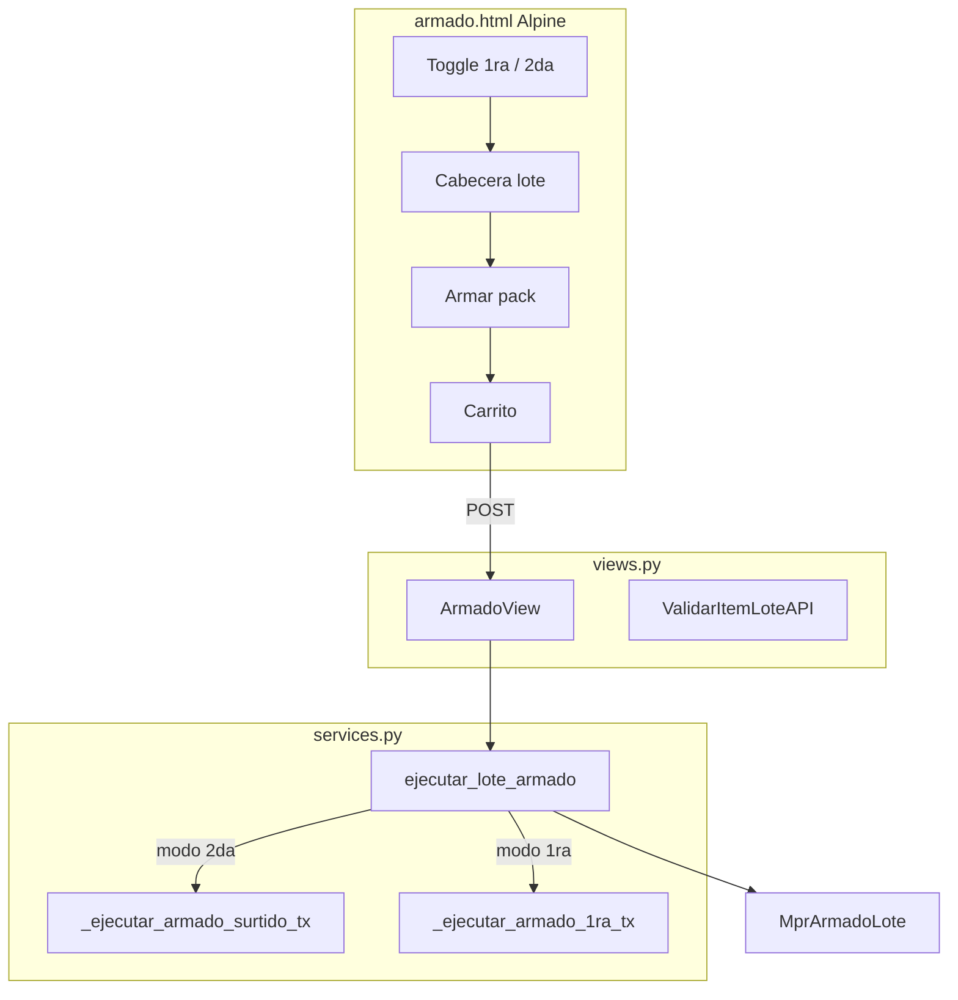

# Diseño técnico — Armado unificado 1ra/2da e imputación supervisor

**Change:** `armado-unificado-imputacion-1ra`  
**Especificación:** [SPEC_ARMADO_UNIFICADO_IMPUTACION.md](SPEC_ARMADO_UNIFICADO_IMPUTACION.md)  
**SDD:** [SDD_ARMADO_UNIFICADO_IMPUTACION.md](SDD_ARMADO_UNIFICADO_IMPUTACION.md)  
**OpenSpec design:** `openspec/changes/armado-unificado-imputacion-1ra/design.md`  
**Código base:** `mpr/views.py` (`ArmadoSurtidoView`, `ArmadoOptView`), `mpr/services.py`, `mpr/models.py`, `mpr/templates/mpr/armado_surtido.html`

---

## 1. Enfoque técnico

Evolucionar armado surtido multi-lote en **vista unificada** con discriminador `modo`. Fase A concentra UI + TX 1ra/2da + deprecación OPT. Fase B añade imputación supervisor desacoplada del flujo operario.

---

## 2. Arquitectura (Fase A)



---

## 3. Armado 1ra — TX

Nueva función `_ejecutar_armado_1ra_tx` paralela a surtido:

1. Validar pack `ensamblado=Si` e `id_en_abm`.
2. Cargar BOM; rechazar si composición POST ≠ BOM (anti-tamper).
3. Validar stock componentes en **Semi** (misma lógica consumo que surtido).
4. Entrada pack **Terminado 1.ª** en destino.
5. Historial `lista_produccion_historico` tipo OPA **sin** `id_lista_produccion` obligatorio.
6. Post-commit Synap: `MprArmadoMovimiento` con `modo=1ra`, `estado_imputacion=pendiente`.

Reutilizar helpers: `_mpr_consumir_salida_componente_surtido`, `_mpr_insert_renglon_stock_armado`, talonario MSTOCK.

**Catálogo 1ra:** `listar_packs_armado_1ra(base_empresa)` — SQL similar a `listar_packs_armado_surtido` filtrando `ensamblado='Si'` y BOM no vacío.

**Max packs:** adaptar `get_lineas_armado_opt` sin `id_lista`: función `calcular_max_packs_armado_1ra(base_empresa, id_pack, deposito_semi)`.

---

## 4. Vista unificada

| Aspecto | Implementación |
|---------|----------------|
| Template | Renombrar/evolucionar `armado_surtido.html` → `armado.html` |
| Context | `modo`, `packs_catalog_json`, depósitos default por modo |
| Alpine | Prop `modo`; watcher vacía carrito; labels «Armado 1ra» / «Armado 2da» |
| Composición 1ra | Tabla read-only BOM; ocultar búsqueda libre componentes |
| Composición 2da | Comportamiento actual |
| POST | `parse_lote_armado_post` incluye `modo`; validar coherencia origen |

---

## 5. Modelos Django (migración)

```python
class MprArmadoLote(models.Model):
    id = models.UUIDField(primary_key=True, default=uuid.uuid4)
    base_empresa = models.CharField(max_length=64, db_index=True)
    modo = models.CharField(max_length=3, choices=[("1ra", "1ra"), ("2da", "2da")])
    id_operario = models.IntegerField(null=True)
    id_usuario = models.IntegerField()
    deposito_origen = models.IntegerField()
    deposito_destino = models.IntegerField()
    ejecutado_en = models.DateTimeField(auto_now_add=True)
    cantidad_exitosos = models.IntegerField(default=0)
    cantidad_fallidos = models.IntegerField(default=0)

# MprArmadoSurtidoMovimiento → rename o proxy MprArmadoMovimiento
# + modo, id_lote_armado FK, estado_imputacion (1ra only)
```

Data migration: filas existentes → `modo='2da'`, `estado_imputacion='na'`.

---

## 6. Imputación (Fase B)

### Servicios

| Función | Rol |
|---------|-----|
| `listar_mstock_pendientes_imputacion` | JOIN Synap movimiento + legacy movimiento_stock tipo Armado |
| `sugerir_imputacion_fifo` | `listar_detalle_pedidos_por_articulo` / demanda abierta |
| `confirmar_imputacion_armado` | TX: insert Synap + UPDATE detalle/agrupada |

### Vista

- `ImputacionArmado1raView` (List + POST confirm).
- Template: filtros, acordeón por `MprArmadoLote`, filas MSTOCK, panel sugerencia FIFO.
- Decorador/mixin: `@requiere_permiso_imputacion_armado_1ra`.

### Estado imputación MSTOCK

- `pendiente`: 0 imputado.
- `parcial`: 0 < imputado < armado.
- `completo`: imputado = armado.
- 2da: `na` o null.

---

## 7. Deprecación

| Artefacto | Acción |
|-----------|--------|
| `ArmadoOptView` | Redirect 302 permanent-ish a `armado?modo=1ra` |
| `ArmadoSurtidoView` | Alias → `ArmadoView` con default `modo=2da` |
| `opt_puede_armado_surtido` | Eliminar llamadas GET/POST |
| `opt_detail` tarjetas | Eliminar bloque `mostrar_tarjeta_armado_surtido` |
| `estado_acciones_opt` | Líneas 1244-1261: quitar `hay_restante_armar` de `puede_cerrar` |
| Wizard paso 4 | Reemplazar formulario por card enlace menú |

---

## 8. Tests

| Módulo | Casos |
|--------|-------|
| `test_armado_unificado_modo.py` | Mezcla rechazada, BOM 1ra, redirect legacy |
| `test_armado_unificado_lote_1ra.py` | Parcial stock semi |
| `test_imputacion_armado_1ra.py` | FIFO, límite cantidad, 403, exclusión 2da |
| `test_estado_acciones_opt_cierre.py` | Cerrar sin armado |

Ejecutar: `docker exec Synap_app python manage.py test mpr.tests.test_armado_unificado ...`

---

## 9. Rollout

1. Deploy Fase A (armado unificado + redirects).
2. Capacitación naming Armado 1ra/2da.
3. Deploy Fase B (imputación) en staging con supervisor piloto.
4. Actualizar `MANUAL_USUARIO_MPR.md` y `FUENTE_VERDAD_UI_REPORTES_MPR.md`.

---

## 10. Open questions

- Permiso imputación: reutilizar flag MPR existente vs codename nuevo.
- KPI tablero: fase C vs quick win en Fase B.
