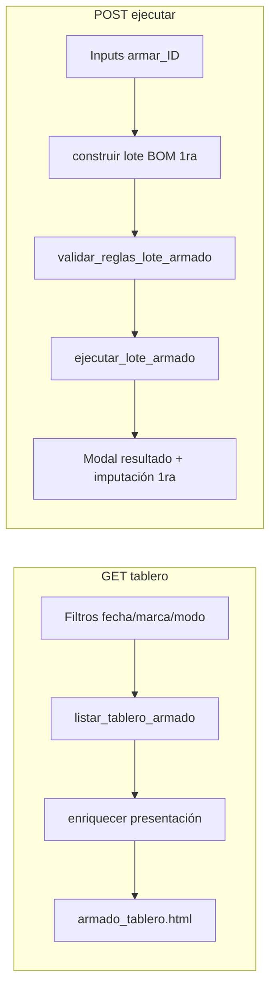

# Diseño UX/UI — Armado tabla (alineación PCP Armado)

**Rol:** Product Design  
**Fecha:** 07/07/2026  
**Estado:** En implementación (fase 1 — Armado 1ra)  
**Planilla referencia:** `Best Sox/PCP20130321.xlsx` → hojas **PCP Armado** y **Resumen Armado**  
**Canon Synap:** `docs/general/FUENTE_VERDAD_UI_REPORTES_MPR.md`, `docs/mpr/DISENO_TABLERO_PRODUCCION_REFACTOR_PCP.md`  
**Negocio:** `docs/mpr/BEST_SOX_GAP_PROCESOS_Y_CALCULOS.md` §4.4  

---

## 1. Objetivo de experiencia

El operario de armado abre una **grilla densa** (como Tablero de producción / Parte / Control de calidad) para responder en segundos:

1. **¿Qué packs debo armar?** → columna **Resta armar** (brecha pedido + seguridad − stock terminado).
2. **¿Cuánto puedo armar hoy?** → **Máx. armable** (1ra: cuello de botella BOM en Semi).
3. **¿Cuánto armo ahora?** → input **Armar** por fila + acción masiva **Ejecutar armado**.

La pantalla sustituye el flujo POS+carrito como **vista principal** (`vista=tablero`, default). El POS se conserva en `?vista=pos` para Armado 2da con composición libre.

---

## 2. Análisis PCP Excel

### 2.1 Hoja PCP Armado (operativa)

| Col Excel | Campo | Fórmula / origen | Equivalente MPR |
|-----------|-------|------------------|-----------------|
| A | Marca | Catálogo artículo | `marca_nombre` / filtro marcas |
| B | Código | Agrupador comercial | `codigo_grupo` (opcional fase 2) |
| C–D | Id / Artículo pack | Lista artículos terminados | `id_articulo`, `codigo_manual`, descripción |
| E | 1er fecha entrega | `MIN(comp_ped.FechaEntrega)` en PED pendientes del pack | `primera_fecha_entrega` (dd/MM/yyyy) |
| F | Pedido | Snapshot demanda | `pedido_pares` desde PED |
| G | UM | uni (= par Best Sox) | Pares / docenas toggle |
| H | Stock terminado | Depósito PT | `stock_terminado` |
| I | Stock de seguridad | MCSS / reserva | `stock_reserva` (`articulo.stock_reserva`) |
| J | Urgente | `MAX(0, Pedido − Stock terminado)` | `resta_urgente` |
| K | Urgente docenas | J ÷ 12 | presentación docenas |
| L | **Resta armar** | `MAX(0, Pedido + MCSS − Stock terminado)` | `resta_armar` (= `cantidad_a_fabricar` demanda pack) |
| M | Docenas | L ÷ divisor bulto | `resta_armar_docenas_pcp` |
| N– | Colores / Resta Prod | VLOOKUP a PCP Producción (PP) | **Fuera de alcance fase 1** (informativo futuro) |

**Validación numérica (snapshot):** fila con Pedido=1084, Stock=1017, MCSS=720 → Urgente=67, Resta armar=787 (= 1084+720−1017).

### 2.2 Hoja Resumen Armado (agregado)

- Pivot **Resta armar en docenas** por Marca + Código + variantes de artículo.
- Totales por código (`Total 3000 Logo Prog Crew`).
- **Fase 2:** pestaña o enlace «Resumen» en hub Armado; fase 1 solo grilla operativa.

---

## 3. Decisiones de producto (cerradas)

| # | Decisión |
|---|----------|
| 1 | **Vista principal:** grilla tabla en `/mpr/armado/?vista=tablero` (default). |
| 2 | **POS legacy:** `?vista=pos` — carrito actual; obligatorio para **2da composición libre**. |
| 3 | **Modo 1ra / 2da:** toggle existente (verde / ámbar); misma URL, distinto origen y elegibilidad. |
| 4 | **Fase 1 ejecución masiva:** solo **Armado 1ra** desde tabla (BOM fija). |
| 5 | **Fase 1 Armado 2da en tabla:** listado demanda + enlace «Componer» → `?vista=pos&id_articulo=` (sin input masivo). |
| 6 | **Unidad:** pares enteros; docenas = pares ÷ 12 redondeado (mismo toggle que tablero). |
| 7 | **Filtro default:** «Solo con resta» (`resta_armar > 0`), análogo a «Solo urgentes» del tablero. |
| 8 | **Input Armar sin precarga:** vacío al abrir; el analista completa solo las filas necesarias. Deshabilitado si `max_armable = 0`. Negativos no permitidos (UI + backend). |
| 9 | **Sin operario** en cabecera (paridad decisión previa armado unificado). |
| 10 | **Shell visual:** `slate-800` hero + acento **emerald** (1ra) / **amber** (2da), no `gray-*` legacy. |
| 11 | **Columnas visibles (29/07/2026):** Artículo, Terminado, Máx. armable, Armar. Ocultas: fecha entrega, Pedido, Reserva, Resta urgente, Resta armar. |
| 12 | **Chrome (30/07/2026):** botón **Actualizar** (naranja Synap `bg-orange-500`) recarga la grilla con los filtros actuales. El atajo **Carrito** del chrome queda **deprecado**; Armado 2da sigue abriendo POS vía **Componer**. |
| 13 | **Máx. armable (30/07/2026):** el mínimo BOM debe conservar componente con stock 0 (no usar `0` como centinela). Caso: pack 907953-01 / IDArt 637 — componente 984 en Semi = 0 → máx. armable 0. |
| 14 | **Resultado post-armado:** éxito/error solo en **modal Synap** (detalle grabados + fallos); sin toast Django duplicado. Payload vía `json_script` para no romper Alpine/HTML. |
| 13 | **Resultado de ejecución (30/07/2026):** éxito, parcial y error se informan únicamente en el modal Synap de resultado; no se duplican como toast. El JSON de resultado se entrega mediante `json_script`, no dentro de un atributo HTML. |

---

## 4. Arquitectura de información (columnas)

```
┌─────────────┬───────────┬──────────────┬────────┐
│  Artículo   │ Terminado │ Máx. armable │ Armar  │
└─────────────┴───────────┴──────────────┴────────┘
  sticky-left     pares      packs (1ra)    input vacío
```

| Columna | Rol UX | 1ra | 2da |
|---------|--------|-----|-----|
| Artículo | Identidad + marca | ✓ | ✓ |
| Stock terminado | PT actual (saldo real; negativos visibles en rosa, sin clamp a 0) | ✓ | ✓ |
| Máx. armable | Tope físico origen | BOM × Semi | — (fase 2) |
| Armar | Input packs (sin precarga) | entero ≥ 0 | enlace POS |

Columnas de demanda (Pedido, Reserva, Resta urgente/armar, 1er fecha entrega) se calculan en backend para filtrar elegibilidad pero **no** se muestran en la grilla operativa.

Vacío o 0 en Armar = la fila no se incluye en el lote. Negativos se rechazan (coerce a vacío en UI; `qty <= 0` en POST).

★ Interno: Resta armar = `max(0, pedido + reserva − stock_terminado)` — sigue usándose para el filtro «solo con resta». Si `stock_terminado` es negativo, aumenta la resta (el saldo real se muestra en Terminado).

★ Presentación (30/07/2026): `stock_terminado` en Armado usa `clamp_negativos=False` (`mpr/presentacion_operativa.py`), paridad Inventario Stock.

★ Capacidad (30/07/2026): Máx. armable es el mínimo entre todos los componentes BOM. Un componente con saldo `0` fija el máximo en `0`; no puede ser reemplazado por un componente posterior con saldo positivo.

---

## 5. Flujos



---

## 6. Fases de entrega

| Fase | Alcance |
|------|---------|
| **1 (actual)** | Servicio `listar_tablero_armado`, template tabla, POST 1ra, docs, tests unitarios presentación. |
| **2** | Resumen Armado (pivot docenas por código/marca), fecha entrega, columnas PP color. |
| **3** | Armado 2da: plantillas composición o fila expandible en tabla. |
| **4** | KPI cabecera totales docenas (paridad I2/M2 del libro PCP). |

---

## 7. Referencias código

| Pieza | Ruta |
|-------|------|
| Servicio listado | `mpr/services.py` → `listar_tablero_armado` |
| Presentación | `mpr/presentacion_operativa.py` → `enriquecer_filas_tablero_armado` |
| Vista | `mpr/views.py` → `ArmadoSurtidoView` + `vista=tablero\|pos` |
| Template | `mpr/templates/mpr/armado_tablero.html` |
| Chrome UI | Misma barra densa `slate-800` que Tablero/Parte/CC ([TABLERO_PRODUCCION_CHROME_DENSIDAD.md](TABLERO_PRODUCCION_CHROME_DENSIDAD.md) §3.1); vista carrito (`armado_surtido.html`) conserva layout POS propio |
| Ejecución | `ejecutar_lote_armado` (sin cambios de contrato) |
