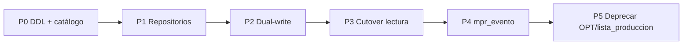

# Plan: MPR en MySQL — fuente única con AdministraNET

**Versión:** 1.1  
**Fecha:** 04/07/2026  
**Estado:** Propuesta / diseño (sin implementación)  
**Motivación:** Hoy el pipeline MPR nuevo (E7–E11) persiste ledgers operativos en **PostgreSQL** mientras el stock físico vive en **MySQL**. Eso rompe el principio de una sola fuente de verdad compartida con AdministraNET y complica auditoría, respaldo y futura convivencia con VB6 u otros lectores del esquema legacy.

---

## 1. Objetivos

| Objetivo | Criterio de éxito |
|----------|-------------------|
| **Fuente única** | Todo dato operativo MPR (envíos, partes, transiciones, turnos, armado surtido, config) reside en la **base MySQL de la empresa** (`base_empresa`). |
| **Nomenclatura** | Tablas `snake_case` con prefijo `mpr_` (ej. `MprEnvioProduccion` → `mpr_envio_produccion`). |
| **Identificadores** | PK **autonumérica** `BIGINT AUTO_INCREMENT` en cada tabla; códigos de negocio (`codigo_movimiento`, etc.) como columnas **adicionales**, no como PK. |
| **Integridad** | FK **físicas** entre tablas `mpr_*` del mismo cluster; FK hacia catálogos AdministraNET donde el motor y el esquema lo permitan (`articulo`, `deposito`, `movimiento_stock`, `comp_ped`, `sue_abm_empleado`). |
| **Charset** | `ENGINE=InnoDB DEFAULT CHARSET=utf8mb4 COLLATE=utf8mb4_unicode_ci` en todas las tablas nuevas MPR. |
| **Despliegue** | DDL idempotente vía catálogo `core/services/legacy_mysql_schema/catalog.py` + script `docs/mpr/sql/001_mpr_core_tables.sql` (mismo patrón que self-checkout). |
| **Acceso en Synap** | Repositorios con `get_connection(base_empresa)` / `mysql_cursor` — **no** ORM Django sobre alias `mysql` fijo (la BD cambia por sesión). |

### 1.1 Modelo de tenancy AdministraNET (importante)

**AdministraNET no es multiempresa dentro de una misma base MySQL.** Cada instalación tiene **una BD = una empresa** (ej. `administranet92`). No existen filas de distintas empresas conviviendo en las mismas tablas.

En Synap, `base_empresa` es solo el **selector de conexión**: indica a qué base MySQL conectarse según la sesión del usuario. **No debe persistirse** como columna en tablas `mpr_*` ni en configuración MPR en MySQL.

| Contexto | Rol de `base_empresa` |
|----------|------------------------|
| **Postgres (estado actual, incorrecto)** | Columna en modelos Django porque una sola BD central agrupa todas las empresas Synap. |
| **MySQL (objetivo)** | **Ausente** en el esquema. La empresa queda implícita en la BD conectada. |
| **Código Synap** | Parámetro de `get_connection(base_empresa)` / `mysql_cursor(base_empresa)` al invocar repositorios. |

Por eso la configuración MPR no se llama `mpr_empresa_config`: en MySQL es simplemente **`mpr_config`** (parámetros de la instalación, típicamente **una fila**).

---

## 2. Diagnóstico del estado actual

### 2.1 Dualidad Postgres / MySQL

| Capa | Ubicación actual | Problema |
|------|------------------|----------|
| Stock físico | MySQL: `movimiento_stock`, `stock`, `stock_deposito`, `deposito` | Correcto |
| Demanda / OPT legacy | MySQL: `lista_produccion_*`, `comp_ped`, `stockp` | Mezcla flujo viejo (OPT) con tablero nuevo |
| Ledgers E7–E11 | **Postgres**: `MprEnvioProduccion`, `MprParte*`, `MprTransicionLote`, turnos, armado surtido | **Fuera de AdministraNET** |
| Config MPR | **Postgres**: `mpr_empresa_config` + columna `base_empresa` | Anti-patrón: Synap multi-tenant en Postgres; en MySQL no aplica |
| OPT Synap obsoleto | Postgres `mpr_opt` / `mpr_opt_linea` (`managed=False`) | Ya deprecado; datos reales en `lista_produccion_agrupada` |

### 2.2 Consecuencias operativas

- Backup/restore de producción requiere **dos motores** para reconstruir un parte o un envío.
- Trazabilidad E8 (`id_lista_produccion = NULL`) **no** escribe en `lista_produccion_historico` ni en MySQL.
- Reportes y futuros lectores VB6 no ven envíos tablero ni partes por componente sin integración ad hoc.
- Tests usan Postgres (`TestCase`); entornos sin migrate en default fallan silenciosamente en CI parcial.

### 2.3 Patrón de referencia en Synap

Seguir el modelo **self-checkout**:

- DDL en `docs/mpr/sql/001_mpr_core_tables.sql`
- Proveedor en `PROVIDER_REGISTRY` (Archivo → Migración esquema MySQL)
- Acceso vía `mpr/db.py` + repositorios (SQL parametrizado, `administranet_types`)
- **Ninguna** tabla `mpr_*` lleva columna `base_empresa`: la conexión **ya** apunta a la única empresa de esa BD

---

## 3. Catálogo de tablas MySQL nuevas

Convenciones transversales:

- **Sin `base_empresa`** en ninguna tabla del cluster `mpr_*` (regla AdministraNET)
- PK: `id_<entidad> BIGINT NOT NULL AUTO_INCREMENT`
- Timestamps: `creado_en DATETIME NOT NULL DEFAULT CURRENT_TIMESTAMP`; `actualizado_en` donde aplique
- Montos/cantidades: `DECIMAL(15,2)` (alineado a `administranet_types`)
- VARCHAR de estado: valores acotados en comentarios + validación en servicios
- Índices compuestos para consultas del tablero, partes por fecha/turno, trazabilidad por artículo

### 3.1 Configuración

#### `mpr_config`

Reemplaza Postgres `mpr_empresa_config` / modelo `MprEmpresaConfig`. Nombre corregido: **no hay dimensión «empresa» en la tabla** — la BD entera es la empresa.

Patrón **singleton**: una fila por instalación (seed en el proveedor DDL: `INSERT … WHERE NOT EXISTS`). Opcional: forzar `id_mpr_config = 1` en aplicación.

| Columna | Tipo | Notas |
|---------|------|-------|
| `id_mpr_config` | BIGINT PK AI | |
| `bloquear_parte_supera_fabricando` | TINYINT(1) DEFAULT 1 | |
| `actualizado_en` | DATETIME ON UPDATE | |

Renombrado en código Synap (fase P1): `MprEmpresaConfig` → `MprConfig`; repositorio `mpr.repositories.config` recibe `base_empresa` solo para abrir conexión, no para filtrar filas.

---

### 3.2 Turnos y roster (E4)

#### `mpr_turno`

| Columna | Tipo | FK / índice |
|---------|------|-------------|
| `id_mpr_turno` | BIGINT PK AI | |
| `nombre` | VARCHAR(100) NOT NULL | UNIQUE |
| `hora_inicio`, `hora_fin` | TIME NOT NULL | |
| `activo` | TINYINT(1) DEFAULT 1 | INDEX `(activo)` |
| `creado_en` | DATETIME | |

#### `mpr_roster_dia`

| Columna | Tipo | FK |
|---------|------|-----|
| `id_mpr_roster_dia` | BIGINT PK AI | |
| `fecha` | DATE NOT NULL | UNIQUE `(fecha, id_operario)` |
| `id_operario` | INT NOT NULL | → `sue_abm_empleado.id_sue_abm_empleado` |
| `id_mpr_turno` | BIGINT NOT NULL | → `mpr_turno.id_mpr_turno` ON DELETE RESTRICT |
| `creado_en` | DATETIME | INDEX `(fecha)` |

---

### 3.3 Envío a producción desde tablero (E7)

#### `mpr_envio_produccion`

Reemplaza ledger Postgres `MprEnvioProduccion`.

| Columna | Tipo | FK / índice |
|---------|------|-------------|
| `id_mpr_envio_produccion` | BIGINT PK AI | |
| `id_articulo` | INT NOT NULL | → `articulo.IDArt`; INDEX `(id_articulo, creado_en)` |
| `cantidad` | DECIMAL(15,2) NOT NULL | |
| `id_usuario` | INT NOT NULL | → `usuarios` (lógico) |
| `anulado` | TINYINT(1) DEFAULT 0 | |
| `creado_en` | DATETIME | INDEX `(creado_en)` |
| `codigo_movimiento_mstock` | INT NULL | Opcional: MSTOCK si en el futuro el envío genera asiento físico |

---

### 3.4 Parte de producción (E4 / E8)

#### `mpr_parte`

| Columna | Tipo | FK |
|---------|------|-----|
| `id_mpr_parte` | BIGINT PK AI | |
| `uuid_parte` | CHAR(36) NULL UNIQUE | Migración desde UUID Postgres; URLs pueden migrar a `id_mpr_parte` |
| `fecha_produccion` | DATE NOT NULL | INDEX `(fecha_produccion, id_mpr_turno)` |
| `id_mpr_turno` | BIGINT NOT NULL | → `mpr_turno` RESTRICT |
| `id_usuario` | INT NOT NULL | |
| `registrado_en` | DATETIME | |
| `notas` | VARCHAR(500) | |
| `movimiento_fisico_ok` | TINYINT(1) DEFAULT 0 | |
| `id_lista_produccion` | BIGINT NULL | → `lista_produccion_agrupada` NULLABLE (legacy OPT); NULL en E8 |

#### `mpr_parte_linea`

| Columna | Tipo | FK |
|---------|------|-----|
| `id_mpr_parte_linea` | BIGINT PK AI | |
| `id_mpr_parte` | BIGINT NOT NULL | → `mpr_parte` CASCADE |
| `id_articulo` | INT NOT NULL | → `articulo.IDArt` (componente E8) |
| `id_operario` | INT NOT NULL | |
| `operario_nombre` | VARCHAR(255) | Snapshot |
| `cantidad` | DECIMAL(15,2) | UNIQUE `(id_mpr_parte, id_articulo, id_operario)` |

#### `mpr_parte_ajuste`

| Columna | Tipo | FK |
|---------|------|-----|
| `id_mpr_parte_ajuste` | BIGINT PK AI | |
| `uuid_ajuste` | CHAR(36) NULL UNIQUE | Migración |
| `id_mpr_parte` | BIGINT NOT NULL | → `mpr_parte` RESTRICT |
| `id_articulo`, `id_operario` | INT | |
| `delta` | DECIMAL(15,2) | |
| `motivo` | VARCHAR(255) | |
| `id_usuario` | INT | |
| `registrado_en` | DATETIME | |
| `ajuste_fisico_ok` | TINYINT(1) | |

---

### 3.5 Transiciones entre etapas (E5)

#### `mpr_transicion_lote`

| Columna | Tipo | FK |
|---------|------|-----|
| `id_mpr_transicion_lote` | BIGINT PK AI | |
| `id_articulo` | INT NOT NULL | → `articulo.IDArt` |
| `tipo_origen`, `tipo_destino` | VARCHAR(64) | Valores `TIPO_MPR_*` |
| `cantidad` | DECIMAL(15,2) | |
| `codigo_movimiento` | INT NULL | → `movimiento_stock.CodigoMovimiento` (lógico) |
| `id_usuario` | INT | |
| `creado_en` | DATETIME | INDEX `(id_articulo, creado_en)` |

---

### 3.6 Armado surtido e imputación (E3 / E9)

#### `mpr_articulo_armado_surtido`

| Columna | Tipo | FK |
|---------|------|-----|
| `id_mpr_articulo_armado_surtido` | BIGINT PK AI | |
| `id_articulo` | INT NOT NULL | → `articulo.IDArt`; UNIQUE `(id_articulo)` |
| `activo` | TINYINT(1) | |
| `creado_en` | DATETIME | |

#### `mpr_armado_lote`

| Columna | Tipo | |
|---------|------|---|
| `id_mpr_armado_lote` | BIGINT PK AI | |
| `uuid_lote` | CHAR(36) NULL UNIQUE | Migración |
| `modo` | VARCHAR(3) | `1ra` / `2da` |
| `id_operario`, `id_usuario` | INT | |
| `deposito_origen`, `deposito_destino` | INT | → `deposito` |
| `ejecutado_en` | DATETIME | |
| `cantidad_items`, `cantidad_exitosos`, `cantidad_fallidos` | INT | |

#### `mpr_armado_surtido_movimiento`

| Columna | Tipo | FK |
|---------|------|-----|
| `id_mpr_armado_surtido_movimiento` | BIGINT PK AI | |
| `codigo_movimiento` | INT NOT NULL | INDEX; enlace MSTOCK |
| `id_articulo_pack` | INT NOT NULL | → `articulo.IDArt` |
| `cantidad_packs` | INT | |
| `deposito_origen`, `deposito_destino` | INT | → `deposito` |
| `id_lista_produccion` | BIGINT NULL | → `lista_produccion_agrupada` (legacy OPT) |
| `id_mpr_armado_lote` | BIGINT NULL | → `mpr_armado_lote` SET NULL |
| `modo` | VARCHAR(3) | |
| `estado_imputacion` | VARCHAR(10) | |
| `id_operario`, `id_usuario` | INT | |
| `detalle` | VARCHAR(500) | |
| `creado_en` | DATETIME | |

#### `mpr_armado_surtido_linea`

| Columna | Tipo | FK |
|---------|------|-----|
| `id_mpr_armado_surtido_linea` | BIGINT PK AI | |
| `id_mpr_armado_surtido_movimiento` | BIGINT | → movimiento CASCADE |
| `id_articulo_componente` | INT | → `articulo.IDArt` |
| `codigo_articulo`, `descripcion_articulo` | VARCHAR | Snapshot |
| `cantidad_por_pack`, `cantidad_total` | INT | |

#### `mpr_imputacion_armado`

| Columna | Tipo | FK |
|---------|------|-----|
| `id_mpr_imputacion_armado` | BIGINT PK AI | |
| `codigo_movimiento` | INT | MSTOCK armado 1ra |
| `id_articulo_pack` | INT | |
| `cantidad` | INT | |
| `codigo_movimiento_pedido` | INT | → `comp_ped.CodigoMovimiento` |
| `id_lista_detalle` | BIGINT NULL | → `lista_produccion_detalle.id_lista_detalle` |
| `origen_regla` | VARCHAR(10) | FIFO / MANUAL |
| `id_usuario_supervisor` | INT | |
| `imputado_en` | DATETIME | |
| `notas` | VARCHAR(500) | |

---

### 3.7 Tabla unificada de eventos (reemplazo futuro de historico)

#### `mpr_evento` (fase 2 — recomendada)

Centraliza trazabilidad hoy repartida en `lista_produccion_historico` + ledgers Postgres.

| Columna | Tipo | Notas |
|---------|------|-------|
| `id_mpr_evento` | BIGINT PK AI | |
| `tipo_evento` | VARCHAR(20) | `ENVIO`, `PARTE`, `TRANSICION`, `ARMADO`, `OPT` (legacy) |
| `id_articulo` | INT | Pack o componente según evento |
| `id_articulo_componente` | INT NULL | |
| `cantidad` | DECIMAL(15,2) | |
| `codigo_movimiento_mstock` | INT NULL | |
| `id_mpr_parte` | BIGINT NULL | FK |
| `id_mpr_envio_produccion` | BIGINT NULL | FK |
| `id_mpr_transicion_lote` | BIGINT NULL | FK |
| `id_lista_produccion` | BIGINT NULL | Puente legacy OPT |
| `id_operario`, `id_usuario` | INT NULL | |
| `id_deposito_origen`, `id_deposito_destino` | INT NULL | |
| `fecha` | DATE | |
| `hora_evento` | TIME NULL | |
| `creado_en` | DATETIME | |

Permite trazabilidad **por componente** sin depender de `id_lista_produccion`.

---

## 4. Estrategia de acceso en código

### 4.1 No usar ORM Django contra Postgres para MPR operativo

1. Crear `mpr/db.py` (wrapper `mysql_cursor` + helpers transacción).
2. Crear `mpr/repositories/`:
   - `envio_produccion.py`
   - `parte.py`
   - `transicion_lote.py`
   - `turno_roster.py`
   - `armado_surtido.py`
   - `config.py`
3. Refactorizar `mpr/services.py` y `mpr/views.py` para llamar repositorios en lugar de `.objects`.
4. Modelos Django: pasar a **`managed = False`** como documentación de esquema **o** eliminarlos y documentar solo en este plan + SQL.

### 4.2 Router Django

**No** extender `LegacyDbRouter` a `mpr` tal cual: el alias `mysql` en `settings.DATABASES` apunta a un `NAME` fijo, pero Synap abre **otra base** por `base_empresa` vía pool. El patrón correcto es el de `legacy_db/repositories.py` y `self_checkout/db.py`.

### 4.3 Tests

- Tests de integración MPR: `@override_settings` + fixtures MySQL por `base_empresa` de prueba (como `test_opt_flujo_mysql.py`).
- Eliminar dependencia de migraciones Postgres `0010`–`0017` para flujo operativo.

---

## 5. Migración de datos Postgres → MySQL

### 5.1 Comando `migrate_mpr_ledgers_to_mysql`

Por cada `base_empresa` activa:

1. Ejecutar proveedor DDL (`001_mpr_core_tables.sql`).
2. Copiar filas en orden de FK:
   - `mpr_turno` → `mpr_roster_dia`
   - `mpr_config` (fila singleton; sin `base_empresa`)
   - `mpr_envio_produccion`
   - `mpr_parte` (+ mapeo UUID → `id_mpr_parte`, guardar `uuid_parte`)
   - `mpr_parte_linea`, `mpr_parte_ajuste`
   - `mpr_transicion_lote`
   - armado surtido (lote → movimiento → línea → imputación)
3. Validar conteos y checksums por empresa.
4. Modo `--dry-run` y `--empresa=X`.

### 5.2 Convivencia temporal (ventana de corte)

| Semana | Comportamiento |
|--------|----------------|
| W1–W2 | **Dual-write**: escribir MySQL + Postgres; lectura desde MySQL con fallback Postgres |
| W3 | Solo MySQL; Postgres read-only |
| W4 | Truncar tablas Postgres MPR en `default` (migración Django de limpieza) |

### 5.3 URLs y referencias externas

Partes usan UUID en URLs hoy. Opciones:

- **A (recomendada):** Redirigir `/mpr/parte/<uuid>/` vía columna `uuid_parte` durante 6 meses; nuevas URLs usan `id_mpr_parte`.
- **B:** Mantener UUID como clave de negocio secundaria permanente.

---

## 6. Deprecación de tablas y campos

### 6.1 Postgres (Synap `default`) — eliminar tras migración

| Objeto | Acción | Notas |
|--------|--------|-------|
| `mpr_envio_produccion` | DROP | Migrado a MySQL |
| `mpr_parte`, `mpr_parte_linea`, `mpr_parte_ajuste` | DROP | |
| `mpr_transicion_lote` | DROP | |
| `mpr_turno`, `mpr_roster_dia` | DROP | |
| `mpr_articulo_armado_surtido` | DROP | |
| `mpr_armado_lote` | DROP | |
| `mpr_armado_surtido_movimiento`, `_linea` | DROP | |
| `mpr_imputacion_armado` | DROP | |
| `mpr_empresa_config` (`MprEmpresaConfig`) | DROP | Reemplazado por `mpr_config` en MySQL por BD |
| `mpr_opt`, `mpr_opt_linea` | DROP | Ya `managed=False`; sin datos |
| Migraciones Django 0008–0017 | Congelar / squash | Nuevas migraciones solo si queda metadata en Postgres |

### 6.2 MySQL — tablas legacy OPT (deprecación por fases)

| Tabla | Fase | Destino / reemplazo |
|-------|------|---------------------|
| `lista_produccion_agrupada` | **Fase 3** (post tablero único) | Demanda consolidada puede quedar en `comp_ped`/`stockp` + vista; estado «en proceso» desde `mpr_envio_produccion` + stock |
| `lista_produccion_detalle` | **Fase 3** | Sincronización «Actualizar demanda» reescrita o reemplazada por `mpr_demanda_linea` (futuro) |
| `lista_produccion_historico` | **Fase 2** | `mpr_evento` + joins a `mpr_parte` / `mpr_envio_produccion` |
| `lista_produccion_agrupada_formula` | **Inmediata** | Nunca usada en Synap; no migrar; documentar como ignorada |

### 6.3 MySQL — columnas a deprecar en `lista_produccion_agrupada`

Cuando el tablero + envío directo sean el único flujo de «Enviado»:

| Columna | Motivo deprecación | Reemplazo |
|---------|-------------------|-----------|
| `id_opt` | Agrupación legacy; Synap ya no escribe | `codigo_movimiento_opt` histórico only → luego ninguno |
| `codigo_movimiento_opt` | Flujo OPT / liberar OPT | `mpr_envio_produccion` + MSTOCK OPP |
| `cantidad_asignada_opt` | Acumulado OPT liberado | SUM envíos + ledger |
| `id_operario_opt` (por línea pack) | Operario por línea OPT | `mpr_parte_linea.id_operario` |
| `en_proceso_produccion` | Flag manual OPT | Derivado: Fabricando > 0 |
| `cantidad_fabricada_acumulada` | Acumulado OPA por línea OPT | `mpr_armado_surtido_movimiento` + `mpr_evento` |

**Retener** mientras convivan wizard OPT y tablero:

- `cantidad_pedida`, `cantidad_pendiente_prod`, `fecha_objetivo`, `id_deposito_produccion`, `prioridad` (demanda hasta Fase 3).

### 6.4 MySQL — columnas en otras tablas

| Tabla | Columna | Acción |
|-------|---------|--------|
| `lista_produccion_detalle` | `id_operario_opt` | Deprecar → operario en `mpr_parte_linea` |
| `lista_produccion_detalle` | `en_proceso_produccion` | Deprecar con OPT |
| `stock` | `id_operario_opt` | Evaluar: mantener para MSTOCK o mover a `mpr_evento` |
| `comp_ped` | `estado_pedido_opt` | **Mantener** hasta rediseño de estados de pedido a fábrica |
| `stockp` | `cantidad_fab_pendiente_opt` | Ya deprecado para MPR; no usar en código nuevo |

### 6.5 Código / rutas legacy Synap

| Elemento | Deprecación |
|----------|-------------|
| Wizard `/mpr/wizard/` | Etapa 11: solo trazabilidad avanzada |
| `ejecutar_liberar_opt`, ventana pack OPT | Tras paridad tablero + migración MySQL |
| `construir_trazabilidad_opt` anclada a `id_lista_produccion` | Reemplazar por `construir_trazabilidad_componente` sobre `mpr_evento` |
| `_escribir_historico_opp_parte` → `lista_produccion_historico` | Escribir `mpr_evento` + opcional historico durante transición |
| Imports `Mpr*.objects` en services/views/tests | Refactor a repositorios |

---

## 7. Fases de implementación

| Fase | Entregables | Estimación |
|------|-------------|------------|
| **P0 — Esquema** | `001_mpr_core_tables.sql`, proveedor `mpr_core_tables` en catalog, doc `SCHEMA_MPR_ADMINISTRANET92.md` § tablas Synap | 3–5 d |
| **P1 — Repositorios** | `mpr/repositories/*`, refactor servicios críticos (envío, parte, transición, turnos) | 8–12 d |
| **P2 — Migración datos** | Comando `migrate_mpr_ledgers_to_mysql`, tests paridad conteos | 3–5 d |
| **P3 — Cutover** | Dual-write → solo MySQL; tests suite `mpr` 390+ OK en contenedor | 5–8 d |
| **P4 — Trazabilidad** | Tabla `mpr_evento`, backfill desde Postgres + historico, UI trazabilidad por componente | 8–10 d |
| **P5 — Deprecación OPT** | Checklist lectores, freeze wizard, ALTER DROP columnas OPT (opcional), docs deprecación | 10–15 d |

**Prioridad P0–P3** es bloqueante para coherencia arquitectónica. **P4–P5** pueden solaparse con operación si el tablero ya es entrada principal.

---

## 8. Riesgos y mitigaciones

| Riesgo | Mitigación |
|--------|------------|
| FK hacia `articulo`/`deposito` falla en bases con MyISAM antiguo | Pre-check InnoDB; proveedor catalog valida engine |
| Charset `latin1` en tablas legacy vs `utf8mb4` en `mpr_*` | Solo tablas nuevas utf8mb4; joins por IDs numéricos |
| Migración parcial multi-empresa | Comando por empresa + reporte supervisor |
| Regresión tablero (fórmulas E7) | Tests golden en `test_etapa7_enviar_tablero`, `test_etapa8_parte_por_componente` contra MySQL |
| Bloqueos DDL en producción | Ejecutar proveedor en ventana; `IF NOT EXISTS` idempotente |
| Pérdida UUID en bookmarks | Columna `uuid_parte` + redirects |

---

## 9. Criterios de aceptación (P3)

- [ ] Cero escrituras MPR operativas en Postgres en flujos E7–E11.
- [ ] Proveedor «MPR — tablas core Synap» aplicado en todas las bases productivas.
- [ ] `docker exec Synap_app python manage.py test mpr --keepdb` verde.
- [ ] Tablero, Parte, Clasificación, Armado leen/escriben solo MySQL.
- [ ] Documentación actualizada: `ENVIO_PRODUCCION_TABLERO.md`, `PARTE_PRODUCCION.md`, `SCHEMA_MPR_ADMINISTRANET92.md`, OpenSpec deltas.
- [ ] Plan de rollback documentado (restaurar snapshot Postgres + flag feature).

---

## 10. Referencias

- [SCHEMA_MPR_ADMINISTRANET92.md](SCHEMA_MPR_ADMINISTRANET92.md)
- [HERRAMIENTA_GLOBAL_MIGRACION_ESQUEMA_MYSQL.md](../general/HERRAMIENTA_GLOBAL_MIGRACION_ESQUEMA_MYSQL.md)
- [ENVIO_PRODUCCION_TABLERO.md](ENVIO_PRODUCCION_TABLERO.md)
- [PARTE_PRODUCCION.md](PARTE_PRODUCCION.md)
- [NAVIGACION_MPR_ETAPA11.md](NAVIGACION_MPR_ETAPA11.md)
- Patrón DDL: `self_checkout/sql/001_self_checkout_tables.sql`
- Catálogo: `core/services/legacy_mysql_schema/catalog.py`

---

## 11. Próximo paso acordado

1. Revisión de producto/arquitectura de este plan (FK estrictas vs lógicas, tabla `mpr_evento` en P0 o P4).
2. Aprobación → OpenSpec change `mpr-mysql-fuente-unica` (propose → spec → tasks).
3. Implementación **P0** (DDL + proveedor) sin cambiar aún el runtime (riesgo cero).
