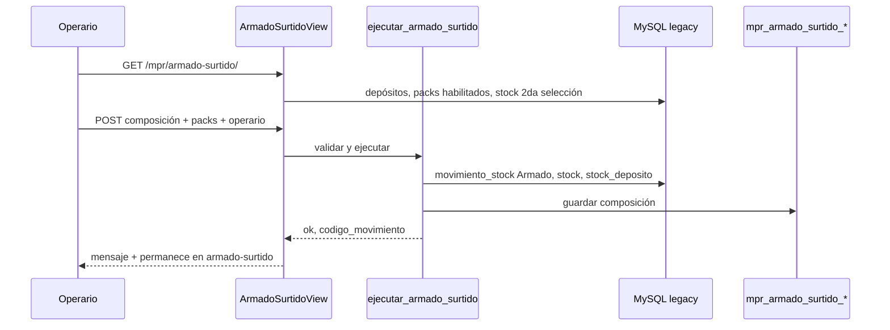

# SDD — Armado surtido desde 2.ª selección (MVP)

**Nombre del change:** `mpr-armado-surtido-mvp`  
**Estado:** implementado (MVP)  
**Fecha:** 01/06/2026

## 1. Objetivo

Permitir **armar packs con composición variable** a partir del stock en **2.ª selección**, sin receta BOM fija, y depositar el producto terminado en **Terminado**, con trazabilidad y el mismo modelo de movimiento que el armado MPR actual.

El diseño prioriza **máxima flexibilidad**:

- Varios artículos “pack surtido” (no un solo SKU genérico).
- Composición **libre por operación** (fase 2: plantillas opcionales).
- Depósitos y `suma_stock` **configurables** (sin hardcodear negocio).
- Vínculo **opcional** con OPT (`id_lista` en query/contexto).

**No** se usa `/stock/ingreso-movimiento/` como proceso estándar de armado surtido (solo contingencia de ajustes).

## 2. Contexto y problema

| Flujo actual | Limitación |
|--------------|------------|
| **Armado BOM** (`ejecutar_armado`, `/mpr/armado/`, `/mpr/opt/<id>/armado/`) | Exige `en_abm` + componentes + `descuenta_en = Mstock`. Origen típico: Semi elaborado. |
| **OPP** | Lleva componentes a 2.ª selección, Scrap, Semi, etc., pero no arma un pack terminado surtido. |
| **Reclasificación** | Un artículo, una cantidad; no N insumos → 1 pack. |
| **Ingreso movimiento stock** | Renglones libres; composición no estructurada; riesgo operativo y motivo distinto del armado MPR. |

**Caso de negocio:** en 2.ª selección hay artículos vendibles con defectos leves; se arman **packs surtidos** según disponibilidad del día (sin BOM predefinido).

## 3. Alcance por fases

### 3.1 MVP (este SDD)

| Incluido | Excluido (fases posteriores) |
|----------|------------------------------|
| Pantalla `/mpr/armado-surtido/` | Plantillas guardar/cargar (fase 2) |
| Servicio `ejecutar_armado_surtido` | Enlace UI desde detalle OPT (fase 3) |
| Catálogo de packs elegibles (flag/config) | Informes dedicados composición (fase 4) |
| Composición libre (N líneas × cantidad por pack) | Cambios en `ingreso-movimiento` |
| Cantidad de packs entera ≥ 1 | BOM dinámico en `en_abm_formula` |
| Operario obligatorio si cantidad > 0 | Tabla MySQL legacy nueva en AdministraNET |
| Origen default: depósito `tipo_mpr = 2daSeleccion` | |
| Destino default: depósito `tipo_mpr = Terminado` | |
| Persistencia composición en historial Synap | |
| `?id_lista=` opcional (solo trazabilidad en detalle/historial) | |
| UI canónica MPR (`base_mpr.html`, patrones wizard/OPT) | |
| Tests unitarios del servicio (validación, sin MySQL obligatorio) | |

### 3.2 Roadmap

1. **Fase 2 — Multi-pack (lote / carrito):** varios armados distintos en una pantalla; ver [SDD_ARMADO_SURTIDO_MULTI_LOTE.md](SDD_ARMADO_SURTIDO_MULTI_LOTE.md).
2. **Fase 2b:** plantillas de composición (tablas Django).
3. **Fase 3:** acceso desde detalle OPT + líneas de demanda “armado surtido” (parcialmente hecho: tarjeta OPT + `?id_lista=`).
4. **Fase 4:** reportes (composición por comprobante, stock 2.ª selección vs surtido armado).

## 4. Decisiones de diseño

| ID | Decisión | Alternativa descartada |
|----|----------|------------------------|
| D1 | Movimiento **Armado** (`MOTIVO_ARMADO_CODIGO = 9`, `tipo_mov` OPA/Armado alineado a `ejecutar_armado`) | Ingreso manual motivo genérico |
| D2 | Servicio nuevo **`ejecutar_armado_surtido`**, no extender BOM de `ejecutar_armado` | Forzar BOM vacío en `en_abm` |
| D3 | Composición en **tabla Synap** `mpr_armado_surtido_composicion` (+ cabecera por movimiento) | Solo texto en `detalle` del movimiento |
| D4 | Pack elegible por **`articulo.tipo_art_fab = 'Fabricado 2da'`** | Un solo `IDArt` hardcodeado |
| D5 | Origen/destino **editables** en UI con **defaults** desde `get_deposito_*_mpr` | Origen siempre fijo sin override |
| D6 | Validación stock **por línea** en origen; **sin** `max_packs` automático global | Calcular máximo como armado BOM |
| D7 | Cantidades en **unidades enteras** (componentes y packs) | Docenas en entrada de composición (solo visualización opcional del pack terminado) |
| D8 | **No** exigir `id_en_abm` ni BOM para el pack surtido | Reutilizar `get_bom_detalle` |

## 5. Requisitos funcionales (MVP)

| ID | Requisito |
|----|-----------|
| R1 | Ruta GET/POST `/mpr/armado-surtido/` accesible con sesión MPR (`MprLoginRequiredMixin`). |
| R2 | Query opcional `?id_lista=<id>`: si existe OPT, se valida y se incluye en detalle del movimiento e historial. **Desde detalle OPT** exige al menos una OPP registrada y cantidad > 0 enviada a **2.ª selección**; sin `id_lista` (menú) no aplica ese bloqueo. |
| R3 | Selector de **pack terminado** solo entre artículos con `articulo.tipo_art_fab = 'Fabricado 2da'`. |
| R4 | Depósito **origen** precargado = `get_deposito_por_tipo_mpr(2daSeleccion)`; **destino** = Terminado; ambos editables desde lista de depósitos permitidos. |
| R5 | Tabla de **composición**: filas `{ id_articulo_componente, cantidad_por_pack }`; alta/baja de filas en UI; búsqueda de artículo con saldo > 0 en origen (API o lista filtrada). |
| R6 | Campo **cantidad de packs** entera ≥ 1; por cada fila, consumo total = `cantidad_por_pack × cantidad_packs`. |
| R7 | **Operario** obligatorio (`id_operario`) si `cantidad_packs > 0`. |
| R8 | `ejecutar_armado_surtido` valida stock en origen por componente; transacción única; salidas + entrada pack en destino; lotes FIFO si el artículo usa lote (misma lógica que `ejecutar_armado`). Cada renglón en `stock` persiste `PrecioCostoxU` / `PrecioCostoxR` desde `articulo.PrecioCosto`. |
| R9 | Tras éxito: mensaje con comprobante; permanece en `/mpr/armado-surtido/` (formulario limpio) para permitir otro armado o salir manualmente. |
| R10 | Persistir composición: una fila cabecera + N líneas componente vinculadas a `codigo_movimiento` (tablas Django en app `mpr`). |
| R11 | Tablero MPR: enlace “Armado surtido” en menú Producción. |
| R12 | Documentación: este SDD, `GLOSARIO_MPR.md`, `MANUAL_USUARIO_MPR.md`, `MPR_ARMADO_STOCK_COMPONENTES.md`. |

## 6. Escenarios de aceptación

| Escenario | Dado | Cuando | Entonces |
|-----------|------|--------|----------|
| S1 | Stock comp A=100, comp B=50 en 2.ª selección; composición 2×A + 1×B por pack | Armo 10 packs | Salen 20 A y 10 B del origen; entran 10 packs en destino; comprobante Armado. |
| S2 | Stock insuficiente en un componente | Confirmo | Error claro con código artículo y saldo vs necesario; sin movimiento. |
| S3 | `cantidad_packs = 0` o sin operario | Envío formulario | Error de validación; sin movimiento. |
| S4 | Pack no habilitado en config | POST manipulado | Rechazado. |
| S5 | `?id_lista=22` válida | Armado exitoso | `detalle` / historial referencian OPT 22; enlace volver a detalle OPT. |
| S6 | Origen = destino (POST manipulado) | Confirmo | Rechazado. |
| S7 | Composición vacía | Confirmo | Rechazado (“Indique al menos un componente”). |

## 7. Arquitectura técnica

### 7.1 Flujo



### 7.2 Servicio `ejecutar_armado_surtido`

**Firma propuesta:**

```python
def ejecutar_armado_surtido(
    base_empresa: str,
    id_usuario: int,
    id_articulo_pack: int,
    cantidad_packs: int,
    deposito_origen: int,
    deposito_destino: int,
    lineas_composicion: List[Dict[str, Any]],  # [{ "id_articulo": int, "cantidad_por_pack": int }, ...]
    id_operario: Optional[int] = None,
    id_lista_produccion: Optional[int] = None,
    detalle: Optional[str] = None,
) -> Tuple[bool, Optional[int], Optional[str], Optional[str]]:
```

**Comportamiento (alineado a `ejecutar_armado`):**

1. Validar datos y que `id_articulo_pack` esté habilitado para surtido.
2. Validar `lineas_composicion` (ids distintos, cantidades > 0).
3. Por cada línea: `necesario = cantidad_por_pack * cantidad_packs`; comparar con `stock_deposito` en origen.
4. Abrir transacción; crear `movimiento_stock` (motivo Armado).
5. Renglones **salida** por componente (y lote si aplica).
6. Renglón **entrada** del pack × `cantidad_packs` en destino.
7. Actualizar `stock` / `stock_deposito`.
8. Insertar historial OPA/análogo si aplica (`lista_produccion_historico` con `id_articulo` = pack, detalle que indique surtido).
9. Guardar composición en tablas Django.
10. Commit.

**Detalle movimiento (ejemplo):**  
`Armado surtido MPR (pack {id_art}, {n} packs, {k} componentes) OPT {id_lista}`

### 7.3 Modelo de datos Synap (Django)

Nuevas tablas en app `mpr` (migración Django; **no** ALTER en MySQL legacy salvo que producto exija columna en `articulo` más adelante).

**`MprArmadoSurtidoMovimiento`** (cabecera de trazabilidad)

| Campo | Tipo | Notas |
|-------|------|-------|
| id | PK | |
| base_empresa | varchar | |
| codigo_movimiento | int | FK lógica a legacy |
| id_articulo_pack | int | |
| cantidad_packs | int | |
| deposito_origen | int | |
| deposito_destino | int | |
| id_lista_produccion | int, null | |
| id_operario | int, null | |
| id_usuario | int | |
| creado_en | datetime | |

**`MprArmadoSurtidoLinea`**

| Campo | Tipo | Notas |
|-------|------|-------|
| id | PK | |
| movimiento | FK → cabecera | |
| id_articulo_componente | int | |
| cantidad_por_pack | int | |
| cantidad_total | int | `× cantidad_packs` denormalizado |

Índice por `codigo_movimiento` + `base_empresa` para consultas.

### 7.4 Configuración: packs habilitados

**Importante:** el pack surtido **no** se identifica con `articulo.ensamblado` ni con `en_abm`. Ver discriminación completa pack/componente en [ARTICULO_PACK_COMPONENTE_MPR.md](ARTICULO_PACK_COMPONENTE_MPR.md).

Opción implementada (MVP):

- Tabla Synap **`MprArticuloArmadoSurtido`** (`id_articulo`, `activo`, `base_empresa`).
- Comando `mpr_cargar_packs_armado_surtido` o **admin Django**.
- Pantalla de mantenimiento en Config. MPR: fase 2.

### 7.5 API auxiliar

| Ruta | Uso |
|------|-----|
| `GET /mpr/api/armado-surtido/stock-origen/?q=` | Artículos con saldo > 0 en depósito origen seleccionado (reutilizar patrón `api_empleados`). |

### 7.6 URLs y vistas

| Método | Ruta | Vista |
|--------|------|-------|
| GET, POST | `/mpr/armado-surtido/` | `ArmadoSurtidoView` |
| GET | `/mpr/api/armado-surtido/stock-origen/` | `ArmadoSurtidoStockOrigenAPIView` |

Registrar en `mpr/urls.py` y enlace en `mpr/base_mpr.html` (menú Producción).

### 7.7 UI (canon MPR)

Plantilla: `mpr/templates/mpr/armado_surtido.html` (extiende `base_mpr.html`).

**Bloques:**

1. Migas: Producción → Armado surtido (→ OPT N si `id_lista`).
2. Cabecera: texto operativo (origen 2.ª selección, destino terminado, packs completos).
3. Formulario:
   - Select pack terminado.
   - Select origen / destino (defaults marcados).
   - Tabla composición (cod., descripción, saldo en origen, cant. por pack, quitar fila).
   - Botón “Agregar artículo” (búsqueda).
   - Cantidad de packs (entero).
   - Operario (select, mismo origen que OPP/OPA).
4. Acciones: **Ejecutar armado surtido**, **Volver** (tablero o OPT).

**Presentación cantidades pack terminado (opcional MVP+):** debajo de “Cantidad packs”, mostrar docenas enteras del pack con `docenas_enteras_desde_packs` + `cantidad_promedio_bulto` (sin unidades sueltas), coherente con armado OPT.

**POST loading:** `mpr-post-loading` como en `armado_opt.html`.

## 8. Seguridad y permisos

- Mismo mixin que resto MPR (`MprLoginRequiredMixin`).
- Validar `base_empresa` de sesión en servicio y API.
- Rechazar IDs de artículos/depósitos fuera de empresa (consultas parametrizadas).

## 9. Integración con flujos existentes

| Sistema | Integración MVP |
|---------|-----------------|
| **OPP → 2.ª selección** | Precede operativamente; no cambia OPP. |
| **Armado BOM** | Pantallas distintas; sin conflicto. |
| **Ventana pack** | Pack surtido en Terminado con `suma_stock=Si` suma a stock terminado. |
| **Tablero MPR** | Nuevo ítem menú; movimientos recientes pueden mostrar tipo Armado/OPA existente. |
| **VB6** | Lee mismas tablas `movimiento_stock` / `stock`; composición extra solo en Synap. |

## 10. Fuera de alcance explícito

- Usar `/stock/ingreso-movimiento/` como flujo principal.
- Un único artículo “Pack surtido” obligatorio.
- Plantillas de composición (fase 2).
- Cálculo automático de “máx. packs armables” con composición variable.
- Modificar `ejecutar_armado` para BOM opcional (evitar regresiones en armado actual).

## 11. Plan de tareas (implementación)

### Backend

- [x] T1 — Modelos Django `MprArmadoSurtidoMovimiento`, `MprArmadoSurtidoLinea`, `MprArticuloArmadoSurtido` + migraciones.
- [x] T2 — `ejecutar_armado_surtido` en `mpr/services.py`.
- [x] T3 — `listar_articulos_stock_deposito(base, id_deposito, busqueda)` reutilizable.
- [x] T4 — `articulo_habilitado_armado_surtido(base, id_articulo)`.
- [x] T5 — Tests: `mpr/tests/test_armado_surtido.py`.

### Frontend

- [x] T6 — `ArmadoSurtidoView` + `armado_surtido.html`.
- [x] T7 — API stock origen + JS búsqueda.
- [x] T8 — Enlace en menú Producción (MPR).

### Documentación

- [x] T9 — Actualizar `MANUAL_USUARIO_MPR.md` (§ Armado surtido).
- [x] T10 — `GLOSARIO_MPR.md`.
- [x] T11 — `MPR_ARMADO_STOCK_COMPONENTES.md`.
- [x] T12 — SDD marcado implementado.

### Configuración (mínimo viable)

- [x] T13 — Comando `manage.py mpr_cargar_packs_armado_surtido`.

## 12. Verificación

```bash
docker exec Synap_app python manage.py test mpr.tests.test_armado_surtido
docker exec Synap_app python manage.py test mpr
```

Prueba manual:

1. OPP con envío a 2.ª selección.
2. Habilitar pack surtido en config.
3. `/mpr/armado-surtido/` → composición → 1 pack → comprobante.
4. Verificar saldos origen/destino y filas en admin/historial Synap.

## 13. Referencias de código existente

| Artefacto | Ubicación |
|-----------|-----------|
| Armado con BOM | `mpr/services.py` → `ejecutar_armado` |
| Armado OPT UI | `mpr/templates/mpr/armado_opt.html`, `ArmadoOptView` |
| Depósito 2.ª selección | `TIPO_MPR_2DA_SELECCION`, `get_depositos_opp` |
| Docenas pack | `docenas_enteras_desde_packs`, `descomponer_docenas_unidades` |
| Pack vs componente | [ARTICULO_PACK_COMPONENTE_MPR.md](ARTICULO_PACK_COMPONENTE_MPR.md) |
| UI canónica | `docs/general/FUENTE_VERDAD_UI_REPORTES_MPR.md` |
| Motivos MPR vs Stock | `docs/mpr/ANALISIS_MPR_PROPUESTA_MVP.md` |

## 14. Glosario (extracto)

| Término | Definición |
|---------|------------|
| **Armado surtido** | Armado de un pack terminado con composición definida en el momento, desde stock en 2.ª selección (u otro origen configurado), sin BOM fija. |
| **Cantidad por pack** | Unidades de un componente que integran **un** pack surtido. |
| **Pack habilitado surtido** | `IDArt` en `MprArticuloArmadoSurtido` (Synap), no columna dedicada en `articulo`. |
| **Componente (surtido)** | Cualquier artículo con stock en origen; no figura en `en_abm_formula`. |

---

**Próximo paso:** implementación según §11 (change `mpr-armado-surtido-mvp`) o desglose en `openspec/changes/` si el equipo usa SDD formal con proposal/tasks.
