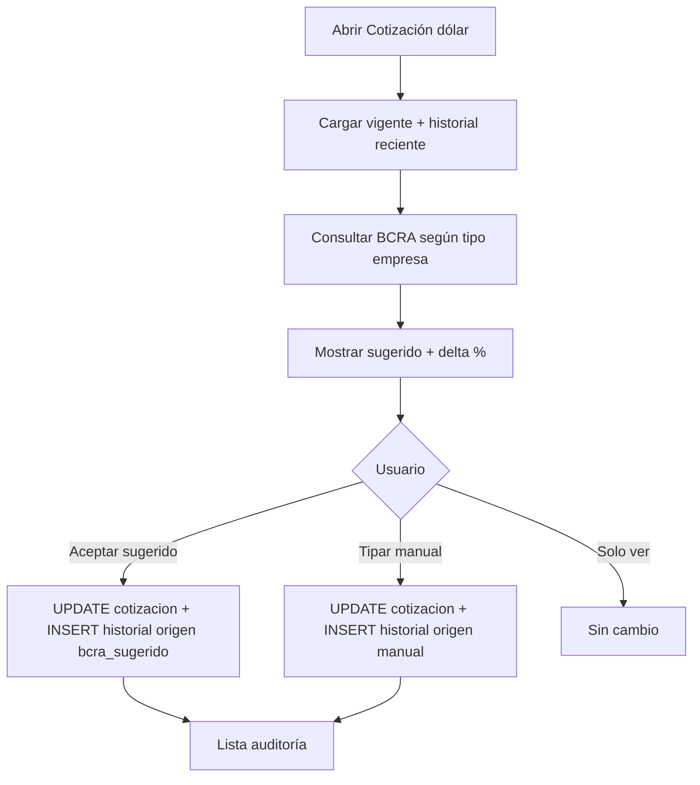

# Plan de implementación — Cotización dólar BCRA en Synap

**Fecha:** 02/08/2026  
**Diseño de producto (cerrado 30/07/2026):** [COTIZACION_DOLAR_ADMINISTRANET_Y_COSTEO.md](COTIZACION_DOLAR_ADMINISTRANET_Y_COSTEO.md) §6–7  
**Consumidor inmediato:** informe [Ventas marcas mensual](../../reports/PLAN_INFORME_VENTAS_MARCAS_MENSUAL.md) (KPI Regalías/TC); luego costeo MPR y comprobantes.

**Estado:** **Implementado v1 (código)** — 02/08/2026. Entregables B0–B7 + cableado VMM A9 en repo. **Pendiente operativo:** ejecutar DDL `cotizacion_historial` en Staging Best Sox (proveedor global), validar `BCRA_VARIABLE_IDS` contra API real, corrida job `--aplicar` solo con `auto_aceptar_job=True`, QA device cotización ([QA_VMM_PWA_P7.md](../../reports/QA_VMM_PWA_P7.md) §G) y smoke ([SMOKE_BEST_SOX_VMM.md](../../reports/SMOKE_BEST_SOX_VMM.md) §Parte 4).

---

## 1. Objetivo v1

1. Sugerir cotización oficial (API BCRA) según **tipo configurable** de empresa.  
2. Permitir **aceptar** o **override manual**.  
3. Solo el valor aceptado escribe `cotizacion.ValorPesos` (`id_cotizacion = 1` por defecto) **y** una fila en `cotizacion_historial`.  
4. Pantalla de auditoría (histórico diario).  
5. Servicio reutilizable `resolver_tc(base, fecha, id_cotizacion=1)` para informes/costeo.

**No v1:** blue/MEP, recálculo masivo de costos artículo, tipos distintos por módulo, revaluación del pasado.

---

## 2. Decisiones técnicas

| Tema | Decisión |
|------|----------|
| Maestro vigente | Seguir VB6: tabla MySQL `cotizacion`, dólar defecto `id=1` |
| Historial | Nueva tabla MySQL **`cotizacion_historial`** (genérica ERP, no `mpr_costo_*`) |
| DDL | Registrar en `core/services/legacy_mysql_schema/catalog.py` + herramienta global de esquema |
| Config tipo BCRA | Parámetro por empresa (PostgreSQL `ModuleConfig` o tabla config Synap; **no** hardcode en VMM) |
| Tipos | `bcra_referencia` (default), `bcra_compra`, `bcra_venta`, `mid`, `manual_only` |
| Origen historial | `bcra_sugerido` \| `manual` \| `job` + `id_usuario` + observación |
| Job | Opcional: propone o aplica solo si política «auto-aceptar» está ON; default = solo propone |
| UI | Canon Reports/MPR: sin `alert`/`confirm` nativos; modales Synap; **pantalla usable en PWA** (&lt; `lg` + landscape), no solo desktop |
| Freeze comprobantes | Fuera de v1 de esta pantalla; se documenta contrato para pedidos/facturas (ya usan `coti_dolar`) |

### 2.1 Schema propuesto `cotizacion_historial`

```sql
-- MySQL AdministraNET (por base empresa)
CREATE TABLE IF NOT EXISTS cotizacion_historial (
  id_historial INT NOT NULL AUTO_INCREMENT,
  id_cotizacion INT NOT NULL,
  fecha DATE NOT NULL,
  valor_pesos DECIMAL(18,6) NOT NULL,
  tipo_cotizacion VARCHAR(32) NOT NULL DEFAULT 'manual',  -- bcra_referencia|...|manual_only
  origen VARCHAR(32) NOT NULL DEFAULT 'manual',           -- bcra_sugerido|manual|job
  id_usuario INT NULL,
  observacion VARCHAR(255) NOT NULL DEFAULT '-',
  created_at DATETIME NOT NULL,
  PRIMARY KEY (id_historial),
  UNIQUE KEY uq_cotiz_hist_fecha (id_cotizacion, fecha),
  KEY ix_cotiz_hist_cotiz_fecha (id_cotizacion, fecha)
);
```

Lectura a fecha: último `valor_pesos` con `fecha <= corte`; si no hay → `cotizacion.ValorPesos`.

---

## 3. Componentes Synap

| Componente | Ubicación sugerida |
|------------|-------------------|
| Cliente HTTP BCRA | `core/services/bcra_cotizacion.py` (o `legacy_db/services/`) |
| Servicio dominio | `core/services/cotizacion_service.py` — sugerir, aceptar, historial, resolver |
| API | `GET/POST` bajo settings o `/api/core/cotizacion/` (sugerir, vigente, aceptar, historial) |
| Pantalla | Settings o Contabilidad: «Cotización dólar» — vigente, sugerido, delta %, aceptar, historial |
| Schema provider | `legacy_mysql_schema/catalog.py` → `run_cotizacion_historial_mysql` (id `cotizacion_historial`) |
| Comando job | `manage.py sincronizar_cotizacion_bcra` (`--dry-run` default / `--aplicar`) |
| Consumo VMM | `_resolve_tc` delega a `resolver_tc` (mismo fallback 14,5817) |

### 3.1 Rutas y permisos (implementado)

| Pieza | Ubicación |
|-------|-----------|
| Pantalla | `/contabilidad/cotizacion-dolar/` — `contabilidad_audit/cotizacion_views.py`, template `cotizacion_dolar.html` |
| APIs JSON | `/contabilidad/api/cotizacion/*` (vigente, sugerir, aceptar, manual, historial) |
| Permiso menú/PWA | `contabilidad.cotizacion.ver` |
| Config empresa | `CotizacionConfig` (PostgreSQL, migración `0019_cotizacionconfig`) |
| DDL MySQL | `contabilidad_audit/sql/cotizacion_historial.sql` |

---

## 4. Flujo UI (v1)



---

## 5. Tareas ejecutables

| # | Tarea | Dep. |
|---|-------|------|
| B0 | Actualizar SPEC/OpenSpec corta (requirements + escenarios) | — |
| B1 | Provider DDL `cotizacion_historial` + dry-run en Staging Best Sox | B0 |
| B2 | Cliente BCRA + tests con respuestas mock | B0 |
| B3 | `cotizacion_service` (sugerir/aceptar/resolver/historial) + tests | B1, B2 |
| B4 | APIs + permisos (`supervisor` o permiso dedicado) | B3 |
| B5 | Pantalla UI Synap (español, modales, dd/MM/yyyy) + layout PWA | B4 |
| B6 | Comando job + docs operación | B3 |
| B7 | Integrar VMM `_resolve_tc` + nota en SPEC informe | B3 |
| B8 | Docs: actualizar COTIZACION_DOLAR… § estado «implementado v1» | B5–B7 |

**Criterio done v1 (código):** supervisor ve sugerencia BCRA, acepta o tipa, queda en `cotizacion` + historial; VMM con TC vacío usa `resolver_tc`; PWA Nivel A expone cotización en menú contabilidad.

**Criterio done v1 (ops — pendiente):** DDL aplicado en base Best Sox Staging; smoke SQL+UI documentado; QA device §G en [QA_VMM_PWA_P7.md](../../reports/QA_VMM_PWA_P7.md).

---

## 6. Riesgos

| Riesgo | Mitigación |
|--------|------------|
| API BCRA caída / cambio de contrato | Timeout corto, cache sugerencia, mensaje UI, fallback a vigente |
| Pisar ValorPesos sin querer | Default job = dry-run; aceptar siempre explícito en UI |
| Bases multi-empresa MySQL | Historial y UPDATE por `base_empresa` de sesión |
| UNIQUE (id_cotizacion, fecha) | Re-aceptar el mismo día = UPDATE historial del día + UPDATE maestro (auditar observación) |

---

## 7. Relación con VMM

Hasta B7, el informe sigue con lectura directa `SELECT ValorPesos … id=1`.  
Tras B7, el campo TC vacío del informe resuelve por `resolver_tc` (misma semántica; preparado para as-of fecha fin de período en fase posterior).

Orden recomendado con el backlog VMM: **A1–A6 en paralelo a B0–B3**; **A8 (comparar marcas)** independiente; **A9** después de B7.
