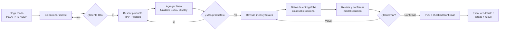
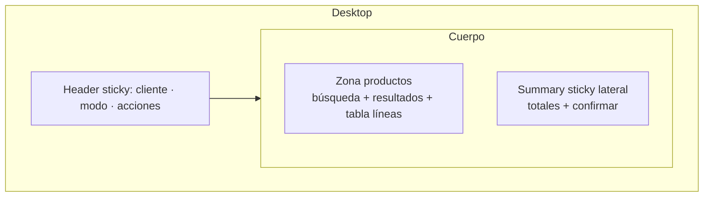
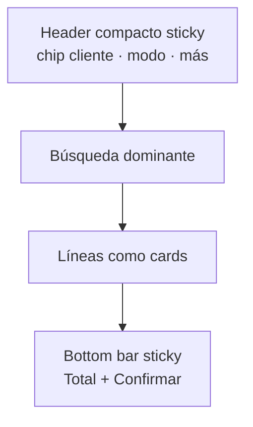
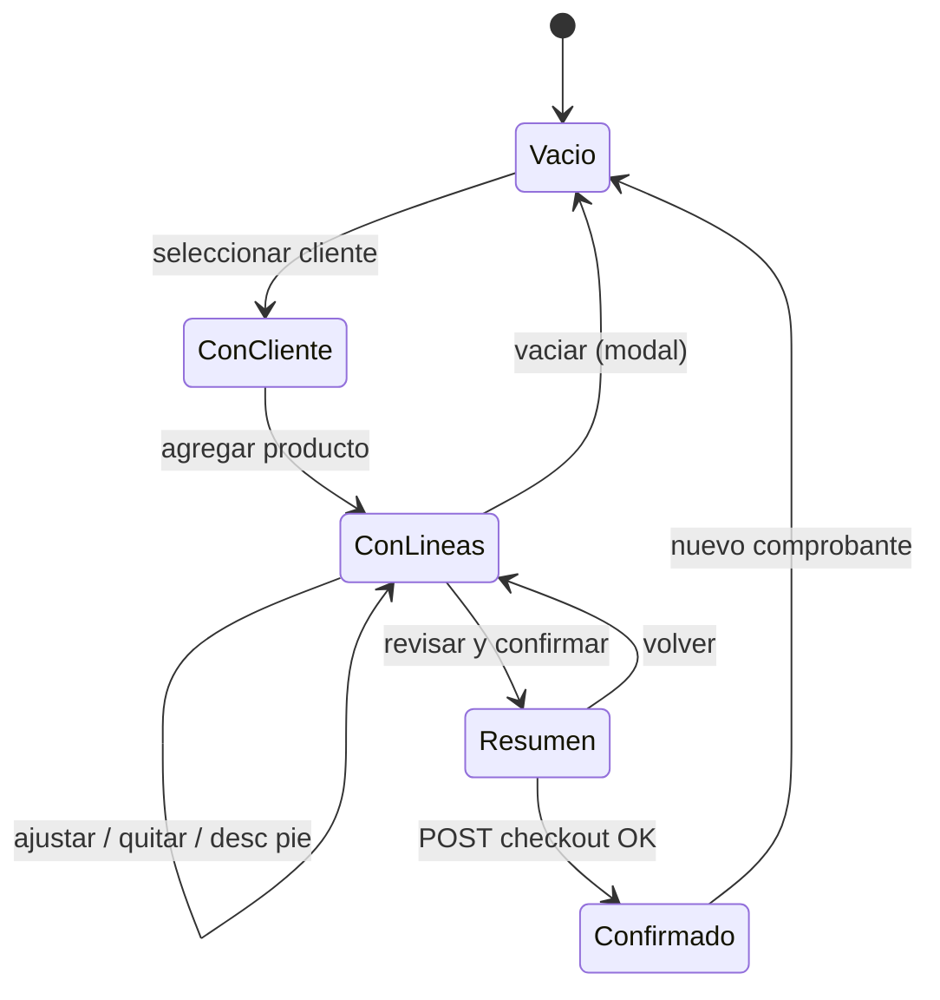

# 03 · Flujo propuesto — Toma de pedidos

- **Fecha:** 10/07/2026
- **Pantalla:** `/ecom/mayoristapp/compra/` (`compra_mayorista.html`)
- **Restricción:** rediseño de presentación. El backend sigue calculando precios/totales (`serializar_carrito`); el flujo respeta las APIs y el objeto Alpine `compraMayorista()` actuales.
- **Política de negocio preservada:** se mantienen los tres modos **PED / PRE / DEV** y la regla **no editar comprobantes confirmados** (patrón anular + repetir).
- **Criterio de diseño:** mejor opción para vendedores dinámicos (velocidad + contexto), no “parecer ERP” ni “parecer carrito”.

---

## 1. Flujo ideal (camino feliz)

El flujo se ordena en cuatro momentos claros, con el **cliente como primer gate** y **confirmar** siempre accesible:

1. **Identificar cliente** → 2. **Encontrar productos** → 3. **Ajustar líneas** → 4. **Confirmar comprobante**.

> El **modo** puede elegirse antes o durante; el **cliente es obligatorio** para agregar artículos o confirmar (`_requiereCliente()`, ya implementado). El bloque de entrega/observaciones es **opcional y colapsable**, fuera del camino crítico.

---

## 2. Orden de interacción

| Paso | Foco | Acción del usuario | Respuesta del sistema |
|---|---|---|---|
| 1 | Header · Modo | Elige PED/PRE/DEV (o deja PED por defecto) | Cambia color semántico del shell; si hay carrito, **modal** de confirmación (reemplaza `confirm()`) |
| 2 | Header · Cliente | Escribe ≥2 caracteres, elige del dropdown | Carga crédito, marcas relevantes, pedidos recientes; libera la zona de productos |
| 3 | Productos · Búsqueda | Escribe/escanea; ↑↓ para mover, Enter para agregar | Lista de resultados TPV; agrega línea y limpia el input, foco vuelve a búsqueda |
| 4 | Líneas | Ajusta cantidad, UOM (Unidad/Bulto/Display), quita | Recalcula en backend; totales se actualizan en summary sticky |
| 5 | Summary | (Opcional) descuento al pie %, punto de venta | Recalcula neto/IVA/imp. interno/total desde backend |
| 6 | Secundario | (Opcional) despliega entrega + observaciones | Campos plegables, no bloquean confirmar |
| 7 | Summary · Confirmar | "Revisar y confirmar {tipo}" | Modal resumen (líneas + total) |
| 8 | Modal | Confirmar / Volver | POST checkout; estado de éxito con próximos pasos |

---

## 3. Acciones primarias y secundarias

**Primarias (siempre visibles, alto contraste):**
- **Buscar producto** (input dominante en la zona de productos).
- **Confirmar comprobante** (en el summary sticky: lateral en desktop, bottom bar en mobile).

**Secundarias (accesibles, menor peso):**
- Seleccionar cliente / cambiar cliente.
- Cambiar modo (PED/PRE/DEV).
- Ajustar cantidad, UOM, quitar línea.
- Descuento al pie, punto de venta.
- Repetir pedido, ver pedidos recientes.

**Terciarias (plegadas/diferidas):**
- Forma de entrega, observaciones (sección colapsable).
- Vaciar carrito (destructiva, con confirmación mediante modal del canon).
- Ir al hub / ver listado.

Regla: **una sola acción primaria por región**. La zona de productos prioriza "buscar"; el summary prioriza "confirmar".

---

## 4. Comportamiento por dispositivo

### 4.1 Desktop (≥1024px)
- Header sticky (cliente + modo + acciones).
- Dos columnas: **productos (dominante)** a la izquierda, **summary sticky** a la derecha.
- Líneas en **tabla** con columnas: producto, UOM, cantidad, precio unit., total, quitar.
- Entrega/observaciones como sección colapsable bajo las líneas o dentro del summary.

### 4.2 Tablet (768–1023px)
- Header sticky.
- Layout de una columna priorizada: búsqueda arriba, líneas al medio.
- Summary **sticky inferior** (bottom bar) con total + confirmar; toque en el total expande el desglose.
- UOM y cantidad con controles táctiles (mín. 44px).

### 4.3 Mobile (<768px)
- Header compacto sticky: chip de cliente + selector de modo (segmented) + acción "más".
- Búsqueda a pantalla casi completa; resultados como lista.
- Líneas como **tarjetas** (`OrderLineMobileCard`), no tabla.
- **Bottom bar sticky** siempre visible: total + botón "Confirmar {tipo}". Un toque abre el modal resumen.
- Entrega/observaciones en *sheet* colapsable.

---

## 5. Casos alternativos

### 5.1 Sin cliente seleccionado
El usuario intenta agregar/confirmar sin cliente → se marca `intentoSinCliente`, aparece aviso ámbar (ya existe, líneas 53–55) y foco al buscador de cliente. La zona de productos puede quedar visualmente atenuada hasta elegir cliente.

### 5.2 Cambio de modo con carrito cargado
Reemplazar `confirm()` por **modal del canon**: "¿Cambiar a {modo}? El carrito se mantiene; cambia el comportamiento de stock y confirmación." Confirmar → `cambiarTipo()`; cancelar → sin cambios.

### 5.3 Repetir pedido / PRE → PED
- **Repetir:** abre el modal de previsualización (`repetir_pedido_modal.js`), carga al carrito y avisa "Precios actualizados". Propuesta: mostrar, cuando el backend lo permita sin cambios, un indicador de líneas cuyo precio difiere del origen (ver `07-funcionalidades-propuestas.md`).
- **PRE → PED:** desde el detalle del presupuesto o repitiendo con modo PED. El flujo respeta que un PRE confirmado no se edita: se genera un nuevo PED.

### 5.4 Producto sin stock / promoción
- Stock se muestra por línea de resultado (columna Stock del include TPV) y en carrito; el backend decide si permite según modo. La UI solo informa (badge/etiqueta), no bloquea salvo que el backend lo indique.
- Promoción: filtro "Solo promociones" + badge "Promo" (ya existentes).

### 5.5 Cliente se limpia al refrescar (intencional)
Comunicar antes de recargar/navegar: si hay carrito o cliente activo, mostrar diálogo "Se perderá la selección de cliente en pantalla (el carrito borrador se conserva)". Mantiene la decisión de diseño, pero informada.

### 5.6 Devolución (DEV)
Mismo shell, color rose. El summary y confirmar reflejan "devolución". Se preservan validaciones de backend.

---

## 6. Errores y recuperación

| Situación | Detección | Presentación | Recuperación |
|---|---|---|---|
| Error de red al buscar | `!ok` en `cargarArticulos` | Toast/inline "No se pudo buscar artículos" con `aria-live` | Reintentar sin perder término |
| Error al agregar línea | `!ok` en `agregar` | Mensaje + reconciliar carrito (`setCart(data.carrito)`) | El carrito refleja estado real del backend |
| Descuento inválido | `!ok` en `aplicarDescuentoPie` | Inline "Descuento inválido" | Corregir valor; total no cambia hasta éxito |
| Fallo de checkout | `!ok` en `confirmar` | Mensaje de error del backend (`data.detail`) | Reintentar; el carrito se mantiene |
| Crédito no autorizado | `creditoWidget.autorizado === false` | Aviso ámbar informativo | El pedido se registra igual (regla actual), sin bloquear |
| Sesión/PV no resuelto | `cargarContexto` sin PV default | Selector "Sesión" por defecto | Elegir PV manualmente |

Principios de error:
- **Nunca calcular en frontend para "corregir":** ante error, se reconcilia con el estado del backend.
- **Mensajes accionables y en español**, fechas dd/MM/yyyy.
- **`aria-live`** para anunciar éxito/error.
- **Modales del canon** en lugar de `alert/confirm/prompt` nativos.

---

## 7. Estados del carrito (borrador persistente)

El carrito es un **borrador (EcomCart)** que sobrevive recargas. Propuesta de comunicación (solo presentación):
- Indicador sutil "Borrador guardado" en el summary cuando hay líneas.
- Diálogo de "cambios sin guardar" solo cuando la acción implique **perder contexto de cliente** (no las líneas).

---

## 8. Qué NO cambia (garantías)

- Los **tres modos** PED/PRE/DEV y su semántica de color.
- **No edición** de comprobantes confirmados; anular + repetir.
- **Contrato Alpine** (`searchProductos`, `articulosGrid`, `selectedSearchIndex`, `soloPromo`, `cambiarTipo`, `agregar`, `confirmar`, `money`, `$refs.busquedaDropdownList`, etc.).
- **Cálculo de precios/totales** exclusivamente en backend.
- **APIs y rutas** existentes.

El detalle de estructura visual está en `04-wireframe-conceptual.md`.
