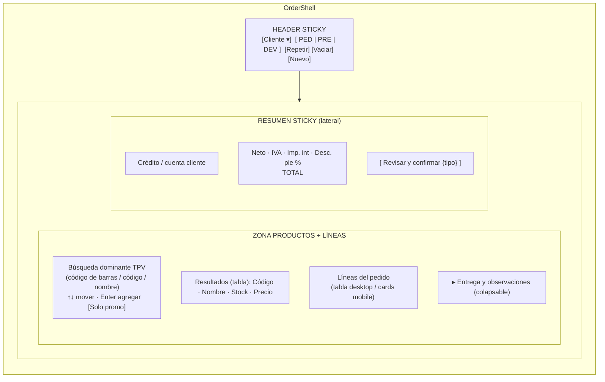
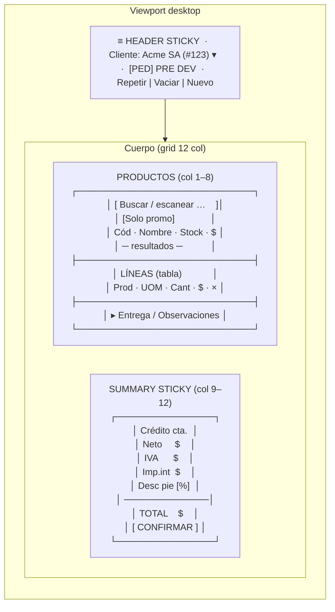
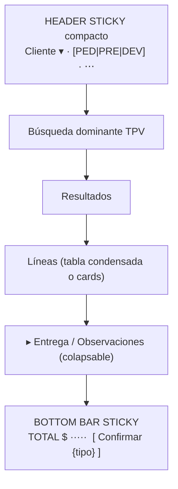
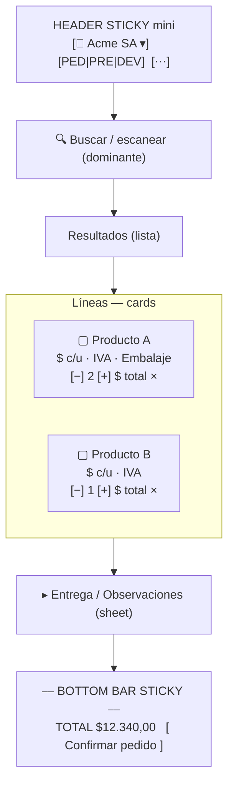
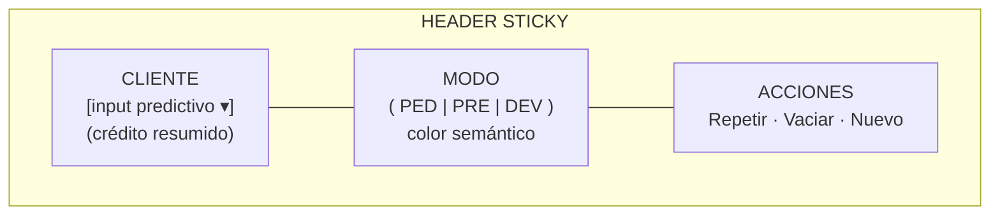
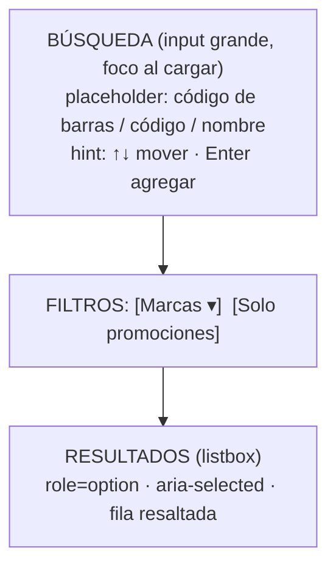
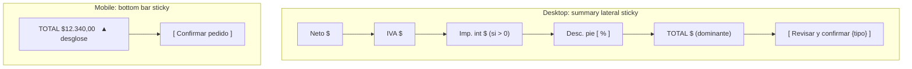
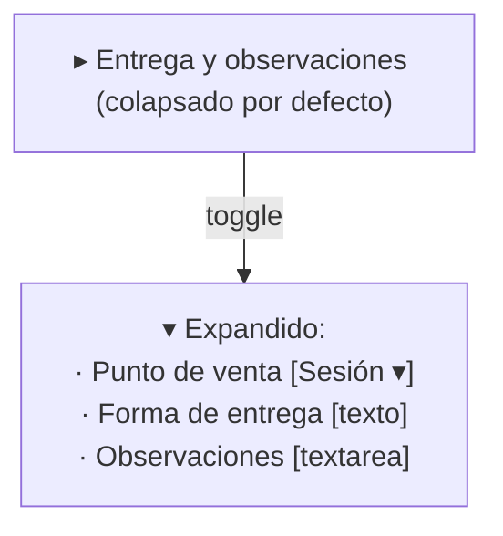
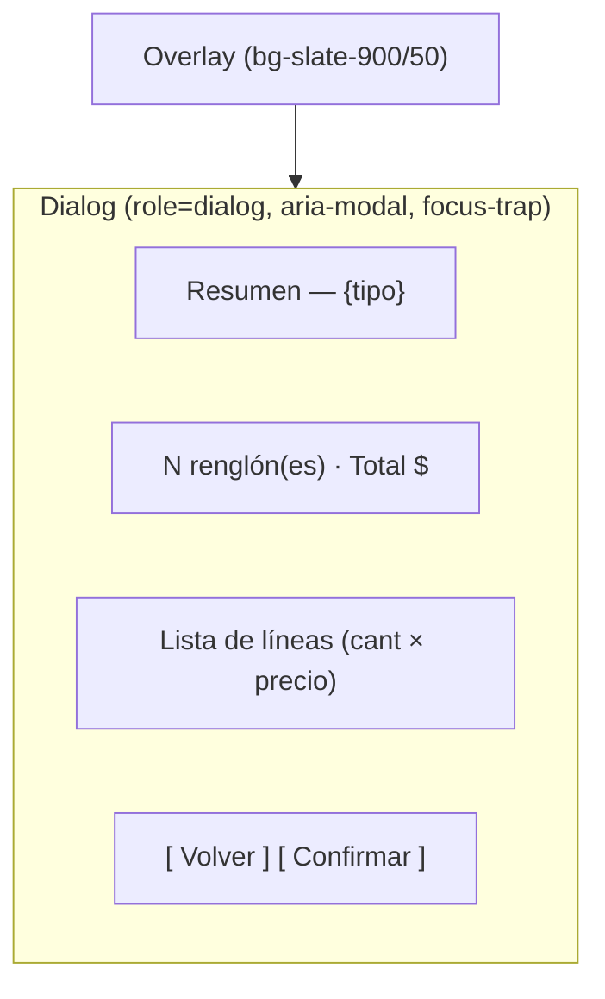
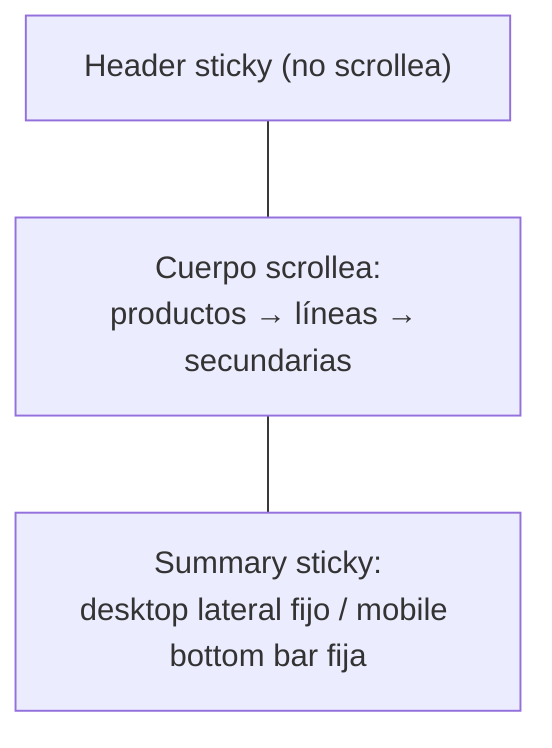

# 04 · Wireframe conceptual — OrderShell

- **Fecha:** 10/07/2026
- **Pantalla:** `/ecom/mayoristapp/compra/`
- **Base de layout:** `ecom/templates/ecom/base_pedidos.html` + tokens `pedidos_page_styles.html`
- **Objetivo:** definir la estructura visual "OrderShell" sin cambiar backend ni el contrato Alpine `compraMayorista()`.

> Estos wireframes son conceptuales (estructura y jerarquía). El detalle de tokens está en `05-design-system-pedidos.md` y el mapeo a includes/Alpine en `06-componentes.md`.

### Criterio de layout (decisión 10/07/2026)

No se elige layout por semejanza a “ERP” o “carrito”. Se elige lo que hace más **dinámica** la carga para vendedores:

1. **Captura continua** (búsqueda + teclado) como gesto principal.
2. **Líneas del pedido** como superficie de edición (no un mini-carrito de tienda).
3. **Contexto comercial** (cliente, crédito, modo, total) siempre visible sin interrumpir la carga.
4. **Confirmar** a un toque cuando el pedido está listo.
5. Lenguaje de UI orientado al trabajo (“pedido”, “líneas”, “confirmar”); evitar “carrito” como metáfora dominante.

---

## 1. Estructura OrderShell

El OrderShell reorganiza la pantalla en cinco zonas con responsabilidad única:

1. **Header sticky** — cliente + modo (PED/PRE/DEV) + acciones (vaciar, repetir, nuevo).
2. **Captura de productos** — búsqueda dominante estilo TPV + filtros (marcas, promo) + resultados.
3. **Líneas del pedido** — tabla en desktop / tarjetas en mobile.
4. **Resumen sticky** — totales + confirmar (lateral en desktop, bottom bar en mobile).
5. **Secciones secundarias colapsables** — entrega y observaciones.



---

## 2. Layout desktop (≥1024px)



- **Proporción sugerida:** productos ~66% / summary ~33% (revisando la compresión actual del carrito; ver diagnóstico §5). El summary es **`position: sticky; top: <alto header>`**.
- Los **pedidos recientes** y el **bloque de éxito** se muestran como banda superior contextual, no como card de ancho completo que empuje el área de trabajo.

---

## 3. Layout tablet (768–1023px)



- Una sola columna; el summary se transforma en **bottom bar sticky**.
- Toque en el TOTAL de la bottom bar → expande desglose (neto/IVA/imp.int/desc).

---

## 4. Layout mobile (<768px)



- **Header mini sticky**: chip de cliente (abre selector), segmented de modo, menú "⋯" para acciones secundarias (repetir, vaciar, nuevo, hub).
- **Líneas como `OrderLineMobileCard`**: cantidad con stepper táctil, precio unitario, total, quitar.
- **Bottom bar sticky** siempre visible: total + confirmar. Un toque abre el modal resumen.
- Entrega/observaciones como *sheet* inferior colapsable, no intercalado con las líneas.

---

## 5. Header sticky — anatomía



- El header **fija** el contexto operativo (a quién, qué tipo) mientras el usuario scrollea productos/líneas.
- El color del borde/acento del shell cambia según modo (sky/amber/rose), reutilizando `.compra-modo-*`.
- En scroll, el header puede condensarse (altura reducida) manteniendo cliente + modo visibles.

---

## 6. Zona de productos — dominante



- La búsqueda es el **elemento de mayor peso** de la zona de trabajo (tamaño, contraste, foco inicial).
- Resultados conservan navegación por teclado (contrato: `selectedSearchIndex`, `$refs.busquedaDropdownList`).
- Al agregar, el input se limpia y **recupera foco** (flujo de captura continua para operadores intensivos).

---

## 7. Líneas — tabla desktop vs cards mobile

**Desktop (tabla):**

| Producto | UOM | Cant. | P. unit. | Total | |
|---|---|---|---|---|---|
| Producto A | Unidad ▾ | [ 2 ] | $1.200,00 | $2.400,00 | × |
| Producto B | Bulto ▾ | [ 1 ] | $9.940,00 | $9.940,00 | × |

- Nueva columna **UOM** (selector Unidad/Bulto/Display) alimentada por `presentacion.opciones` (hoy oculta; ver diagnóstico §1.3). Sin cambio de backend: el API ya acepta `tipo_unidad` + `multiplicador`.

**Mobile (card):**

```
┌─────────────────────────────┐
│ Producto A                  │
│ $1.200,00 c/u · 21% IVA     │
│ UOM: Unidad ▾   Promo       │
│ [ − ]  2  [ + ]     $2.400  │
│                        Quitar│
└─────────────────────────────┘
```

---

## 8. Summary sticky — desktop lateral / mobile bottom bar



- **Totales siempre del backend** (`serializar_carrito`): el summary solo formatea con `money()`.
- El botón de confirmar hereda color por modo (PED sky / PRE amber / DEV rose).
- En mobile, "▲ desglose" expande neto/IVA/imp.int/desc sin abandonar la vista.

---

## 9. Secciones secundarias colapsables



- Fuera del camino crítico: no compiten con líneas ni con confirmar.
- Punto de venta se mantiene como selector (contrato `puntosVenta`, `pv`).

---

## 10. Modal resumen (pre-confirmación)



- Reutiliza el modal existente (líneas 216–234 de `compra_mayorista.html`) **añadiendo** semántica a11y (`role="dialog"`, `aria-modal`, focus trap, cierre con `Esc`, retorno de foco).
- El mismo patrón cubre: cambio de modo con carrito, y vaciar carrito (reemplazando `confirm()` nativo).

---

## 11. Breakpoints (resumen)

| Breakpoint | Ancho | Layout | Summary |
|---|---|---|---|
| `base` (mobile) | < 640px | 1 columna, header mini, cards | Bottom bar sticky |
| `sm` | ≥ 640px | 1 columna, inputs táctiles | Bottom bar sticky |
| `md` | ≥ 768px | 1–2 columnas (tabla condensada) | Bottom bar o lateral estrecho |
| `lg` | ≥ 1024px | 2 columnas (productos + summary) | Lateral sticky |
| `xl` | ≥ 1280px | 2 columnas holgadas | Lateral sticky |

> Nota: hoy el grid usa `md:grid-cols-3` (2/3+1/3). La propuesta sugiere pasar el summary a **sticky** y reservar el layout de dos columnas para `lg+`, dejando `md` en una columna con bottom bar para evitar la compresión del carrito descrita en el diagnóstico §5.

---

## 12. Zonas de scroll



- Se elimina el **scroll interno del carrito** (`compra-carrito-scroll max-height: 46vh`) en favor de scroll natural del documento con summary sticky, evitando "scroll dentro de scroll".

El mapeo de cada zona a componentes reales (includes + Alpine) está en `06-componentes.md`.
