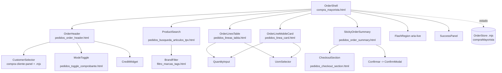

# 06 · Componentes — Mapeo a Django/Alpine

- **Fecha:** 10/07/2026
- **Stack real:** Django templates + Tailwind + Alpine 3 + fetch JSON. **No React.**
- **Regla:** los "componentes" del brief se implementan como **includes Django** (`ecom/templates/ecom/includes/*.html`) coordinados por el objeto Alpine `compraMayorista()` y módulos `.mjs`. El **contrato Alpine** (nombres de estado/métodos) se preserva; el impacto de backend es **ninguno** (solo consumo de APIs existentes).

> Nomenclatura: los nombres del brief (OrderShell, CustomerSelector, etc.) son **conceptuales**. Abajo se indica su archivo/patrón real y qué **conservar / refactorizar / crear**.

---

## 1. Leyenda

- **Prioridad:** P0 (crítico para el rediseño) · P1 (alto) · P2 (medio) · P3 (nice-to-have).
- **Acción:** `Conservar` (ya existe, se mantiene) · `Refactorizar` (existe, se reorganiza sin romper contrato) · `Nuevo` (crear include/módulo).
- **Backend:** en todos los casos **ninguno** o **solo consumo de APIs existentes**.

---

## 2. Tabla resumen

| Concepto (brief) | Implementación real | Acción | Prioridad | Backend |
|---|---|---|---|---|
| OrderShell | `base_pedidos.html` + wrapper en `compra_mayorista.html` | Refactorizar | P0 | Ninguno |
| OrderHeader | Nuevo include `pedidos_order_header.html` | Nuevo | P0 | Ninguno |
| CustomerSelector | `compra-cliente-panel` + `compra_mayorista_cliente.mjs` | Conservar/Refactorizar | P0 | Consumo APIs |
| BrandFilter | `filtro_marcas_tags.html` + `compra_mayorista_marcas.mjs` | Conservar | P1 | Consumo APIs |
| ProductSearch | `pedidos_busqueda_articulos_tpv.html` | Conservar/Refactorizar | P0 | Consumo APIs |
| OrderLinesTable | Nuevo include `pedidos_lineas_tabla.html` | Nuevo (extrae del panel) | P0 | Consumo APIs |
| OrderLineMobileCard | Nuevo include `pedidos_linea_card.html` | Nuevo | P0 | Consumo APIs |
| QuantityInput | Parcial `pedidos_qty_input.html` | Nuevo (extrae) | P1 | Consumo APIs |
| UomSelector | Nuevo include `pedidos_uom_selector.html` | Nuevo | P1 | Consumo APIs |
| OrderSummary | Nuevo include `pedidos_order_summary.html` | Nuevo (extrae totales) | P0 | Consumo APIs |
| StickyOrderSummary | Wrapper responsive del summary | Nuevo | P0 | Ninguno |
| CheckoutSection | Nuevo include `pedidos_checkout_section.html` (colapsable) | Refactorizar | P1 | Consumo APIs |
| ConfirmModal | `compra_mayorista.html` modal + `pedidos_modal.html` genérico | Refactorizar | P0 | Ninguno |
| ModeToggle | `pedidos_toggle_comprobante.html` | Conservar | P1 | Consumo APIs |
| RecentOrders | Bloque recientes + `repetir_pedido_modal.js` | Conservar/Refactorizar | P2 | Consumo APIs |
| SuccessPanel | Bloque éxito de `compra_mayorista.html` | Refactorizar | P1 | Ninguno |
| CreditWidget | Bloque crédito en panel cliente | Conservar | P2 | Consumo APIs |
| FlashRegion | `flash()` → región `aria-live` | Refactorizar | P1 | Ninguno |
| OrderStore (Alpine) | `compraMayorista()` → módulos `.mjs` | Refactorizar | P0 | Ninguno |

---

## 3. Detalle por componente

### 3.1 OrderShell — contenedor
- **Responsabilidad:** estructurar header sticky + cuerpo (productos/líneas) + summary sticky + secundarias colapsables; aplicar color de modo.
- **Implementación:** `base_pedidos.html` (hero/layout) + wrapper `.compra-modo-shell` en `compra_mayorista.html` (ya aplica `:class="modoShellClass"`).
- **Datos entrada:** `tipo` (modo), `esCliente`.
- **Eventos:** ninguno propio; delega en hijos.
- **Estado:** global (`compraMayorista`): `tipo`, `modoShellClass` (getter existente).
- **Deps:** tokens `.pedidos-*`, `.compra-modo-*`.
- **Backend:** ninguno.
- **Acción:** **Refactorizar** — reorganizar el grid `md:grid-cols-3` a layout de dos columnas `lg+` con summary sticky (ver `04`), sin cambiar `modoShellClass`.
- **Prioridad:** P0.

### 3.2 OrderHeader — cabecera sticky
- **Responsabilidad:** agrupar cliente + modo + acciones (repetir/vaciar/nuevo) en una barra sticky.
- **Implementación:** **nuevo** `includes/pedidos_order_header.html`, componiendo `CustomerSelector` + `ModeToggle` + acciones. Hoy estos elementos están dispersos (hero + cards).
- **Datos entrada:** `clienteActivoLabel`, `tipo`, `cart.items.length`.
- **Eventos:** `cambiarTipo`, `vaciar`, `repetirPedido`, "nuevo".
- **Estado:** global.
- **Deps:** OrderHeader ⟶ CustomerSelector, ModeToggle.
- **Backend:** consumo (cambio de tipo llama `carrito_tipo`).
- **Acción:** **Nuevo** (reagrupa lo existente).
- **Prioridad:** P0.

### 3.3 CustomerSelector — cliente predictivo
- **Responsabilidad:** buscar/seleccionar cliente; mostrar crédito; disparar carga de contexto.
- **Implementación:** `#compra-cliente-panel` (líneas 32–68 de `compra_mayorista.html`) + `compra_mayorista_cliente.mjs` + `ecom_predictive.mjs`.
- **Datos entrada:** URLs `clientes_buscar/seleccionar/seleccionado`.
- **Eventos (custom):** `compra-cliente-seleccionado`, `compra-cliente-limpiado`, `compra-cliente-error` (contrato ya existente).
- **Estado:** global (`clienteActivo`, `clienteActivoLabel`, `creditoWidget`, `intentoSinCliente`).
- **Reutilización:** patrón predictivo compartido (`ecom_predictive.mjs`).
- **Backend:** consumo APIs.
- **Acción:** **Conservar** el `.mjs`; **Refactorizar** su ubicación al header sticky. Mantener la decisión "no restaura sesión".
- **Prioridad:** P0.

### 3.4 ProductSearch — búsqueda TPV
- **Responsabilidad:** buscar/escanear, navegar por teclado, disparar agregado.
- **Implementación:** `includes/pedidos_busqueda_articulos_tpv.html`.
- **Datos entrada:** contrato `searchProductos`, `articulosGrid`, `articulosGridLoading`, `selectedSearchIndex`, `soloPromo`, `$refs.busquedaDropdownList`.
- **Eventos:** `onBusquedaProductosInput`, `onBusquedaProductosKeydown`, `onBusquedaProductosEnter`, `onTablaBusquedaKeydown`, `agregarDesdeBusqueda`, `toggleSoloPromo`.
- **Estado:** global.
- **Backend:** consumo (`urls.listado`, POST filtros).
- **Acción:** **Conservar** el contrato; **Refactorizar** para: foco automático al cargar, flujo de barcode (match exacto por código), y alinear estilos al token de tabla. **No romper** navegación ↑↓Enter.
- **Prioridad:** P0.

### 3.5 OrderLinesTable — líneas (desktop)
- **Responsabilidad:** listar renglones del carrito en tabla; cantidad, UOM, quitar.
- **Implementación:** **nuevo** `includes/pedidos_lineas_tabla.html`, extraído del panel derecho actual (líneas 143–159).
- **Datos entrada:** `cart.items` (cada `it`: `id`, `descripcion`, `precio_unitario_neto`, `alicuota_iva`, `tipo_unidad`, `promocion_etiqueta`, `cantidad`, `total`).
- **Eventos:** `cambiarCantidad`, `quitar`, (nuevo) `cambiarUom`.
- **Estado:** global (renderiza `cart`).
- **Deps:** QuantityInput, UomSelector.
- **Backend:** consumo (PATCH/DELETE item).
- **Acción:** **Nuevo** (extrae del monolito).
- **Prioridad:** P0.

### 3.6 OrderLineMobileCard — línea (mobile)
- **Responsabilidad:** misma info que la fila, en tarjeta táctil.
- **Implementación:** **nuevo** `includes/pedidos_linea_card.html`, se muestra `< md` mientras la tabla se muestra `md+`.
- **Datos entrada:** ítem del carrito.
- **Eventos:** `cambiarCantidad`, `quitar`, `cambiarUom`.
- **Backend:** consumo.
- **Acción:** **Nuevo**.
- **Prioridad:** P0.

### 3.7 QuantityInput — cantidad
- **Responsabilidad:** editar cantidad con stepper táctil (− n +) o input numérico.
- **Implementación:** **nuevo** parcial `includes/pedidos_qty_input.html` (reutilizable en tabla y card).
- **Datos entrada:** `it.id`, `it.cantidad`.
- **Eventos:** `cambiarCantidad(it.id, valor)`.
- **Estado:** local del ítem (valor); commit al backend on-change.
- **Deps:** token `.pedidos-input-qty` (ver `05`).
- **Backend:** consumo (PATCH item).
- **Acción:** **Nuevo** (extrae el input actual, línea 151–153).
- **Prioridad:** P1.

### 3.8 UomSelector — embalaje/UOM
- **Responsabilidad:** elegir Unidad / Bulto / Display por línea (y al agregar).
- **Implementación:** **nuevo** `includes/pedidos_uom_selector.html`.
- **Datos entrada:** `presentacion.opciones` (`tipo`, `multiplicador`), `tipo_unidad_defecto`.
- **Eventos:** al cambiar, re-agregar/actualizar con `tipo_unidad` + `multiplicador` (el API ya los acepta; ver `agregar`, líneas 655–666).
- **Estado:** local + reconciliación con `cart`.
- **Backend:** **consumo** (API ready; hoy la UI fuerza "Unidad"). Reactiva estado hoy huérfano (`embalaje`, `mostrarEmbalaje`).
- **Acción:** **Nuevo** — activa una capacidad existente sin tocar backend.
- **Prioridad:** P1.

### 3.9 OrderSummary — totales
- **Responsabilidad:** mostrar neto, IVA, imp. interno, descuento al pie %, total; alojar el CTA confirmar.
- **Implementación:** **nuevo** `includes/pedidos_order_summary.html`, extraído de líneas 163–211.
- **Datos entrada:** `tot` (`subtotal_neto`, `iva_total`, `impuesto_interno_total`, `total`), `descPie`, `tipo`.
- **Eventos:** `aplicarDescuentoPie`, `abrirResumen`.
- **Estado:** global; **totales siempre del backend** vía `money()`.
- **Backend:** consumo (descuento pie POST).
- **Acción:** **Nuevo** (extrae del monolito).
- **Prioridad:** P0.

### 3.10 StickyOrderSummary — envoltura responsive
- **Responsabilidad:** posicionar OrderSummary como lateral sticky (desktop) o bottom bar sticky (mobile).
- **Implementación:** wrapper CSS/estructura en `pedidos_order_summary.html` con clases responsive + token de sombra sticky.
- **Datos entrada:** `tot.total`, `cart.items.length`.
- **Eventos:** expandir/colapsar desglose (mobile).
- **Backend:** ninguno.
- **Acción:** **Nuevo**.
- **Prioridad:** P0.

### 3.11 CheckoutSection — datos de comprobante (colapsable)
- **Responsabilidad:** punto de venta, forma de entrega, observaciones — fuera del camino crítico.
- **Implementación:** **refactor** de líneas 178–200 a `includes/pedidos_checkout_section.html`, colapsable.
- **Datos entrada:** `puntosVenta`, `pv`, `formaEntrega`, `observaciones`.
- **Eventos:** binding `x-model`; se envían en `confirmar()`.
- **Backend:** consumo (checkout).
- **Acción:** **Refactorizar** (separar del carrito, migrar a tokens `.pedidos-input`/`.pedidos-select`).
- **Prioridad:** P1.

### 3.12 ConfirmModal — modal del canon
- **Responsabilidad:** pre-confirmación de checkout; también cambio de modo con carrito y vaciar.
- **Implementación:** **refactor** del modal existente (líneas 216–234) a `includes/pedidos_modal.html` reutilizable con `role="dialog"`, `aria-modal`, focus trap, `Esc`.
- **Datos entrada:** título, cuerpo (líneas/mensaje), acciones.
- **Eventos:** `confirmar`, `cerrar`.
- **Estado:** global (`modalResumen`) + nuevos flags para modales de modo/vaciar.
- **Backend:** ninguno (dispara acciones existentes).
- **Acción:** **Refactorizar** — reemplaza `confirm()`/`prompt()` nativos.
- **Prioridad:** P0.

### 3.13 ModeToggle — PED/PRE/DEV
- **Responsabilidad:** cambiar el tipo de comprobante.
- **Implementación:** `includes/pedidos_toggle_comprobante.html` (con `role="tablist"`).
- **Datos entrada:** `tipo`.
- **Eventos:** `cambiarTipo`.
- **Backend:** consumo (`carrito_tipo`).
- **Acción:** **Conservar**; solo mover al OrderHeader y disparar ConfirmModal (no `confirm()`) cuando hay carrito.
- **Prioridad:** P1.

### 3.14 RecentOrders — pedidos recientes
- **Responsabilidad:** listar y repetir pedidos recientes del cliente.
- **Implementación:** bloque `md:col-span-3` (líneas 81–95) + `repetir_pedido_modal.js`.
- **Datos entrada:** `pedidosRecientes`.
- **Eventos:** `repetirPedido`.
- **Backend:** consumo (`pedidos_recientes`, `cargar_desde_pedido`).
- **Acción:** **Conservar/Refactorizar** — moverlo a una banda contextual o dentro del selector de cliente (no ancho completo que empuje el trabajo).
- **Prioridad:** P2.

### 3.15 SuccessPanel — éxito de checkout
- **Responsabilidad:** confirmar resultado y próximos pasos (ver detalle/listado/nuevo/hub).
- **Implementación:** bloque líneas 97–120.
- **Datos entrada:** `exitoCheckout`, `ultimoCodMov`, `ultimoTipo`.
- **Eventos:** navegación; "nuevo comprobante".
- **Backend:** ninguno.
- **Acción:** **Refactorizar** — presentarlo como panel/toast del canon con `aria-live` y foco dirigido; migrar botones inline a `.pedidos-btn*`.
- **Prioridad:** P1.

### 3.16 CreditWidget — crédito/cuenta
- **Responsabilidad:** mostrar saldo CC, límite de días y estado de autorización.
- **Implementación:** bloque crédito (líneas 56–67) + `_setCreditoWidget`.
- **Datos entrada:** `creditoWidget`.
- **Backend:** consumo.
- **Acción:** **Conservar**; ubicar en el summary o bajo el chip de cliente.
- **Prioridad:** P2.

### 3.17 BrandFilter — filtro de marcas
- **Responsabilidad:** filtrar catálogo por marcas.
- **Implementación:** `includes/filtro_marcas_tags.html` + `compra_mayorista_marcas.mjs` (evento `compra-marcas-cambiadas`).
- **Datos entrada:** `marcasFiltro`.
- **Backend:** consumo (`urls.marcas`, filtros de listado).
- **Acción:** **Conservar**; integrar visualmente junto a la búsqueda (filtros accesibles, no ocultos).
- **Prioridad:** P1.

### 3.18 FlashRegion — mensajes
- **Responsabilidad:** anunciar ok/error de acciones.
- **Implementación:** `flash()` (línea 715) + `
` (línea 202) → **región dedicada con `aria-live="polite"`**.
- **Datos entrada:** `mensaje`, `mensajeOk`.
- **Backend:** ninguno.
- **Acción:** **Refactorizar** (a11y).
- **Prioridad:** P1.

### 3.19 OrderStore (Alpine) — estado central
- **Responsabilidad:** estado y lógica de la pantalla.
- **Implementación actual:** objeto `compraMayorista()` **inline** (~470 líneas JS).
- **Acción:** **Refactorizar** — extraer a módulos `.mjs` por dominio, **preservando el contrato** (los includes referencian `searchProductos`, `agregar`, `money`, etc.):
  - `compra_mayorista_carrito.mjs` (setCart, agregar, cambiarCantidad, quitar, vaciar, descuento pie).
  - `compra_mayorista_busqueda.mjs` (cargarArticulos, navegación teclado).
  - `compra_mayorista_checkout.mjs` (abrirResumen, confirmar, modo).
  - `compra_mayorista_core.mjs` (api, money, csrf, urls, init) que compone y expone `Alpine.data('compraMayorista', …)`.
- **Backend:** ninguno.
- **Prioridad:** P0 (habilita el resto sin regresiones).

---

## 4. Árbol de composición propuesto

---

## 5. Resumen conservar / refactorizar / nuevo

**Conservar (contrato intacto):** ProductSearch, CustomerSelector (.mjs), ModeToggle, BrandFilter, CreditWidget, RecentOrders (lógica repetir).

**Refactorizar (reubicar/extraer sin romper contrato):** OrderShell (grid → sticky), CheckoutSection (separar/colapsar), ConfirmModal (a11y + reemplazo de nativos), SuccessPanel, FlashRegion, OrderStore (a `.mjs`), ModeToggle (disparar modal).

**Nuevo (extrae del monolito o activa capacidad existente):** OrderHeader, OrderLinesTable, OrderLineMobileCard, QuantityInput, UomSelector, OrderSummary, StickyOrderSummary, `pedidos_modal.html` genérico.

**Impacto backend total:** ninguno; todo es presentación o consumo de APIs ya disponibles. La clasificación funcional está en `07-funcionalidades-propuestas.md`.
