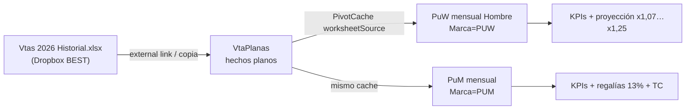

# Análisis e ingeniería inversa — BEST «Reporte Ventas Marcas con detalles Vs»

**Fecha:** 29/07/2026  
**Origen:** planilla Excel del sistema comercial BEST (BestSox), reemplazado por Synap.  
**Archivo analizado:** `/Users/sebastian/Documents/BestSox/Reporte Ventas Marcas con detalles Vs.xlsx` (~6 MB)  
**Objetivo:** documentar el modelo de datos y la presentación que usaba BestSox, para diseñar un informe equivalente (o cercano) en Synap y decidir si se clona un reporte existente o se adapta.

**Estado:** análisis de descubrimiento (pre-plan). No hay implementación ni slug Synap aún.

**Producto a portar:** hojas **`PuW mensual Hombre`** y **`PuM mensual`**.  
**`VtaPlanas` no es el reporte:** en el Excel era la capa de hechos (extract). En Synap **toda la información sale de AdministraNET**; el Excel solo aporta la plantilla de cálculo, ejes y **filtros**. No hay históricos a migrar ni paridad Excel↔DB. Mapeo: [MAPEO_PUW_PUM_ADMINISTRANET.md](MAPEO_PUW_PUM_ADMINISTRANET.md).

---

## 1. Resumen ejecutivo

La planilla combina **extracto de hechos + pivots de gestión por marca**. El entregable Synap debe centrarse en los pivots.

| Capa | Hoja | Rol |
|------|------|-----|
| **Hechos (≈ DB)** | `VtaPlanas` | ~27.500 renglones; fuente del PivotCache — **no** es la UI del reporte |
| **Reporte** | `PuW mensual Hombre`, `PuM mensual` | Tabla dinámica Ven→Cliente × AñoMes + KPIs (unidades/docenas, facturación, regalías) y proyección |

El libro está **linkado** al historial maestro:

`Dropbox/BEST/BS Ventas/Vtas 2026 Historial.xlsx`

Ese historial (usuario Arturo Balantzian) contiene decenas de hojas comerciales (`Com-PUM`, `Com-PuW`, `Com-Marcas Vs`, mensuales por marca, rankings, NC/ND, etc.). La planilla que analizamos es un **recorte** (copia de `VtaPlanas` + 2 pivots de marca).

**Conclusión Synap:** ningún informe actual cubre este combo (detalle renglón + pivot mensual por marca + docenas equivalentes + regalías + proyección). Lo más cercano para **clonar como base técnica** es `ventas-por-vendedor` / `ventas-por-articulo` (runner `ventas_objetivos_bo_runner.py`). Hay que **nuevo slug + nueva jerarquía/métricas**, no solo reconfigurar filtros.

---

## 2. Arquitectura del workbook

- **PivotCache:** `sheet="VtaPlanas"`, rango `A1:AN…`.
- **Sin nombres definidos** en el libro analizado.
- Hojas pivots: filtros de página típicos Excel (Fecha, Codigo, Marca, SuperArt, Comprobante, Modulo).

### 2.1 Significado de «Vs» en el nombre

En el ecosistema BEST aparecen:

- hoja externa `Com-Marcas Vs`;
- fichas de costo `FICHA MARCAS VS.xlsx` (otro dominio: BOM/costo MP, **no** es este reporte de ventas).

Hipótesis (a confirmar con el usuario de negocio):

1. **Familia de reportes «Marcas Vs»** = commercial pack de marcas (propias / licenciadas) con detalle; o  
2. **«Vs» = comparación** (período actual vs anterior / proyección vs real).

En las dos hojas pivots de *esta* copia **no** hay columnas lado a lado año anterior; sí hay:

- meses del año en curso (`202601`…`202606`);
- totales;
- bloques de **proyección** con multiplicadores (`x1,07`, `x1,2`, `x1,25`…) y trimestres `q1`…`q4`.

Para el MVP Synap conviene tratar «Vs» como **reporte de marcas con detalle + visión mensual**, y validar aparte si hace falta comparación YoY o solo proyección.

---

## 3. Hoja `VtaPlanas` — modelo de hechos

### 3.1 Cardinalidad (copia analizada)

| Métrica | Valor |
|---------|-------|
| Filas de datos | 27.521 |
| Período | 07/01/2026 → 06/07/2026 |
| AñoMes | 202601…202607 |
| Sucursal | siempre `1` |
| Módulo | siempre `D` |
| Marcas distintas | 18 (dominan `PUM` 22.899, `PUW` 3.001) |
| Artículos (`Articulo`) | 824 |
| SuperArt | 192 (~4,3 SKUs por SuperArt) |
| Vendedores (`Ven`) | 11 |

### 3.2 Diccionario de columnas (A–AN)

| Col | Nombre | Semántica inferida | Mapeo probable AdministraNET / Synap |
|-----|--------|--------------------|--------------------------------------|
| A | `AñoMes` | `yyyyMM` derivado de `Fecha` | Calculado |
| B | `Fecha` | Fecha comprobante | `cuentacliente.Fecha` / `stock` vía cabecera |
| C | `Suc` | Sucursal | `sucursales` / PV |
| D | `SuperArt` | Código “padre” / modelo (entero) | Posible `articulo` padre / código sin CE; **confirmar en catálogo BestSox** |
| E | `Articulo` | SKU con talle/color (ej. `56.064004`) | `articulo.Codigo` / CE |
| F | `Descripcion` | Descripción comercial | `articulo.Descripcion` |
| G | `Talle` | Talle | CE / atributo |
| H | `ColorNom` | Color | CE / atributo |
| I | `Temporada` | Casi todo `ST` | Atributo artículo |
| J | `Calidad` | `H`,`U`,`N`,`M`,`V`… | Atributo / segmento |
| K | `Codigo` | Tipo comprobante local BEST (`FC1`,`FCY`,`FL1`,`NC1`…) | Mapear a `TipoComprobante` FA/FC/NC… |
| L | `Comprobante` | Nro comprobante | `cuentacliente` / letra+número |
| M | `Cliente` | Código cliente | `cliente.Codigo` |
| N | `Nombre` | Razón social | `cliente` |
| O | `Rubro` | Rubro (casi todo `MEDIAS`) | `rubro` |
| P | `SubR` | Subrubro (`SNEAKER`,`UNISEX`,`HOMBRES`…) | `subrubro` |
| Q–R | `SSRub`,`SSSRub` | Vacías en esta copia | — |
| S | `Marca` | Código corto (`PUM`,`PUW`,`LEV`…) | `marca.CodMarca` / `articulo.CodigoMarca` |
| T | `Costo` | Costo unitario | Costo artículo / lista costo |
| U | `Cantidad` | Cantidad en **unidades de venta** (packs) | `stock.Cantidad` (signo − en NC) |
| V | `Canti_2` | Divisor a docenas de pares | Ver §3.3 |
| W | `Canti_3` | `Cantidad / Canti_2` = **docenas de pares** | Calculado |
| X | `UnidMed` | Empaque: `P1`,`P2`,`P3`,`P6`,`CU` | Unidad de medida / pack |
| Y | `PreUni` | Precio unitario | Precio renglón |
| Z | `SubTot0` | `Cantidad × PreUni` | Bruto línea |
| AA–AB | `Dto.1` / `Dto.1.$` | % y $ dto 1 | Descuentos línea |
| AC | `SubTot41` | `SubTot0 − Dto.1.$` | |
| AD–AG | `Dto.2`/`Dto.3` y $ | 2.º/3.er descuento | |
| AH | `SubTot.2` | Neto línea post-dtos (**métrica de facturación del pivot**) | Aprox. `PrecioNetoxR` / neto renglón Synap |
| AI–AJ | `Total_IVA` / `Total_Final` | IVA y total | |
| AK | `Modulo` | Siempre `D` en la muestra | Canal/módulo BEST |
| AL | `Pedido` | Nro pedido origen | `comp_ped` / pedido |
| AM–AN | `Ven` / `Vend.Nombre` | Vendedor | `viajantes` |

Identidades verificadas en 3.000 filas:

- `SubTot0 ≈ Cantidad × PreUni`
- `SubTot41 ≈ SubTot0 − Dto.1.$`
- `SubTot.2 ≈ SubTot41 − Dto.2.$ − Dto.3.$`
- `Canti_3 ≈ Cantidad / Canti_2` (5.000/5.000)

NC (`NC1`, etc.) traen **cantidad y montos negativos** (1.425 filas): el neto ya “resta” en el pivot.

### 3.3 Unidades: packs vs docenas

| `UnidMed` | Filas | `Canti_2` | Interpretación |
|-----------|-------|-----------|----------------|
| `P3` | 13.789 | 4 | Pack de 3 pares → docenas = packs / 4 |
| `P2` | 8.798 | 6 | Pack de 2 pares |
| `P1` | 4.761 | 12 | Pack de 1 par |
| `P6` | 98 | 2 | Pack de 6 pares |
| `CU` | 46 | 1 | Conceptos / descuentos especiales |

Regla: **`Canti_2 = 12 / pares_por_pack`**, **`Canti_3 = docenas de pares`**.

Diferencia crítica entre pivots:

- **PuW:** agrega `Cantidad` (packs / unidades de venta).
- **PuM:** agrega `Canti_3` (docenas) — el KPI se etiqueta «Docenas».

En Synap (MPR) ya existe la convención docenas/pares; este reporte comercial necesita **exponer ambas** o parametrizar por marca.

### 3.4 Tipos de comprobante (`Codigo`)

Top: `FC1` (21.201), `FCY` (2.428), `FL1` (2.341), `NC1` (1.301), `NCY`, `FCD`, `ND1`, …

Son códigos **locales BEST** (no idénticos a `TipoComprobante` AdministraNET). Al portar a Synap hay que **mapear** a FA/FB/FC/… y NC*, o filtrar por los mismos criterios que `ventas_objetivos_bo_runner` / `ventas_netas`.

---

## 4. Hojas pivots — producto gerencial

### 4.1 Estructura común

**Filtros de página (ejemplos):**

| Filtro | PuW mensual Hombre | PuM mensual |
|--------|--------------------|-------------|
| Marca | `PUW` | `PUM` |
| SuperArt | Multiple Items | Todas |
| Fecha / Codigo / Comprobante / Modulo | All / Todas | Varios / Todas |

**Matriz:**

- Filas: `Ven` → `Nombre` (cliente)
- Columnas: `AñoMes` (202601…202606)
- Valores por mes: **cantidad** + **`SubTot.2`**
- Totales de cantidad y facturación

### 4.2 KPIs de cabecera (misma lógica en ambas)

| KPI | Fórmula observada | Notas |
|-----|-------------------|-------|
| TC | valor fijo `14,5817` | Tipo de cambio / factor (confirmar) |
| Unidades / Docenas | `GETPIVOTDATA` sobre cantidad o `Canti_3` | Métrica distinta PuW vs PuM |
| Facturación | total `SubTot.2` del pivot | Neto post-descuentos |
| Precio medio | Facturación / Unidades | |
| Regalías | `Facturación × 13%` | Royalty marca (Puma etc.) |
| Regalías / TC | `Regalías / TC` | Conversión |
| Gap vs objetivo | columnas F/G con valores “target” pegados | Objetivos externos, no en `VtaPlanas` |

### 4.3 Bloque proyección (fuera del pivot “puro”)

Columnas auxiliares con etiquetas `x1,2`, `x1,25`, `x1,07`, `x1,15`, `x1,17`…:

- `CEILING(mes × coeficiente, 1)` (o 0,5 en algunos casos PuM)
- Agrupación trimestral `q1`…`q4` sumando meses + proyecciones
- Notas operativas («Pasar la diferencia a oct», «Lw + SW mujer»)

Esto es **planificación comercial**, no solo histórico. En Synap puede ser fase 2 (o reutilizar objetivos de `ventas-objetivos-vs-bo`).

### 4.4 Cola de clientes (PuW filas ~250+)

Hay un listado alfabético de clientes con columnas reducidas (posiblemente otro volcado / ranking auxiliar). No es el corazón del pivot mensual Ven→Cliente.

---

## 5. Qué pedía el usuario BEST (requerimientos inferidos)

1. **Detalle auditable** de cada renglón de venta (comprobante, cliente, SKU, descuentos, costo).
2. **Corte por marca** (y a veces por SuperArt / género — «Hombre» en PuW).
3. **Vista mensual** unidades + facturación neta por vendedor y cliente.
4. **Unidades en docenas de pares** cuando el negocio lo pide (medias Puma).
5. **Indicadores de licencia** (regalías %).
6. **Proyección / inflación** con coeficientes manuales (fase avanzada).
7. Export / Excel como medio de trabajo diario (hoy el Excel *es* el sistema).

---

## 6. Contraste con reportes Synap existentes

| Capacidad BEST | Synap hoy | Brecha |
|----------------|-----------|--------|
| Detalle renglón exportable | Export VO/VPV/VPA; no replica las 40 cols BEST | Media |
| Árbol vendedor→cliente→artículo | `ventas-por-vendedor`, `ventas-objetivos-vs-bo` | Jerarquía existe; **falta marca como nivel** |
| Árbol artículo→proveedor→cliente | `ventas-por-articulo` | Marca solo **filtro** |
| Listar por marca (plano) | Relay `ventas_netas` `listar_por=marca`; `utilidad-gerencial` | Sin meses lado a lado ni docenas pack |
| Pivot mensual AñoMes × cliente | No | Alta |
| `Canti_3` / packs P1–P6 | No en reportes ventas | Alta (hay docenas en MPR, otro dominio) |
| Regalías % | No | Media (regla de negocio) |
| Comparación períodos columnas | `resumen-ejecutivo-ventas` (KPIs día); no marca+detalle | Alta si se confirma YoY |
| Filtro marca incluir/excluir | Sí en VO/VPV/VPA | Reutilizable |
| Facturación neta línea | `PrecioNetoxR` / `SubtotalDesc` en runners | Reutilizable con validación vs `SubTot.2` |

### 6.1 Recomendación: clonar vs adaptar

| Opción | Veredicto |
|--------|-----------|
| **Solo adaptar** un slug existente (cambiar filtros de VPV/VPA) | **No alcanza**: falta dimensión marca en árbol, pivot mensual, docenas pack, regalías, proyección. |
| **Clonar** `ventas-por-vendedor` (mismo runner, modo `solo_ventas_*`) | **Sí como base técnica**: SQL de ventas por renglón, filtros, árbol, export, UI dashboard canónica. |
| **Complementar** con piezas de | `ventas_netas` (GROUP BY marca), `executive_sales_summary` (si hay Vs período), toggle docenas MPR (UX unidades). |

**Slug tentativo:** `ventas-marcas-detalle` (o `ventas-marcas-vs` si producto confirma el nombre BEST).

**Jerarquía candidata MVP:**

`Marca → (SuperArt opcional) → Artículo → Cliente`  
o  
`Marca → Vendedor → Cliente → Artículo`

con columnas: unidades packs, docenas equiv., facturación neta; filtros período + marca + SuperArt + sucursal/PV.

**No MVP (fase 2):** regalías, TC, proyección `CEILING×coef`, objetivos pegados en Excel.

---

## 7. Mapeo técnico sugerido (Synap)

Fuente operativa (igual que VO):

- Cabecera: `cuentacliente` (tipos FA/NC…, fechas, cliente, vendedor, PV/sucursal)
- Renglón: `stock` ⋈ `articulo` ⋈ `rubro` ⋈ `subrubro` ⋈ `marca`
- Facturación línea: alinear a la misma expresión que `sql_venta_por_art` (`PrecioNetoxR` o equivalente) y **validar** contra muestra export BEST `SubTot.2`
- Unidades: `stock.Cantidad` con signo NC
- Docenas: requiere dato de **pares por unidad de venta** (hoy `UnidMed`/`Canti_2` en BEST). En AdministraNET: investigar `articulo` / unidad / CE / `cantidad_unidad_*`; si no existe, tabla puente o coeficiente por marca/SKU

Tipos AdministraNET: normalizar INT/DATE/DECIMAL con `core.utils.administranet_types` al leer/escribir.

UI: canon reportes (`dashboard_detail.html` + includes), **sin** diálogos nativos; no usar pantallas `ventas/objetivos-venta` ni presupuestos como referencia visual.

---

## 8. Preguntas abiertas → resueltas en el plan

Cerradas en [PLAN_INFORME_VENTAS_MARCAS_MENSUAL.md](PLAN_INFORME_VENTAS_MARCAS_MENSUAL.md) (29/07/2026):

1. Entregable MVP = **pivot mensual Ven→Cliente** (no pantalla tipo VtaPlanas).  
2. «Vs» = nombre pack; **sin** YoY en MVP.  
3. Marcas = filtro multi sobre AdministraNET.  
4. Unidades = toggle **packs \| docenas**.  
5. Regalías / TC / proyección = **Fase 2**.  
6. Sin históricos; datos solo AdministraNET.

---

## 9. Artefactos relacionados (fuera de alcance inmediato)

| Path | Uso |
|------|-----|
| `BestSox/Stock BS Valorizados/Stocks Historico 2025.xlsx` | Stock valorizado histórico (otro informe) |
| `BestSox/.../Planillas Costos/FICHA MARCAS VS.xlsx` | Fichas técnicas / costo MP (343 hojas) — **no** es el reporte de ventas |
| Synap `docs/reports/SPEC_INFORME_VENTAS_POR_VENDEDOR.md` | Patrón de clonado de informe |
| Synap `reports/services/ventas_objetivos_bo_runner.py` | Runner candidato a extender |

---

## 10. ¿Reporte, workspace o Command Center? (decisión de producto)

### 10.1 Naturaleza del artefacto BEST

No es solo un informe de lectura: en Excel es un **workspace de marca** con tres capas:

| Capa | ¿Qué hace? | ¿Modifica ventas reales? |
|------|------------|---------------------------|
| **A — Hechos** (`VtaPlanas`) | Export/consulta de facturación | No (solo lectura de ERP) |
| **B — Pivot** | Agregación mensual Ven→Cliente | No |
| **C — Parámetros editables** | TC, % regalías, coeficientes `x1,xx`, targets F/G, filtro SuperArt | **No escriben en ERP**; sí cambian KPIs/proyección mostrados |

Los indicadores variables **recalculan la vista**, no alteran comprobantes.

### 10.2 Indicadores variables observados

| Parámetro | Ejemplo en planilla | Efecto |
|-----------|---------------------|--------|
| TC | `14,5817` | Convierte regalías a otra unidad |
| % regalías | `13%` sobre facturación | KPI licencia |
| Coeficientes proyección | `x1,07`…`x1,25` por mes/bloque | Meses proyectados = `CEILING(real × coef)` |
| Targets pegados (cols F/G) | Unidades/facturación “objetivo” | Gap real vs meta |
| Filtros pivot | Marca, SuperArt, Fecha, Codigo | Recortan el universo |

### 10.3 ¿Persistir?

| Parámetro | ¿Persistir en Synap? | Dónde razonable |
|-----------|----------------------|-----------------|
| Filtros período/marca/sucursal | No obligatorio (query) | Como resto de reportes |
| Pares/pack → docenas (`Canti_2`) | **Sí** (dato maestro) | Artículo / U.M. / tabla puente |
| % regalías por marca | **Sí** si se usa en producción | Config por marca (PostgreSQL o legacy) |
| TC | **Sí** si regalías multi-moneda; o leer de fuente ya usada en empresa | Cotización / param empresa |
| Coeficientes proyección | **Sí solo si** reemplazan al Excel como herramienta de planning | Escenario por marca/año; **alternativa:** reusar `viajantes_objetivos_ventas` |
| Targets F/G ad-hoc | Preferir **objetivos** Synap ya existentes | Módulo `ventas` + informe VO |

Recomendación: **no** persistir celdas sueltas tipo Excel; persistir **reglas de negocio** (regalía, U.M.) y **objetivos/escenarios** con modelo propio.

### 10.4 Command Center / Resumen ejecutivo

| | Command Center | Resumen ejecutivo ventas |
|--|----------------|--------------------------|
| Rol | Tablero multi-área por período | Panel intradía facturación |
| Ventas netas | Sí (KPI período) | Sí (día + vs ayer/semana/año) |
| Por marca / docenas / regalías / TC / proyección mensual | **No** | **No** |
| Persistencia config | Solo canal mayorista/minorista por sucursal | Idem |
| Extensible | Nueva **tarjeta/área** con KPI marca | Top marca del día |

**Conclusión:** CC ya tiene *parte* de la info (ventas netas agregadas), pero **no** el paquete BEST. Se puede **extender** con un KPI “ventas por marca” o link al informe; **no** conviene meter el pivot + proyección + regalías dentro del CC (rompe el rol operacional multi-área).

### 10.5 Forma recomendada en Synap (híbrido)

1. **Informe de consulta** (slug nuevo, patrón VPV): hechos + jerarquía marca/cliente/artículo + export.  
2. **Capa opcional de parámetros** (fase 2): % regalía, TC, escenarios de proyección — o reutilizar objetivos.  
3. **Command Center**: como máximo una tarjeta/resumen o deep-link; no sustituye al informe.

---

## 11. Próximo paso acordado

Con este documento como base: **armar el plan** (alcance MVP, slug, jerarquía, métricas, fases) en la siguiente iteración con el usuario, respondiendo las preguntas de la §8 y cerrando §10 (persistencia de regalías/proyección vs objetivos).
