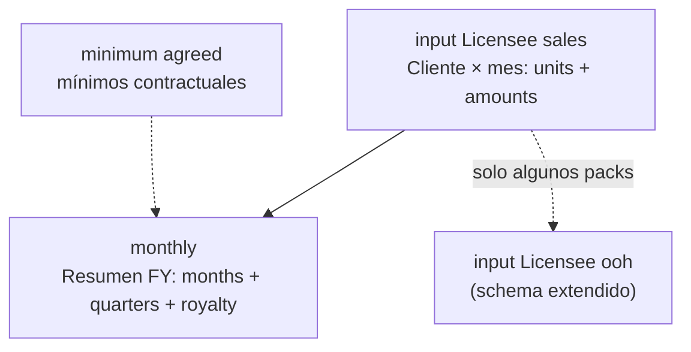

# Análisis — Monthly Reporting Best Sox (entregables a marcas)

**Fecha:** 07/08/2026 (decisión seed/julio: 07/08/2026)  
**Carpeta origen:** `/Users/sebastian/Documents/Best Sox/fwdreportesjun/`  
**Estado:** descubrimiento + **estrategia seed/cutover cerrada (§6)**; **planillas actualizadas (jul+) pendientes de recepción** (§6.6); borrador mapeo ANET (§10).  
**JSON técnico:** `tmp_exports/analisis_monthly_reporting/*_struct.json`

> **No confundir** con el informe Synap `ventas-marcas-mensual` (matriz Ven×Cliente).  
> Estos archivos son el **pack de envío a licenciatarios / marcas** (Levi’s, Puma, LW propia): detalle cliente + resumen mensual FY + regalías.  
> **Informe Synap hermano:** slug `ventas-mensuales-licenciatarios` — [PLAN](PLAN_INFORME_VENTAS_MENSUALES_LICENCIATARIOS.md) · [SPEC](SPEC_INFORME_VENTAS_MENSUALES_LICENCIATARIOS.md).

---

## 1. Inventario de archivos

| Archivo | Formato | Marca / línea | U.M. aparente | Product group | % regalía |
|---------|--------|---------------|---------------|---------------|-----------|
| `Monthly Reporting Best Sox_LEVIS BW 26.xlsx` | xlsx | Levi’s **BW** (Bodywear) | dozens | Bodywear | **20 %** |
| `Monthly Reporting Best Sox_LEVIS LW 26 DZ.xlsx` | xlsx | Levi’s **LW** Legwear | dozens | Legwear | **20 %** |
| `Monthly Reporting Best Sox_LEVIS LW 26 PK.xlsx` | xlsx | Levi’s **LW** Legwear | packs (montos = DZ) | Legwear | **20 %** |
| `Monthly Reporting Best Sox_LW 26.xlsx` | xlsx | **LW** (línea propia / no Levi) | dozens | LW | **13 %** |
| `Monthly_Reporting _Best Sox_2026_BW_PUMA.xlsb` | xlsb | Puma **BW** | PACKS | Men BW | **13 %** |
| `Monthly_Reporting _Best Sox_2026_SW_PUMA.xlsb` | xlsb | Puma **SW** | PACKS | Men SW / Women SW | **13 %** |

También hay en la carpeta `Levis x art 25-26.xlsx` (~5 MB) — **no** incluido en este pase (parece extracto por artículo; pendiente).

---

## 2. Arquitectura común del workbook



| Hoja | Rol |
|------|-----|
| **input Licensee sales** | Hechos pivotables: 1 fila por cliente (y a veces variante), columnas mes = par **units \| amounts** |
| **monthly** | Entregable visual: totales por mes, trimestres, FY; Sales × tasa = Royalty |
| **input Licensee ooh** | Solo en **LW 26**: mismo eje temporal con columnas Licencee/Type/Country/Currency/Year |
| **minimum agreed** | Solo en **LW 26** (y vacía en PUMA): mínimos históricos en USD / dozens / units |

La hoja `monthly` **casi no guarda números**: enlaza con fórmulas a la fila 2 de totales de `input Licensee sales` (`='input Licensee sales'!E2`, etc.) y calcula quarters / royalty.

---

## 3. Spec de formato (para clonar en export Synap)

### 3.1 Hoja `monthly` (canónica Levi’s / LW)

| Celda / zona | Contenido | Fuente | Tamaño | Estilo | Number format |
|--------------|-----------|--------|--------|--------|---------------|
| B2 | Título (`Best Sox` / `Best Sox-BW`…) | Calibri | 16 | bold+italic; fill `#FFFF99` | General |
| D2…R2 | `01-2026` … `12-2026` | Calibri | 14 | bold+italic | `@` (texto) |
| G2, K2, O2, S2 | `1st/2nd/3th/4th quarter` | idem | 14 | bold+italic | `@` |
| T2 | `FY 2026` | idem | 14 | bold+italic | `@` |
| B4 | Etiqueta U.M. (`dozens` / `PACKS`) | Calibri | 11 | | |
| D4…T4 | Totales unidades (fórmulas) | Calibri | 11 (T4: 16) | fill theme 3 tint ~0.80 | `_-* #,##0_-;…` |
| B6 / C6 | `Sales` / `ARS` | Calibri | 11 | | Accounting `#,##0.00` |
| D6…T6 | Montos | Calibri | 11 | fill theme 3 tint ~0.80 | `_-* #,##0.00_-;…` |
| C7 | Tasa regalía (`0.2` / `0.13`) | Calibri | 14 | | `0%` |
| B8 | `Royalty` | Calibri | 11 | | |
| D8…T8 | `=$C7*D6` … | Calibri | 11 | fill theme 3 tint ~0.80 | `_-* #,##0.00_-;…` |
| D13 | `FY 2026` (bloque mínimos) | Calibri | 11 | bold | |
| D14:G14 | MINIMUM / ACTUAL / FORECAST / EXPECTED total | Calibri | 11 | | |

**Freeze:** `D3` o `D4`.  
**Merged:** `B2:C2`, `D13:G13`.  
**Nota tipográfica:** `3th quarter` (typo histórico de la plantilla — mantener si se exige pixel-perfect).

Colores theme 3 + tint ≈ gris-azul claro Office; el amarillo del título es RGB fijo `FFFFFF99`.

### 3.2 Hoja `input Licensee sales` (familia Levi’s / LW)

| Zona | Formato |
|------|--------|
| Headers A4:D4 + meses | **Tahoma 10** bold; fill theme 3. Textos: `Customer`, **`City / Province`**, `Store Type`, `Product group` |
| Meses E4, G4, … | Date serial; format **`mmm-yy`**; merge con columna amounts (`E4:F4`, …) |
| Subfila R3 | `units` / `amounts` alternados |
| Unidades | `#,##0` (a veces `0.0` / decimales en DZ) |
| Montos | `"$"#,##0.00` |
| YTD_Units / YTD_Sales | cols ~29–30 |
| Freeze | fila 1 / col variable (`B1`, `C1`, `V1`…) |
| Fórmulas totales | Fila 2: `=SUM(E5:E4931)` etc. (rango “holgado”) |

### 3.3 Familia PUMA (`xlsb`)

Misma idea de hojas, pero:

- Columnas fijas de licencia: Licencee, Type, Country, Currency, Year, Fantasia, Razón social, city, store type, Product Group.
- Meses como **seriales Excel** (46023 = ene-2026…), no date headers `mmm-yy` en el mismo layout.
- `monthly` título `Best Sox-BW` / `Best Sox-SW`; U.M. = **PACKS**; filas Men/Women (hoy en 0 en el resumen); tasa **13 %**.
- SW incluye columna **UF** entre city y store type (BW no).
- Estilos: no extraídos con fidelidad desde `.xlsb` (pyxlsb no lee tema/fuente); conviene convertir una copia a `.xlsx` o usar la plantilla Levi’s como proxy visual y validar en Excel.

---

## 4. Dimensiones de negocio detectadas (ejes del “mismo documento”)

Cada archivo = **misma plantilla** filtrada / parametrizada por:

1. **Marca / licencia:** LEVIS vs PUMA vs LW propia.  
2. **Línea / product group:** Bodywear, Legwear, LW, Men BW, Men SW, Women SW.  
3. **Unidad de medida:** dozens vs packs (y en LW DZ hay decimales de docena).  
4. **Tasa de regalía:** 20 % (Levi’s) vs 13 % (LW / Puma).  
5. **Año fiscal de columnas:** siempre calendario 2026 en headers (`01-2026`…`FY 2026`).  
6. **Canal / store type** en el detalle (Levi’s Store, franchise, Multibrand, Puma Store…).  
7. **Geografía:** City / Province (Cap Fed, GBA, Cuyo…) — en PUMA SW también UF.

---

## 5. Diferencias estructurales significativas (para conversar)

### A. Levi’s BW vs Levi’s LW vs LW propia

| Tema | BW | LW DZ | LW PK | LW 26 |
|------|----|-------|-------|-------|
| Hojas | sales + monthly | igual | igual | **+ ooh + minimum agreed** |
| Product group | Bodywear | Legwear | Legwear | **LW** |
| Regalía | 20 % | 20 % | 20 % | **13 %** |
| Etiqueta U.M. monthly | dozens | dozens | **dice dozens pero números ≈ packs** | dozens |
| Label FY bloque mínimos | **`FY 2025`** (inconsistente) | FY 2026 | FY 2026 | FY 2026 |
| Filas cliente ~ | 23 | 21 | 21 | **110** |

### B. DZ vs PK (mismo Legwear)

- **Montos idénticos** mes a mes.  
- **Unidades distintas:** ratio PK/DZ **no es fijo ×6** (muestra n=30: media ≈ 5,08; mediana ≈ 5,05; min 4; max 6).  
- Implica mezcla de U.M. en origen o conversión no uniforme — **no** se puede regenerar PK como `DZ × 6` a ciegas.

### C. Familia PUMA vs familia Levi’s/LW

| | Levi’s / LW xlsx | PUMA xlsb |
|--|------------------|-----------|
| Schema input | Customer, City, Store Type, Product group | Licencee + Type + Country + Currency + Year + Fantasia + Razón social + … |
| monthly | Sin desglose género | Filas **Men / Women** |
| U.M. | dozens (salvo PK) | **PACKS** |
| Extensión | .xlsx | **.xlsb** |
| Columna extra | — | SW: **UF** |

### D. Datos de estos archivos (corte junio)

En **todos** los packs analizados: **jul–dic = 0**. Son reportes de avance a junio (“fwdreportesjun”). Sirven como **seed histórico ene–jun 2026**, no como YTD completo post-julio.

---

## 6. Estrategia seed + julio partido (DECISIÓN CERRADA)

### 6.1 Situación

- El envío anualizado exige **YTD (ene→mes actual)** en la misma plantilla.  
- AdministraNET solo tiene hechos confiables **desde 22/07/2026** (inclusive).  
- Los packs `fwdreportesjun` ya enviados tienen **ene–jun 2026** poblados y **jul–dic = 0** → sirven como seed de meses cerrados pre-julio, **no** como seed de julio.

### 6.2 Decisión: híbrido B (con A como capa de seed)

Se adopta **B — híbrido por fecha**, donde la parte histórica es un **seed congelado tipo A** (no se recalcula desde BEST).

| Tramo de fecha | Fuente | Mutabilidad |
|----------------|--------|-------------|
| **2026-01-01 → 2026-06-30** | Seed importado de Monthly Reporting ya enviados (fila cliente × mes: units + amounts) | **Congelado** (reproduce lo enviado; no se recalcula) |
| **2026-07-01 → 2026-07-21** | Seed de **julio partido** (ver §6.3) | Congelado una vez cargado |
| **2026-07-22 → adelante** | **Solo AdministraNET** | Vivo (consulta Synap) |

Clave de seed (mínima): `(anio, marca_pack, product_group, um, codigo_cliente | nombre_cliente, anio_mes)` → `units`, `amounts`, más metadatos (city, store_type) tal como vinieron en el Excel enviado.

Agregación del mes / YTD / royalty en la plantilla = **suma seed + ANET** según el tramo (sin doble conteo).

Descartadas para el MVP: **C** (pegado manual) y **D** (reproceso BEST), salvo que negocio aporte extractos BEST explícitos para rellenar el hueco de julio 1–21.

### 6.3 Julio 2026 partido — reglas

```text
julio_2026_total = seed_jul_01_21  +  anet_jul_22_31
```

| Subtramo | Fuente | Regla |
|----------|--------|--------|
| **01/07 → 21/07** | Seed julio | **No** está en `fwdreportesjun` (cols jul = 0). Hay que **cargar un seed específico** cuando exista: (1) próximo Monthly Reporting ya enviado que incluya julio BEST, o (2) extracto/export BEST 01–21/07, o (3) planilla parcial firmada por negocio. Hasta entonces el subtramo vale **0** y el mes julio queda **subdeclarado** (solo ANET 22–31). |
| **22/07 → 31/07** | AdministraNET | Mismos filtros de marca/línea/U.M. que el pack; fecha factura/comprobante ≥ 22/07/2026 y ≤ 31/07/2026. |
| **Agosto+** | AdministraNET | Mes completo desde ANET. |

**Prohibido:** tomar julio ANET de todo el mes (1–31) y sumarle seed ene–jun sin cortar el 22/07 → doble conteo o hueco mal cerrado.

**Idempotencia:** reimportar el mismo archivo de seed no duplica filas (upsert por clave §6.2).

### 6.4 Qué se seed-ea vs qué se calcula

| Capa | Seed | Calculado al exportar |
|------|------|------------------------|
| `input Licensee sales` filas cliente × mes (ene–jun y jul 1–21) | Sí | No |
| Totales fila 2 / YTD / quarters / royalty en `monthly` | No (fórmulas o motor Synap) | Sí, sobre la unión seed+ANET |
| Metadatos plantilla (tasa %, U.M. label, título pack) | Config por pack | Aplicados al generar el .xlsx |

Granularidad del seed: **al menos fila cliente × mes** (no solo totales `monthly`), para poder regenerar la hoja input con el mismo shape.

### 6.5 Pendiente operativo (no bloquea la decisión)

1. Entregar/ubicar fuente del seed **julio 1–21** (o aceptar julio solo ANET 22–31 hasta tenerla).  
2. Versionar cada import de seed (`pack`, `archivo_origen`, `fecha_carga`).  
3. Criterio de match cliente seed ↔ AdministraNET (código vs razón social) en el plan SDD.

### 6.6 Planillas actualizadas (pendiente recepción)

Negocio pedirá/enviará **Monthly Reporting actualizados** (post-junio). Al llegar:

1. Re-correr extracción estructural (¿mismo schema?).  
2. Importar seed **ene–jun** (si cambió vs `fwdreportesjun`, versionar y preferir la última enviada).  
3. Extraer seed **julio 1–21** (o julio completo BEST si el archivo aún es 100 % pre-ANET) según §6.3.  
4. No bloquear diseño SDD ni mapeo ANET (§10) mientras tanto: el tramo jul 1–21 puede quedar en 0 hasta el import.

---

## 7. Relación con Synap actual

| Capacidad Synap hoy | Encaja |
|---------------------|--------|
| `ventas-marcas-mensual` (matriz + regalías KPI) | Misma **familia de métricas** (packs/docenas, $ , % regalía, TC) pero **otro layout** (no es esta plantilla de envío) |
| Export VMM Matriz/Detalle | **No** es pixel-compatible con Monthly Reporting |
| Necesidad nueva | Informe hermano **`ventas-mensuales-licenciatarios`** ([PLAN](PLAN_INFORME_VENTAS_MENSUALES_LICENCIATARIOS.md)): plantilla openpyxl + seed+ANET (§6) |

---

## 8. Próximos pasos sugeridos (iteración)

1. Confirmar pixel-perfect de plantilla por marca (typos: `3th quarter`, PK=`dozens`, BW `FY 2025`).  
2. Cerrar mapeo AdministraNET → Product group / Store Type / City (§10) con negocio.  
3. Recibir planillas actualizadas → seed jul 1–21 (§6.6).  
4. Diseño SDD: tabla seed + importer Excel + exportador plantilla (§11).  
5. Extraer estilos PUMA (xlsb→xlsx de referencia).  
6. Analizar `Levis x art 25-26.xlsx` si también es entregable.

---

## 9. Artefactos de extracción

- `tmp_exports/analisis_monthly_reporting/*_struct.json` — hojas, widths, fonts, fills, number formats, preview.  
- Este documento — síntesis + **decisión §6** + borradores §10–§11.

---

## 10. Borrador mapeo AdministraNET → ejes del pack (en curso)

Objetivo: para meses **≥ 22/07/2026**, armar filas `input Licensee sales` compatibles con el seed.

### 10.1 Lo que sí viene de ANET con camino claro

| Campo pack | Origen probable Synap/ANET | Notas |
|------------|----------------------------|--------|
| Customer (razón social) | `cliente.nombre_cliente` / `cc.Codigo` | Match seed↔ANET vía `MonthlyReportingClientMatch` (informe VML). Mapeos confirmados Libro1: [MAPEO_CLIENTES_LICENCIATARIOS_SEED_ANET.md](MAPEO_CLIENTES_LICENCIATARIOS_SEED_ANET.md) |
| units / amounts | Mismo motor que VMM: FA/NC + `PrecioNetoxR` × factor pie (`SubtotalDesc/SubTotal1`) / packs\|docenas | Ver [MAPEO_PUW_PUM_ADMINISTRANET.md](MAPEO_PUW_PUM_ADMINISTRANET.md) §3.1 |
| AñoMes | `DATE_FORMAT(cc.Fecha,'%Y%m')` | Julio partido: fecha ≥ 22/07 |
| Marca / pack | `art.CodigoMarca` + config pack | PUM/PUW/LEV/… ya validados en VMM |
| U.M. packs\|docenas | `factor_canti2` / `modo_unidades` | PK vs DZ: **no** asumir ×6 |

### 10.2 Config por pack (propuesta)

Cada entregable = un **pack_id** con parámetros fijos:

| pack_id | product_group (salida) | um | tasa | filtro ANET (hipótesis) |
|---------|------------------------|-----|------|-------------------------|
| `levis_bw` | Bodywear | dozens | 0.20 | Marca LEV + rubro/calidad/SuperArt a confirmar |
| `levis_lw_dz` | Legwear | dozens | 0.20 | Marca LEV + Legwear |
| `levis_lw_pk` | Legwear | packs | 0.20 | Mismo universo que DZ; otra U.M. |
| `lw_propia` | LW | dozens | 0.13 | Marca(s) LW / PUM? — **a confirmar** (110 clientes Multibrand) |
| `puma_bw` | Men BW | packs | 0.13 | Marca PUM + filtro género/SuperArt Hombre |
| `puma_sw` | Men SW / Women SW | packs | 0.13 | PUM + desglose género en filas |

Hipótesis a validar con negocio (no inventar en código):

- Bodywear vs Legwear en Levi’s: ¿rubro, subrubro, `id_manual`, o atributo BEST no migrado?  
- LW propia vs Puma BW/SW: ¿misma marca PUM con distinto product group, o marcas distintas?  
- Preset «Hombre» VMM ≈ Men BW/SW.

### 10.3 City / Store Type (gap)

Valores vistos en seed (no son provincias ANET crudas):

| Campo | Dominio en Excel | ¿En ANET? |
|-------|------------------|-----------|
| City / Province | Cap Fed, GBA, Sur, Cuyo, Córdoba, NEA, NOA, Bs As, Noa… | **Regiones comerciales**, no `CodProvincia` directo |
| Store Type | Multibrand, Levi's Store, Levi's Store (franchise), Puma Stores | **Clasificación de canal**; no hay campo 1:1 obvio en `cliente` |

**Propuesta mientras no haya maestro:**

1. **Tabla de override por cliente** (`codigo_cliente` → `city_label`, `store_type_label`) sembrada desde el Excel enviado (última versión).  
2. ANET aporta ventas; al exportar se joinea el override.  
3. Clientes nuevos post-cutover sin override → defaults (`Multibrand` / ciudad `—` o regla provisional) + cola de revisión.

Alternativa futura: mapear `id_zona` / categoría cliente → labels del pack (requiere inventario con negocio).

### 10.4 Valores de dominio ya extraídos (seed jun)

- **LEVIS BW cities:** Cap Fed, Córdoba, GBA, Sur, Noa — stores: Multibrand, Levi's Store (franchise), Levi's Store.  
- **LEVIS LW:** + Cuyo — mismos stores.  
- **LW:** Cap Fed, GBA, Sur, Cuyo, Córdoba, NEA, NOA, Bs As — casi todo Multibrand (+ 1 Puma Stores).

---

## 11. Borrador diseño técnico (sin implementar)

```text
[Excel enviado] --import--> monthly_reporting_seed_row
                              (pack_id, anio_mes, cliente_key, units, amounts, city, store_type, source_file, loaded_at)

[AdministraNET] --query--> filas ANET (fecha >= cutover, filtros pack)

[Union] mes a mes: seed ∪ ANET  -->  writer openpyxl (plantilla monthly + input)
```

| Pieza | Responsabilidad |
|-------|-----------------|
| `PackDefinition` | título, tasa, um, product_group, filtros marca/SuperArt, schema Levi vs Puma |
| Importer | lee `input Licensee sales`, upsert seed, registra versión |
| Query ANET | reutiliza parsers/signo/U.M. de `ventas_marcas_mensual_runner` |
| Merger | aplica reglas §6.2–§6.3 |
| Exporter | clona formato §3 (pixel-perfect por familia) |

**Fuera de alcance hasta planillas nuevas:** rellenar jul 1–21; validar totales vs archivo actualizado.

**Siguiente conversación útil:** (a) confirmar filtros ANET por pack_id (§10.2), (b) aceptar override City/Store, (c) cuando suban los Excel → import seed.

---

## 12. Conciliación seed vs planillas fuente (08/08/2026)

Procedimiento operativo para validar que el seed PostgreSQL refleja las 6 planillas de `fwdreportesjun` (o su versión actualizada). **No** exige paridad binaria del `.xlsb`; compara totales **pack×cliente×mes** (units + amount) en el tramo seed (ene–jun por defecto).

### 12.1 Archivos fuente (jun 2026)

| pack_id | Archivo en `fwdreportesjun/` |
|---------|------------------------------|
| `levis_bw` | `Monthly Reporting Best Sox_LEVIS BW 26.xlsx` |
| `levis_lw_dz` | `Monthly Reporting Best Sox_LEVIS LW 26 DZ.xlsx` |
| `levis_lw_pk` | `Monthly Reporting Best Sox_LEVIS LW 26 PK.xlsx` |
| `lw_propia` | `Monthly Reporting Best Sox_LW 26.xlsx` |
| `puma_bw` | `Monthly_Reporting _Best Sox_2026_BW_PUMA.xlsb` |
| `puma_sw` | `Monthly_Reporting _Best Sox_2026_SW_PUMA.xlsb` |

Ruta local de referencia: `/Users/sebastian/Documents/Best Sox/fwdreportesjun/`.

### 12.2 Flujo recomendado

1. **Migrar** modelos `MonthlyReporting*` (`reports/migrations/0037_*`).  
2. **Importar** cada pack (idempotente por SHA-256):  
   `docker exec Synap_app python manage.py import_monthly_reporting_seed --seed-packs --pack levis_bw --file "/ruta/Monthly Reporting Best Sox_LEVIS BW 26.xlsx"`  
3. **Conciliar** (dry-run, solo lectura):  
   `docker exec Synap_app python manage.py reconcile_monthly_reporting_seed --source-dir "/ruta/fwdreportesjun"`  
4. Revisar por pack: coincidencias, discrepancias (`missing_in_db`, `units`, `amount`), totales YTD FY por cliente.  
5. **FA/NC (porción ANET ≥22/07):** no se concilia contra Excel seed; se valida con reglas compartidas VMM (`ventas_marcas_mensual_rules`: FA/FB/FC/FE/FM positivo; NCA… negativo). Smoke ANET post-cutover aparte.

### 12.3 Montaje en contenedor

Si el comando reporta «Archivo no accesible», montar la carpeta fuente en el volumen de `Synap_app` o pasar `--file` con ruta visible dentro del contenedor.

### 12.4 Criterio de éxito

- Tras import de las 6 planillas: **0 discrepancias** en ene–jun por pack (salvo clientes nuevos en planilla actualizada pendiente de reimport).  
- YTD FY archivo = YTD FY DB para el mismo universo de clientes seed.  
- DZ/PK: misma facturación, cantidades difieren solo por factor U.M. (tests automatizados).
