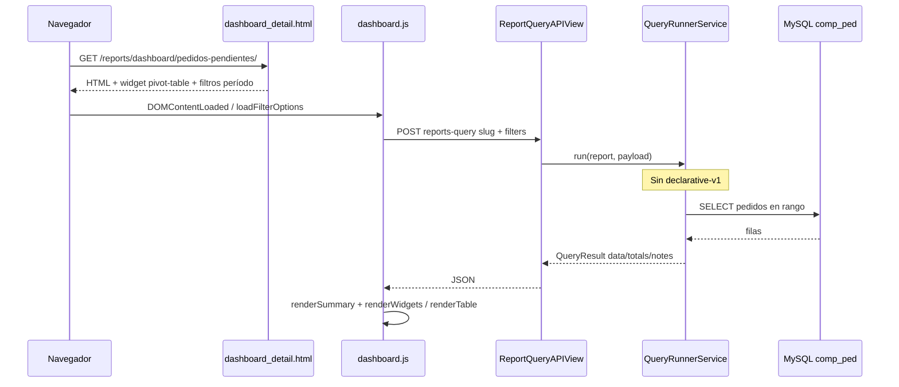

# Arquitectura del reporte Pedidos pendientes

Documento de referencia del flujo **end-to-end** del informe operativo **Pedidos pendientes** en Synap (Django, API REST, MySQL AdministraNET, frontend `dashboard.js`). Complementa la validación funcional y de datos en [VALIDACION_PEDIDOS_PENDIENTES.md](./VALIDACION_PEDIDOS_PENDIENTES.md).

---

## 1. Identidad y alcance

| Concepto | Valor |
|----------|--------|
| **Slug canónico (BD, API y URL)** | `pedidos-pendientes` |
| **Nombre** | Pedidos pendientes |
| **Categoría** | `operational` (permiso `OperationalReportsPermission`) |
| **Compatibilidad URL antigua** | `/reports/dashboard/pending_orders/` → redirección **301** a `/reports/dashboard/pedidos-pendientes/` (`reports/urls.py`). El slug `pending_orders` **no** ejecuta `_run_pending_orders` en el runner (cae en datos de muestra vacíos si se usara sin fila en BD). |
| **URL de detalle** | `/reports/dashboard/pedidos-pendientes/` |

---

## 2. Modelo de datos Synap (PostgreSQL)

### 2.1 Definición del reporte

- **`ReportDefinition`** (`reports.models`): filas por `slug`, opcionalmente por `empresa`.
- **Semilla**: migración `reports/migrations/0015_add_pending_orders_report.py` (nombre histórico del archivo).
  - Crea/actualiza registro global `slug="pedidos-pendientes"`, `empresa=None`.
- **Instalaciones ya migradas**: `reports/migrations/0031_rename_pending_orders_slug_to_pedidos_pendientes.py` renombra `pending_orders` → `pedidos-pendientes`, actualiza `metadata.related_reports` y entradas de `reports_reportworkspace.items`.
  - **`config`** (JSON): `metrics`, `dimensions`, `filters` (objeto con `fecha_inicio`, `fecha_fin`, flags `dia_actual` / `mes_actual` / `año_actual`, `periodo_tipo`), `tags`, `notes`. **No incluye** `version: declarative-v1` en la semilla oficial.
  - **`metadata`**: `related_reports` vacío en 0015; otros reportes pueden referenciar este slug.
  - **`refresh_interval`**: `daily` en semilla (el cliente puede usar intervalos más cortos vía UI).
- **`ReportWidget`**: un widget por reporte, tipo **`pivot-table`**, orden 1.
  - **`configuration`**: `rows` = `["fecha", "nro_comprobante", "estado", "tipo_comprobante"]`, `values` = `["subtotal_desc"]`, `aggregation` = `sum`, paginación, exportable, etc.

### 2.2 Relación con otros artefactos

- `0016_add_sales_summary_report`: `related_reports` incluye `pedidos-pendientes` (en código fuente; BD antigua la corrige 0031).
- `0030_add_total_consolidado_operativo`: metadata menciona `pedidos-pendientes` junto a otros slugs (indicador consolidado; la semántica de fechas del consolidado puede diferir del listado por período; ver [TOTAL_CONSOLIDADO_OPERATIVO_VALIDACION.md](./TOTAL_CONSOLIDADO_OPERATIVO_VALIDACION.md)).

---

## 3. Fuente operativa (MySQL legacy)

- **Base**: nombre en `filters.base_empresa` o sesión / `DEFAULT_BASE_EMPRESA` (misma convención que otros reportes legacy).
- **Tabla**: `comp_ped` (cabecera de pedidos).
- **Filtros de negocio** (fijos en SQL): `TipoComprobante = 'PED'`, `Anulado = 'No'`, `Estado IN ('En preparación', 'Preparado')`.
- **Rango temporal**: `Fecha` entre `fecha_inicio` y `fecha_fin` (resolución vía `_resolve_period_dates` en `QueryRunnerService`).

Detalle de columnas devueltas y criterio VB6: ver [VALIDACION_PEDIDOS_PENDIENTES.md](./VALIDACION_PEDIDOS_PENDIENTES.md).

---

## 4. Capa de ejecución: `QueryRunnerService`

**Archivo**: `reports/services/query_runner.py`.

### 4.1 Orden de decisión en `run()` (crítico)

1. Si `report.config.get("version") == "declarative-v1"` → se delega a **`ReportExecutionEngine`** y **no** se alcanza el `elif` legacy que llama a `_run_pending_orders`.
2. Si no es declarativo → rama legacy con caché opcional (`REPORTS_CACHE_ENABLED`) y luego:
   - `report.slug == "pedidos-pendientes"` → **`_run_pending_orders`**.

**Implicación**: si alguien guarda el reporte desde el Builder con `declarative-v1`, la consulta MySQL específica de pedidos **deja de ejecutarse** salvo que se corrija la prioridad en código o se quite esa versión del config en BD.

### 4.2 `_run_pending_orders`

- Lee `filters` del payload; resuelve fechas con `_resolve_period_dates`; si faltan, devuelve `QueryResult` vacío con nota explicativa.
- Resuelve `base_empresa`; si no hay, devuelve error en `notes`.
- Conexión **MySQL** con charset `latin1` (alineado al legacy).
- **SQL**: selecciona `fecha` (formateada `DD/MM/YYYY`), `nro_comprobante`, `subtotal_desc`; orden `Fecha DESC`, `NroComprobante ASC`. (Tipo PED y estados aplican solo en WHERE.)
- **`totals`**: `total_subtotal_desc` (suma de `subtotal_desc`).
- **`notes`**: texto de período, cantidad de pedidos, total formateado.

### 4.3 Caché y TTL

- `_get_cache_ttl`: `pedidos-pendientes` está en `status_reports` → TTL **300 s** (5 minutos) cuando el caché de reportes está habilitado.

---

## 5. API REST

### 5.1 Consulta

- **Vista**: `ReportQueryAPIView.post` → `reports/api_views.py`.
- **Ruta**: expuesta como `reports-api:reports-query` (ver `reports` API urls del proyecto).
- **Permisos**: operativo o gerencial según categoría del reporte.
- **Payload**: serializado por `ReportQueryRequestSerializer` (`slug`, `limit`, `filters`, …). La sesión puede inyectar `base_empresa` en `filters`.
- **Respuesta**: cuerpo estándar `meta`, `data`, `totals`, `notes` vía `ReportQueryResponseSerializer`.
- **Schema declarativo en la misma respuesta**: solo si `config.version == declarative-v1"`; en ese caso se añaden `schema` (`ReportSchemaService.build_schema`) y `query_result` embebido. Con la semilla **0015** (sin `declarative-v1`), **no** se envían `schema` ni `query_result` en la API de query.

### 5.2 Exportación

- **Vista** de export (PDF/XLSX) usa `ExportService`.
- Tratamiento genérico de filas con `subtotal_desc` y totales `total_subtotal_desc` (mapeo en `export_service.py` para fila de totales en Excel).

### 5.3 Schema HTTP

- Existe `schema_api_url` en contexto del dashboard para el slug del reporte; para reportes **no** declarativos, el schema del Builder no sustituye la ejecución real de `_run_pending_orders`.

---

## 6. Vista Django y plantilla

### 6.1 `DashboardDetailView` (`reports/views.py`)

- Resuelve `ReportDefinition` por slug y empresa.
- **`is_declarative`**: `config.get("version") == "declarative-v1"`.
- Contexto: `report`, `widgets`, URLs de API, `is_declarative`, `report_config_for_script` (JSON del config).

### 6.2 `dashboard_detail.html`

- **Bloque de resumen** `#report-summary`: clase `hidden` si **no** `is_declarative`. En la práctica, `renderSummary` en `dashboard.js` hace `classList.remove("hidden")` al terminar si hay totales que mostrar, así que el resumen **puede mostrarse** tras el primer fetch aunque el servidor haya partido con `hidden`.
- **Filtros**: si **no** es declarativo, rama **legacy** con `includes/filters_period.html` + `filters_interval.html` (período personalizado / día / mes / año, fechas, intervalo de refresco).
- **`#dashboard-root`**: `data-dashboard-url`, `data-report-slug`, `data-is-declarative` alineado con `is_declarative`.
- **Botón Exportar Excel**: visible para `pedidos-pendientes` (misma lista que remitos, ventas netas, etc.).
- **`widget_engine.js`**: se carga si `is_declarative` **o** slug ventas netas. Para `pedidos-pendientes` con config semilla → **no** se carga WidgetEngine en esta página (tabla vía `renderTable` clásico).
- Script declarativo grande: solo dentro de `` → **no** aplica al reporte sembrado como legacy.

---

## 7. Frontend: `dashboard.js`

### 7.1 Clasificación del reporte

- **`legacyReports`** incluye `"pedidos-pendientes"`.
- **`isPedidosPendientesSlug(slug)`**: helper único para condiciones en `dashboard.js`.
- **`detectReportType()`**: con config sin `declarative-v1` y slug en legacy, el informe se trata como **legacy** para la lógica que depende de ese helper.

### 7.2 Filtros (`getFilters` / `applyFilters` / `saveFilters`)

- Rama específica para `isPedidosPendientesSlug(currentReportSlug)`: `periodo_tipo`, `fecha_inicio`, `fecha_fin`, `refresh_interval` (mismo patrón que varios operativos).
- Persistencia en `localStorage` bajo `report_filters_pedidos-pendientes`.

### 7.3 Carga de datos

- `fetchDashboardData` → POST al `data-dashboard-url` con `slug` y `filters`.
- `renderSummary(meta, totals)`: usa `total_subtotal_desc`; hay solapamiento de heurísticas con remitos (clave `total_subtotal_desc` dispara etiquetas pensadas para “remitos” en parte del código; conviene tenerlo en cuenta al rediseñar KPIs).
- `renderWidgets(payload)`:
  - Recorre `[data-widget-id]` del HTML generado para el widget `pivot-table`.
  - Para tipo `pivot-table`: gráfico oculto, **`renderTable` con `show: true`**.
- **`renderTable`**: no usa WidgetEngine para `pedidos-pendientes` (config semilla); construye tabla HTML desde las claves del primer registro; para este slug se pueden excluir columnas por configuración. Cabeceras legibles vía sustitución de `_` y capitalización, formato moneda para columnas detectadas como currency (`subtotal_desc`), hasta 1000 filas, fila de totales en columnas monetarias.

### 7.4 Workspace (multi-informe)

- `loadWorkspaceSlot`: para `pivot-table` y slug `pedidos-pendientes` o `uninvoiced_remitos`, ajusta altura del wrapper de tabla (otros informes ~288px; **pedidos declarativo** en workspace usa más alto para acomodar “Agrupar por” + tabla agrupada).
- Límite de filas en request: reportes de tabla (`isTableReport`) usan `limit` mayor (p. ej. 1000).
- Filtros automáticos por fechas si el widget se considera “legacy” según `reportConfig.version` del ítem guardado (si el workspace guardó config declarativa, la rama de filtros cambia).
- **Panel “Filtros” en workspace** (`dashboard.js`): **`total-consolidado-operativo`** mantiene el bloque operativo (fechas + sucursales + punto de venta + clientes a excluir). **`pedidos-pendientes`** usa un panel distinto (`data-workspace-filter-kind="pedidos-period"`): **Período** (Día / Mes / Año / Personalizado), **Fecha desde / Fecha hasta** e **intervalo de actualización**, misma semántica que `filters_period.html` + `filters_interval.html` del informe en `dashboard_detail.html`. Persistencia por ítem `report_filters_<item_key>` (si `item_key` coincide con el slug del informe, comparte clave con la vista detalle). Al armar el POST, `loadWorkspaceSlot` **elimina** del objeto de filtros las claves propias del consolidado (`sucursales`, `punto_venta`, `clientes_excluidos`, `periodo_tipo`) para no mezclar comportamientos. El backend puede seguir aceptando filtros extra en `_run_pending_orders`; el workspace de pedidos no los envía.
- **Agrupación en workspace** (`widget_engine.js` + `dashboard.js`): para `pedidos-pendientes` en `[data-workspace-mode]` el control **Agrupar por** se renderiza dentro del panel **Filtros** (`#workspace_pedidos_grouping_<safeItemKey>`), para que se oculte al cerrar el panel; la tabla y los toggles de grupos siguen en el cuerpo del slot. Misma lógica y `localStorage` `report_table_grouping_v1_<slug>_<id_widget>` que la vista detalle. El resto de informes declarativos en workspace siguen sin barra de agrupación en slot.
- **Layout del cuerpo del slot (declarativo en workspace)**: el `section` del widget incluye varios `div.relative` dentro del panel de filtros del consolidado. `loadWorkspaceSlot` ancla el motor con **`section.querySelector(":scope > .relative")`** (hijo directo del `section`), no con el primer `.relative` del árbol. Dentro de ese `.relative`, la rama declarativa replica el mismo esqueleto que `buildWorkspaceDOM` para informes legacy: **`[data-widget-content]`** (con el `WidgetEngine` en un hijo **`[data-workspace-mode]`**) y **`[data-widget-table-wrapper]`** oculto, para que el DOM coincida con **pedidos-pendientes** / **total-consolidado-operativo** legacy.
- **Pantalla completa en workspace (`workspace.html` + `dashboard.js`)**: el API Fullscreen añade la clase **`reports-fullscreen`** al `body`. El CSS **oculta el navbar global** (`header.w-full`), el **`padding-top`** compensatorio (`.pt-16`) y la cabecera del tablero (`.workspace-header`: título, intervalo, navegación entre espacios, enlace al catálogo y botón de entrada a fullscreen). Un segundo botón con **`data-fullscreen-toggle`** y clase **`workspace-fullscreen-fab`** queda oculto en ventana normal y visible fijo abajo a la derecha en fullscreen para **salir** del modo. **No** hay reglas extra de grid, flex ni parches JS sobre tablas; el comportamiento de widgets es el mismo que en ventana normal.

### 7.5 Tiempo real y otros

- Inicialización de controles (fullscreen, filtros, realtime) incluye explícitamente `pedidos-pendientes` en varias condiciones junto a remitos, ventas netas, etc.

---

## 8. `ReportSchemaService` (declarativo)

- Para **`pedidos-pendientes`**, tras armar los widgets, **`_pedidos_pendientes_sin_columnas_tipo_y_estado`** excluye las dimensiones y filas de tabla `tipo_comprobante` y `estado` (no se muestran en pantalla ni en export; la consulta `_run_pending_orders` ya no las devuelve).
- **`_pedidos_pendientes_sin_agrupacion_inicial`** fuerza `options.grouping.enabled = false` al servir el schema (sin chips al cargar), pero **conserva** `grouping.fields` del Builder: esos nombres son la lista blanca de dimensiones en el control **Agrupar por** (`widget_engine.js` las intersecta con las columnas de la tabla).
- En **`dashboard_detail.html`**, al cargar con loading visible (`loadDeclarativeDashboard(true)`), se borra `window.declarativeSchemaCache` antes de pedir el schema, para que “Actualizar” no reutilice dimensiones/columnas viejas mientras los datos sí se renuevan.

### Persistencia en el navegador (declarativo)

- **Filtros**: `localStorage` con clave `report_filters_<slug>` (mismo criterio que otros dashboards). La primera carga de datos la dispara **`initializeFilters()`**: tras generar controles y un breve delay, aplica filtros guardados y llama `loadDeclarativeDashboard(true, savedFilters)`; **no** se ejecuta un `loadDeclarativeDashboard()` previo al inicio del script (evita un primer POST con valores por defecto y un segundo con filtros guardados).
- **Agrupación de tabla** (`WidgetEngine`): clave `report_table_grouping_v1_<slug>_<id_widget>`, valor JSON `{"fields":["dim1","dim2"]}`. Si la clave **existe** (incluso con `fields: []`), se usa esa preferencia; si **no** existe, se aplica la del schema (`grouping.enabled` / `grouping.fields`). Al cambiar chips en “Agrupar por”, se guarda automáticamente.
- **Exportación Excel** (`reports/services/export_service.py`): el orden y el conjunto de columnas siguen la misma lógica que la tabla en pantalla — en declarativo, `ReportSchemaService.build_schema` + primer widget `table` (`table_dimensions` / `table_metrics`); en **pedidos pendientes** (legacy), orden preferido `fecha`, `nro_comprobante`, `cliente`/`nombre_cliente` si existen, `subtotal_desc`, sin `tipo_comprobante` ni `estado`.

### Flujo de renderizado (declarativo) y por qué podían seguir viéndose columnas

1. **Carga de página** (`is_declarative` según `config.version == declarative-v1` en `ReportDefinition`): se incluye `widget_engine.js`; el script inline ejecuta **`initializeFilters()`** → al terminar la preparación de filtros, `loadDeclarativeDashboard` → `GET …/schema/` → `POST …/query/`.
2. **Schema** (`ReportSchemaService.build_schema`): dimensiones del informe + `default_widgets` con `options` copiados del `ReportWidget.configuration` (incluye `legacy_config.rows`, y si el Builder guardó columnas de tabla, **`table_dimensions`**).
3. **Tabla** (`WidgetEngine.renderTable`): si existe **`options.table_dimensions`** (array no vacío), las columnas son **solo** las dimensiones cuyo `name` está en esa lista; en esa rama **no** se aplicaban antes las exclusiones por slug. Por eso, aunque el SQL ya no devolviera `tipo_comprobante`/`estado`, si seguían en `table_dimensions` o en dimensiones del schema, los encabezados seguían generándose (celdas vacías o datos viejos si había caché).
4. **Corrección**: en `schema_service._pedidos_pendientes_sin_columnas_tipo_y_estado` se sanitiza también `table_dimensions`; en `widget_engine.js`, tras armar `filteredDimensions`, se vuelve a filtrar para `pedidos-pendientes`. Migración **`0033_pedidos_pendientes_quitar_table_dimensions_tipo_estado`** limpia en BD `config.dimensions`, `options.visual_fields_order`, `configuration.rows` y `configuration.table_dimensions`.

### Vista legacy (sin declarative-v1)

- No se carga el bloque declarativo; **`dashboard.js`** hace `renderTable` con `Object.keys(data[0])` (menos exclusiones). Ahí también se excluyen `tipo_comprobante` y `estado` por slug.
- En el resto de reportes declarativos no se altera el `grouping` guardado en el widget.
- Cualquier cambio futuro en dimensiones del informe declarativo debe mantenerse alineado con la consulta real (`_run_pending_orders` o motor declarativo).

---

## 9. Diagrama de flujo (vista detalle legacy, semilla 0015)

---

## 10. Puntos frágiles para un rediseño

1. **`declarative-v1` vs `_run_pending_orders`**: la primera condición en `run()` gana; riesgo de datos vacíos o motor incorrecto si el config en BD cambia.
2. **POST API con slug incorrecto**: debe usarse `slug: "pedidos-pendientes"`; `pending_orders` no tiene fila tras la migración 0031.
3. **Resumen KPI**: plantilla oculta el bloque hasta que JS lo muestre; la etiqueta para `total_subtotal_desc` puede confundirse con remitos en `renderSummary`.
4. **Widget pivot en BD vs columnas SQL**: las `rows` del widget listan dimensiones conceptuales; la tabla real la arma el backend + `Object.keys(data[0])` en el cliente — cualquier nueva columna SQL debe reflejarse en export y en expectativas de usuario.
5. **Migración 0015**: comprueba `information_schema` en esquema **`public`** (PostgreSQL); en entornos solo MySQL para Synap, el `RunPython` puede saltar creación si la tabla no existe ahí (comportamiento heredado de la migración).

---

## 11. Archivos tocados por el reporte (checklist de código)

| Área | Archivos relevantes |
|------|---------------------|
| Semilla + rename | `0015_add_pending_orders_report.py`, `0031_rename_pending_orders_slug_to_pedidos_pendientes.py` |
| Query | `reports/services/query_runner.py` (`run`, `_run_pending_orders`, TTL, `_resolve_period_dates`) |
| API | `reports/api_views.py` (`ReportQueryAPIView`), serializers de query |
| Export | `reports/services/export_service.py` (`_resolve_export_headers`, `subtotal_desc` / `total_subtotal_desc`) |
| Vista | `reports/views.py` (`DashboardDetailView`) |
| Rutas página | `reports/urls.py` |
| UI | `reports/templates/reports/dashboard_detail.html`, `reports/includes/filters_period.html`, `filters_interval.html` |
| JS | `reports/static/reports/js/dashboard.js`, `reports/static/reports/js/widget_engine.js` (declarativo: tabla y agrupación) |
| Workspace | mismo `dashboard.js` + `workspace.html` (slots) |
| Validación negocio | [VALIDACION_PEDIDOS_PENDIENTES.md](./VALIDACION_PEDIDOS_PENDIENTES.md) |

---

*Última revisión estructural: documento alineado al código en rama de desarrollo tras restaurar cambios locales experimentales; si se modifica `run()`, la plantilla o los slugs, actualizar este archivo en el mismo cambio funcional.*
