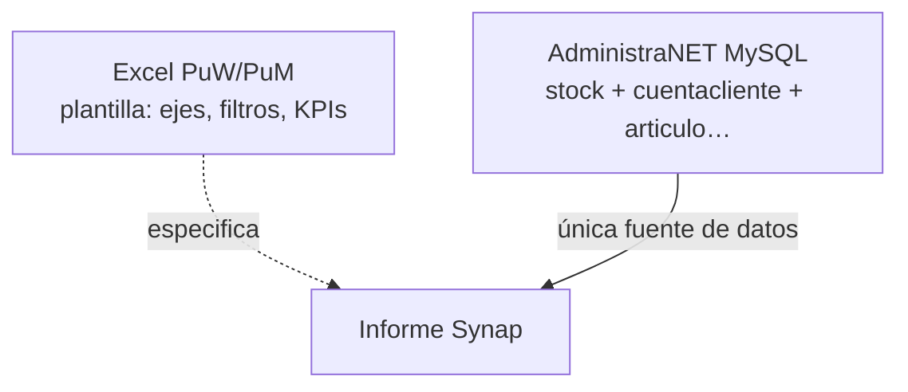

# Mapeo PuW / PuM → AdministraNET

**Fecha:** 29/07/2026  
**Fuente Excel (solo plantilla):** `Reporte Ventas Marcas con detalles Vs.xlsx`  
**Hojas de producto:** `PuW mensual Hombre`, `PuM mensual`  
**Datos operativos:** **solo AdministraNET** (`stock` ⋈ `cuentacliente` ⋈ catálogo). No hay históricos Excel ni Dropbox a sincronizar.

**Rol del Excel:** base de **estructura, métricas, filtros y fórmulas** del informe a construir en Synap. No es fuente de datos ni referente de paridad numérica.

**Estado:** mapeo + validación de catálogo/joins contra MySQL Best Sox (`empresas.base_empresa = administranet`, host LAN).  
**Confirmado por producto:** `SuperArt` = `articulo.id_manual`; marcas = tabla `marca` de AdministraNET; sin históricos.

---

## 0. Encaje



El informe Synap debe **reproducir la lógica de PuW/PuM** (agregados, filtros de página, KPIs), leyendo **directo de AdministraNET**. `VtaPlanas` en el Excel era solo el extract histórico; en Synap **no** se materializa.

Referencia de análisis previo: [ANALISIS_BEST_REPORTE_VENTAS_MARCAS_VS.md](ANALISIS_BEST_REPORTE_VENTAS_MARCAS_VS.md).  
**Plan de implementación:** [PLAN_INFORME_VENTAS_MARCAS_MENSUAL.md](PLAN_INFORME_VENTAS_MARCAS_MENSUAL.md).  
**SPEC / slug:** [SPEC_INFORME_VENTAS_MARCAS_MENSUAL.md](SPEC_INFORME_VENTAS_MARCAS_MENSUAL.md) (`ventas-marcas-mensual`).  
SQL de referencia Synap: `reports/services/ventas_objetivos_bo_runner.py` (`sql_venta_por_art`); runner del informe: `reports/services/ventas_marcas_mensual_runner.py`.

---

## 1. Grano del pivot (lo que se muestra)

| Eje | Excel | AdministraNET |
|-----|-------|---------------|
| **Filas** | `Ven` → `Nombre` (cliente) | `cuentacliente.CodViajante` / `viajantes` → `cuentacliente.Codigo` / `cliente.nombre_cliente` |
| **Columnas** | `AñoMes` (`yyyyMM`) | `DATE_FORMAT(cuentacliente.Fecha, '%Y%m')` |
| **Valores (PuW)** | `Suma de Cantidad` + `Suma de SubTot.2` | Ver §3 |
| **Valores (PuM)** | `Suma de Canti_3` + `Suma de SubTot.2` | Ver §3 |

Una celda del pivot = suma de renglones de venta que pasan los filtros de página (§2), agrupados por vendedor + cliente + mes.

---

## 2. Filtros del informe (desde el Excel → UI / WHERE Synap)

Los filtros de página del pivot Excel son el **contrato de filtros** del informe. Valores de la copia = ejemplo de uso; en Synap son controles de usuario sobre AdministraNET.

### 2.1 Comunes a PuW y PuM

| Filtro (Excel / Synap) | Ejemplo en copia | Campo / expresión AdministraNET | Notas |
|------------------------|------------------|----------------------------------|-------|
| **Marca** | PuW=`PUW`; PuM=`PUM` | `marca.NombreMarca` / `articulo.CodigoMarca` | **Validado Best Sox:** `PUM`→`CodMarca=13`, `PUW`→`15`. Filtro obligatorio o multi-marca |
| **Fecha / período** | `(All)` / varios | `cuentacliente.Fecha` | Rango desde–hasta del informe |
| **Tipo comprobante** (`Codigo`) | `(All)` / `(Todas)` | `cuentacliente.TipoComprobante` ∈ `FA,FB,FC,FE,FM,NCA,NCB,NCC,NCE,NCM` | Whitelist ventas Synap (VO); no hace falta mapa `FC1` BEST |
| **Comprobante** | `(All)` | `cuentacliente.NroComprobante` | Opcional |
| **Módulo** | `(All)` / `D` en extract | *Sin equivalente claro* | Omitir en MVP salvo que negocio defina canal/PV |
| **SuperArt** | PuW subset; PuM todas | **`articulo.id_manual`** | Multi-selección. Usar `id_manual` completo (no sufijos del Excel viejo) |

### 2.2 Específico PuW «Hombre» — inferencia desde datos

En el extract (`Marca=PUW`), **`Calidad` parte el universo sin solape de SuperArt**:

| Calidad | Filas | SuperArt (únicos) | SubR asociado |
|---------|-------|-------------------|---------------|
| `H` | 2.754 | 13 códigos (solo H) | `HOMBRES` o `MEDIAS Todas` |
| `M` | 242 | 7 códigos (solo M) | solo `MUJERES` |

- SuperArt H ∩ M = **∅** → «Hombre» ≡ filtrar la lista de `id_manual` de Calidad H (o excluir los de M).
- Lista Excel Calidad=H: `1064, 4095, 4101, 5037, 5520, 5522, 5785, 5787, 6950, 7307, 7309, 7838, 8869`.
- En catálogo actual Best Sox, varios de esos sufijos mapean a `id_manual` PUW: `5520`→`935520`, `5785`→`935785`, `7307`→`907307`, `8869`→`888869` (hombre: Boxer/Tee); mujer: `6872`→`906872` (*Woman*), `7854`→`907854` (*Women*).

**En AdministraNET no existe columna `Calidad` ni CE de género** (`articulo_ce` solo tiene TALLES=1, COLOR=2). Subrubros PUM/PUW en LAN están genéricos (`Sub Rubro 1`).

**Opciones de implementación (a confirmar con negocio):**

1. **Filtro multi-`id_manual`** (como SuperArt Multiple Items del Excel) — recomendada para v1.  
2. Heurística por nombre (`Woman`/`Women`/`Mujer` ⇒ mujer).  
3. Atributo maestro género/colección si se carga a futuro.

**Conclusión:** «Hombre» = subset de `id_manual` (inferido del Excel); no hay campo ERP nativo de género. Congelar lista contra catálogo actual AdministraNET, no contra extract histórico.

### 2.3 Filtros fijos Synap (universo de ventas)

Aplicar siempre (como VO / `sql_venta_por_art`):

```text
cc.Anulado = 'No'
cc.CodigoMovimiento <> 0
cc.TipoComprobante IN ('FA','FB','FC','FE','FM','NCA','NCB','NCC','NCE','NCM')
st.Anulado = 'No'
st.TipoComp IN ('Venta','Venta TPV','Devol - Cliente','ND Anul NC')
```

Join núcleo:

```sql
FROM stock st
INNER JOIN cuentacliente cc ON cc.CodigoMovimiento = st.CodigoMovimiento
INNER JOIN cliente cl ON cl.Codigo = cc.Codigo
LEFT JOIN articulo art ON art.IDArt = st.IDArt
LEFT JOIN marca ON marca.CodMarca = art.CodigoMarca
LEFT JOIN viajantes v ON v.CodViajante = cc.CodViajante
-- + rubro/subrubro/modelo/unidmed/CE según filtros
```

---

## 3. Métricas del cuerpo del pivot

### 3.1 Facturación — `SubTot.2` (post-pie)

| Excel | Semántica | AdministraNET | Expresión Synap canónica |
|-------|-----------|---------------|---------------------------|
| `SubTot.2` | Neto de línea post descuentos 1/2/3 **y pie de FA** | `stock.PrecioNetoxR` + factor cabecera | `SUM(signo × PrecioNetoxR × factor_cabecera)` |

**Factor cabecera (descuento al pie):** compartido VMM/DABRA en `reports/services/comprobante_descuento_cabecera.py`:

- Python: `factor_descuento_cabecera(SubTotal1, SubtotalDesc)` → `SubtotalDesc / SubTotal1` (o 1 si `SubTotal1=0` o `SubtotalDesc` nulo).
- SQL: `sql_factor_descuento_cabecera_expr()`; importe VMM: `sql_signo_imp_post_pie_expr()` en `ventas_marcas_mensual_rules.py`.
- DABRA re-importa el helper desde `dabra_consolidado_remitos` (sin cambio funcional).

**Validación:** smoke sobre AdministraNET (misma marca/período): `SUM(signo × PrecioNetoxR × factor)` coherente con totales del informe y con `SubtotalDesc` de cabecera (tolerancia redondeo por línea).

**Filtro marca parcial:** el factor es por `CodigoMovimiento` completo; al filtrar una marca, cada renglón visible recibe el mismo factor del FA (paridad AdministraNET/DABRA). Ver [SPEC_INFORME_VENTAS_MARCAS_MENSUAL.md](SPEC_INFORME_VENTAS_MARCAS_MENSUAL.md) §3.1.

Cadena de descuentos en el extract (referencia):

| Extract | ERP |
|---------|-----|
| `PreUni` ≈ `PrecioVentaxU` / lista | `stock.PrecioVentaxU` |
| `Dto.1` / `Dto.1.$` | `stock.PorDesc` / `stock.ImpDesc` (y/o bonif) |
| `Dto.2` / `Dto.3` | Descuentos adicionales de línea / promoción |
| `SubTot.2` | `stock.PrecioNetoxR` (pre-pie) × factor cabecera FA |
| Pie FA | `cuentacliente.PorDesc1`/`ImpDesc1` → `SubtotalDesc` vs `SubTotal1` |

### 3.2 Cantidad — PuW vs PuM

| Hoja | Campo pivot | Semántica Excel | AdministraNET |
|------|-------------|-----------------|---------------|
| **PuW** | `Cantidad` | Unidades de **venta/pack** (P1/P2/P3/P6) | `stock.Cantidad` con signo FA/NC (igual que VO) |
| **PuM** | `Canti_3` | **Docenas de pares** | **Calculado** (no hay columna ERP) |

Regla documentada del extract:

| `UnidMed` | Pares/pack | `Canti_2` (= 12/pares) | `Canti_3` |
|-----------|------------|------------------------|----------|
| P1 | 1 | 12 | `Cantidad/12` |
| P2 | 2 | 6 | `Cantidad/6` |
| P3 | 3 | 4 | `Cantidad/4` |
| P6 | 6 | 2 | `Cantidad/2` |
| CU | n/a | 1 | = `Cantidad` (ajustes) |

**Origen ERP del factor pack — validado Best Sox:**

Tabla `unidmed` contiene exactamente los códigos del extract: `P1`(11), `P2`(12), `P3`(13), `P6`(14), `CU`(10).  
En ventas recientes PUM, `articulo.id_unimed` → `P3` y `stock.multiplicador_vta = 1` (no sirve como `Canti_2`).

| `unidmed.nombre_unimed` | Factor tipo Excel `Canti_2` | Docenas |
|-------------------------|----------------------------|---------|
| P1 | 12 | `Cantidad/12` |
| P2 | 6 | `Cantidad/6` |
| P3 | 4 | `Cantidad/4` |
| P6 | 2 | `Cantidad/2` |
| CU | 1 | `Cantidad` |
| UNIDAD / UNI / UNIDADES | 1 | Misma semántica que CU (unidad suelta AdministraNET); no avisar como U.M. desconocida |

```text
docenas_pares = cantidad_neta / factor_canti2(COALESCE(st.nombre_unimed_vta, um.nombre_unimed))
```

### 3.3 Dimensiones de fila

| Excel | AdministraNET | Notas |
|-------|---------------|-------|
| `Ven` | Preferir `cuentacliente.CodViajante` | VO a veces usa `cliente.CodViajante` para alcance; para paridad pivot usar el del **comprobante** |
| `Vend.Nombre` (hechos) / agrupación | `viajantes.Nombre` | |
| `Nombre` (cliente) | `cliente.nombre_cliente` | Código: `cuentacliente.Codigo` |
| `AñoMes` | `DATE_FORMAT(cc.Fecha, '%Y%m')` | |

---

## 4. KPIs de cabecera (sobre el total del pivot filtrado)

| Celda / etiqueta | Fórmula Excel | Origen AdministraNET / Synap |
|------------------|---------------|------------------------------|
| **TC** (`D1`) | Valor manual `14,5817` | **No está en ventas ERP.** Parámetro externo (cotización). En diseño costo BEST: `bsv_parametro` grupo `tc` ([DISENO_MOTOR_COSTO…](../mpr/best/DISENO_MOTOR_COSTO_STOCK_VALORIZADO_SYNAP.md)) |
| **Unidades** (PuW `D2`) | `GETPIVOTDATA("Cantidad")` | `SUM(cantidad_neta)` packs — §3.2 |
| **Unidades** (PuM `D2`) | `GETPIVOTDATA("Canti_3")` | `SUM(docenas_pares)` — §3.2 |
| **Docenas** (PuM `D3`/`E8`) | Mismo `Canti_3` total | Idem |
| **Facturacion** (`D4`←`C8`) | `GETPIVOTDATA("SubTot.2")` | `SUM(PrecioNetoxR con signo)` |
| **Precio medio** (`E4`) | `Facturacion / Unidades` | Calculado |
| **Regalias** (`D5`) | `Facturacion * 13%` | **No hay tabla ERP.** `SUM(neto) * tasa_marca`. Tasa por marca → config Synap (`bsv_parametro` grupo `regalia` o tabla análoga) |
| **Regalias / TC** (`D6`) | `Regalias / TC` | Calculado |
| Gap vs target (`F*`/`G*`) | Target pegado − real | Targets **no** en extract; en Synap → `viajantes_objetivos_ventas` u objetivos por marca (si se modelan) |

---

## 5. Bloque proyección / trimestres (fuera del pivot “puro”)

No salen de AdministraNET. Son **parámetros de planning** sobre el histórico:

| Elemento Excel | Ejemplo | Cómo obtenerlo en Synap |
|----------------|---------|-------------------------|
| Coeficientes | `x1,2`, `x1,25`, `x1,07`, `x1,15`, `x1,17` | Persistidos como escenario por marca/año **o** no portar en MVP |
| Proyección mes | `CEILING(mes_real * coef, 1)` | Calculado en app |
| `q1`…`q4` | Suma meses + proyecciones | Calculado; divisores en fila 12 (BD12…) son constantes de tipo cambio/índice pegadas |
| Notas | «Pasar la diferencia a oct», «Lw + SW mujer» | Texto operativo; fuera de alcance datos |

---

## 6. Diccionario completo: campos del extract usados por el pivot

Aunque `VtaPlanas` no es el reporte, el PivotCache lee estas columnas. Mapeo para construir el mismo agregado desde AdministraNET:

| Columna extract | ¿La usa el pivot PuW/PuM? | AdministraNET |
|-----------------|---------------------------|---------------|
| `AñoMes` | Sí (columna) | `DATE_FORMAT(cc.Fecha,'%Y%m')` |
| `Fecha` | Filtro página | `cc.Fecha` |
| `Suc` | No en pivot visible | `cc.CodSucursal` |
| `SuperArt` | Filtro página | **`articulo.id_manual`** | Familia; varias CE por código |
| `Articulo` | No en vista pivot | `art.IDArt` / `id_manual` |
| `Descripcion` | No | `art.NombreArticulo` / `st.Descripcion` |
| `Talle` / `ColorNom` | No | `articulo_val_ce` (CE 1/2 típicos) |
| `Temporada` / `Calidad` | Posible filtro género PuW | CE empresa |
| `Codigo` | Filtro tipo | Mapear → `cc.TipoComprobante` |
| `Comprobante` | Filtro | `cc.NroComprobante` |
| `Cliente` / `Nombre` | Filas (`Nombre`) | `cc.Codigo` / `cl.nombre_cliente` |
| `Rubro` / `SubR` | Posible filtro género | `rubro` / `subrubro` |
| `Marca` | Filtro página | `art.CodigoMarca` |
| `Costo` | No en pivot | `st.PrecioCostoxU` |
| `Cantidad` | **Valor PuW** | `st.Cantidad` ± |
| `Canti_2` | Factor (no mostrado) | Derivado U.M./multiplicador |
| `Canti_3` | **Valor PuM** | Calculado |
| `UnidMed` | Implícito en Canti_2 | `st.nombre_unimed_vta` / presentación |
| `SubTot.2` | **Valor $ ambas** | `st.PrecioNetoxR` ± |
| `Modulo` | Filtro | Sin map claro |
| `Pedido` | No | `st.codmov_pedido` / `NroPedido` |
| `Ven` / `Vend.Nombre` | Filas | `cc.CodViajante` / `viajantes.Nombre` |

---

## 7. SQL de referencia — cuerpo del pivot (una marca)

```sql
SELECT
  cc.CodViajante AS ven,
  COALESCE(v.Nombre, '') AS vend_nombre,
  cc.Codigo AS codigo_cliente,
  COALESCE(cl.nombre_cliente, '') AS nombre_cliente,
  DATE_FORMAT(cc.Fecha, '%Y%m') AS anio_mes,
  SUM(CASE
    WHEN cc.TipoComprobante IN ('FA','FB','FC','FE','FM') THEN COALESCE(st.Cantidad, 0)
    WHEN cc.TipoComprobante IN ('NCA','NCB','NCC','NCE','NCM') THEN -COALESCE(st.Cantidad, 0)
    ELSE 0 END) AS cantidad_packs,
  -- docenas: ajustar factor cuando se valide pares_por_pack
  SUM(CASE
    WHEN cc.TipoComprobante IN ('FA','FB','FC','FE','FM') THEN COALESCE(st.Cantidad, 0)
    WHEN cc.TipoComprobante IN ('NCA','NCB','NCC','NCE','NCM') THEN -COALESCE(st.Cantidad, 0)
    ELSE 0 END) / NULLIF(/* Canti_2 equivalente */, 0) AS canti_3_docenas,
  SUM(CASE
    WHEN cc.TipoComprobante IN ('FA','FB','FC','FE','FM') THEN COALESCE(st.PrecioNetoxR, 0)
    WHEN cc.TipoComprobante IN ('NCA','NCB','NCC','NCE','NCM') THEN -COALESCE(st.PrecioNetoxR, 0)
    ELSE 0 END) AS subtot_2
FROM stock st
INNER JOIN cuentacliente cc ON cc.CodigoMovimiento = st.CodigoMovimiento
INNER JOIN cliente cl ON cl.Codigo = cc.Codigo
LEFT JOIN articulo art ON art.IDArt = st.IDArt
LEFT JOIN viajantes v ON v.CodViajante = cc.CodViajante
WHERE cc.Fecha BETWEEN %s AND %s
  AND cc.Anulado = 'No'
  AND cc.CodigoMovimiento <> 0
  AND cc.TipoComprobante IN ('FA','FB','FC','FE','FM','NCA','NCB','NCC','NCE','NCM')
  AND st.Anulado = 'No'
  AND st.TipoComp IN ('Venta','Venta TPV','Devol - Cliente','ND Anul NC')
  AND art.CodigoMarca = %s   -- o JOIN marca m WHERE m.NombreMarca IN ('PUW','PUM')
  -- AND a.id_manual IN (...)  -- SuperArt / filtro Hombre PUW
GROUP BY cc.CodViajante, v.Nombre, cc.Codigo, cl.nombre_cliente, DATE_FORMAT(cc.Fecha, '%Y%m')
```

KPIs:

```text
Facturacion = SUM(subtot_2)
Unidades_PuW = SUM(cantidad_packs)
Unidades_PuM = SUM(canti_3_docenas)
Regalias    = Facturacion * tasa_regalia(marca)   -- default 0.13
Regalias_TC = Regalias / TC
```

---

## 8. Validación contra empresa Best Sox (29/07/2026)

**Conexión:** MySQL LAN `empresas.id_empresa=1` «Best Sox» → `base_empresa=administranet`.

| Chequeo | Resultado |
|---------|-----------|
| Marcas `PUM`/`PUW`/`LEV`/`REE`/… | OK en `marca` (22 filas; PUM=13, PUW=15) |
| `SuperArt` = `id_manual` | OK (varias CE por `id_manual`; Excel a veces usa sufijo corto) |
| U.M. `P1`…`P6`,`CU` | OK en `unidmed` |
| CE | Solo TALLES / COLOR — sin Calidad/género |
| Factor docenas | Usar mapa U.M. → `Canti_2`; `multiplicador_vta`≈1 en muestra |
| «Hombre» | Inferible: lista `id_manual` Calidad H (disjoint de M); sin columna ERP |
| Ventas PUM/PUW en LAN | Solo **24/07/2026–29/07/2026** (cutover reciente): PUM 1063 renglones / 12.746 packs / \$77.238.153; PUW 219 / 560 / \$7.171.360 |
| Históricos Excel | **No aplican:** no hay histórico; el Excel es solo plantilla de cálculo/filtros |

**Validación operativa:** contra AdministraNET (catálogo, joins, filtros §2, factores U.M.). No se busca paridad con filas del Excel.

| # | Aún abierto | Acción |
|---|-------------|--------|
| 1 | Lista canónica `id_manual` «Hombre» PUW | Congelar contra catálogo actual (Calidad H del Excel solo como pista) |
| 2 | Tasa regalía / TC | Params UI + `cotizacion` (Fase 2 implementada) |
| 3 | Proyección / coeficientes | Fase 2 implementada (`incluir_proyeccion`, coef 1,07) |
| 4 | Módulo / canal | Confirmar si se filtra o se ignora |

---

## 9. Diferencias PuW vs PuM (checklist producto)

| Aspecto | PuW mensual Hombre | PuM mensual |
|---------|--------------------|-------------|
| Marca | `PUW` | `PUM` |
| Métrica cantidad | Packs (`Cantidad`) | Docenas (`Canti_3`) |
| SuperArt | Multiple (subset) | Todas |
| Género | Implícito «Hombre» | No |
| KPI cabecera unidades | Sobre `Cantidad` | Sobre `Canti_3` (+ etiqueta Docenas) |
| Regalías / TC | Igual lógica 13% / TC | Igual |
| Proyección | Coefs propios | Coefs propios (+ notas operativas) |

En Synap: **un solo informe** con parámetro marca + toggle **packs | docenas** + filtro opcional género/SuperArt cubre ambas hojas.
