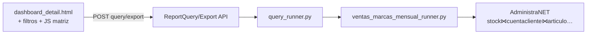

# Plan detallado — Informe ventas marcas mensual (PuW / PuM)

**Fecha:** 29/07/2026  
**Empresa piloto:** Best Sox (`administranet`)  
**Plantilla de negocio:** Excel `Reporte Ventas Marcas con detalles Vs.xlsx` (hojas `PuW mensual Hombre`, `PuM mensual`)  
**Fuente de datos:** solo AdministraNET. Sin históricos Excel ni paridad numérica con la planilla.

**Docs base:**

- [MAPEO_PUW_PUM_ADMINISTRANET.md](MAPEO_PUW_PUM_ADMINISTRANET.md) — filtros, métricas, SQL de referencia  
- [ANALISIS_BEST_REPORTE_VENTAS_MARCAS_VS.md](ANALISIS_BEST_REPORTE_VENTAS_MARCAS_VS.md) — ingeniería inversa  
- [SPEC_INFORME_VENTAS_POR_VENDEDOR.md](SPEC_INFORME_VENTAS_POR_VENDEDOR.md) — patrón de clon UI/registro

**Estado del plan (29/07/2026):** Fase 1 **implementada**; Fase 2 **implementada** (regalías, TC, proyección, deep-link CC). Ver [SPEC_INFORME_VENTAS_MARCAS_MENSUAL.md](SPEC_INFORME_VENTAS_MARCAS_MENSUAL.md).

---

## 1. Decisión de producto (cerradas)

| Pregunta | Decisión MVP |
|----------|--------------|
| ¿Qué se entrega? | **Vista tipo pivot** Ven → Cliente × **AñoMes**, con totales y KPIs de cabecera. Export Excel del mismo universo. |
| ¿Detalle tipo `VtaPlanas`? | **No** como pantalla principal. Export puede incluir hoja/detalle renglón en fase 1.1 si se pide. |
| ¿«Vs» = YoY? | **No** en MVP. Es nombre del pack BEST. |
| ¿Marcas? | Filtro multi-marca sobre `marca` AdministraNET (PUM/PUW y resto). Sin hardcode exclusivo. |
| ¿Unidades? | Toggle **packs \| docenas** (cubre PuW y PuM en un solo informe). |
| ¿«Hombre» PuW? | Filtro opcional multi-`id_manual` (SuperArt). Lista sugerida editable; sin CE género en ERP. |
| ¿Regalías / TC / proyección? | **Fase 2** (implementada): params UI + KPIs + matriz proy + export. Sin `mpr_costo_parametro`. |
| ¿Command Center? | **Fase 2** (implementada): deep-link al dashboard con período/sucursal. |
| ¿Históricos? | No hay. Validar solo contra AdministraNET (smoke SQL + UI). |

**Slug canónico:** `ventas-marcas-mensual`  
**Nombre catálogo:** «Ventas marcas mensual»  
**URL:** `/reports/dashboard/ventas-marcas-mensual/` (+ redirect corto opcional `/reports/ventas-marcas-mensual/`)

---

## 2. Entregable MVP (qué ve el usuario)

### 2.1 Cabecera / KPIs (sobre el universo filtrado)

| KPI | Cálculo |
|-----|---------|
| Unidades / Docenas | `SUM(packs)` o `SUM(docenas)` según toggle |
| Facturación | `SUM(PrecioNetoxR con signo FA/NC)` |
| Precio medio | Facturación / Unidades (0 si unidades = 0) |

Sin regalías, TC, gap vs objetivo ni coeficientes de proyección en MVP.

### 2.2 Matriz

| Eje | Contenido |
|-----|-----------|
| Filas | Vendedor (`CodViajante` / nombre) → Cliente (`Codigo` / `nombre_cliente`) |
| Columnas | Un mes por `yyyyMM` presente en el período (orden ascendente) + columna **Total** |
| Celdas por mes | Unidades (packs o docenas) + Facturación |
| Totales fila | Suma de meses visibles |

Expansión/colapso por vendedor (mismo espíritu VO/VPV; `localStorage` con clave del slug).

### 2.3 Filtros UI (contrato Excel → Synap)

| Filtro | Control | Backend |
|--------|---------|---------|
| Período | Desde–hasta (dd/MM/yyyy) | `cc.Fecha` |
| Marca | Multi-tags (`/api/reports/filters/?type=marcas`) | `art.CodigoMarca` / `marca` |
| SuperArt | Multi-tags `id_manual` (nuevo endpoint o type) | `art.id_manual IN (...)` |
| Unidades | Toggle packs / docenas | Solo presentación + expresión SQL docenas |
| Sucursal / PV | Igual familia VPV (reutilizar include) | Igual VO |
| Cliente / vendedor incl/excl | Reutilizar | Igual VO |
| Tipo comprobante | Fijo whitelist Synap (sin UI) | FA/FB/FC/FE/FM + NC* |
| Comprobante / Módulo | **Omitidos MVP** | — |

Filtros fijos siempre (universo ventas VO): `Anulado='No'`, tipos y `st.TipoComp` según [MAPEO §2.3](MAPEO_PUW_PUM_ADMINISTRANET.md).

### 2.4 Export

- Excel: una hoja matriz (o filas planas Ven / Cliente / AñoMes / unidades / facturación — preferible **plana** para pivotar en Excel del usuario).
- Mismos filtros que la consulta en pantalla.
- Nombre: `Ventas_marcas_mensual_{desde}_{hasta}.xlsx`.

---

## 3. Arquitectura técnica



### 3.1 Por qué runner nuevo (no solo flag en VO)

El grano **Ven × Cliente × AñoMes** con columnas dinámicas de mes **no** encaja en el árbol VPV (vendedor→estado→cliente→rubro→artículo). Reutilizar de VO/VPV:

- Parser de período, sucursal/PV, clientes/vendedores, marcas  
- Whitelist FA/NC y joins de `sql_venta_por_art`  
- UI canónica dashboard + tags-filter + export pipeline  

**No** reutilizar el armado de árbol VO ni columnas objetivo/REM/BO.

**Archivo nuevo:** `reports/services/ventas_marcas_mensual_runner.py`  
**Entrada:** `run_ventas_marcas_mensual(report, payload, user) -> QueryResult`

### 3.2 SQL núcleo (MVP)

Agregado (una query o CTE):

```text
SELECT
  cc.CodViajante, viajante.Nombre,
  cc.Codigo, cliente.nombre_cliente,
  DATE_FORMAT(cc.Fecha, '%Y%m') AS anio_mes,
  SUM(signo * st.Cantidad) AS packs,
  SUM(signo * st.Cantidad / factor_canti2(U.M.)) AS docenas,
  SUM(signo * st.PrecioNetoxR) AS facturacion
FROM stock st
JOIN cuentacliente cc …
JOIN articulo art …
[+ filtros marca, id_manual, sucursal/PV, cliente/vendedor]
GROUP BY ven, cliente, anio_mes
```

`factor_canti2`: mapa fijo P1→12, P2→6, P3→4, P6→2, CU→1 desde `COALESCE(st.nombre_unimed_vta, unidmed.nombre_unimed)` ([MAPEO §3.2](MAPEO_PUW_PUM_ADMINISTRANET.md)).

Normalizar tipos con `core.utils.administranet_types` en parámetros/filtros.

### 3.3 Contrato JSON (borrador)

```json
{
  "meta": {
    "extra": {
      "modo_unidades": "packs|docenas",
      "meses": ["202607", "202608"],
      "kpis": { "unidades": 0, "facturacion": 0, "precio_medio": 0 },
      "filas": [
        {
          "tipo": "vendedor",
          "cod": 1,
          "nombre": "…",
          "totales_mes": { "202607": { "u": 0, "f": 0 } },
          "total": { "u": 0, "f": 0 },
          "clientes": [
            {
              "cod": "C1",
              "nombre": "…",
              "valores_mes": { "202607": { "u": 0, "f": 0 } },
              "total": { "u": 0, "f": 0 }
            }
          ]
        }
      ]
    }
  }
}
```

Frontend: render matriz a partir de `meses` + `filas` (sin pivotar en el browser sobre 27k hechos).

### 3.4 Registro Synap (checklist archivos)

| Pieza | Acción |
|-------|--------|
| Migración `ReportDefinition` | `update_or_create` slug `ventas-marcas-mensual` (patrón `0030_…`) |
| `query_runner.py` | Delegar al runner nuevo |
| `views.py` | `BUILDER_HYBRID_SLUGS` |
| `catalog_service.py` | Catálogo listados |
| `urls.py` | Redirect corto opcional |
| `dashboard_detail.html` | Includes filtros + sección matriz + KPIs |
| `dashboard.js` | Helpers slug, payload filtros, no auto-query si familia manual |
| JS nuevo | `ventas_marcas_mensual.js` (thead meses dinámicos, expand Ven) |
| Include filtros | Reusar período + PV/sucursal/clientes; añadir marca + SuperArt + toggle unidades |
| `export_service.py` | Headers + filename |
| `api` filters | Type `id_manual` / SuperArt filtrable por marca(s) seleccionada(s) |
| Tests | Contrato runner + export headers (+ smoke SQL si hay DB test) |
| Docs | Este plan + SPEC delta + actualizar ANALISIS/MAPEO |

---

## 4. Fases de implementación

### Fase 0 — Cierre de producto (corto, antes de code)

- [ ] Confirmar slug/nombre en catálogo.  
- [ ] Confirmar lista inicial SuperArt «Hombre» (o lanzar MVP solo con multi-select vacío = todos).  
- [ ] Confirmar si export = plana o matriz idéntica a pantalla.

**Default si no hay respuesta en kickoff:** slug/nombre arriba; SuperArt vacío = todos; export **plana**.

### Fase 1 — MVP backend + UI (entrega principal)

1. Migración `ReportDefinition` + cableado `query_runner` / catálogo / hybrid slugs.  
2. Runner: SQL agregado + armado JSON §3.3 + filtros §2.3.  
3. Factor docenas por U.M. (mapa constante; sin tabla nueva).  
4. Template + JS matriz + KPIs + toggle packs/docenas.  
5. Filtros: período, marca, SuperArt (`id_manual`), sucursal/PV, cliente/vendedor.  
6. Export plana alineada al payload.  
7. Tests unitarios (factor U.M., nest filtros, export headers) + test contrato JSON.  
8. Docs: `SPEC_INFORME_VENTAS_MARCAS_MENSUAL.md` + link desde ANALISIS/MAPEO.  
9. Smoke manual Best Sox: período con ventas PUM/PUW recientes, una marca, expand Ven→Cliente.

**Criterio de done Fase 1:** usuario elige marca + fechas, ve matriz meses, totales y export coherentes con AdministraNET; sin diálogos nativos; UI en español.

### Fase 1.1 — Endurecimiento (si hace falta tras smoke)

- Preset «Hombre» (lista `id_manual` congelada o JSON en `ReportDefinition.config`).  
- Endpoint SuperArt con búsqueda y filtro por marca.  
- Ordenación (por facturación total / unidades).  
- Límite de meses (avisar si período > 24 meses).  
- Detalle renglón en 2.ª hoja de export (opcional).

### Fase 2 — KPIs licencia y planning ✅

- [x] % regalías por marca + TC (params UI; lectura `cotizacion` id=1).  
- [x] KPIs Regalías y Regalías/TC.  
- [x] Proyección `CEILING(mes × coef)` en matriz y export.  
- [x] Deep-link desde Command Center (área ventas) con período/sucursal.

### Fase 3 — (opcional) Multi-marca lado a lado / «Vs»

Solo si negocio pide comparación explícita entre marcas o períodos.

---

## 5. Riesgos y mitigaciones

| Riesgo | Mitigación |
|--------|------------|
| Período largo → muchas columnas mes | Cap blando 18–24 meses + mensaje Synap |
| `id_manual` vacío / inconsistente | Mostrar «Sin SuperArt»; no romper query |
| Docenas mal si U.M. distinta a P1–P6/CU | Factor 1 + log/contador de U.M. desconocidas en `meta` |
| Confundir `SubtotalDesc` cabecera vs `PrecioNetoxR` | Documentar y usar **solo** renglón `PrecioNetoxR` |
| Performance Best Sox alto volumen | Agregar índices solo si mediación lo exige; agregar en runner, no traer hechos crudos al browser |
| Mezclar con árbol VO | Runner y JS **nuevos**; no flags confusos en `objetivos_ventas_bo.js` |

---

## 6. Orden de trabajo sugerido (tareas ejecutables)

| # | Tarea | Dependencia |
|---|-------|-------------|
| T1 | SPEC delta (escenarios Given/When/Then) | — |
| T2 | Migración `ReportDefinition` + registro query/catálogo/views | T1 |
| T3 | Runner SQL + factor U.M. + tests unitarios | T2 |
| T4 | API filtro SuperArt (`id_manual`) | T2 |
| T5 | Includes filtros + `dashboard_detail` + `dashboard.js` | T2 |
| T6 | `ventas_marcas_mensual.js` matriz + KPIs | T3, T5 |
| T7 | Export | T3 |
| T8 | Smoke Best Sox + ajustes docs MAPEO/ANALISIS | T6, T7 |
| T9 | (Opcional) preset Hombre + SDD archive | T8 |

Estimación orientativa: **T1–T8 ≈ 3–5 días** de implementación enfocada (sin Fase 2).

---

## 7. Qué no hacer en este cambio

- Materializar `VtaPlanas` o sync Dropbox.  
- Paridad numérica con el Excel histórico.  
- Exclusión FA↔NC vía `imputacion` (requisito de otro hilo; no aplica aquí).  
- Usar UI de Objetivos de venta / Presupuestos como patrón visual.  
- Meter proyección/regalías en el mismo PR del MVP salvo pedido explícito.  
- Ampliar Command Center más allá de un link (Fase 2).

---

## 8. Siguiente paso inmediato

1. Validar §1 y defaults de Fase 0 (2 min con producto).  
2. Redactar `SPEC_INFORME_VENTAS_MARCAS_MENSUAL.md` (T1) y abrir change SDD `reports-ventas-marcas-mensual` **o** implementar directo T2–T8 si se prioriza velocidad sobre OpenSpec.  
3. Arrancar T2 + T3 en paralelo a T5 (UI shell).

**Recomendación:** tras OK verbal a este plan → SPEC corta + implementación Fase 1 sin esperar Fase 2.
