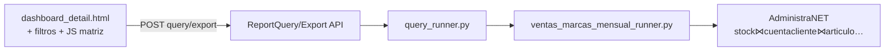

# Plan detallado — Informe ventas marcas mensual (PuW / PuM)

**Fecha:** 29/07/2026 · **Actualizado:** 02/08/2026  
**Empresa piloto:** Best Sox (`administranet`)  
**Plantilla de negocio:** Excel `Reporte Ventas Marcas con detalles Vs.xlsx` (hojas `PuW mensual Hombre`, `PuM mensual`)  
**Fuente de datos:** solo AdministraNET. Sin históricos Excel ni paridad numérica con la planilla.

**Docs base:**

- [MAPEO_PUW_PUM_ADMINISTRANET.md](MAPEO_PUW_PUM_ADMINISTRANET.md) — filtros, métricas, SQL de referencia  
- [ANALISIS_BEST_REPORTE_VENTAS_MARCAS_VS.md](ANALISIS_BEST_REPORTE_VENTAS_MARCAS_VS.md) — ingeniería inversa  
- [SPEC_INFORME_VENTAS_POR_VENDEDOR.md](SPEC_INFORME_VENTAS_POR_VENDEDOR.md) — patrón de clon UI/registro  
- Cotización BCRA (transversal, no exclusiva del informe): [PLAN_COTIZACION_BCRA_SYNAP.md](../mpr/best/PLAN_COTIZACION_BCRA_SYNAP.md) y [COTIZACION_DOLAR_ADMINISTRANET_Y_COSTEO.md](../mpr/best/COTIZACION_DOLAR_ADMINISTRANET_Y_COSTEO.md)

**Estado del plan (02/08/2026, post change `vmm-pwa-cotizacion-bcra` v1 código):**

| Fase | Estado |
|------|--------|
| Fase 1 (MVP matriz) | **Hecha** |
| Fase 2 (regalías, TC vía `cotizacion`, proyección, deep-link CC) | **Hecha** |
| Fase 1.1 (endurecimiento + pendientes de UI) | **Código hecho** — QA smoke A1 pendiente |
| Fase 3 (multi-marca / «Vs») | **Código hecho** — QA device P5/P7 pendiente |
| **PWA / móvil (paridad 100 % con desktop)** | **Código hecho (P0–P6)** — **QA device P7 pendiente** ([QA_VMM_PWA_P7.md](QA_VMM_PWA_P7.md)) |
| Cotización BCRA + historial | **Código v1 hecho** — ops Staging (DDL, job, API BCRA real) + QA cotización en P7 |

**Decisión de producto (02/08/2026):** el informe **debe verse y usarse al 100 % en PWA y en desktop**. Ambas vistas son de primer nivel; el uso esperado es **mayor en PWA**. No es “responsive mínimo”: cada filtro, KPI, matriz, proyección, comparar marcas, export y deep-link CC deben ser operables en viewport móvil (&lt; `lg`) y landscape.

---

## 1. Decisión de producto (cerradas)

| Pregunta | Decisión MVP |
|----------|--------------|
| ¿Qué se entrega? | **Vista tipo pivot** Ven → Cliente × **AñoMes**, con totales y KPIs de cabecera. Export Excel del mismo universo. |
| ¿Detalle tipo `VtaPlanas`? | **No** como pantalla principal. Export puede incluir hoja/detalle renglón en fase 1.1 si se pide. |
| ¿«Vs» = YoY? | **No** en MVP. Es nombre del pack BEST. |
| ¿Marcas? | Filtro multi-marca sobre `marca` AdministraNET (PUM/PUW y resto). Sin hardcode exclusivo. |
| ¿Unidades? | Toggle **packs \| docenas** (cubre PuW y PuM en un solo informe). |
| ¿«Hombre» PuW? | Filtro opcional multi-`id_manual` (SuperArt). Lista sugerida editable; sin CE género en ERP. |
| ¿Regalías / TC / proyección? | **Fase 2** (implementada): params UI + KPIs + matriz proy + export. Sin `mpr_costo_parametro`. |
| ¿Command Center? | **Fase 2** (implementada): deep-link al dashboard con período/sucursal. |
| ¿Históricos? | No hay. Validar solo contra AdministraNET (smoke SQL + UI). |

**Slug canónico:** `ventas-marcas-mensual`  
**Nombre catálogo:** «Ventas marcas mensual»  
**URL:** `/reports/dashboard/ventas-marcas-mensual/` (+ redirect corto opcional `/reports/ventas-marcas-mensual/`)

---

## 2. Entregable MVP (qué ve el usuario)

### 2.1 Cabecera / KPIs (sobre el universo filtrado)

| KPI | Cálculo |
|-----|---------|
| Unidades / Docenas | `SUM(packs)` o `SUM(docenas)` según toggle |
| Facturación | `SUM(PrecioNetoxR con signo FA/NC)` |
| Precio medio | Facturación / Unidades (0 si unidades = 0) |

Sin regalías, TC, gap vs objetivo ni coeficientes de proyección en MVP.

### 2.2 Matriz

| Eje | Contenido |
|-----|-----------|
| Filas | Vendedor (`CodViajante` / nombre) → Cliente (`Codigo` / `nombre_cliente`) |
| Columnas | Un mes por `yyyyMM` presente en el período (orden ascendente) + columna **Total** |
| Celdas por mes | Unidades (packs o docenas) + Facturación |
| Totales fila | Suma de meses visibles |

Expansión/colapso por vendedor (mismo espíritu VO/VPV; `localStorage` con clave del slug).

### 2.3 Filtros UI (contrato Excel → Synap)

| Filtro | Control | Backend |
|--------|---------|---------|
| Período | Desde–hasta (dd/MM/yyyy) | `cc.Fecha` |
| Marca | Multi-tags (`/api/reports/filters/?type=marcas`) | `art.CodigoMarca` / `marca` |
| SuperArt | Multi-tags `id_manual` (nuevo endpoint o type) | `art.id_manual IN (...)` |
| Unidades | Toggle packs / docenas | Solo presentación + expresión SQL docenas |
| Sucursal / PV | Igual familia VPV (reutilizar include) | Igual VO |
| Cliente / vendedor incl/excl | Reutilizar | Igual VO |
| Tipo comprobante | Fijo whitelist Synap (sin UI) | FA/FB/FC/FE/FM + NC* |
| Comprobante / Módulo | **Omitidos MVP** | — |

Filtros fijos siempre (universo ventas VO): `Anulado='No'`, tipos y `st.TipoComp` según [MAPEO §2.3](MAPEO_PUW_PUM_ADMINISTRANET.md).

### 2.4 Export

- Excel: una hoja matriz (o filas planas Ven / Cliente / AñoMes / unidades / facturación — preferible **plana** para pivotar en Excel del usuario).
- Mismos filtros que la consulta en pantalla.
- Nombre: `Ventas_marcas_mensual_{desde}_{hasta}.xlsx`.

---

## 3. Arquitectura técnica



### 3.1 Por qué runner nuevo (no solo flag en VO)

El grano **Ven × Cliente × AñoMes** con columnas dinámicas de mes **no** encaja en el árbol VPV (vendedor→estado→cliente→rubro→artículo). Reutilizar de VO/VPV:

- Parser de período, sucursal/PV, clientes/vendedores, marcas  
- Whitelist FA/NC y joins de `sql_venta_por_art`  
- UI canónica dashboard + tags-filter + export pipeline  

**No** reutilizar el armado de árbol VO ni columnas objetivo/REM/BO.

**Archivo nuevo:** `reports/services/ventas_marcas_mensual_runner.py`  
**Entrada:** `run_ventas_marcas_mensual(report, payload, user) -> QueryResult`

### 3.2 SQL núcleo (MVP)

Agregado (una query o CTE):

```text
SELECT
  cc.CodViajante, viajante.Nombre,
  cc.Codigo, cliente.nombre_cliente,
  DATE_FORMAT(cc.Fecha, '%Y%m') AS anio_mes,
  SUM(signo * st.Cantidad) AS packs,
  SUM(signo * st.Cantidad / factor_canti2(U.M.)) AS docenas,
  SUM(signo * st.PrecioNetoxR) AS facturacion
FROM stock st
JOIN cuentacliente cc …
JOIN articulo art …
[+ filtros marca, id_manual, sucursal/PV, cliente/vendedor]
GROUP BY ven, cliente, anio_mes
```

`factor_canti2`: mapa fijo P1→12, P2→6, P3→4, P6→2, CU→1 desde `COALESCE(st.nombre_unimed_vta, unidmed.nombre_unimed)` ([MAPEO §3.2](MAPEO_PUW_PUM_ADMINISTRANET.md)).

Normalizar tipos con `core.utils.administranet_types` en parámetros/filtros.

### 3.3 Contrato JSON (borrador)

```json
{
  "meta": {
    "extra": {
      "modo_unidades": "packs|docenas",
      "meses": ["202607", "202608"],
      "kpis": { "unidades": 0, "facturacion": 0, "precio_medio": 0 },
      "filas": [
        {
          "tipo": "vendedor",
          "cod": 1,
          "nombre": "…",
          "totales_mes": { "202607": { "u": 0, "f": 0 } },
          "total": { "u": 0, "f": 0 },
          "clientes": [
            {
              "cod": "C1",
              "nombre": "…",
              "valores_mes": { "202607": { "u": 0, "f": 0 } },
              "total": { "u": 0, "f": 0 }
            }
          ]
        }
      ]
    }
  }
}
```

Frontend: render matriz a partir de `meses` + `filas` (sin pivotar en el browser sobre 27k hechos).

### 3.4 Registro Synap (checklist archivos)

| Pieza | Acción |
|-------|--------|
| Migración `ReportDefinition` | `update_or_create` slug `ventas-marcas-mensual` (patrón `0030_…`) |
| `query_runner.py` | Delegar al runner nuevo |
| `views.py` | `BUILDER_HYBRID_SLUGS` |
| `catalog_service.py` | Catálogo listados |
| `urls.py` | Redirect corto opcional |
| `dashboard_detail.html` | Includes filtros + sección matriz + KPIs |
| `dashboard.js` | Helpers slug, payload filtros, no auto-query si familia manual |
| JS nuevo | `ventas_marcas_mensual.js` (thead meses dinámicos, expand Ven) |
| Include filtros | Reusar período + PV/sucursal/clientes; añadir marca + SuperArt + toggle unidades |
| `export_service.py` | Headers + filename |
| `api` filters | Type `id_manual` / SuperArt filtrable por marca(s) seleccionada(s) |
| Tests | Contrato runner + export headers (+ smoke SQL si hay DB test) |
| Docs | Este plan + SPEC delta + actualizar ANALISIS/MAPEO |

---

## 4. Fases de implementación

### Fase 0 — Cierre de producto (corto, antes de code)

- [ ] Confirmar slug/nombre en catálogo.  
- [ ] Confirmar lista inicial SuperArt «Hombre» (o lanzar MVP solo con multi-select vacío = todos).  
- [ ] Confirmar si export = plana o matriz idéntica a pantalla.

**Default si no hay respuesta en kickoff:** slug/nombre arriba; SuperArt vacío = todos; export **plana**.

### Fase 1 — MVP backend + UI (entrega principal)

1. Migración `ReportDefinition` + cableado `query_runner` / catálogo / hybrid slugs.  
2. Runner: SQL agregado + armado JSON §3.3 + filtros §2.3.  
3. Factor docenas por U.M. (mapa constante; sin tabla nueva).  
4. Template + JS matriz + KPIs + toggle packs/docenas.  
5. Filtros: período, marca, SuperArt (`id_manual`), sucursal/PV, cliente/vendedor.  
6. Export plana alineada al payload.  
7. Tests unitarios (factor U.M., nest filtros, export headers) + test contrato JSON.  
8. Docs: `SPEC_INFORME_VENTAS_MARCAS_MENSUAL.md` + link desde ANALISIS/MAPEO.  
9. Smoke manual Best Sox: período con ventas PUM/PUW recientes, una marca, expand Ven→Cliente.

**Criterio de done Fase 1:** usuario elige marca + fechas, ve matriz meses, totales y export coherentes con AdministraNET; sin diálogos nativos; UI en español.

### Fase 1.1 — Endurecimiento ✅ pedido producto 02/08/2026

| Ítem | Notas |
|------|--------|
| Smoke Best Sox vs AdministraNET | Checklist documentado + corrida en Staging/local con marca PUM/PUW |
| Aviso UI U.M. desconocidas | Ya en `meta.extra.um_desconocidas`; falta toast/banner en `ventas_marcas_mensual.js` |
| Filtro punto de venta en UI | Backend ya filtra `cc.id_pv`; exponer tags PV en plantilla VMM (familia BO) |
| Preset «Hombre» | Lista `id_manual` en `ReportDefinition.config` + botón «Aplicar preset» |
| Endpoint SuperArt + filtro por marca | Ya existe `type=superarts`; verificar/completar búsqueda y filtro por marcas seleccionadas |
| Ordenación matriz | Por facturación total o unidades (asc/desc), control en cabecera/JS |
| Cap 24 meses + aviso | Ya en runner; confirmar UI muestra `#vmm-aviso-meses` |
| 2.ª hoja Excel detalle renglón | Export: hoja «Detalle» con grano stock/cuentacliente (FA/NC) mismo filtro |

### Fase 2 — KPIs licencia y planning ✅

- [x] % regalías por marca + TC (params UI; lectura `cotizacion` id=1).  
- [x] KPIs Regalías y Regalías/TC.  
- [x] Proyección `CEILING(mes × coef)` en matriz y export.  
- [x] Deep-link desde Command Center (área ventas) con período/sucursal.

### Fase 3 — Multi-marca lado a lado / «Vs» ✅ pedido producto 02/08/2026

Comparación explícita entre **dos marcas** (o marca A vs resto) en el mismo período:

- Modo UI: «Una marca / Comparar marcas».  
- Columnas mes duplicadas o bloques lado a lado (u/f por marca) **sin** YoY de año anterior en v1 (YoY = fase 3.1 si se pide).  
- KPIs: totales por marca + delta % facturación.  
- Export: columnas marca o hojas por marca.

---

## 5. Riesgos y mitigaciones

| Riesgo | Mitigación |
|--------|------------|
| Período largo → muchas columnas mes | Cap blando 18–24 meses + mensaje Synap |
| `id_manual` vacío / inconsistente | Mostrar «Sin SuperArt»; no romper query |
| Docenas mal si U.M. distinta a P1–P6/CU | Factor 1 + log/contador de U.M. desconocidas en `meta` |
| Confundir `SubtotalDesc` cabecera vs `PrecioNetoxR` | Documentar y usar **solo** renglón `PrecioNetoxR` |
| Performance Best Sox alto volumen | Agregar índices solo si mediación lo exige; agregar en runner, no traer hechos crudos al browser |
| Mezclar con árbol VO | Runner y JS **nuevos**; no flags confusos en `objetivos_ventas_bo.js` |

---

## 6. Orden de trabajo sugerido (tareas ejecutables)

| # | Tarea | Dependencia |
|---|-------|-------------|
| T1 | SPEC delta (escenarios Given/When/Then) | — |
| T2 | Migración `ReportDefinition` + registro query/catálogo/views | T1 |
| T3 | Runner SQL + factor U.M. + tests unitarios | T2 |
| T4 | API filtro SuperArt (`id_manual`) | T2 |
| T5 | Includes filtros + `dashboard_detail` + `dashboard.js` | T2 |
| T6 | `ventas_marcas_mensual.js` matriz + KPIs | T3, T5 |
| T7 | Export | T3 |
| T8 | Smoke Best Sox + ajustes docs MAPEO/ANALISIS | T6, T7 |
| T9 | (Opcional) preset Hombre + SDD archive | T8 |

Estimación orientativa: **T1–T8 ≈ 3–5 días** de implementación enfocada (sin Fase 2).

---

## 7. Qué no hacer en este cambio

- Materializar `VtaPlanas` o sync Dropbox.  
- Paridad numérica con el Excel histórico.  
- Exclusión FA↔NC vía `imputacion` (requisito de otro hilo; no aplica aquí).  
- Usar UI de Objetivos de venta / Presupuestos como patrón visual.  
- Meter proyección/regalías en el mismo PR del MVP salvo pedido explícito.  
- Ampliar Command Center más allá de un link (Fase 2).

---

## 8. Siguiente paso inmediato (histórico — cerrado)

Fases 1–2 entregadas. Ver §9 para el backlog activo.

---

## 9. Backlog activo (02/08/2026) — orden de entrega

Tres frentes. PWA **no es opcional**: cada entrega de A debe cerrar también el criterio P (móvil + landscape). El informe **sigue usando** `cotizacion` id=1 hasta que BCRA v1 entregue “aceptar → ValorPesos”.

### Frente P — PWA / móvil (paridad 100 %)

Implementación v1 entregada (02/08/2026). QA device **pendiente ejecución** — [QA_VMM_PWA_P7.md](QA_VMM_PWA_P7.md).

| # | Tarea | Estado código | QA |
|---|-------|---------------|-----|
| P0 | SPEC PWA VMM (escenarios portrait + landscape) | **Hecho** (SPEC §10–10.3) | — |
| P1 | Acceso PWA de primer nivel | **Hecho** (deep-link/CC; ADR-2 sin `reports` en navbar PWA) | ☐ device |
| P2 | Filtros móviles | **Hecho** (`reports_filters_sheet.js`) | ☐ device |
| P3 | KPIs PWA | **Hecho** | ☐ device |
| P4 | Matriz PWA | **Hecho** (tarjetas portrait + tabla landscape) | ☐ device |
| P5 | Comparar marcas (Fase 3) en PWA | **Hecho** (tabs A/B) | ☐ device |
| P6 | Export / compartir en PWA | **Hecho** (toast si falla descarga) | ☐ device |
| P7 | QA device | Checklist documentado | **pendiente ejecución en dispositivo** |

**Regla:** ninguna tarea A2–A9 se considera “done” sin verificación P2–P4 (o P5 si aplica comparar). Desktop no se degrada.

### Frente A — Informe VMM (funcional)

| # | Tarea | Dep. | Estado código | QA / ops |
|---|-------|------|---------------|----------|
| A1 | Smoke Best Sox + acta en docs (números vs SQL Admin) | — | Plantilla [SMOKE_BEST_SOX_VMM.md](SMOKE_BEST_SOX_VMM.md) | **pendiente corrida Staging** |
| A2 | UI aviso `um_desconocidas` | — | **Hecho** | ☐ device |
| A3 | Filtro PV en UI VMM | — | **Hecho** | ☐ device |
| A4 | Preset Hombre (`config` + botón Aplicar + UI Configurar supervisor) | — | **Hecho** | ☐ device |
| A5 | Ordenación facturación/unidades | — | **Hecho** | ☐ device |
| A6 | Export 2.ª hoja detalle renglón | A1 recomendable | **Hecho** | ☐ smoke A1 |
| A7 | SPEC delta Fase 3 (comparar marcas) | — | **Hecho** (G12–G16) | — |
| A8 | Runner + UI + export modo comparar 2 marcas | A7, P5 | **Hecho** | ☐ device + smoke |
| A9 | Integrar TC VMM con servicio cotización Synap | B4+ | **Hecho** (`resolver_tc`, hint TC) | ☐ smoke BCRA + device |

### Frente B — Cotización BCRA (plan propio)

Ver [PLAN_COTIZACION_BCRA_SYNAP.md](../mpr/best/PLAN_COTIZACION_BCRA_SYNAP.md). **Código v1 implementado** (02/08/2026). Pendiente: DDL en Staging Best Sox, validar IDs variable BCRA contra API real, job `--aplicar` con política explícita, QA PWA §G en [QA_VMM_PWA_P7.md](QA_VMM_PWA_P7.md).

| # | Entrega | Estado código | Ops / QA |
|---|---------|---------------|----------|
| B0–B1 | DDL `cotizacion_historial` + provider catálogo | **Hecho** | Ejecutar proveedor en Staging |
| B2 | Cliente API BCRA + tipo configurable | **Hecho** | Validar respuesta real |
| B3–B5 | Pantalla Synap + APIs + PWA Nivel A | **Hecho** | ☐ device §G |
| B4/B7 | Servicio `resolver_tc` + job `sincronizar_cotizacion_bcra` | **Hecho** (dry-run default) | Job `--aplicar` solo con `auto_aceptar_job` |
| B5/B7 | Cablear VMM `_resolve_tc` | **Hecho** | ☐ smoke A1 §Parte 4 |

### Orden de ejecución recomendado

1. **P0–P2 + A2–A4** (base usable en móvil + pendientes rápidos).  
2. **P3–P4 + A5–A6** (matriz/KPIs PWA + export).  
3. **A7–A8 + P5** (comparar marcas en ambas vistas).  
4. **B0–B7 + A9** (BCRA y cableado TC).  
5. **P7 + A1** (QA final smoke Best Sox en dispositivo real).

### Fuera de este backlog (salvo pedido nuevo)

- Dólar blue/MEP.  
- Recálculo masivo `Actualiza_Costos_Dolar_Masivo` al aceptar BCRA.  
- Paridad con Excel histórico PuW/PuM.  
- Tipos de TC distintos por módulo (regalías ≠ costeo) — v2 del plan BCRA.  
- ~~PWA del informe~~ → **incluido en Frente P**.
