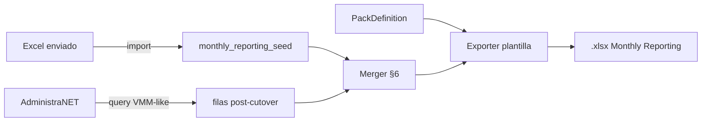

# Plan — Ventas Mensuales Licenciatarios

**Fecha:** 07/08/2026  
**Empresa piloto:** Best Sox (`administranet`)  
**Hermano de:** [Ventas marcas mensual](PLAN_INFORME_VENTAS_MARCAS_MENSUAL.md) (`ventas-marcas-mensual`)  
**Plantilla de negocio:** Monthly Reporting Best Sox (Levi’s / Puma / LW) — ver [ANALISIS_MONTHLY_REPORTING_BEST_SOX_LICENCIATARIOS.md](ANALISIS_MONTHLY_REPORTING_BEST_SOX_LICENCIATARIOS.md)

**Slug canónico:** `ventas-mensuales-licenciatarios`  
**Nombre catálogo:** «Ventas Mensuales Licenciatarios»  
**URL:** `/reports/dashboard/ventas-mensuales-licenciatarios/`

---

## 1. Decisión de producto (cerrada)

| Pregunta | Decisión |
|----------|----------|
| ¿Mismo informe que VMM? | **No.** Informe **hermano**: mismo hub Reports / familia de métricas; otra UI y otro Excel. |
| ¿Qué se entrega? | Pack **Monthly Reporting** por licenciatario/línea: hojas `input Licensee sales` + `monthly` (+ ooh / minimum si aplica), **formato pixel-perfect** vs plantillas Best Sox. |
| ¿Fuente de datos? | **Híbrido (§6 del análisis):** seed congelado ene–jun (+ jul 1–21) + AdministraNET desde **22/07/2026**. |
| ¿Motor de ventas ANET? | Reutilizar signo FA/NC, packs/docenas, marca/SuperArt del runner VMM / MAPEO PuW-PuM. |
| ¿PWA? | Fase posterior; MVP desktop + export. |

---

## 2. Fases

| Fase | Contenido | Estado |
|------|-----------|--------|
| **0** | Slug + seed catálogo + stub query + PLAN/SPEC | **Hecho** |
| **1** | PackDefinition + importer seed Excel + tabla seed | **Hecho** (SDD `historial-licenciatarios-hibrido`) |
| **2** | Merger seed+ANET + export openpyxl plantilla Levi’s/LW | **Hecho** |
| **3** | Familia Puma (.xlsb schema) + Men/Women | **Hecho** |
| **4** | UI pack / rango calendario / match cliente / modal Synap | **Hecho** |
| **5** | QA paridad vs archivo enviado + cutover julio + conciliación | **Hecho** (comando dry-run + tests) |

Ver [VERIFY_INFORME_VENTAS_MENSUALES_LICENCIATARIOS.md](VERIFY_INFORME_VENTAS_MENSUALES_LICENCIATARIOS.md).

---

## 3. Arquitectura (objetivo)

Reutiliza: parsers período/sucursal, `factor_canti2`, whitelist comprobantes, `resolver_tc` solo si el pack lo pide (Puma USD cols).  
No reutiliza: matriz Ven→Cliente VMM, export Matriz/Detalle VMM, preset Hombre UI VMM (salvo como filtro SuperArt en PackDefinition).

---

## 4. Packs iniciales (config)

| pack_id | Salida product_group | U.M. | Tasa | Familia plantilla |
|---------|----------------------|------|------|-------------------|
| `levis_bw` | Bodywear | dozens | 20 % | Levi’s xlsx |
| `levis_lw_dz` | Legwear | dozens | 20 % | Levi’s xlsx |
| `levis_lw_pk` | Legwear | packs | 20 % | Levi’s xlsx |
| `lw_propia` | LW | dozens | 13 % | Levi’s + ooh/minimum |
| `puma_bw` | Men BW | packs | 13 % | Puma |
| `puma_sw` | Men/Women SW | packs | 13 % | Puma (+ UF) |

Filtros ANET exactos por pack: **a confirmar con negocio** (análisis §10).

---

## 5. Relación con VMM

| | VMM | Este informe |
|--|-----|----------------|
| Slug | `ventas-marcas-mensual` | `ventas-mensuales-licenciatarios` |
| Usuario | interno | envío a marcas |
| Histórico | solo ANET | seed + ANET |
| Export | Matriz/Detalle Synap | plantilla Monthly Reporting |

Command Center / catálogo: dos entradas bajo listados/operacional; deep-link independientes.

---

## 6. Criterios de aceptación (alto nivel)

- G1: Existe en catálogo y abre dashboard sin 500.  
- G2: Import seed desde Excel enviado no duplica (upsert).  
- G3: YTD = seed(&lt;cutover) + ANET(≥22/07) sin doble conteo.  
- G4: Julio = seed(01–21) + ANET(22–31).  
- G5: Excel exportado mantiene fuentes/formatos del análisis §3.  
- G6: Pack Levi’s BW/LW regenera `monthly` royalty = sales × tasa.

---

## 7. Referencias

- [MANUAL_USUARIO_REPORTES.md](MANUAL_USUARIO_REPORTES.md)  
- [ANALISIS_MONTHLY_REPORTING_BEST_SOX_LICENCIATARIOS.md](ANALISIS_MONTHLY_REPORTING_BEST_SOX_LICENCIATARIOS.md)  
- [SPEC_INFORME_VENTAS_MENSUALES_LICENCIATARIOS.md](SPEC_INFORME_VENTAS_MENSUALES_LICENCIATARIOS.md)  
- [VERIFY_INFORME_VENTAS_MENSUALES_LICENCIATARIOS.md](VERIFY_INFORME_VENTAS_MENSUALES_LICENCIATARIOS.md)  
- [MAPEO_PUW_PUM_ADMINISTRANET.md](MAPEO_PUW_PUM_ADMINISTRANET.md)  
- [SPEC_INFORME_VENTAS_MARCAS_MENSUAL.md](SPEC_INFORME_VENTAS_MARCAS_MENSUAL.md)
