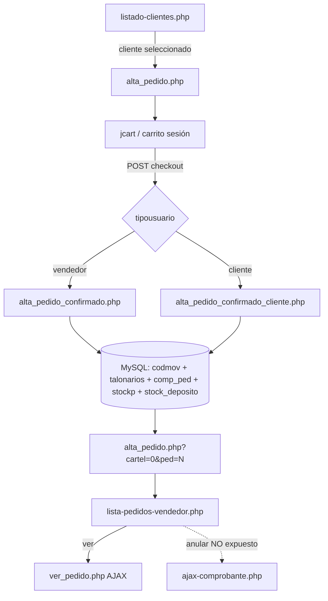

# Resumen ejecutivo — ABM Pedidos eCom Mayorista (AS-IS)

**Alcance:** ingeniería inversa del circuito de **alta, consulta y anulación** de pedidos (`PED`) en administraNET eCom Mayorista (PHP legacy).  
**Fuente de verdad:** `/Users/sebastian/Documents/Administranet/administraNET-ecom/`  
**Fecha de análisis:** 13/07/2026  
**Comparación Synap:** `/ecom/mayoristapp/venta/`, checkout y hub documentados en §14 y `15-proposed-target-design.md`.

---

## Hallazgos clave (CONFIRMADO)

| # | Hallazgo | Evidencia |
|---|----------|-----------|
| 1 | **Alta única vía carrito jCart** — no existe modificación in-place de un PED existente en PHP eCom | Solo `alta_pedido.php` → confirmación; sin `mod_pedido.php` |
| 2 | **Flujo bifurcado por actor** | Vendedor → `alta_pedido_confirmado.php`; cliente → `alta_pedido_confirmado_cliente.php` (redirect L19-21) |
| 3 | **Estado inicial siempre `Pendiente`**, `anulado='No'` | INSERT `comp_ped` L453-454, L438 |
| 4 | **`TipoPedido`:** `Ecom vendedor` (vendedor) / `Web cliente` (cliente) | L43 y L73 respectivos |
| 5 | **Dos transacciones MySQL** en alta: loop `codmov` + transacción principal | L189-227 + L231-849 |
| 6 | **Persistencia atómica (ideal):** `codmov` → `talonarios` → `cliente_datos_adicionales` → `percep_cli` → `comp_ped` → `stockp` + `stock_deposito.saldo_pedido_cliente` | `alta_pedido_confirmado.php` |
| 7 | **Anulación solo por AJAX** (`ajax-comprobante.php`); **sin botón en listado UI** | Grep UI: no invoca `ajax-comprobante` en `lista-pedidos-*.php` |
| 8 | **Anulación no toca `percep_cli`** | `ajax-comprobante.php` L71-99 |
| 9 | **Stock en commit PHP: sin validación SQL** — solo JS (`carrito.js`) | L526-548 vs `_scripts/carrito.js` L500-513 |
| 10 | **`autorizacion_web` leída en listados, no escrita en alta** | SELECT listado L65; INSERT usa `autorizacion_sistema` L459 |
| 11 | **Filtro UI "Web Vendedor" desalineado** — valor `Web` vs persistido `Ecom vendedor` | `lista-pedidos-vendedor.php` L459 |
| 12 | **`fin-comprobante.php` PED: `break` vacío** tras mail — sin redirect | L152-153, L191-192 |

---

## Diagrama de flujo resumido

---

## Alcance funcional AS-IS

| Operación | ¿Existe en PHP eCom? | Notas |
|-----------|---------------------|-------|
| Alta (create) | ✅ CONFIRMADO | Único ABM de escritura |
| Modificación (update) | ❌ CONFIRMADO ausente | Editar = nuevo pedido (VB6/Synap) |
| Consulta (read) | ✅ CONFIRMADO | Listado + modal `ver_pedido.php` |
| Anulación (delete lógica) | ⚠️ Parcial | Backend AJAX sí; UI listado no |
| Repetir pedido | INFERIDO | No hay endpoint dedicado; flujo manual vía carrito |

---

## Synap actual (contexto, no AS-IS)

Synap ya migra el circuito comercial mayorista en:

- **Alta:** `/ecom/mayoristapp/venta/` + `POST …/checkout/confirmar/` (`mayorista_checkout_service`)
- **Listado / hub / anulación con motivo / PDF / mail automático**

Gaps históricos documentados por workers y cerrados en `docs/ecom/SPEC_GESTION_PEDIDOS_SYNAP.md` §7-8. Matriz detallada en `14-functional-equivalence-matrix.md`.

---

## Nivel de confianza global

| Dimensión | Nivel | Justificación |
|-----------|-------|---------------|
| Flujo alta y persistencia | **Alto (CONFIRMADO)** | Código PHP inspeccionado línea a línea |
| Anulación y bloqueos | **Alto (CONFIRMADO)** | `ajax-comprobante.php` completo |
| Cálculos jCart | **Alto (CONFIRMADO)** | `update_subtotal` / `muestra_pedido` |
| Máquina de estados post-alta | **Medio (INFERIDO)** | Transiciones en VB6; eCom solo crea `Pendiente` |
| Permisos granulares | **Medio (INFERIDO)** | Sesión PHP; sin RBAC explícito |
| Equivalencia Synap | **Alto (CONFIRMADO)** | Código Synap + specs existentes |

**Confianza global del paquete documental: ~85 %** — limitada por estados VB6 no trazados en PHP y ausencia de pruebas runtime contra MySQL en este análisis.

---

## Índice de documentos

| Archivo | Contenido |
|---------|-----------|
| `01-component-inventory.md` | Inventario de artefactos PHP/JS/CSS |
| `02-current-architecture.md` | Arquitectura técnica AS-IS |
| `03-functional-specification.md` | Especificación funcional por actor |
| `04-ui-field-mapping.md` | Campos UI ↔ POST ↔ DB |
| `05-data-model.md` | Modelo de datos legacy |
| `06-persistence-matrix.md` | Matriz CRUD por tabla |
| `07-field-traceability.md` | Trazabilidad campo a campo |
| `08-business-rules.md` | Reglas `PED-RN-xxx` |
| `09-calculations.md` | Fórmulas y totales |
| `10-state-machine.md` | Estados del pedido |
| `11-security-and-permissions.md` | Sesión y permisos |
| `12-side-effects-and-integrations.md` | Efectos colaterales |
| `13-test-cases.md` | Casos de prueba sugeridos |
| `14-functional-equivalence-matrix.md` | PHP vs Synap |
| `15-proposed-target-design.md` | TO-BE Synap (fuera AS-IS) |
| `16-open-questions.md` | Preguntas abiertas |
| `17-implementation-backlog.md` | Backlog P0–P3 |
| `sql/read-only-inspection.sql` | Consultas solo lectura |
| `sql/sandbox-tests.sql` | Pruebas DEV/SANDBOX |
