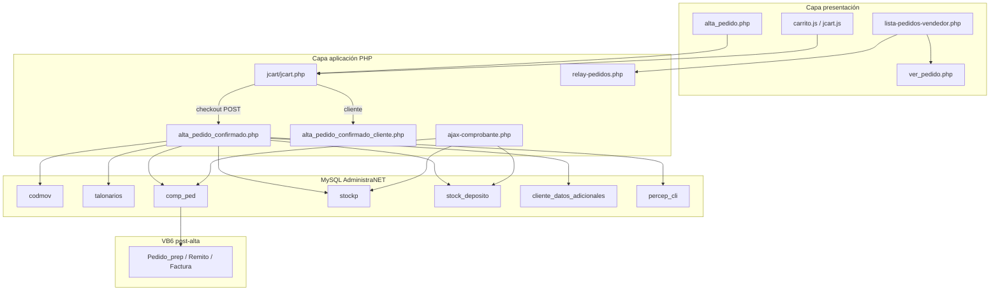
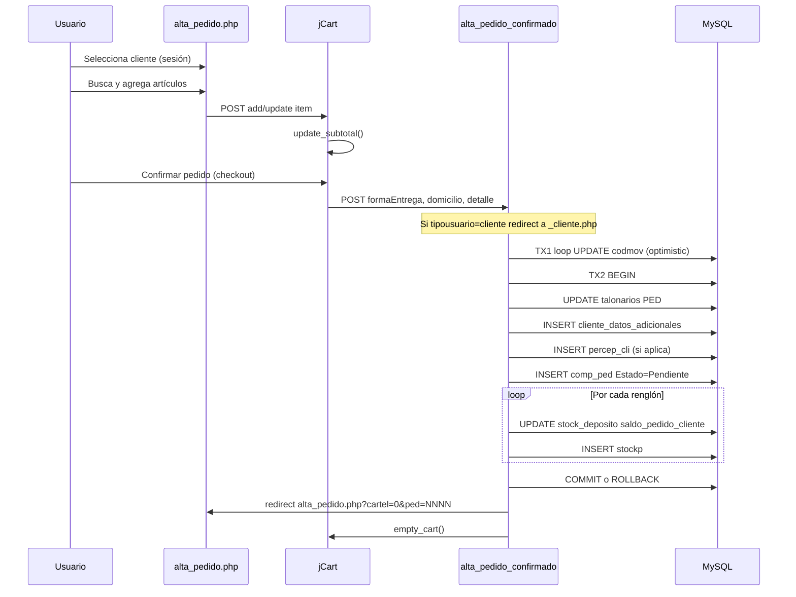
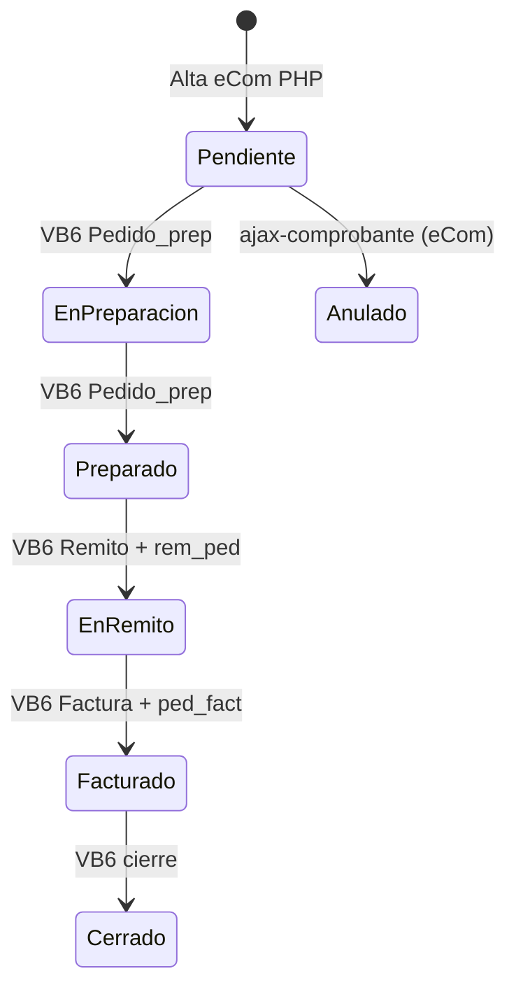

# Arquitectura actual (AS-IS) — Pedidos eCom Mayorista

**Confianza global arquitectura:** CONFIRMADO (código PHP) + INFERIDO (VB6 downstream)

---

## 1. Vista de capas

---

## 2. Secuencia de alta (CONFIRMADO)

---

## 3. Modelo de transacciones (CONFIRMADO)

| Fase | SQL | Propósito |
|------|-----|-----------|
| **TX-A** | `SET AUTOCOMMIT=0; BEGIN;` loop `codmov` `COMMIT/ROLLBACK` | Reservar `CodigoMovimiento` sin colisión |
| **TX-B** | `SET AUTOCOMMIT=0; BEGIN;` … `COMMIT/ROLLBACK` | Alta atómica cabecera + renglones + stock |

**Rollback parcial (CONFIRMADO):** si TX-B falla tras TX-A exitosa, se ejecutan `DELETE` manuales de `percep_cli`, `cliente_datos_adicionales`, `comp_ped` por `CodigoMovimiento` (L837-846). El `codmov` ya consumido **no se revierte**.

---

## 4. Patrón de sesión PHP

- **Sin API REST formal** — formularios POST + AJAX jQuery.
- **Estado del carrito en `$_SESSION['jcart']`** — se pierde al `empty_cart()` post-commit.
- **Multi-empresa:** conexión vía `conexion-vendedor-empresa.inc.php` según sesión vendedor.

---

## 5. Integración con VB6 (INFERIDO, documentado en reports)

eCom PHP **solo escribe** el nodo inicial `Pendiente`. Transiciones posteriores son VB6/Synap logística.

---

## 6. Puntos de falla conocidos (CONFIRMADO)

| Punto | Riesgo |
|-------|--------|
| `codmov` consumido sin alta completa | Hueco numérico; limpieza manual DELETE |
| Stock sin check SQL | Sobre-reserva si bypass JS |
| `fin-comprobante` PED sin redirect | UX muerta tras mail |
| Filtro `TipoPedido=Web` | Listado vacío para pedidos `Ecom vendedor` |
| Anulación sin UI | Operadores dependen de VB6 u otro canal |

---

## 7. Dependencias externas

| Sistema | Interacción |
|---------|-------------|
| MySQL legacy | Persistencia única |
| SMTP vendedor (`$_SESSION['correo']`) | Mail comprobante vía `fin-comprobante` |
| Geolocalización sesión | `geo_latitud` / `geo_longitud` en `comp_ped` |
| AdministraNET desktop | Estados, remitos, facturas, preparación |
