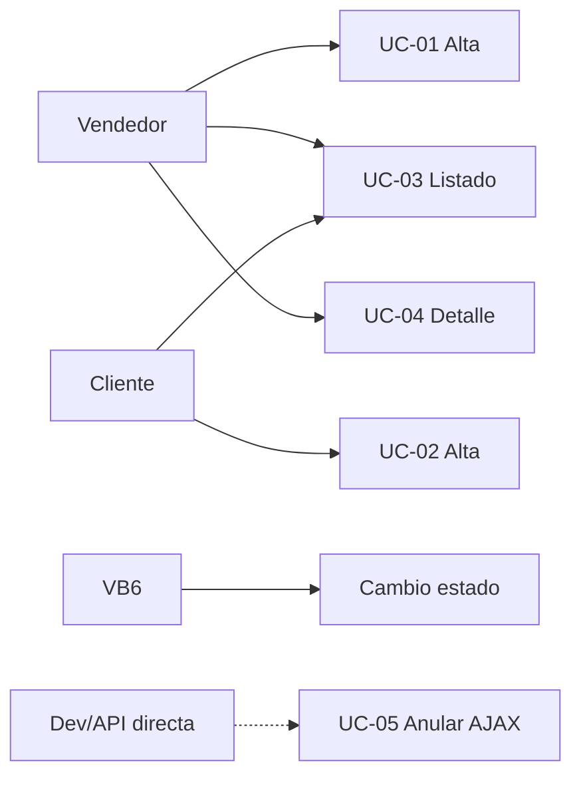

# Especificación funcional (AS-IS) — Pedidos eCom Mayorista

**Confianza:** CONFIRMADO salvo donde se indique INFERIDO.

---

## 1. Actores

| Actor | Identificación | Capacidades pedido |
|-------|----------------|-------------------|
| **Vendedor** | `$_SESSION['tipousuario']=='vendedor'` | Alta, listado (propio o todos_clientes), ver detalle |
| **Cliente autogestión** | `tipousuario=='cliente'` | Alta con confirmación explícita, listado propio |
| **Gerencia** | `todos_clientes=='Si'` | `lista-pedidos-total.php` | INFERIDO |
| **Sistema VB6** | Desktop | Estados, preparación, remito, factura | INFERIDO |

---

## 2. Casos de uso

### UC-01 Alta de pedido (vendedor) — CONFIRMADO

**Precondiciones:**
- Cliente seleccionado en sesión (`listado-clientes.php`).
- Carrito con al menos un ítem y `subtotal > 0`.

**Flujo principal:**
1. Usuario abre `alta_pedido.php`.
2. Busca productos (`ajax-articulos.php` / búsqueda rápida).
3. Agrega ítems al carrito jCart.
4. Completa forma de entrega, domicilio (si obligatorio), detalle, OC.
5. Confirma → POST a `alta_pedido_confirmado.php`.
6. Sistema persiste PED y redirige con número de comprobante.

**Postcondiciones:**
- `comp_ped.Estado = 'Pendiente'`, `Anulado = 'No'`.
- `TipoPedido = 'Ecom vendedor'`.
- Carrito vacío.

**Flujo alternativo A1 — carrito vacío:** redirect `alta_pedido.php?cartel=1`.

---

### UC-02 Alta de pedido (cliente) — CONFIRMADO

**Diferencias vs vendedor:**
- Redirect automático a `alta_pedido_confirmado_cliente.php`.
- Requiere `POST confOperacion=ok` antes del commit.
- `TipoPedido = 'Web cliente'`.
- `autorizacion_sistema = 'No Autorizado'` (salvo lógica vendedor embebida — INFERIDO no aplica en cliente puro).

---

### UC-03 Consulta listado pedidos — CONFIRMADO

**Vendedor:** `lista-pedidos-vendedor.php`
- Carga inicial: últimos 60 PED filtrados por `CodViajante` (si `todos_clientes=No`).
- Filtros AJAX vía `relay-pedidos.php`: fecha, número, tipo pedido, estado.

**Acciones por fila:**
- Ver comprobante (modal `ver_pedido.php`).
- **No hay** acción Anular en grilla (CONFIRMADO).

---

### UC-04 Consulta detalle pedido — CONFIRMADO

- AJAX POST `codigomovimiento` + `comprobante=PED` a `ver_pedido.php`.
- Muestra cabecera, renglones, totales, datos entrega.

---

### UC-05 Anulación de pedido — CONFIRMADO (backend), NO VERIFICADO (UI eCom)

**Endpoint:** `ajax-comprobante.php?tipoComp=PED&codMovP={cod}`

**Precondiciones de bloqueo:**
- Existe `ped_fact` activo → mensaje con Nº factura.
- Existe `rem_ped` activo → mensaje con Nº remito.

**Efecto si permitido:**
- `comp_ped.anulado='Si'`
- `stockp.anulado='Si'` + reversa `stock_deposito.saldo_pedido_cliente`
- Actualiza `ped_presup` / `ped_pd` si vinculados

**No hace:** anular `percep_cli` (CONFIRMADO gap).

---

### UC-06 Envío mail comprobante — CONFIRMADO parcial

- Tras alta, flujo puede pasar por `relay-comprobante-a-mail.php` → `fin-comprobante.php`.
- Para `PED`, tras envío exitoso el `switch` tiene **`break` vacío** — no redirige a listado.
- Requiere mail vendedor configurado en sesión.

---

## 3. Operaciones NO soportadas (CONFIRMADO)

| Operación | Estado AS-IS |
|-----------|--------------|
| Editar pedido existente | No existe |
| Cambiar estado desde eCom | No existe |
| Convertir PRE→PED desde eCom pedidos | No en este módulo |
| Anular desde listado web | No expuesto |

---

## 4. Reglas de autorización comercial (CONFIRMADO)

| Actor | Campo | Valor alta |
|-------|-------|------------|
| Vendedor, cliente sin exceso crédito | `autorizacion_sistema` | `Autorizado` |
| Vendedor, `arrCliente['exceso']==1` | `autorizacion_sistema` | `No Autorizado` |
| Cliente web | `autorizacion_sistema` | `No Autorizado` |

`autorizacion_web`: **no se escribe** en INSERT alta eCom (CONFIRMADO). Aparece en SELECT listados — valor legacy/VB6.

---

## 5. Numeración comprobante (CONFIRMADO)

- **Formato:** `{PV 4 dígitos}-{Nro 8 dígitos}` desde `talonarios` tipo `PED`.
- **Clave interna:** `CodigoMovimiento` desde `codmov WHERE codigo=1`.
- **Búsqueda:** `NroCompBusq` = número secuencial sin PV.

---

## 6. Entrega y logística (CONFIRMADO)

- `FechaEntrega` = hoy + `cant_dias_entrega`, ajustado si cae en día no laborable.
- `formaentrega` / `Fentrega` desde POST carrito.
- `cliente_datos_adicionales`: domicilio entrega, ruta (si logística activa), depósito despacho.
- `origen_pedido = 'Web'` en datos adicionales.

---

## 7. Diagrama casos de uso

---

## 8. Criterios de aceptación legacy (resumen)

| ID | Criterio |
|----|----------|
| FA-01 | Pedido con ítems genera `comp_ped` + `stockp` |
| FA-02 | `Estado` inicial `Pendiente` |
| FA-03 | Stock reservado en `saldo_pedido_cliente` |
| FA-04 | Numeración sin duplicar `CodigoMovimiento` (best-effort loop) |
| FA-05 | Anulación bloqueada si facturado/remitido |
