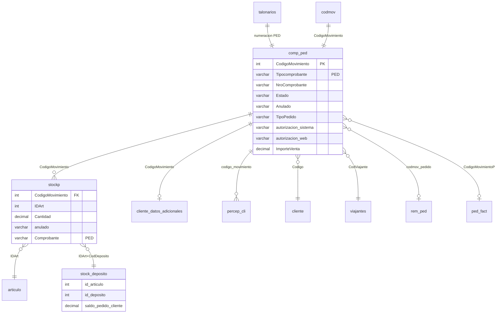

# Modelo de datos — Pedidos eCom (AS-IS)

**Base:** MySQL AdministraNET compartida con VB6  
**Confianza:** CONFIRMADO (INSERT/SELECT PHP) + INFERIDO (campos no usados en eCom)

---

## 1. Diagrama entidad-relación (alcance pedido)

---

## 2. Tabla `comp_ped` (cabecera PED)

| Campo | Tipo lógico | Alta eCom | Notas |
|-------|-------------|-----------|-------|
| `CodigoMovimiento` | INT | ✅ Escrito | FK lógica universal |
| `Tipocomprobante` | VARCHAR | `'PED'` | CONFIRMADO |
| `NroComprobante` | VARCHAR | ✅ | PV-Nro desde talonario |
| `NroCompBusq` | INT | ✅ | Secuencial talonario |
| `Fecha` | DATE | `Y/m/d` hoy | CONFIRMADO |
| `Codigo` | INT | Cliente sesión | CONFIRMADO |
| `CodSucursal` | INT | Sucursal cliente | CONFIRMADO |
| `id_pv` | INT | PV vendedor | CONFIRMADO |
| `Estado` | VARCHAR | `'Pendiente'` | CONFIRMADO |
| `Anulado` | VARCHAR | `'No'` | CONFIRMADO |
| `TipoPedido` | VARCHAR | `Ecom vendedor` / `Web cliente` | CONFIRMADO |
| `autorizacion_sistema` | VARCHAR | Autorizado / No Autorizado | CONFIRMADO |
| `autorizacion_web` | VARCHAR | ❌ No escrito eCom | CONFIRMADO |
| `ImporteVenta` | DECIMAL | subtotal jCart | CONFIRMADO |
| `ImporteVentaL` | VARCHAR | num2letras | CONFIRMADO |
| `Iva1`, `Iva2` | DECIMAL | 21 % / 10,5 % | CONFIRMADO |
| `Subtotal1/2`, `SubTotalDesc*` | DECIMAL | Netos por alícuota | CONFIRMADO |
| `Exento`, `exento_interes` | DECIMAL | CONFIRMADO |
| `impuesto_interno_total` | DECIMAL | CONFIRMADO |
| `total_percep` | DECIMAL | CONFIRMADO |
| `PorDesc1/2`, `ImpDesc*` | DECIMAL | Descuento al pie | CONFIRMADO |
| `Detalle` | TEXT | OC + observaciones | CONFIRMADO |
| `CondVenta`, `id_condventa` | — | Cliente | CONFIRMADO |
| `CodViajante` | INT | Vendedor/cliente | CONFIRMADO |
| `Vencimiento` | DATE | +1 mes | CONFIRMADO |
| `FechaEntrega` | DATE | Calculada | CONFIRMADO |
| `formaentrega` | VARCHAR | POST | CONFIRMADO |
| `id_deposito_despacho` | INT | Sesión depósito | CONFIRMADO |
| `CotiDolar` | DECIMAL | cotizacion | CONFIRMADO |
| `geo_latitud`, `geo_longitud` | VARCHAR | Sesión GPS | CONFIRMADO |
| `fecha_control` | DATETIME | `d/m/Y H:i` | CONFIRMADO |
| `IdUsuario` | INT | Sesión | CONFIRMADO |

---

## 3. Tabla `stockp` (renglones)

| Campo | Alta eCom | Confianza |
|-------|-----------|-----------|
| `CodigoMovimiento` | ✅ | CONFIRMADO |
| `IDArt` | ✅ | CONFIRMADO |
| `Cantidad`, `Salida` | cantidad mínima contada | CONFIRMADO |
| `cantidad_entregada`, `cantidad_pendiente` | = Cantidad inicial | CONFIRMADO |
| `PrecioNetoxU/R`, `PrecioBrutoxU/R` | Desde jCart | CONFIRMADO |
| `PrecioCostoxU/R` | Calculado PHP `calculaPrecioCostoUnidad` | CONFIRMADO |
| `Alicuota`, `TipoIVA` | jCart | CONFIRMADO |
| `PorDesc`, `ImpDesc` | Descuento línea/promo | CONFIRMADO |
| `promocion`, `promocion_por`, `promocion_tipo`, `promocion_cant` | Si promo | CONFIRMADO |
| `CodDeposito` | Sesión | CONFIRMADO |
| `Comprobante` | `'PED'` | CONFIRMADO |
| `TipoComp` | `'Pedido'` | CONFIRMADO |
| `anulado` | `'No'` | CONFIRMADO |
| `Orden` | Secuencial 1..n | CONFIRMADO |
| `tipo_unidad` | Unidad/Display/Bulto | CONFIRMADO |
| `lista_precio` | Cliente | CONFIRMADO |
| Campos embalaje `*_vta`, `*_comp` | Si `utilizaEmbalaje=Si` | CONFIRMADO |

---

## 4. Tablas satélite

### `cliente_datos_adicionales`

| Campo | Valor alta |
|-------|------------|
| `CodigoMovimiento` | codMov |
| `TipoComprobante` | `PED` |
| `id_cliente` | cliente.Codigo |
| `fechaEntrega` | Calculada |
| `id_deposito_despacho` | depósito sesión |
| `Fentrega` | formaEntrega |
| `origen_pedido` | `'Web'` |
| `id_cliente_domicilio` | POST o NULL |
| `id_ruta` | POST o NULL |

### `percep_cli`

| Campo | Origen |
|-------|--------|
| `id_percep_cli_tipo` | jCart percepciones |
| `alicuota_percep_cli` | tipo |
| `importe_percep_cli` | monto calculado |
| `codigo_movimiento` | codMov |
| `tipo_comp` | `PED` |

### `stock_deposito`

| Campo | Efecto alta |
|-------|-------------|
| `saldo_pedido_cliente` | `+= Cantidad` por artículo/depósito |

### `codmov` / `talonarios`

| Tabla | Operación |
|-------|-----------|
| `codmov` | `CodigoMovimiento + 1` optimistic lock |
| `talonarios` | `Nro + 1` where `TipoComprobante='PED'` |

---

## 5. Tablas de relación (anulación / downstream)

| Tabla | Rol | eCom escribe en alta |
|-------|-----|---------------------|
| `rem_ped` | Pedido ↔ Remito | ❌ |
| `ped_fact` | Pedido ↔ Factura | ❌ |
| `ped_presup` | Presupuesto ↔ Pedido | ❌ |
| `ped_pd` | Parte diario | ❌ |

---

## 6. Valores `TipoPedido` históricos (INFERIDO)

| Valor | Origen |
|-------|--------|
| `Sistema` | VB6 desktop |
| `Web` | eCom generaciones anteriores |
| `Ecom vendedor` | eCom actual vendedor |
| `Web cliente` | eCom cliente |
| `Ecom cliente` | Synap (no PHP legacy) |

---

## 7. Referencias schema

- `docs/general/TIPOS_DATOS_ADMINISTRANET.md`
- `docs/reports/docs/tablas/` (si existe `comp_ped`)
- Normalización Synap: `core.utils.administranet_types`
