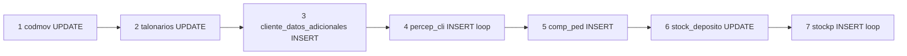

# Matriz de persistencia — Pedidos eCom (AS-IS)

**Leyenda operación:** C=Create, R=Read, U=Update, D=Delete lógica  
**Confianza:** CONFIRMADO (evidencia PHP)

---

## 1. Matriz por tabla y operación

| Tabla | Alta PED | Consulta listado | Consulta detalle | Anulación AJAX | Modificación |
|-------|----------|------------------|------------------|----------------|--------------|
| `codmov` | **U** (+1) | — | — | — | ❌ |
| `talonarios` | **U** (Nro+1) | — | — | — | ❌ |
| `comp_ped` | **C** INSERT | **R** | **R** | **U** anulado=Si | ❌ |
| `stockp` | **C** INSERT | — | **R** | **U** anulado=Si | ❌ |
| `stock_deposito` | **U** saldo+=qty | **R** (pre-add JS) | — | **U** saldo-=qty | ❌ |
| `cliente_datos_adicionales` | **C** INSERT | — | **R** INFERIDO | — | ❌ |
| `percep_cli` | **C** INSERT | — | **R** INFERIDO | ❌ **no anula** | ❌ |
| `cliente` | **R** | **R** JOIN | **R** | — | ❌ |
| `viajantes` | **R** | **R** JOIN | — | — | ❌ |
| `articulo` | **R** | — | **R** | — | ❌ |
| `articulo_prov` | **R** | — | — | — | ❌ |
| `cotizacion` | **R** | — | — | — | ❌ |
| `percep_cli_param` | **R** (jCart) | — | — | — | ❌ |
| `rem_ped` | — | — | — | **R** bloqueo | ❌ |
| `ped_fact` | — | — | — | **R** bloqueo | ❌ |
| `ped_presup` | — | — | — | **U** anulado | ❌ |
| `ped_pd` | — | — | — | **U** anulado | ❌ |

---

## 2. Orden de escritura en alta (CONFIRMADO)



**Transacción:** pasos 2-7 dentro de `BEGIN…COMMIT` único (post-loop codmov).

---

## 3. Detalle SQL por tabla — Alta

### `codmov` (CONFIRMADO)

```sql
-- Lectura + update optimista (loop hasta affected_rows=1)
SELECT CodigoMovimiento + 1 AS CodigoMovNew, CodigoMovimiento FROM codmov WHERE codigo = 1;
UPDATE codmov SET CodigoMovimiento = {new} WHERE codigo=1 AND CodigoMovimiento={old};
```

### `talonarios` (CONFIRMADO)

```sql
SELECT * FROM talonarios WHERE id_punto_venta = {pv} AND TipoComprobante = 'PED';
UPDATE talonarios SET Nro = Nro + 1 WHERE id_punto_venta = {pv} AND TipoComprobante = 'PED';
```

### `comp_ped` (CONFIRMADO)

- `INSERT INTO comp_ped SET …` (mysqli, no INSERT explícito columnas)

### `stockp` (CONFIRMADO)

- Un `INSERT` por ítem carrito con ~40 campos.

### `stock_deposito` (CONFIRMADO)

```sql
SELECT saldo_pedido_cliente FROM stock_deposito WHERE id_articulo={id} AND id_deposito={dep};
UPDATE stock_deposito SET saldo_pedido_cliente = {saldo + qty} WHERE …;
```

**Sin:** `SELECT … FOR UPDATE`, sin check `saldo >= 0`.

---

## 4. Detalle anulación (`ajax-comprobante.php`)

| Paso | SQL efecto |
|------|------------|
| 1 | Check `ped_fact` Anulado=No |
| 2 | Check `rem_ped` Anulado=No |
| 3 | `UPDATE comp_ped SET anulado='Si'` |
| 4 | `UPDATE stockp JOIN stock_deposito SET saldo-=Cantidad, stockp.anulado='Si'` |
| 5 | `UPDATE ped_presup` si existe |
| 6 | `UPDATE ped_pd` / `erp_parte_diario` si existe |

**Ausente:** `UPDATE percep_cli` (CONFIRMADO gap PHP).

---

## 5. Rollback / compensación manual (CONFIRMADO)

Si falla commit principal con `codMov` ya asignado:

```sql
DELETE FROM percep_cli WHERE codigo_movimiento = {codMov};
DELETE FROM cliente_datos_adicionales WHERE CodigoMovimiento = {codMov};
DELETE FROM comp_ped WHERE CodigoMovimiento = {codMov};
-- stockp: no insertado si controlRenglones=0
-- codmov: NO se revierte
```

---

## 6. Sesión / carrito (no MySQL)

| Store | Alta | Post-alta |
|-------|------|-----------|
| `$_SESSION['jcart']` | R/W | unset + empty_cart |
| `$_SESSION['totalCarrito']` | R/W | reset |

---

## 7. Comparación persistencia Synap (referencia)

| Aspecto | PHP eCom | Synap `mayorista_checkout_service` |
|---------|----------|-----------------------------------|
| Transacciones | 2 (codmov + main) | 1 atómica Django |
| codmov lock | Optimistic loop | `SELECT FOR UPDATE` |
| percep_cli anulación | ❌ | ✅ |
| stock validación SQL | ❌ | ✅ (servicio) |
| TipoPedido | Ecom vendedor / Web cliente | Ecom vendedor / Ecom cliente |

Ver `14-functional-equivalence-matrix.md`.
