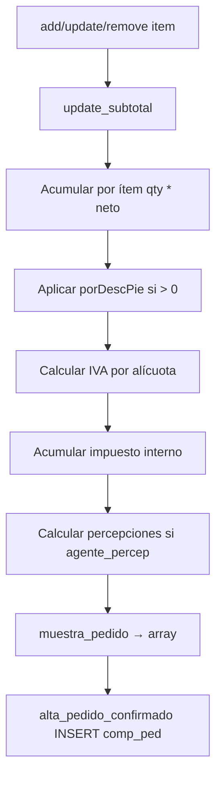

# Cálculos y totales — jCart pedidos (AS-IS)

**Fuente:** `jcart/jcart.php` — `update_subtotal()` (privado) y `muestra_pedido()` (público)  
**Confianza:** CONFIRMADO

---

## 1. Pipeline de cálculo



---

## 2. `update_subtotal()` — variables acumuladas (CONFIRMADO)

Por cada ítem en `$this->items`:

| Variable interna | Fórmula base |
|------------------|--------------|
| `subtotalNeto` | Σ `qty * netoTotal` (sin desc pie) |
| `subtotalDesc` | Σ `qty * netoTotalDesc` (con desc pie) |
| `subtotal` | Σ `qty * (netoTotalDesc + IVA)` |
| `subtotalIva21` | Σ `qty * impIva` si `iva==1` |
| `subtotalIva105` | Σ `qty * impIva` si `iva==2` |
| `subtotalNetoIva21/105` | Σ `qty * netoTotal` por alícuota |
| `subtotalDesc21/105` | Σ `qty * netoTotalDesc` por alícuota |
| `importeDesc21/105` | Σ `qty * (netoTotal - netoTotalDesc)` |
| `subtotalExento` | Σ si `tipoIva=='Exento'` |
| `subtotalImpInt` | Σ `impuestoInterno` por ítem (no tasa %) |
| `itemCount` | Σ `qty` |

### Descuento al pie (CONFIRMADO)

```php
if ($this->porDescPie > 0 && $this->entregados[$item] != "Si") {
    $netoTotalDesc = $netoTotal - ($netoTotal * $this->porDescPie / 100);
}
```

- `porDescPie` proviene de cliente / permiso vendedor modificar descuento.
- Ítems `entregados=='Si'` excluidos del desc pie (INFERIDO: devoluciones parciales).

### IVA por ítem (CONFIRMADO)

```php
$impIva = $netoTotalDesc * $alicuota / 100;
$precioTotal = $netoTotalDesc + $impIva;
```

---

## 3. Percepciones IIBB (CONFIRMADO)

**Condición:** `$_SESSION['agente_percep'] == 'Si'`

1. Lee `percep_cli_param` por `id_cliente`.
2. Por cada tipo, lee `percep_cli_tipo.alicuota_percep_cli_tipo`.
3. Base imponible: `totalNetoPer` = Σ `qty * netoTotalDesc` (ítems no entregados).
4. Monto: `totalNetoPer * alicuota / 100`.
5. Acumula en `$this->percepciones['detalle'][idTipo]`.
6. `percepcionesT` = suma montos.

**Error:** si no hay parámetros configurados → return `'percepcion'`.

---

## 4. `muestra_pedido()` — salida hacia PHP confirm (CONFIRMADO)

| Key array | Origen | Uso `comp_ped` |
|-----------|--------|----------------|
| `subtotal` | `subtotal + subtotalImpInt` | `ImporteVenta` |
| `subtotalNeto` | acumulado | referencia |
| `subtotalNetoIva21/105` | acumulado | `Subtotal1/2` |
| `subtotalExento` | acumulado | `Exento` |
| `subtotalImpInt` | acumulado | `impuesto_interno_total` |
| `subtotalIva21/105` | acumulado | `Iva1/Iva2` |
| `subtotalDesc` | acumulado | `SubTotalDesc` |
| `subtotalDesc21/105` | acumulado | `SubTotalDesc1/2` |
| `porDescPie` | propiedad | `PorDesc1/2` |
| `importeDesc21/105` | acumulado | `ImpDesc1/2` |
| `percepcionesT` | acumulado | `total_percep` |
| `percepciones` | array detalle | INSERT `percep_cli` |

**Nota CONFIRMADO:** `ImporteVenta` **incluye** impuesto interno en subtotal final.

---

## 5. Cálculos por renglón en commit PHP (CONFIRMADO)

Además de jCart, `alta_pedido_confirmado.php` recalcula **precio de costo**:

### `calculaPrecioCostoUnidad($datosCosto)`

Inputs desde `articulo` + `articulo_prov`:
- `cantidad_unidad_display`
- `cantidad_display_bulto`
- `tipoPrecioUnidad` (Unidad/Display/Bulto)
- `PrecioCosto`

### Ajuste por `comoCuento` (tipo unidad venta)

| tipoCuenta | `cantidadDividir` | `precioCosto` final |
|------------|-------------------|---------------------|
| Unidad | 1 | `precioCostoCalculado` |
| Display | `cantidadUnidadDisplay` | ×1 |
| Bulto | `display * bulto` | `× cantidadDisplayBulto` |

```php
$precioCostoXRenglon = $precioCosto * $cantidadContada;
```

### Precios venta en `stockp` (CONFIRMADO)

- `PrecioNetoxU` = neto con descuento línea
- `PrecioBrutoxU` = `netoN + impIva`
- `PrecioBrutoxR` = `subtotalNeto + subtotalIva` del ítem jCart

---

## 6. Promociones (CONFIRMADO)

Si `articulo['promo']=='si'`:
- `promocion='Si'`
- `promocion_por` / `descuento_por` desde `promoPorc`
- `promocion_cant`, `promocion_tipo` según jCart

Si no promo: `descuento_por = articulo['descPor']`.

---

## 7. Unidad / Display / Bulto — cantidad persistida (CONFIRMADO)

- `qty` en carrito = unidades contadas usuario.
- `cantidadMinimaContada` → `stockp.Cantidad`, `Salida`, `cantidad_entregada`, `cantidad_pendiente`.
- `tipo_unidad` = `comoCuento`.

---

## 8. Cotización dólar (CONFIRMADO)

```sql
SELECT ValorPesos FROM cotizacion WHERE id_cotizacion=1 LIMIT 1
```

→ `comp_ped.CotiDolar` y `stockp.coti_dolar`.

---

## 9. Diferencias vs Synap (referencia)

| Aspecto | PHP jCart | Synap checkout |
|---------|-----------|----------------|
| Motor | PHP sesión | `mayorista_cart_service` + Postgres |
| Percepciones | En update_subtotal | `mayorista_percepciones` |
| Validación stock | JS | SQL en servicio |
| Redondeo | PHP `ROUND` en PorDesc | `Decimal` Python |

Ver `14-functional-equivalence-matrix.md`.

---

## 10. Ejemplo numérico ilustrativo (INFERIDO)

| Concepto | Valor ejemplo |
|----------|---------------|
| Neto ítem A (21 %) | $100 × 2 u = $200 |
| Desc pie 5 % | Neto desc = $190 |
| IVA 21 % | $39,90 |
| Subtotal ítem | $229,90 |
| + Imp. interno | según `impuestoInterno` fijo por ítem |

*Valores ilustrativos; validar con caso real en sandbox SQL.*
