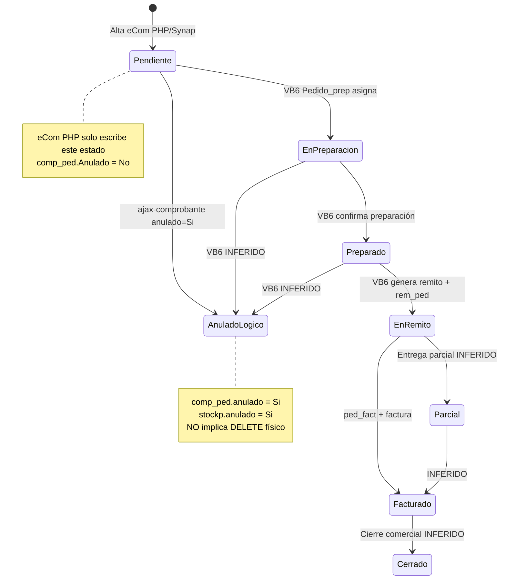
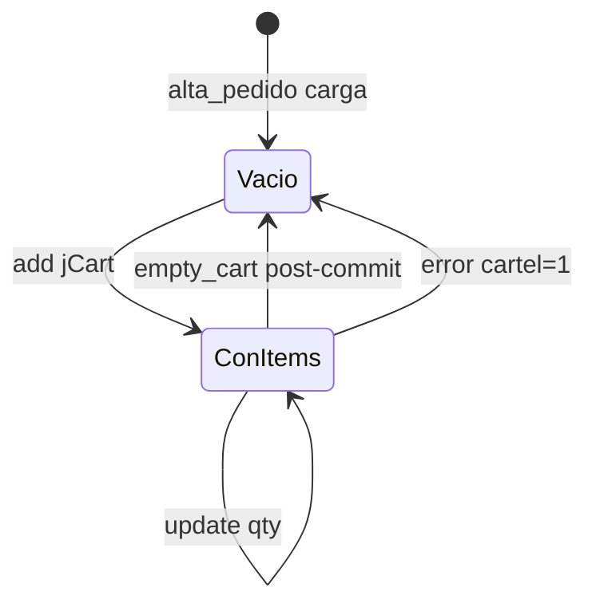

# Máquina de estados — Pedidos (AS-IS + downstream)

**Alcance eCom PHP:** solo creación en `Pendiente`.  
**Confianza downstream VB6:** INFERIDO (documentación reports + paridad operativa)

---

## 1. Diagrama de estados completo

---

## 2. Campos de estado

| Campo | Valores observados | Quién escribe |
|-------|-------------------|---------------|
| `comp_ped.Estado` | `Pendiente`, `En preparación`, `Preparado`, `En remito`, `Parcial`, `Facturado`, `Cerrado` | VB6 / logística Synap lectura |
| `comp_ped.Anulado` | `No` / `Si` | Alta PHP; anulación AJAX |
| `stockp.anulado` | `No` / `Si` | Alta; anulación AJAX |
| `rem_ped.anulado` | `No` / `Si` | VB6 / anulación remito |
| `ped_fact.Anulado` | `No` / `Si` | VB6 facturación |

**Encoding:** En BD puede coexistir `En preparacion` sin tilde — NO VERIFICADO en esta auditoría. Ver `docs/reports/VALIDACION_PEDIDOS_PENDIENTES.md`.

---

## 3. Transiciones eCom PHP (CONFIRMADO)

| Desde | Hacia | Trigger | Condición |
|-------|-------|---------|-----------|
| — | `Pendiente` | INSERT alta | Siempre |
| `Pendiente` | `Anulado` lógico | `ajax-comprobante` | Sin `ped_fact`/`rem_ped` activos |

**No hay** transiciones `Estado` escritas por PHP eCom en alta ni listado.

---

## 4. Transiciones VB6 (INFERIDO)

| Desde | Hacia | Proceso |
|-------|-------|---------|
| `Pendiente` | `En preparación` | `Pedido_prep` toma pedido |
| `En preparación` | `Preparado` | Operario confirma picking |
| `Preparado` | `En remito` | Alta remito vinculado |
| `En remito` | `Facturado` | Factura con `ped_fact` |
| `*` | `Cerrado` | Cierre ciclo |

Synap expone lectura en:
- `GET /ecom/mayoristapp/logistica/estado-pedidos/`
- Stepper en detalle venta (TO-BE implementado)

---

## 5. Anulación vs Estado (CONFIRMADO)

- Anulación AJAX **no cambia** `Estado` a un valor "Anulado" textual.
- Solo marca `anulado='Si'`.
- Listado muestra columna `Anulado` separada de `Estado`.

**Excepción INFERIDO:** `ped_presup` anulación resetea `Estado='Pendiente'` en presupuesto vinculado (SQL L78-82 ajax-comprobante) — no aplica a PED puro.

---

## 6. Bloqueos por estado downstream (CONFIRMADO)

| Relación activa | Efecto en anulación eCom |
|-----------------|--------------------------|
| `ped_fact` Anulado=No | Bloquea |
| `rem_ped` Anulado=No | Bloquea |

---

## 7. Estado carrito sesión (CONFIRMADO)

---

## 8. Estado autorización (paralelo, CONFIRMADO)

| Campo | Estados | Impacto |
|-------|---------|---------|
| `autorizacion_sistema` | Autorizado / No Autorizado | Informativo en listado; no bloquea alta |
| `autorizacion_web` | Leído en listado | NO escrito eCom; workflow VB6 INFERIDO |

---

## 9. Equivalencia Synap edición (TO-BE, referencia)

| `comp_ped.Estado` | Shell `/venta/?cod_mov=` |
|-------------------|--------------------------|
| `Pendiente` + no anulado | Modo editar → anula + nuevo PED |
| Otro / anulado | Solo consulta |

No es AS-IS PHP; documentado para no confundir máquinas.
