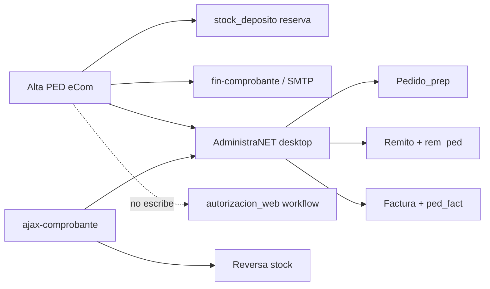

# Efectos colaterales e integraciones — Pedidos eCom (AS-IS)

**Confianza:** CONFIRMADO (código) + INFERIDO (operativa)

---

## 1. Mapa de integraciones



---

## 2. Efectos en stock (CONFIRMADO)

### Alta

| Tabla | Campo | Efecto |
|-------|-------|--------|
| `stock_deposito` | `saldo_pedido_cliente` | **Incremento** por cantidad pedida |
| `stockp` | `Cantidad` | Registro comprometido |

**No modifica:** `saldo` físico, `stock` movimientos — reserva lógica cliente.

### Anulación

| Tabla | Efecto |
|-------|--------|
| `stock_deposito` | **Decremento** `saldo_pedido_cliente` |
| `stockp` | `anulado='Si'` |

### Gap percepciones (CONFIRMADO)

Anulación **no** elimina/anula filas `percep_cli` — puede dejar percepciones huérfanas en reportes fiscales.

---

## 3. Integración VB6 downstream (INFERIDO)

| Evento eCom | Trigger VB6 | Efecto |
|-------------|-------------|--------|
| PED `Pendiente` creado | Operador abre Pedido_prep | `Estado` → `En preparación` |
| Preparación completa | Confirmación VB6 | `Preparado` |
| Despacho | Remito | `rem_ped` + posible `En remito` |
| Facturación | Factura A/B | `ped_fact` bloquea anulación |

Synap **no reemplaza** estos pasos en AS-IS PHP; logística Synap es lectura/Kanban.

---

## 4. Mail y PDF (CONFIRMADO parcial)

| Componente | Rol |
|------------|-----|
| `relay-comprobante-a-mail.php` | Arma params base64 → `fin-comprobante.php` |
| `fin-comprobante.php` | UI selección email cliente |
| `enviar_mail_comprobante()` | SMTP adjunto PDF |

**PED específico:**
- Case `PED` en generación PDF: **break vacío** (L70-71) — PDF no generado en este path CONFIRMADO.
- Post-envío exitoso `PED`: **break vacío** sin redirect (L152-153).

**Efecto colateral:** Usuario puede quedar en pantalla mail sin volver al listado.

---

## 5. Relaciones presupuesto / parte diario (CONFIRMADO en anulación)

Si pedido vinculado a:
- `ped_presup` → anula vínculo presupuesto, resetea estado presupuesto `Pendiente`
- `ped_pd` → anula vínculo parte diario, `erp_parte_diario.Estado='Reportado'`

No aplica en alta eCom directa sin conversión PRE→PED.

---

## 6. Cotización y moneda (CONFIRMADO)

- Lee `cotizacion.ValorPesos` id=1.
- Persiste en cabecera y renglones.
- **Efecto:** Trazabilidad conversión USD en reportes — no recalcula precios en alta.

---

## 7. Geolocalización (CONFIRMADO)

- `geo_latitud`, `geo_longitud` en `comp_ped`.
- INFERIDO: auditoría visitas vendedor / compliance.

---

## 8. jCart / sesión (CONFIRMADO)

Post-commit exitoso:
```php
$jcart->empty_cart();
unset($_SESSION["jcart"]);
```

**Efecto:** Pérdida carrito borrador; idempotencia depende de no re-post confirm.

---

## 9. Numeración — efectos colaterales (CONFIRMADO)

| Escenario | Efecto |
|-----------|--------|
| Fallo post-`codmov` | `CodigoMovimiento` consumido, posible hueco |
| Rollback manual | DELETE parcial tablas; `codmov` no revertido |
| Talonario incrementado | Si falla después de UPDATE talonario, posible salto número |

---

## 10. Integraciones Synap actuales (TO-BE, no AS-IS)

| Integración | Synap |
|-------------|-------|
| Carrito Postgres | `EcomCart` idempotencia |
| Mail automático | `encolar_comprobante_mail` post-checkout |
| PDF | API `…/pedidos/<cod_mov>/pdf/` |
| Hub ventas | `/ecom/mayoristapp/` |
| Relay cliente | `frm=0` → `/venta/` |

---

## 11. Side effects NO presentes en eCom PHP (CONFIRMADO)

- No escribe contabilidad / cta cte en alta PED.
- No genera remito automático.
- No actualiza `autorizacion_web`.
- No encola jobs asíncronos (todo síncrono request-response).

---

## 12. Riesgos operativos resumidos

| # | Riesgo | Severidad |
|---|--------|-----------|
| 1 | Sobre-reserva stock sin SQL check | Media |
| 2 | percep_cli huérfanas al anular | Media |
| 3 | Huecos numeración codmov | Baja |
| 4 | Filtro TipoPedido desalineado | Baja UX |
| 5 | UX mail PED incompleta | Baja |
