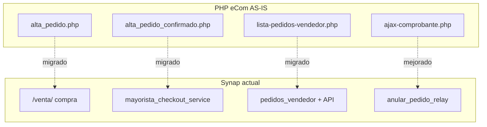

# Matriz de equivalencia funcional — PHP AS-IS vs Synap actual

**Fecha:** 13/07/2026  
**PHP:** `administraNET-ecom/`  
**Synap:** `/ecom/mayoristapp/venta/`, checkout, hub, listados  
**Leyenda:** ✅ Paridad | ⚠️ Parcial | ❌ Gap | ➕ Mejora Synap

---

## 1. Resumen ejecutivo

| Área | PHP eCom | Synap | Estado |
|------|----------|-------|--------|
| Alta pedido | jCart + confirmado PHP | `/venta/` + API checkout | ✅ |
| Modificación PED | ❌ No existe | Anula + nuevo (Pendiente) | ➕ |
| Listado vendedor | `lista-pedidos-vendedor.php` | `pedidos_vendedor.html` + API | ✅ |
| Anulación | AJAX sin UI | API + UI + motivo obligatorio | ➕ |
| PDF | `ver_pedido` / mail parcial | API PDF dedicada | ➕ |
| Mail auto alta | Manual fin-comprobante | `encolar_comprobante_mail` | ➕ |
| Stock validación | Solo JS | SQL en servicio | ➕ |
| percep_cli anulación | ❌ | ✅ | ➕ |
| TipoPedido valores | `Ecom vendedor` / `Web cliente` | `Ecom vendedor` / `Ecom cliente` | ⚠️ |
| Filtro tipo listado | Desalineado `Web` | Corregido en relay Synap | ➕ |
| Carrito persistencia | Sesión PHP | Postgres `EcomCart` | ➕ |
| Hub / repetir pedido | Limitado PHP | Hub + repetir último | ➕ |
| PRE → PED | No en módulo pedidos | API convertir presupuesto | ➕ |

---

## 2. Flujos de pantalla

| # | Funcionalidad | PHP AS-IS | Synap actual | Equiv. |
|---|---------------|-----------|--------------|--------|
| F-01 | Selección cliente | `listado-clientes.php` | Relay clientes + selector embebido compra | ✅ |
| F-02 | Catálogo + carrito | `alta_pedido.php` + jCart | `compra_mayorista.html` `/venta/` | ✅ |
| F-03 | Confirmación checkout | `alta_pedido_confirmado(_cliente).php` | `POST …/checkout/confirmar/` | ✅ |
| F-04 | Redirect post-alta | `alta_pedido.php?cartel=0&ped=` | Modal éxito + listado/hub | ⚠️ UX distinta |
| F-05 | Consulta pedido confirmado | Solo modal listado | `/venta/?cod_mov=` consulta/edición | ➕ |
| F-06 | Listado inicial 60 | SQL LIMIT 60 | API paginada | ⚠️ |
| F-07 | Filtros avanzados | `relay-pedidos.php` | API v1 comprobantes pedidos | ✅ |
| F-08 | Export Excel/PDF grilla | DataTables buttons | API + export Synap | ⚠️ |
| F-09 | Preparación depósito | VB6 + PHP logística legacy | Kanban Synap lectura | ⚠️ |

---

## 3. Persistencia y datos

| # | Aspecto | PHP | Synap | Notas |
|---|---------|-----|-------|-------|
| D-01 | Tablas escritas alta | codmov, talonarios, cda, percep, comp_ped, stockp, stock_dep | Mismas + EcomCart | ✅ |
| D-02 | Estado inicial | Pendiente | Pendiente | ✅ |
| D-03 | Anulado inicial | No | No | ✅ |
| D-04 | CodigoMovimiento lock | Optimistic loop | SELECT FOR UPDATE | ➕ Synap |
| D-05 | Transacciones | 2 separadas | 1 atómica | ➕ Synap |
| D-06 | Rollback codmov hueco | Posible | Mitigado | ➕ |
| D-07 | autorizacion_web | No escribe | INFERIDO no escribe | ✅ gap compartido |
| D-08 | autorizacion_sistema | Sí | Sí (`mayorista_credito`) | ✅ |
| D-09 | TipoPedido cliente | `Web cliente` | `Ecom cliente` | ⚠️ convivencia reportes |
| D-10 | Motivo anulación en Detalle | No | Sí append Detalle | ➕ |

---

## 4. Reglas de negocio

| Regla ID | PHP | Synap | Match |
|----------|-----|-------|-------|
| PED-RN-003 | Estado Pendiente | Igual | ✅ |
| PED-RN-005 | TipoPedido por actor | Valores distintos cliente | ⚠️ |
| PED-RN-010/011 | Autorización crédito | Igual lógica | ✅ |
| PED-RN-020 | Reserva stock | Igual + reversa anulación | ✅ |
| PED-RN-021 | Stock solo JS | SQL validación | ➕ |
| PED-RN-060/061 | Bloqueo remito/factura | Solo `Estado=Pendiente` — **no** consulta `ped_fact`/`rem_ped` | ❌ Gap P0 |
| PED-RN-063 | percep_cli anulación | Synap anula | ➕ |
| PED-RN-070 | No edición in-place | Anula+nuevo | ✅ concepto |
| PED-RN-081 | Filtro Web desalineado | Synap usa valores reales | ➕ |

---

## 5. Cálculos

| Concepto | PHP jCart | Synap | Match |
|----------|-----------|-------|-------|
| Subtotal + imp int | `muestra_pedido` | checkout service | ✅ INFERIDO |
| IVA 21 / 10.5 | Por ítem | Motor precios | ✅ |
| Descuento pie | jCart | Carrito Synap | ✅ |
| Percepciones | jCart + INSERT | `mayorista_percepciones` | ✅ |
| Promo línea | jCart promo flags | `promocion_etiqueta` v1 | ⚠️ |
| Display/Bulto/Pallet | PHP | Selector Synap v1 | ✅ |

---

## 6. Seguridad

| Aspecto | PHP | Synap |
|---------|-----|-------|
| Auth | Sesión PHP | Django session + API tokens |
| Permisos | Flags sesión | `ecom.pedidos.*`, `ecom.comprobantes.anular` |
| CSRF | jcartToken parcial | Django CSRF |
| IDOR anulación | NO VERIFICADO | Control por empresa/sesión |

---

## 7. Gaps remanentes Synap (jul 2026) — auditoría código

| Gap | Prioridad | Estado | Notas |
|-----|-----------|--------|-------|
| Anulación: bloqueo `ped_fact` / `rem_ped` | **P0** | Abierto | `puede_anular_pedido_relay` solo mira `Estado=Pendiente`; PHP sí valida vínculos |
| OrderShell: domicilio + `id_ruta` | **P1** | Abierto | Backend acepta; UI venta no envía (sí masivo) |
| Filtro `TipoPedido` vs valores `Ecom *` | **P1** | Abierto | Pedidos Synap nuevos pueden no filtrar bien |
| `ImporteVentaL`, `CotiDolar`, `geo_*` | P2 | Abierto | PHP escribe; Synap INSERT omitidos |
| Convivencia `Web cliente` vs `Ecom cliente` | P2 | Abierto | Reportes / filtros BI |
| Geo captura en alta móvil | P2 | Abierto | Sin sesión geo en Synap |
| Asignar/preparar pedido web | P3 | Fuera v1 | Sigue VB6 `Pedido_prep` |
| IDOR ownership anulación | P0 audit | Abierto | Auditar alcance por viajante/empresa |

---

## 8. Diagrama equivalencia

---

## 9. Criterio de cierre migración

Un flujo PHP se considera **migrado** cuando:

1. Synap cubre la operación con paridad de persistencia (§3).
2. Reglas PED-RN críticas tienen test TC-SYN (§13).
3. Gap documentado aceptado por producto o resuelto en backlog §17.

**Estado global migración alta/listado/anulación:** **~95 %** (CONFIRMADO por specs Synap).
