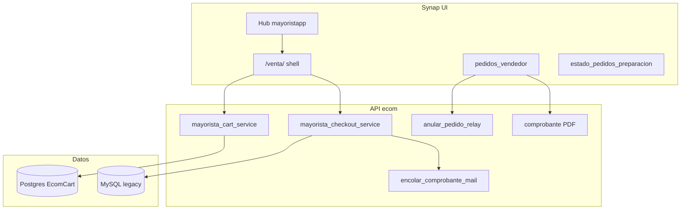

# Diseño objetivo (TO-BE) — Synap Pedidos Mayorista

> **Separado del AS-IS.** Este documento describe el estado **objetivo** en Synap, no el comportamiento PHP legacy.  
> **Fuente:** `docs/ecom/SPEC_GESTION_PEDIDOS_SYNAP.md`, código `ecom/services/mayorista_*`, openspec `ecom-venta-pedido-unificada`.

---

## 1. Visión

Unificar el circuito comercial mayorista en Synap:

- **Un solo shell de venta:** `/ecom/mayoristapp/venta/`
- **Checkout transaccional** con paridad AdministraNET + mejoras (stock SQL, mail, PDF, motivo anulación)
- **Hub** como punto de entrada vendedor
- **Sin UPDATE in-place** de PED — patrón anular + nuevo `CodigoMovimiento`

---

## 2. Arquitectura objetivo

---

## 3. Flujos TO-BE

### 3.1 Alta (implementado)

| Paso | Componente |
|------|------------|
| 1 | Selección cliente (relay / autogestión) |
| 2 | Catálogo + carrito Postgres |
| 3 | `POST /ecom/api/mayoristapp/checkout/confirmar/` |
| 4 | Persistencia legacy atómica |
| 5 | Mail encolado automáticamente |

**TipoPedido TO-BE:**
- Vendedor: `Ecom vendedor`
- Cliente: `Ecom cliente` (normalización vs PHP `Web cliente`)

### 3.2 Edición pedido Pendiente (implementado)

- Cargar líneas en carrito desde `cod_mov`
- Al confirmar: modal → anula origen + checkout nuevo
- **No** UPDATE renglones mismo `CodigoMovimiento`

### 3.3 Anulación (implementado)

- API con `motivo` obligatorio → append `comp_ped.Detalle`
- Reversa `stock_deposito.saldo_pedido_cliente`
- Anula `comp_ped`, `stockp`, **`percep_cli`**
- UI en grilla y detalle

### 3.4 Consulta y repetición (implementado)

- PDF API
- Repetir: artículo + cantidad; precios actuales
- Hub "repetir último pedido"

---

## 4. Permisos TO-BE

| Código | Uso |
|--------|-----|
| `ecom.pedidos.crear` | Alta |
| `ecom.pedidos.ver` | Listado propio |
| `ecom.pedidos.ver_todos` | Gerencia |
| `ecom.comprobantes.anular` | Anulación |
| `ecom.carrito.editar` | Equivalencia transitoria cliente |

---

## 5. Mejoras respecto AS-IS (intencionales)

| # | Mejora | Motivo |
|---|--------|--------|
| 1 | Validación stock SQL | Evitar sobre-reserva PED-RN-021 |
| 2 | Transacción única | Evitar huecos codmov |
| 3 | Anulación percep_cli | Cierre gap fiscal |
| 4 | Motivo anulación | Auditoría |
| 5 | Mail automático | UX post-alta |
| 6 | Filtros TipoPedido alineados | PED-RN-081 |
| 7 | Carrito Postgres | Idempotencia / multi-tab |
| 8 | PRE → PED API | Flujo comercial completo |

---

## 6. Fuera de alcance TO-BE (sigue legacy)

| Proceso | Sistema |
|---------|---------|
| Asignación preparación operario | VB6 `Pedido_prep` |
| Picking físico | Depósito VB6 |
| Remito / facturación | VB6 + reports Synap lectura |
| `autorizacion_web` workflow | VB6 INFERIDO |

---

## 7. Normalizaciones pendientes TO-BE

| Tema | Acción propuesta |
|------|------------------|
| `Web cliente` histórico vs `Ecom cliente` | Vista reportes unificada o migración datos |
| Encoding `En preparación` | Validar en MySQL y normalizar |
| Permisos granulares en roles | Migrar de equivalencias `carrito.editar` |

---

## 8. Criterios de aceptación TO-BE

- [ ] TC-SYN-001..011 verdes en CI
- [ ] Paridad persistencia §06 vs PHP
- [ ] Sin regresión en VB6 downstream (PED Pendiente visible en Pedido_prep)
- [ ] Documentación `docs/ecom/` actualizada por cambio

---

## 9. Referencias implementación

| Artefacto | Ruta |
|-----------|------|
| Checkout | `ecom/services/mayorista_checkout_service.py` |
| Carrito | `ecom/services/mayorista_cart_service.py` |
| Anulación | `ecom/services/anular_pedido_relay.py` (INFERIDO nombre) |
| UI venta | `ecom/templates/ecom/compra_mayorista.html` |
| URLs | `ecom/urls.py` |
| Tests | `ecom/tests/test_pedido_gestion.py` |

*Verificar nombre exacto servicio anulación en repo al implementar backlog.*
